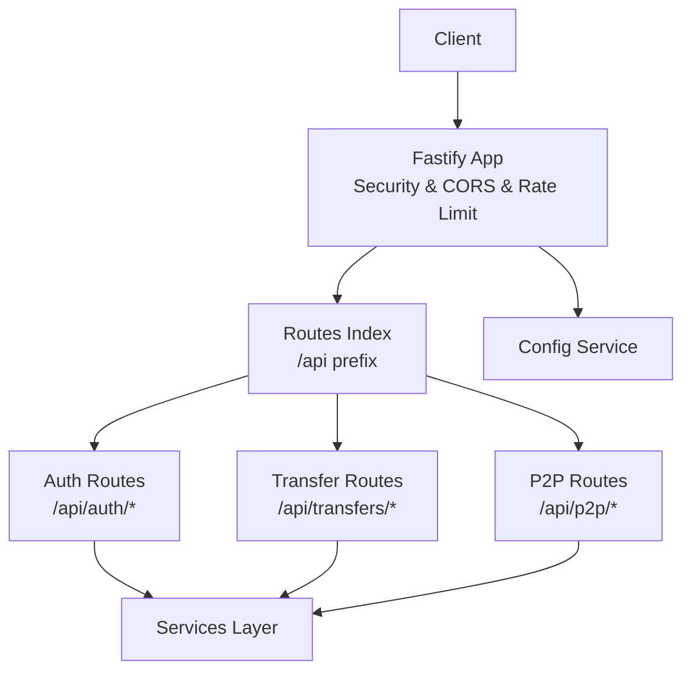
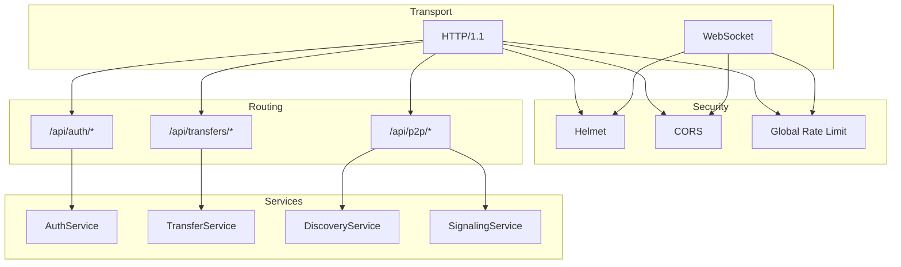
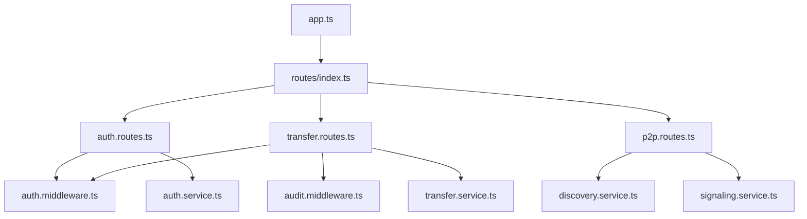

# API Reference

<cite>
**Referenced Files in This Document**
- [app.ts](file://packages/server/src/app.ts)
- [index.ts](file://packages/server/src/routes/index.ts)
- [auth.routes.ts](file://packages/server/src/routes/auth.routes.ts)
- [transfer.routes.ts](file://packages/server/src/routes/transfer.routes.ts)
- [p2p.routes.ts](file://packages/server/src/routes/p2p.routes.ts)
- [auth.middleware.ts](file://packages/server/src/middlewares/auth.middleware.ts)
- [audit.middleware.ts](file://packages/server/src/middlewares/audit.middleware.ts)
- [auth.service.ts](file://packages/server/src/services/auth.service.ts)
- [transfer.service.ts](file://packages/server/src/services/transfer.service.ts)
- [discovery.service.ts](file://packages/server/src/services/discovery.service.ts)
- [signaling.service.ts](file://packages/server/src/services/signaling.service.ts)
- [config.json](file://config.json)
</cite>

## Table of Contents
1. [Introduction](#introduction)
2. [Project Structure](#project-structure)
3. [Core Components](#core-components)
4. [Architecture Overview](#architecture-overview)
5. [Detailed Component Analysis](#detailed-component-analysis)
6. [Dependency Analysis](#dependency-analysis)
7. [Performance Considerations](#performance-considerations)
8. [Troubleshooting Guide](#troubleshooting-guide)
9. [Conclusion](#conclusion)
10. [Appendices](#appendices)

## Introduction
This document provides comprehensive API documentation for Airportal’s RESTful endpoints. It covers:
- Authentication endpoints (registration, login, current user)
- Transfer management endpoints (uploads, downloads, text sharing, history, configuration)
- P2P communication endpoints (WebSocket signaling, peer discovery, transfer coordination)
- Request/response formats, authentication requirements, error handling, rate limiting, and security considerations
- Practical examples, client implementation guidelines, and integration patterns

Airportal exposes a Fastify-based backend with security-first defaults, including rate limiting, content security policies, file validation, and optional heuristic scanning.

## Project Structure
Airportal organizes its server-side code into modular routes, services, middlewares, and plugins. The application bootstraps security middleware, registers routes under the /api prefix, and serves static assets in production.

**Diagram sources**
- [app.ts:19-148](file://packages/server/src/app.ts#L19-L148)
- [index.ts:10-62](file://packages/server/src/routes/index.ts#L10-L62)

**Section sources**
- [app.ts:19-148](file://packages/server/src/app.ts#L19-L148)
- [index.ts:10-62](file://packages/server/src/routes/index.ts#L10-L62)

## Core Components
- Security middleware stack: Helmet for CSP/HSTS/XSS protection, CORS, and rate limiting
- Route registration: /api/auth, /api/transfers, /api/p2p, health checks, and static asset serving
- Services: authentication, transfer management, discovery, signaling, and security plugins
- Configuration: centralized via config.json with security, transfer, and P2P settings

Key behaviors:
- Global rate limit applies to all routes
- Upload-specific rate limit configured per route
- Content Security Policy restricts script/connect sources and enforces safe defaults
- Optional heuristic and behavior tracking plugins can be enabled

**Section sources**
- [app.ts:22-97](file://packages/server/src/app.ts#L22-L97)
- [index.ts:46-59](file://packages/server/src/routes/index.ts#L46-L59)
- [config.json:6-77](file://config.json#L6-L77)

## Architecture Overview
The API follows a layered architecture:
- Transport: HTTP/WS over TLS
- Security: Helmet, CORS, rate limit, audit logging
- Routing: Fastify with modular route registration
- Business logic: Services implementing domain operations
- Persistence: Prisma client (schema present in repository)

**Diagram sources**
- [app.ts:22-97](file://packages/server/src/app.ts#L22-L97)
- [auth.routes.ts:16-54](file://packages/server/src/routes/auth.routes.ts#L16-L54)
- [transfer.routes.ts:12-347](file://packages/server/src/routes/transfer.routes.ts#L12-L347)
- [p2p.routes.ts:48-132](file://packages/server/src/routes/p2p.routes.ts#L48-L132)

## Detailed Component Analysis

### Authentication Endpoints
Base URL: https://your-host/api/auth

- POST /register
  - Purpose: Register a new user account
  - Authentication: Not required
  - Request body:
    - username: string (min 3, max 50)
    - password: string (min 6, max 100)
  - Response:
    - success: boolean
    - data: user profile (fields depend on service implementation)
  - Error codes:
    - REGISTER_FAILED (400)
  - Example request:
    - POST /api/auth/register with JSON body containing username and password
  - Notes:
    - Username/password constraints validated by Zod schema

- POST /login
  - Purpose: Authenticate and obtain session credentials
  - Authentication: Not required
  - Request body:
    - username: string (required)
    - password: string (required)
  - Response:
    - success: boolean
    - data: authentication result (token/session info depends on service)
  - Error codes:
    - LOGIN_FAILED (401)
  - Example request:
    - POST /api/auth/login with JSON body
  - Notes:
    - On success, clients should persist returned credentials for subsequent authenticated requests

- GET /me
  - Purpose: Retrieve current authenticated user profile
  - Authentication: Required (via auth middleware)
  - Request headers:
    - Authorization: Bearer <token> (typical JWT bearer)
  - Response:
    - success: boolean
    - data: user object (fields depend on service)
  - Error codes:
    - Unauthorized (401) if missing/invalid token
  - Example request:
    - GET /api/auth/me with Authorization header

**Section sources**
- [auth.routes.ts:16-54](file://packages/server/src/routes/auth.routes.ts#L16-L54)
- [auth.middleware.ts](file://packages/server/src/middlewares/auth.middleware.ts)
- [auth.service.ts](file://packages/server/src/services/auth.service.ts)

### Transfer Management Endpoints
Base URL: https://your-host/api/transfers

- GET /config
  - Purpose: Fetch server-side limits and capabilities
  - Authentication: Not required
  - Response:
    - success: boolean
    - data:
      - maxFileSize: number (bytes)
      - maxTextLength: number (chars)
      - defaultExpiry: number (seconds)
      - maxExpiry: number (seconds)
      - folderUploadEnabled: boolean
  - Example request:
    - GET /api/transfers/config

- POST /
  - Purpose: Create a new transfer (file or text)
  - Authentication: Optional (optionalAuth middleware)
  - Headers:
    - Content-Type: multipart/form-data for file uploads; application/json for text
  - Query parameters (for file/folder uploads):
    - type: "folder" to enable ZIP archive validation
    - folderName: string (default "folder")
    - fileCount: number (used for metadata)
    - expiresIn: number (seconds, capped by server max)
    - maxDownloads: number (0..1000)
    - ownerOnly: "true" to require creator-only access
  - Request body (JSON for text):
    - text: string (1..maxTextLength)
    - expiresIn: number (optional, seconds)
    - maxDownloads: number (optional)
    - ownerOnly: boolean (optional)
  - Response:
    - success: boolean
    - data: transfer identifier and metadata (code, expiresAt, etc.)
  - Validation and security:
    - File uploads:
      - Single file upload enforced
      - ZIP archive validation when type=folder
      - File type detection (magic bytes) when enabled
      - Heuristic/security plugin scan (if enabled)
    - Text uploads:
      - Heuristic/security plugin scan (if enabled)
    - ownerOnly requires authenticated user
  - Error codes:
    - NO_FILE (400) when multipart file missing
    - INVALID_ZIP (400) for invalid ZIP archives
    - INVALID_FILE_TYPE (400) for unsupported/unsafe files
    - SECURITY_BLOCK (400) when malicious/suspicious content flagged
    - LOGIN_REQUIRED (400) when ownerOnly is set but user not authenticated
    - UPLOAD_FAILED (400) for general upload failures
    - RATE_LIMIT_EXCEEDED (429) for upload rate limit exceeded
  - Rate limiting:
    - Upload-specific window and max configured per server config
  - Example requests:
    - Multipart upload:
      - POST /api/transfers?type=folder&expiresIn=180&maxDownloads=1&ownerOnly=true
      - Body: multipart/form-data with single file field
    - Text upload:
      - POST /api/transfers
      - Body: JSON with text, optional expiresIn, maxDownloads, ownerOnly

- GET /:code
  - Purpose: Download file or retrieve text content
  - Authentication: Optional (optionalAuth middleware)
  - Path parameters:
    - code: string (length equals server-configured codeLength, alphanumeric excluding ambiguous characters)
  - Response:
    - For text: JSON with contentType=text, textContent, expiresAt
    - For file: binary stream with appropriate headers (Content-Type, Content-Disposition, security headers)
  - Validation:
    - Validates code format and length
  - Error codes:
    - INVALID_CODE (400) for malformed codes
    - ACCESS_DENIED (404/403) for not found/expired or insufficient permissions
  - Security headers:
    - X-Content-Type-Options: nosniff
    - X-Download-Options: noopen
    - Cache-Control: no-store, no-cache, must-revalidate
    - Content-Security-Policy: default-src 'none'
  - Example request:
    - GET /api/transfers/{code}

- GET /history
  - Purpose: List user's transfer history
  - Authentication: Required
  - Response:
    - success: boolean
    - data: array of transfer records
  - Example request:
    - GET /api/transfers/history with Authorization header

**Section sources**
- [transfer.routes.ts:23-347](file://packages/server/src/routes/transfer.routes.ts#L23-L347)
- [auth.middleware.ts](file://packages/server/src/middlewares/auth.middleware.ts)

### P2P Communication Endpoints
Base URL: https://your-host/api/p2p

- GET /status
  - Purpose: Check P2P availability and local peer count
  - Authentication: Not required
  - Response:
    - enabled: boolean
    - peerCount: number
  - Example request:
    - GET /api/p2p/status

- GET /ws
  - Purpose: WebSocket endpoint for signaling and peer presence
  - Authentication: Not required
  - Query parameters:
    - deviceName: optional string (device-friendly name)
  - WebSocket messages:
    - Client sends JSON messages for signaling
    - Server responds with JSON messages (e.g., init with peers, error on parse failure)
  - Behavior:
    - Server tracks peers by IP and device name derived from User-Agent or query
    - On connect: server sends init message with socketId and initial peer list
    - On disconnect/error: server removes peer
  - Example handshake:
    - Connect to wss://your-host/api/p2p/ws?deviceName=MyDevice
    - Receive init with peers list
    - Send signaling messages as needed

**Section sources**
- [p2p.routes.ts:48-132](file://packages/server/src/routes/p2p.routes.ts#L48-L132)
- [discovery.service.ts](file://packages/server/src/services/discovery.service.ts)
- [signaling.service.ts](file://packages/server/src/services/signaling.service.ts)

## Dependency Analysis
High-level dependencies among major components:

**Diagram sources**
- [app.ts:19-148](file://packages/server/src/app.ts#L19-L148)
- [index.ts:10-62](file://packages/server/src/routes/index.ts#L10-L62)
- [auth.routes.ts:16-54](file://packages/server/src/routes/auth.routes.ts#L16-L54)
- [transfer.routes.ts:12-347](file://packages/server/src/routes/transfer.routes.ts#L12-L347)
- [p2p.routes.ts:48-132](file://packages/server/src/routes/p2p.routes.ts#L48-L132)

**Section sources**
- [index.ts:10-62](file://packages/server/src/routes/index.ts#L10-L62)

## Performance Considerations
- Rate limiting:
  - Global rate limit applies to all routes
  - Upload-specific rate limit configured per route
  - Exceeding limits returns RATE_LIMIT_EXCEEDED
- File size limits:
  - Max file size enforced by multipart parser
  - ZIP archive validation parameters apply for folder uploads
- Security scanning:
  - Optional heuristic and behavior tracking plugins add latency; enable only as needed
- Static assets:
  - In production, static assets served efficiently; SPA fallback handled for non-API routes

[No sources needed since this section provides general guidance]

## Troubleshooting Guide
Common issues and resolutions:
- Authentication failures:
  - LOGIN_FAILED indicates invalid credentials; verify username/password
  - REGISTER_FAILED indicates registration error; check constraints and uniqueness
- Access denied:
  - ACCESS_DENIED for expired/not-found transfers or insufficient permissions (e.g., ownerOnly)
- Upload failures:
  - INVALID_ZIP for malformed archives; ensure valid ZIP with allowed entries and sizes
  - INVALID_FILE_TYPE for unsupported or unsafe files; verify MIME/type detection settings
  - SECURITY_BLOCK indicates malicious/suspicious content; review security plugin logs
  - UPLOAD_FAILED for general upload errors; inspect server logs
- Rate limiting:
  - RATE_LIMIT_EXCEEDED; reduce request frequency or adjust thresholds
- P2P signaling:
  - WebSocket parse errors indicate malformed JSON; ensure proper message format
  - Peer not visible; verify local network connectivity and device name derivation

**Section sources**
- [transfer.routes.ts:260-271](file://packages/server/src/routes/transfer.routes.ts#L260-L271)
- [p2p.routes.ts:89-101](file://packages/server/src/routes/p2p.routes.ts#L89-L101)

## Conclusion
Airportal’s API provides secure, configurable endpoints for authentication, file/text transfers, and P2P signaling. The design emphasizes safety through validation, scanning, and rate limiting while offering flexible configuration for deployment environments.

[No sources needed since this section summarizes without analyzing specific files]

## Appendices

### Endpoint Catalog
- Authentication
  - POST /api/auth/register
  - POST /api/auth/login
  - GET /api/auth/me
- Transfers
  - GET /api/transfers/config
  - POST /api/transfers/
  - GET /api/transfers/:code
  - GET /api/transfers/history
- P2P
  - GET /api/p2p/status
  - GET /api/p2p/ws

**Section sources**
- [auth.routes.ts:16-54](file://packages/server/src/routes/auth.routes.ts#L16-L54)
- [transfer.routes.ts:23-347](file://packages/server/src/routes/transfer.routes.ts#L23-L347)
- [p2p.routes.ts:48-132](file://packages/server/src/routes/p2p.routes.ts#L48-L132)

### Request/Response Formats
- Success response template:
  - { "success": true, "data": <payload> }
- Error response template:
  - { "success": false, "error": { "code": "<CODE>", "message": "<message>" } }
- Common error codes:
  - REGISTER_FAILED, LOGIN_FAILED, ACCESS_DENIED, INVALID_CODE, NO_FILE, INVALID_ZIP, INVALID_FILE_TYPE, SECURITY_BLOCK, LOGIN_REQUIRED, UPLOAD_FAILED, RATE_LIMIT_EXCEEDED, NOT_FOUND, INTERNAL_ERROR

**Section sources**
- [auth.routes.ts:24-46](file://packages/server/src/routes/auth.routes.ts#L24-L46)
- [transfer.routes.ts:61-271](file://packages/server/src/routes/transfer.routes.ts#L61-L271)
- [app.ts:131-145](file://packages/server/src/app.ts#L131-L145)

### Authentication Methods
- Session tokens:
  - Typical JWT bearer token returned on login; include Authorization: Bearer <token>
- Cookie/session:
  - Not explicitly exposed in routes; use bearer tokens for programmatic clients

**Section sources**
- [auth.routes.ts:34-47](file://packages/server/src/routes/auth.routes.ts#L34-L47)
- [auth.middleware.ts](file://packages/server/src/middlewares/auth.middleware.ts)

### Rate Limiting Policies
- Global rate limit: max requests per time window
- Upload rate limit: separate max and window for upload endpoint
- Key generator considers forwarded IP for accurate attribution behind proxies

**Section sources**
- [app.ts:86-97](file://packages/server/src/app.ts#L86-L97)
- [transfer.routes.ts:42-49](file://packages/server/src/routes/transfer.routes.ts#L42-L49)

### Security Considerations
- Content Security Policy: restrictive defaults, minimal script/connect sources
- Strict Transport Security: HSTS enabled
- XSS/Clickjacking protections: X-XSS-Protection, frame-ancestors restrictions
- File validation: magic-byte detection and ZIP archive validation
- Heuristic scanning: configurable patterns and risk scoring
- Audit logging: optional request auditing

**Section sources**
- [app.ts:38-66](file://packages/server/src/app.ts#L38-L66)
- [config.json:6-77](file://config.json#L6-L77)

### Practical Examples and Integration Patterns
- Client implementation guidelines:
  - Use HTTPS base URL (https://your-host/api)
  - Persist bearer tokens securely after login
  - Respect rate limits; implement exponential backoff on 429
  - Validate server config before upload to avoid errors
- Registration flow:
  - POST /api/auth/register with username/password
  - Store returned credentials
- Login flow:
  - POST /api/auth/login
  - Save token for protected endpoints
- Upload flow:
  - GET /api/transfers/config to fetch limits
  - POST /api/transfers with multipart/form-data or JSON text
  - Use ownerOnly and maxDownloads thoughtfully
- Download flow:
  - GET /api/transfers/{code}
  - For files, save attachment with correct filename
- P2P signaling:
  - Connect to /api/p2p/ws
  - Send/receive JSON messages for peer coordination

**Section sources**
- [transfer.routes.ts:23-347](file://packages/server/src/routes/transfer.routes.ts#L23-L347)
- [p2p.routes.ts:48-132](file://packages/server/src/routes/p2p.routes.ts#L48-L132)