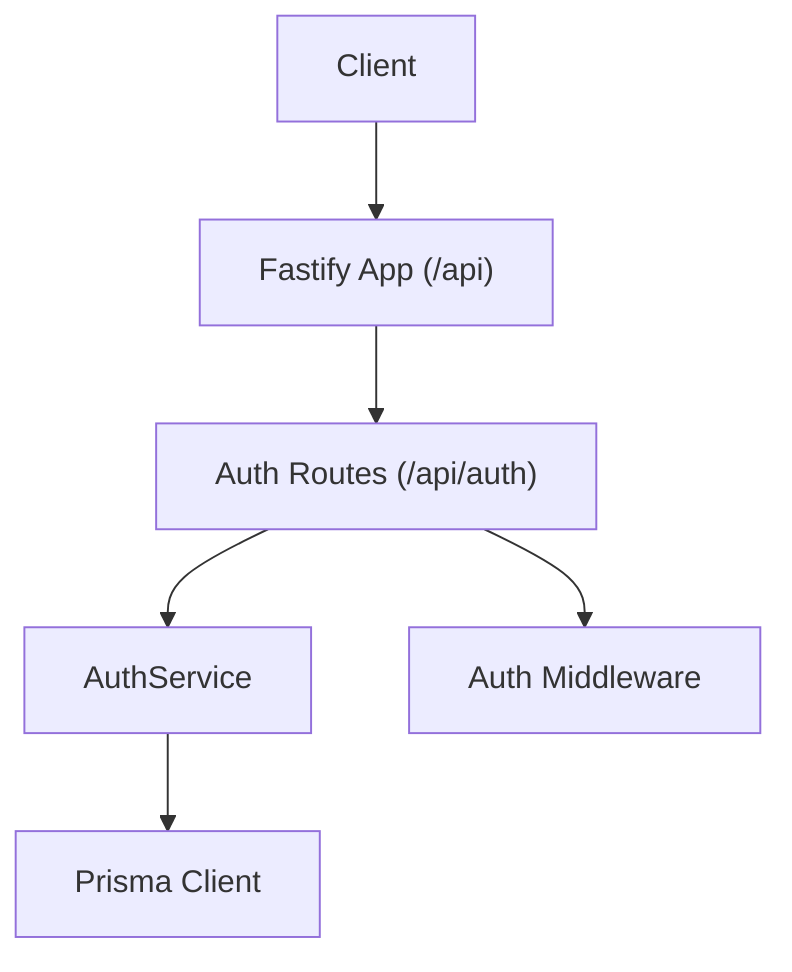
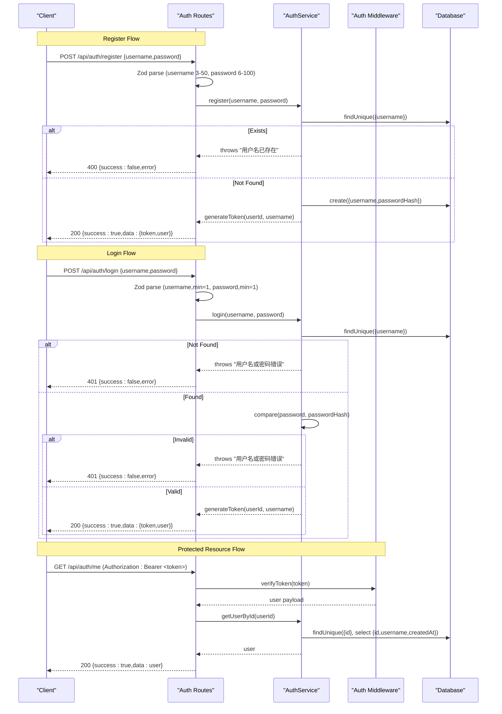
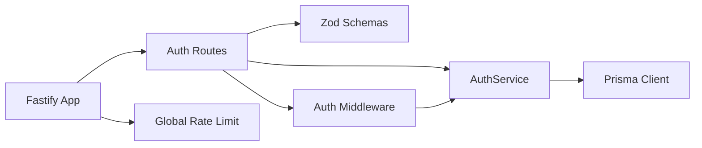

# Authentication Endpoints

<cite>
**Referenced Files in This Document**
- [auth.routes.ts](file://packages/server/src/routes/auth.routes.ts)
- [auth.service.ts](file://packages/server/src/services/auth.service.ts)
- [auth.middleware.ts](file://packages/server/src/middlewares/auth.middleware.ts)
- [index.ts](file://packages/server/src/routes/index.ts)
- [app.ts](file://packages/server/src/app.ts)
- [config.service.ts](file://packages/server/src/services/config.service.ts)
- [types/index.ts](file://packages/server/src/types/index.ts)
</cite>

## Table of Contents
1. [Introduction](#introduction)
2. [Project Structure](#project-structure)
3. [Core Components](#core-components)
4. [Architecture Overview](#architecture-overview)
5. [Detailed Component Analysis](#detailed-component-analysis)
6. [Dependency Analysis](#dependency-analysis)
7. [Performance Considerations](#performance-considerations)
8. [Troubleshooting Guide](#troubleshooting-guide)
9. [Conclusion](#conclusion)
10. [Appendices](#appendices)

## Introduction
This document provides comprehensive API documentation for the authentication endpoints exposed by the server. It covers:
- POST /api/auth/register for user registration with username/password validation and response schemas
- POST /api/auth/login for user authentication with credential verification and token generation
- GET /api/auth/me for retrieving current user information protected by authentication middleware

It includes request/response schemas using Zod validation patterns, HTTP status codes, error handling strategies, security considerations, and practical client integration examples.

## Project Structure
Authentication endpoints are organized under the Fastify routing layer and backed by a service layer with middleware for token verification. Routes are mounted under the /api prefix, with authentication routes grouped under /api/auth.

**Diagram sources**
- [index.ts:52](file://packages/server/src/routes/index.ts#L52)
- [auth.routes.ts:16](file://packages/server/src/routes/auth.routes.ts#L16)
- [auth.service.ts:10](file://packages/server/src/services/auth.service.ts#L10)
- [auth.middleware.ts:11](file://packages/server/src/middlewares/auth.middleware.ts#L11)

**Section sources**
- [index.ts:51-52](file://packages/server/src/routes/index.ts#L51-L52)
- [app.ts:114-115](file://packages/server/src/app.ts#L114-L115)

## Core Components
- Auth Routes: Define three endpoints:
  - POST /api/auth/register: Validates input via Zod, delegates to AuthService.register, and returns a tokenized response
  - POST /api/auth/login: Validates input via Zod, authenticates via AuthService.login, and returns a tokenized response
  - GET /api/auth/me: Protected by authMiddleware, fetches user info via AuthService.getUserById
- Auth Service: Implements registration, login, user lookup, and JWT token generation/verification
- Auth Middleware: Extracts Authorization header, validates JWT, and attaches user payload to request
- Configuration: Provides JWT secret and expiration, plus global rate limit settings

**Section sources**
- [auth.routes.ts:16-54](file://packages/server/src/routes/auth.routes.ts#L16-L54)
- [auth.service.ts:10-88](file://packages/server/src/services/auth.service.ts#L10-L88)
- [auth.middleware.ts:11-32](file://packages/server/src/middlewares/auth.middleware.ts#L11-L32)
- [config.service.ts:100-103](file://packages/server/src/services/config.service.ts#L100-L103)

## Architecture Overview
The authentication flow integrates route validation, service logic, and middleware for secure access.

**Diagram sources**
- [auth.routes.ts:18-31](file://packages/server/src/routes/auth.routes.ts#L18-L31)
- [auth.routes.ts:34-47](file://packages/server/src/routes/auth.routes.ts#L34-L47)
- [auth.routes.ts:50-53](file://packages/server/src/routes/auth.routes.ts#L50-L53)
- [auth.service.ts:11-33](file://packages/server/src/services/auth.service.ts#L11-L33)
- [auth.service.ts:35-55](file://packages/server/src/services/auth.service.ts#L35-L55)
- [auth.service.ts:57-68](file://packages/server/src/services/auth.service.ts#L57-L68)
- [auth.middleware.ts:23-31](file://packages/server/src/middlewares/auth.middleware.ts#L23-L31)

## Detailed Component Analysis

### POST /api/auth/register
- Purpose: Register a new user account
- Request Schema (Zod):
  - username: string, min length 3, max length 50
  - password: string, min length 6, max length 100
- Processing:
  - Route parses request body with Zod
  - Calls AuthService.register(username, password)
  - On success, returns { success: true, data: { token, user } }
  - On failure, returns { success: false, error: { code, message } }
- Responses:
  - 200 OK on success
  - 400 Bad Request on validation failure or registration error
- Validation:
  - Username uniqueness enforced by database query
  - Password hashed using bcrypt before storage
- Rate Limiting:
  - Applies global rate limiter configured in security.rateLimit
  - No endpoint-specific override is configured

Example request:
- POST /api/auth/register
- Headers: Content-Type: application/json
- Body: { "username": "...", "password": "..." }

Example successful response:
- 200 OK
- Body: { "success": true, "data": { "token": "...", "user": { "userId": 123, "username": "..." } } }

Example error response:
- 400 Bad Request
- Body: { "success": false, "error": { "code": "REGISTER_FAILED", "message": "..." } }

**Section sources**
- [auth.routes.ts:6-9](file://packages/server/src/routes/auth.routes.ts#L6-L9)
- [auth.routes.ts:18-31](file://packages/server/src/routes/auth.routes.ts#L18-L31)
- [auth.service.ts:11-33](file://packages/server/src/services/auth.service.ts#L11-L33)

### POST /api/auth/login
- Purpose: Authenticate an existing user and issue a JWT
- Request Schema (Zod):
  - username: string, min length 1
  - password: string, min length 1
- Processing:
  - Route parses request body with Zod
  - Calls AuthService.login(username, password)
  - On success, returns { success: true, data: { token, user } }
  - On failure, returns { success: false, error: { code, message } }
- Responses:
  - 200 OK on success
  - 401 Unauthorized on invalid credentials
- Validation:
  - Compares provided password against stored hash
- Rate Limiting:
  - Applies global rate limiter configured in security.rateLimit
  - No endpoint-specific override is configured

Example request:
- POST /api/auth/login
- Headers: Content-Type: application/json
- Body: { "username": "...", "password": "..." }

Example successful response:
- 200 OK
- Body: { "success": true, "data": { "token": "...", "user": { "userId": 123, "username": "..." } } }

Example error response:
- 401 Unauthorized
- Body: { "success": false, "error": { "code": "LOGIN_FAILED", "message": "..." } }

**Section sources**
- [auth.routes.ts:11-14](file://packages/server/src/routes/auth.routes.ts#L11-L14)
- [auth.routes.ts:34-47](file://packages/server/src/routes/auth.routes.ts#L34-L47)
- [auth.service.ts:35-55](file://packages/server/src/services/auth.service.ts#L35-L55)

### GET /api/auth/me
- Purpose: Retrieve currently authenticated user’s profile
- Authentication:
  - Requires Authorization header with Bearer token
  - Auth middleware verifies token and attaches user payload to request
- Processing:
  - Route handler calls AuthService.getUserById(request.user!.userId)
  - Returns { success: true, data: user }
- Responses:
  - 200 OK on success
  - 401 Unauthorized if missing/invalid token
  - 404 Not Found if user does not exist
- Validation:
  - User existence verified by database query with selected fields

Example request:
- GET /api/auth/me
- Headers: Authorization: Bearer <token>

Example successful response:
- 200 OK
- Body: { "success": true, "data": { "id": 123, "username": "...", "createdAt": "..." } }

Example error responses:
- 401 Unauthorized
  - Body: { "success": false, "error": { "code": "UNAUTHORIZED"|"INVALID_TOKEN", "message": "..." } }
- 404 Not Found
  - Body: { "success": false, "error": { "code": "USER_NOT_FOUND", "message": "..." } }

**Section sources**
- [auth.routes.ts:50-53](file://packages/server/src/routes/auth.routes.ts#L50-L53)
- [auth.middleware.ts:11-32](file://packages/server/src/middlewares/auth.middleware.ts#L11-L32)
- [auth.service.ts:57-68](file://packages/server/src/services/auth.service.ts#L57-L68)
- [types/index.ts:44-47](file://packages/server/src/types/index.ts#L44-L47)

## Dependency Analysis
- Route-to-Service coupling:
  - Auth routes depend on AuthService for business logic
  - Auth routes depend on Zod for request validation
- Middleware dependency:
  - Auth routes optionally depend on authMiddleware for protected endpoints
  - Auth middleware depends on AuthService for token verification
- Service-to-DB coupling:
  - AuthService uses Prisma client for user persistence and retrieval
- Global rate limiting:
  - Applied at the Fastify app level and affects all routes including auth endpoints

**Diagram sources**
- [auth.routes.ts:16](file://packages/server/src/routes/auth.routes.ts#L16)
- [auth.service.ts:10](file://packages/server/src/services/auth.service.ts#L10)
- [auth.middleware.ts:11](file://packages/server/src/middlewares/auth.middleware.ts#L11)
- [app.ts:86-97](file://packages/server/src/app.ts#L86-L97)

**Section sources**
- [auth.routes.ts:16-54](file://packages/server/src/routes/auth.routes.ts#L16-L54)
- [auth.service.ts:10-88](file://packages/server/src/services/auth.service.ts#L10-L88)
- [auth.middleware.ts:11-32](file://packages/server/src/middlewares/auth.middleware.ts#L11-L32)
- [app.ts:86-97](file://packages/server/src/app.ts#L86-L97)

## Performance Considerations
- Hashing cost:
  - Password hashing uses bcrypt with a fixed salt rounds value; adjust environment configuration if needed
- Token lifecycle:
  - JWT expiration is configurable; shorter expirations reduce long-lived token risk
- Rate limiting:
  - Global rate limiter applies to all routes; consider endpoint-specific overrides for authentication if needed
- Database queries:
  - Registration checks uniqueness via unique index lookup
  - Login compares hash against stored value; ensure indexing on username for optimal performance

[No sources needed since this section provides general guidance]

## Troubleshooting Guide
Common issues and resolutions:
- Registration fails with "用户名已存在":
  - Cause: Duplicate username detected by database
  - Resolution: Choose a unique username
- Login fails with "用户名或密码错误":
  - Cause: Nonexistent user or incorrect password
  - Resolution: Verify credentials; ensure password matches stored hash
- GET /api/auth/me returns 401:
  - Cause: Missing Authorization header or invalid/expired token
  - Resolution: Include Authorization: Bearer <valid-token>; refresh token if expired
- GET /api/auth/me returns 404:
  - Cause: User deleted or not found
  - Resolution: Re-authenticate or contact support
- Global rate limit exceeded:
  - Symptom: 429 responses with RATE_LIMIT_EXCEEDED
  - Resolution: Back off and retry; consider reducing request frequency

**Section sources**
- [auth.service.ts:16-19](file://packages/server/src/services/auth.service.ts#L16-L19)
- [auth.service.ts:40-50](file://packages/server/src/services/auth.service.ts#L40-L50)
- [auth.middleware.ts:14-19](file://packages/server/src/middlewares/auth.middleware.ts#L14-L19)
- [auth.middleware.ts:26-31](file://packages/server/src/middlewares/auth.middleware.ts#L26-L31)
- [app.ts:93-96](file://packages/server/src/app.ts#L93-L96)

## Conclusion
The authentication system provides secure, validated endpoints for registration, login, and user retrieval. It leverages Zod for request validation, bcrypt for password hashing, JWT for tokenization, and middleware for bearer token verification. Global rate limiting protects the API from abuse. Clients should implement robust error handling, token storage, and refresh strategies for reliable operation.

[No sources needed since this section summarizes without analyzing specific files]

## Appendices

### Request/Response Schemas and Status Codes
- POST /api/auth/register
  - Request: { username: string, password: string }
  - Success: 200 { success: true, data: { token: string, user: { userId: number, username: string } } }
  - Errors: 400 { success: false, error: { code: "REGISTER_FAILED", message: string } }
- POST /api/auth/login
  - Request: { username: string, password: string }
  - Success: 200 { success: true, data: { token: string, user: { userId: number, username: string } } }
  - Errors: 401 { success: false, error: { code: "LOGIN_FAILED", message: string } }
- GET /api/auth/me
  - Request: Authorization: Bearer <token>
  - Success: 200 { success: true, data: { id: number, username: string, createdAt: string } }
  - Errors: 401 { success: false, error: { code: "UNAUTHORIZED"|"INVALID_TOKEN", message: string } }; 404 { success: false, error: { code: "USER_NOT_FOUND", message: string } }

**Section sources**
- [auth.routes.ts:6-9](file://packages/server/src/routes/auth.routes.ts#L6-L9)
- [auth.routes.ts:11-14](file://packages/server/src/routes/auth.routes.ts#L11-L14)
- [auth.routes.ts:18-31](file://packages/server/src/routes/auth.routes.ts#L18-L31)
- [auth.routes.ts:34-47](file://packages/server/src/routes/auth.routes.ts#L34-L47)
- [auth.routes.ts:50-53](file://packages/server/src/routes/auth.routes.ts#L50-L53)
- [auth.service.ts:57-68](file://packages/server/src/services/auth.service.ts#L57-L68)
- [auth.middleware.ts:14-19](file://packages/server/src/middlewares/auth.middleware.ts#L14-L19)
- [auth.middleware.ts:26-31](file://packages/server/src/middlewares/auth.middleware.ts#L26-L31)

### Security Considerations
- Transport security:
  - Use HTTPS in production to protect tokens and credentials
- Token storage:
  - Store tokens securely (e.g., HttpOnly cookies or secure local storage)
  - Enforce short token lifespans and refresh mechanisms
- Input validation:
  - Zod schemas enforce minimum lengths and presence
- Rate limiting:
  - Global rate limiter reduces brute-force attempts; consider endpoint-specific limits for login/register if needed
- Logging:
  - Middleware logs warnings for failed attempts; avoid logging sensitive fields

**Section sources**
- [app.ts:38-66](file://packages/server/src/app.ts#L38-L66)
- [app.ts:86-97](file://packages/server/src/app.ts#L86-L97)
- [auth.service.ts:16-19](file://packages/server/src/services/auth.service.ts#L16-L19)
- [auth.service.ts:40-50](file://packages/server/src/services/auth.service.ts#L40-L50)

### Practical Examples and Client Patterns
- Successful registration and login flow:
  - Step 1: POST /api/auth/register with { username, password }
  - Step 2: Save returned token securely
  - Step 3: On subsequent requests, include Authorization: Bearer <token>
  - Step 4: GET /api/auth/me to confirm identity
- Error handling patterns:
  - Registration: On 400, prompt user to choose another username
  - Login: On 401, prompt user to re-enter credentials
  - Protected resource: On 401, trigger re-login; on 404, notify user to re-authenticate
- Integration tips:
  - Implement exponential backoff on rate limit errors
  - Rotate JWT secret in production and manage expiration appropriately

[No sources needed since this section provides general guidance]