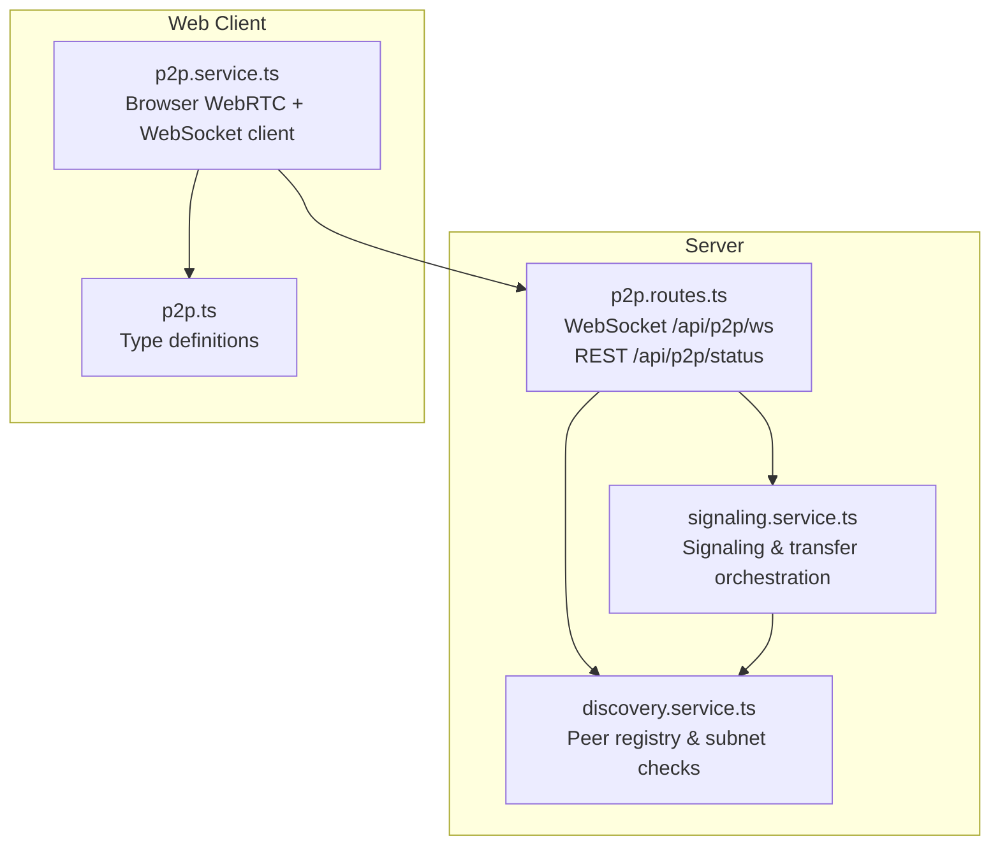
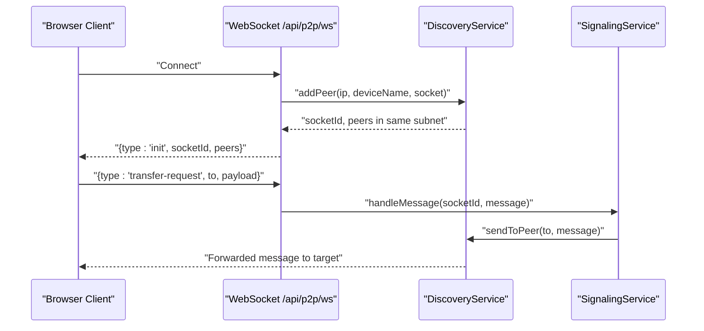
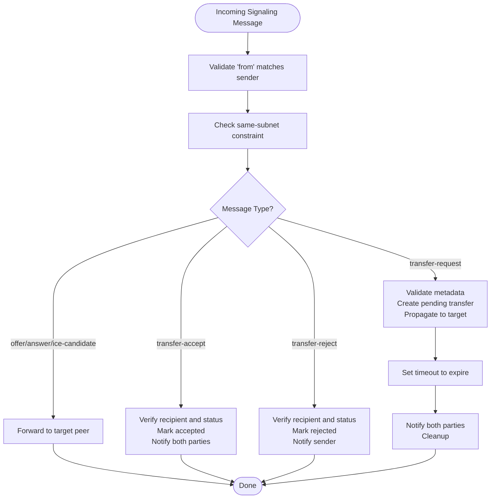
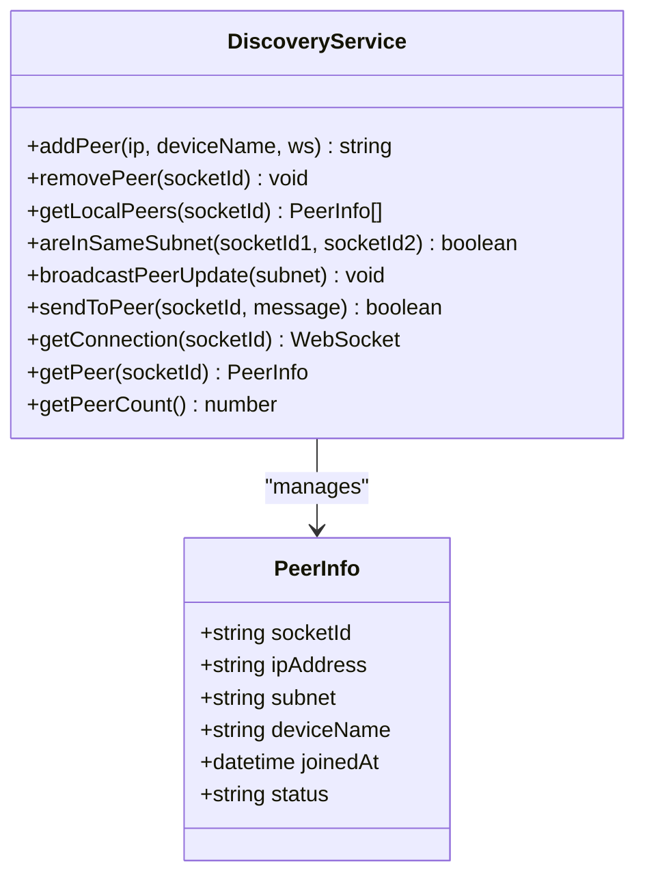
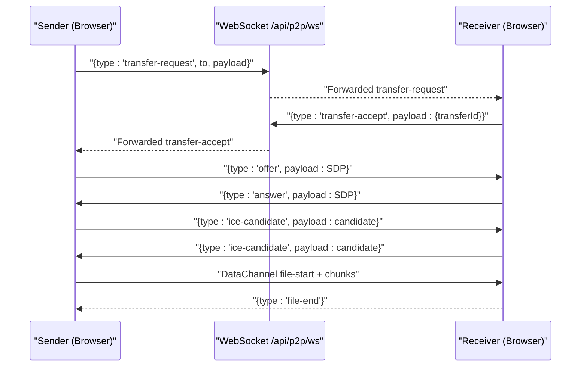
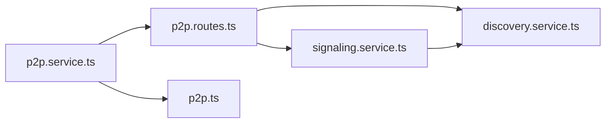

# P2P Communication Endpoints

<cite>
**Referenced Files in This Document**
- [config.json](file://config.json)
- [p2p.routes.ts](file://packages/server/src/routes/p2p.routes.ts)
- [signaling.service.ts](file://packages/server/src/services/signaling.service.ts)
- [discovery.service.ts](file://packages/server/src/services/discovery.service.ts)
- [p2p.service.ts](file://packages/web/src/services/p2p.service.ts)
- [p2p.ts](file://packages/web/src/types/p2p.ts)
</cite>

## Table of Contents
1. [Introduction](#introduction)
2. [Project Structure](#project-structure)
3. [Core Components](#core-components)
4. [Architecture Overview](#architecture-overview)
5. [Detailed Component Analysis](#detailed-component-analysis)
6. [Dependency Analysis](#dependency-analysis)
7. [Performance Considerations](#performance-considerations)
8. [Troubleshooting Guide](#troubleshooting-guide)
9. [Conclusion](#conclusion)

## Introduction
This document provides comprehensive API documentation for P2P communication endpoints in the system. It covers:
- WebSocket signaling endpoint for WebRTC signaling server communication (ICE candidates, offers/answers, connection establishment)
- REST endpoint for peer discovery and availability checking with NAT traversal support
- Real-time coordination via WebSocket messages, including transfer requests and progress updates
- Connection lifecycle management, STUN/TURN configuration, and fallback mechanisms for NAT traversal failures
- Examples of P2P handshake sequences, client-side integration patterns, and troubleshooting guidance

The P2P subsystem is designed for local network direct transfers with built-in subnet-based isolation and signaling coordination.

## Project Structure
The P2P functionality spans the server and web client packages:
- Server routes define WebSocket and REST endpoints for signaling and discovery
- Server services implement signaling forwarding, transfer orchestration, and peer discovery
- Web client provides a P2P service wrapper around browser WebRTC APIs and WebSocket signaling

**Diagram sources**
- [p2p.routes.ts:48-133](file://packages/server/src/routes/p2p.routes.ts#L48-L133)
- [signaling.service.ts:26-350](file://packages/server/src/services/signaling.service.ts#L26-L350)
- [discovery.service.ts:13-207](file://packages/server/src/services/discovery.service.ts#L13-L207)
- [p2p.service.ts:14-580](file://packages/web/src/services/p2p.service.ts#L14-L580)
- [p2p.ts:1-101](file://packages/web/src/types/p2p.ts#L1-L101)

**Section sources**
- [p2p.routes.ts:48-133](file://packages/server/src/routes/p2p.routes.ts#L48-L133)
- [signaling.service.ts:26-350](file://packages/server/src/services/signaling.service.ts#L26-L350)
- [discovery.service.ts:13-207](file://packages/server/src/services/discovery.service.ts#L13-L207)
- [p2p.service.ts:14-580](file://packages/web/src/services/p2p.service.ts#L14-L580)
- [p2p.ts:1-101](file://packages/web/src/types/p2p.ts#L1-L101)

## Core Components
- WebSocket endpoint: `/api/p2p/ws` for signaling and presence
- REST endpoint: `/api/p2p/status` for P2P subsystem health and peer count
- Signaling service: forwards WebRTC offers/answers/ICE candidates and manages transfer requests
- Discovery service: maintains peer registry, subnet-based filtering, and broadcasts peer lists
- Web client P2P service: wraps browser WebRTC APIs, handles signaling, and orchestrates file transfers over DataChannels

Key configuration:
- P2P enabled flag and limits are configured in the global configuration file

**Section sources**
- [p2p.routes.ts:48-133](file://packages/server/src/routes/p2p.routes.ts#L48-L133)
- [signaling.service.ts:26-350](file://packages/server/src/services/signaling.service.ts#L26-L350)
- [discovery.service.ts:13-207](file://packages/server/src/services/discovery.service.ts#L13-L207)
- [config.json:94-101](file://config.json#L94-L101)

## Architecture Overview
The P2P architecture consists of:
- A WebSocket server that registers peers by IP subnet and sends initial peer lists
- A signaling service that validates cross-peer constraints and forwards messages
- A discovery service that enforces local-network-only communication and broadcasts peer updates
- A browser-based client that creates WebRTC connections and transfers files over DataChannels

**Diagram sources**
- [p2p.routes.ts:57-123](file://packages/server/src/routes/p2p.routes.ts#L57-L123)
- [signaling.service.ts:40-87](file://packages/server/src/services/signaling.service.ts#L40-L87)
- [discovery.service.ts:42-81](file://packages/server/src/services/discovery.service.ts#L42-L81)

## Detailed Component Analysis

### WebSocket Endpoint: /api/p2p/ws
Purpose:
- Establishes a WebSocket session for signaling and presence
- Registers peers by IP subnet and device name
- Sends initial peer list and broadcasts updates

Behavior:
- On connect: registers peer, generates socketId, sends initialization with peers in the same subnet
- On message: parses JSON and delegates to signaling service
- On close/error: removes peer from registry

Security and constraints:
- Enforces local subnet communication for all signaling messages
- Validates that the sender's claimed identity matches the actual socketId

Operational details:
- Max payload size configured for WebSocket transport
- Device name derived from User-Agent or query parameter

**Section sources**
- [p2p.routes.ts:57-123](file://packages/server/src/routes/p2p.routes.ts#L57-L123)
- [signaling.service.ts:40-87](file://packages/server/src/services/signaling.service.ts#L40-L87)
- [discovery.service.ts:42-81](file://packages/server/src/services/discovery.service.ts#L42-L81)

### REST Endpoint: /api/p2p/status
Purpose:
- Reports P2P subsystem status and current peer count

Response:
- enabled: boolean indicating P2P subsystem status
- peerCount: number of currently connected peers

**Section sources**
- [p2p.routes.ts:125-131](file://packages/server/src/routes/p2p.routes.ts#L125-L131)

### Signaling Orchestration: SignalingService
Responsibilities:
- Validates message origin and cross-peer constraints
- Forwards WebRTC signaling messages (offer, answer, ice-candidate)
- Manages transfer requests: creation, acceptance, rejection, expiration
- Completes transfers and resets peer statuses

Key flows:
- Offer/Answer/ICE candidate forwarding with availability checks
- Transfer request validation and propagation with timeout
- Transfer acceptance/rejection verification and status updates
- Expiration handling and cleanup

**Diagram sources**
- [signaling.service.ts:40-87](file://packages/server/src/services/signaling.service.ts#L40-L87)
- [signaling.service.ts:112-202](file://packages/server/src/services/signaling.service.ts#L112-L202)
- [signaling.service.ts:207-316](file://packages/server/src/services/signaling.service.ts#L207-L316)

**Section sources**
- [signaling.service.ts:26-350](file://packages/server/src/services/signaling.service.ts#L26-L350)

### Peer Discovery and Subnet Isolation: DiscoveryService
Responsibilities:
- Maintains peer registry with socketId, IP, subnet, device name, and status
- Computes subnets for IPv4 (/24) and IPv6 (/64 equivalent)
- Broadcasts peer list updates per subnet
- Enforces local-network-only communication

Key behaviors:
- Adds/removes peers and updates peer lists
- Filters peers to same subnet for signaling
- Updates peer status during transfers

**Diagram sources**
- [discovery.service.ts:13-207](file://packages/server/src/services/discovery.service.ts#L13-L207)

**Section sources**
- [discovery.service.ts:13-207](file://packages/server/src/services/discovery.service.ts#L13-L207)

### Web Client P2P Service: Browser Integration
Responsibilities:
- Connects to WebSocket signaling server
- Handles signaling messages (offer, answer, ICE candidate)
- Creates and manages WebRTC peer connections
- Transfers files over DataChannels with chunking and progress reporting
- Accepts or rejects transfer requests

Key flows:
- Connect to signaling server and receive initial peer list
- Initiate transfer request and wait for acceptance
- Create offer, receive answer, exchange ICE candidates
- Send file chunks with backpressure control and progress updates
- Handle incoming file transfers and completion

**Diagram sources**
- [p2p.service.ts:362-398](file://packages/web/src/services/p2p.service.ts#L362-L398)
- [p2p.service.ts:403-446](file://packages/web/src/services/p2p.service.ts#L403-L446)
- [p2p.service.ts:502-551](file://packages/web/src/services/p2p.service.ts#L502-L551)

**Section sources**
- [p2p.service.ts:14-580](file://packages/web/src/services/p2p.service.ts#L14-L580)
- [p2p.ts:1-101](file://packages/web/src/types/p2p.ts#L1-L101)

## Dependency Analysis
Component relationships:
- p2p.routes.ts depends on discovery.service.ts and signaling.service.ts
- signaling.service.ts depends on discovery.service.ts
- p2p.service.ts (web) communicates with the WebSocket server and browser WebRTC APIs

**Diagram sources**
- [p2p.routes.ts:1-7](file://packages/server/src/routes/p2p.routes.ts#L1-L7)
- [signaling.service.ts:1-2](file://packages/server/src/services/signaling.service.ts#L1-L2)
- [discovery.service.ts:1-2](file://packages/server/src/services/discovery.service.ts#L1-L2)
- [p2p.service.ts:1-7](file://packages/web/src/services/p2p.service.ts#L1-L7)
- [p2p.ts:1-1](file://packages/web/src/types/p2p.ts#L1-L1)

**Section sources**
- [p2p.routes.ts:1-7](file://packages/server/src/routes/p2p.routes.ts#L1-L7)
- [signaling.service.ts:1-2](file://packages/server/src/services/signaling.service.ts#L1-L2)
- [discovery.service.ts:1-2](file://packages/server/src/services/discovery.service.ts#L1-L2)
- [p2p.service.ts:1-7](file://packages/web/src/services/p2p.service.ts#L1-L7)
- [p2p.ts:1-1](file://packages/web/src/types/p2p.ts#L1-L1)

## Performance Considerations
- Chunk size: DataChannel file transfer uses a fixed chunk size optimized for reliability
- Backpressure control: Sender waits when buffered amount exceeds thresholds to prevent memory pressure
- Timeout handling: Transfer request timeout and connection establishment timeouts are enforced
- Payload limits: WebSocket max payload is configured to balance throughput and memory usage
- Local network focus: Subnet-based enforcement avoids unnecessary long-haul signaling

[No sources needed since this section provides general guidance]

## Troubleshooting Guide
Common issues and resolutions:
- Peers not visible: Ensure devices are on the same subnet; the system enforces local-network-only communication
- Signaling failures: Verify WebSocket connection is established and messages are parsable; check for parse errors
- Transfer timeouts: Confirm both peers remain connected; requests expire after a configured timeout
- ICE candidate exchange: Ensure both sides are exchanging candidates; check connection state logs
- DataChannel errors: Monitor channel open/close events and buffered amount; adjust chunk sizes if needed

Operational indicators:
- Status endpoint returns current peer count and subsystem status
- Logs capture connection events, errors, and message forwarding outcomes

**Section sources**
- [p2p.routes.ts:125-131](file://packages/server/src/routes/p2p.routes.ts#L125-L131)
- [signaling.service.ts:92-107](file://packages/server/src/services/signaling.service.ts#L92-L107)
- [p2p.service.ts:78-102](file://packages/web/src/services/p2p.service.ts#L78-L102)

## Conclusion
The P2P subsystem provides a streamlined signaling and transfer framework optimized for local networks. It leverages WebSocket-based signaling, strict subnet enforcement, and WebRTC DataChannels for efficient file transfers. The documented endpoints and flows enable reliable peer-to-peer communication with clear error handling and progress reporting.