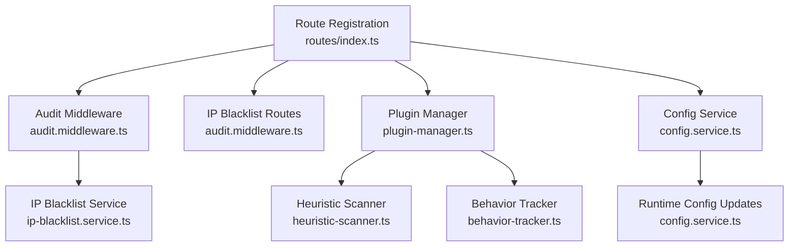
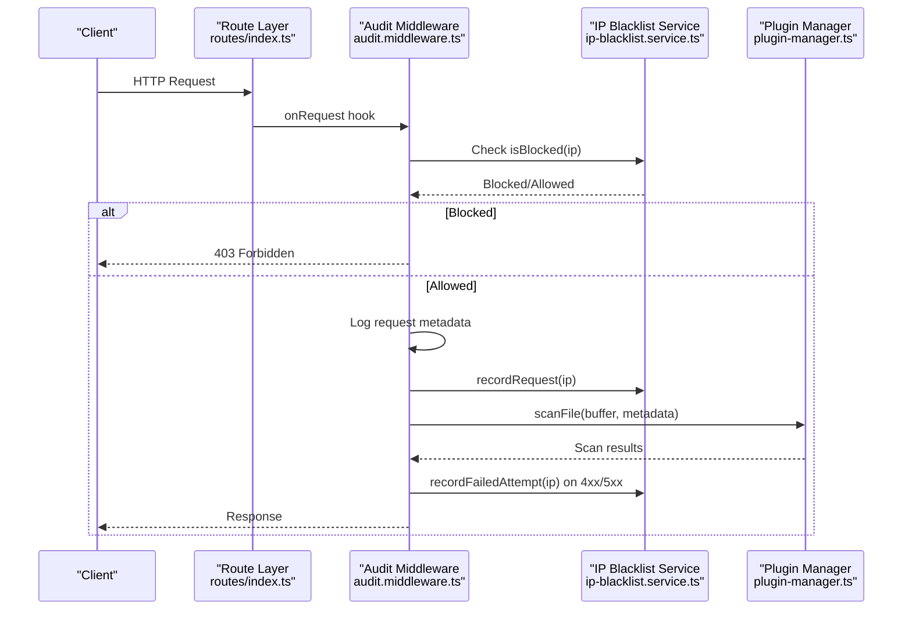
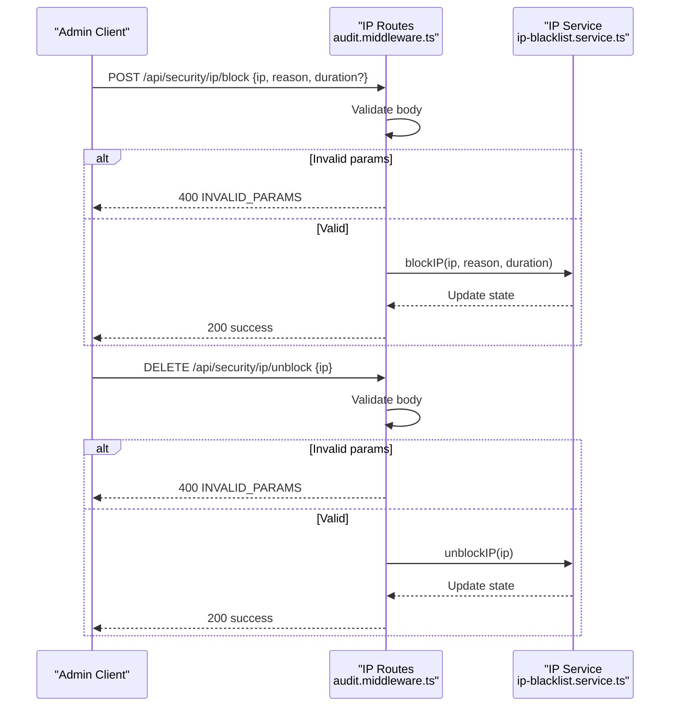
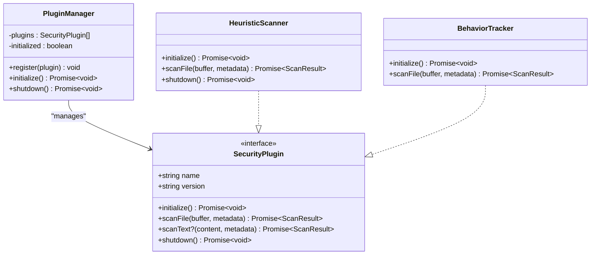
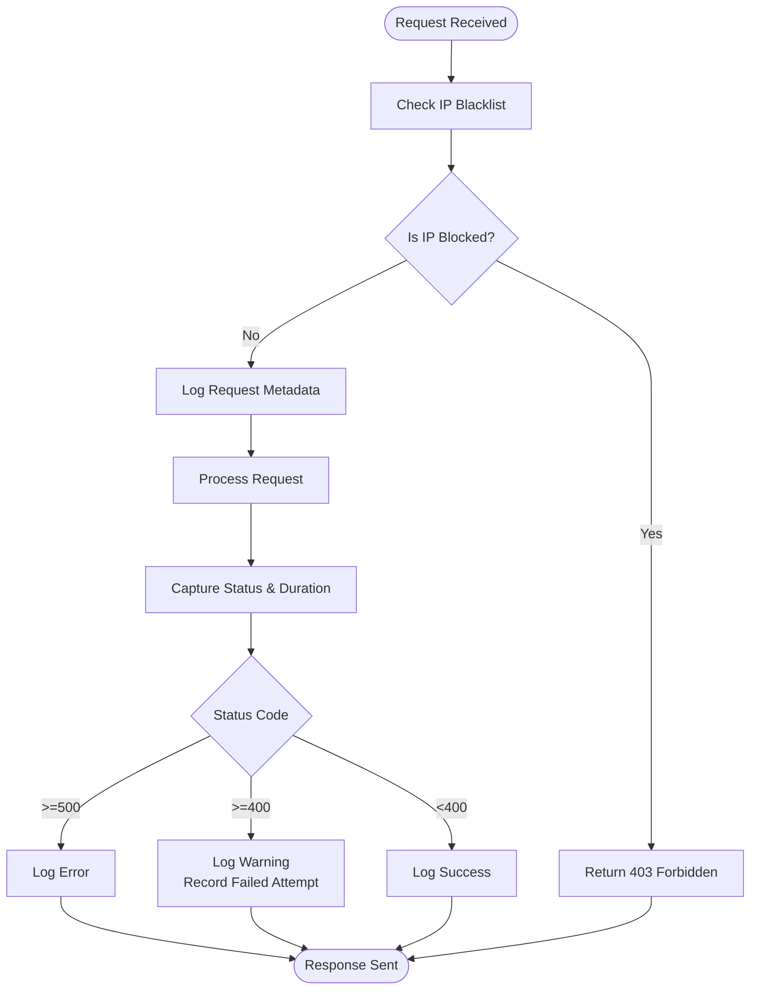
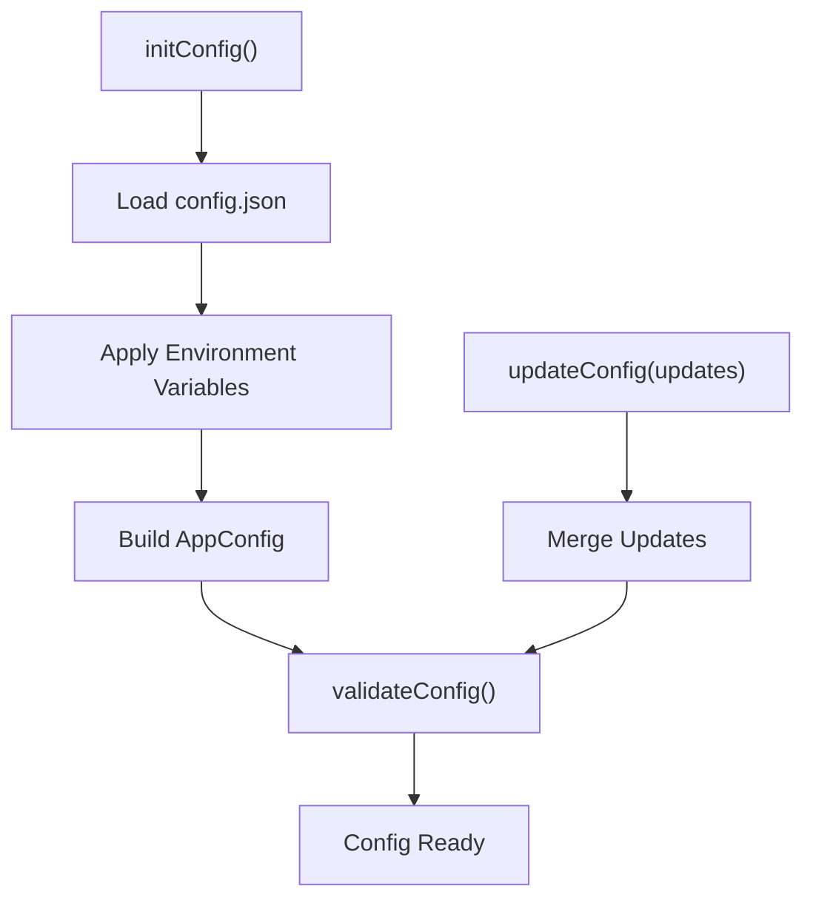
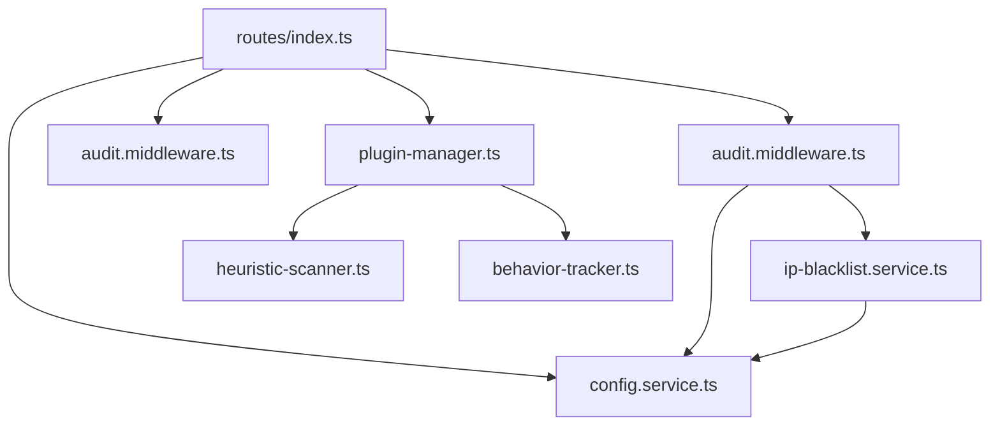

# Security Management Endpoints

<cite>
**Referenced Files in This Document**
- [routes/index.ts](file://packages/server/src/routes/index.ts)
- [audit.middleware.ts](file://packages/server/src/middlewares/audit.middleware.ts)
- [ip-blacklist.service.ts](file://packages/server/src/services/ip-blacklist.service.ts)
- [config.service.ts](file://packages/server/src/services/config.service.ts)
- [plugin-manager.ts](file://packages/server/src/plugins/plugin-manager.ts)
- [types.ts](file://packages/server/src/plugins/types.ts)
- [heuristic-scanner.ts](file://packages/server/src/plugins/heuristic-scanner.ts)
- [behavior-tracker.ts](file://packages/server/src/plugins/behavior-tracker.ts)
- [config.json](file://packages/server/config.json)
- [api.test.ts](file://packages/server/test/routes/api.test.ts)
</cite>

## Table of Contents
1. [Introduction](#introduction)
2. [Project Structure](#project-structure)
3. [Core Components](#core-components)
4. [Architecture Overview](#architecture-overview)
5. [Detailed Component Analysis](#detailed-component-analysis)
6. [Dependency Analysis](#dependency-analysis)
7. [Performance Considerations](#performance-considerations)
8. [Troubleshooting Guide](#troubleshooting-guide)
9. [Conclusion](#conclusion)

## Introduction
This document provides comprehensive API documentation for security management endpoints in the AirtPortal server. It covers IP address management, security plugin lifecycle, audit logging, and runtime configuration updates. The focus is on practical usage, integration patterns, and operational procedures for security monitoring and incident response.

## Project Structure
The security-related functionality is organized around:
- Route registration and middleware integration
- IP blacklist service for access control and analytics
- Security plugin system (heuristic scanner and behavior tracker)
- Runtime configuration service supporting environment-driven security policies
- Audit middleware for request logging and automatic blocking

**Diagram sources**
- [routes/index.ts:10-62](file://packages/server/src/routes/index.ts#L10-L62)
- [audit.middleware.ts:48-124](file://packages/server/src/middlewares/audit.middleware.ts#L48-L124)
- [ip-blacklist.service.ts:14-214](file://packages/server/src/services/ip-blacklist.service.ts#L14-L214)
- [plugin-manager.ts:4-47](file://packages/server/src/plugins/plugin-manager.ts#L4-L47)
- [heuristic-scanner.ts:25-173](file://packages/server/src/plugins/heuristic-scanner.ts#L25-L173)
- [behavior-tracker.ts:12-42](file://packages/server/src/plugins/behavior-tracker.ts#L12-L42)
- [config.service.ts:348-364](file://packages/server/src/services/config.service.ts#L348-L364)

**Section sources**
- [routes/index.ts:10-62](file://packages/server/src/routes/index.ts#L10-L62)
- [audit.middleware.ts:48-124](file://packages/server/src/middlewares/audit.middleware.ts#L48-L124)
- [ip-blacklist.service.ts:14-214](file://packages/server/src/services/ip-blacklist.service.ts#L14-L214)
- [plugin-manager.ts:4-47](file://packages/server/src/plugins/plugin-manager.ts#L4-L47)
- [heuristic-scanner.ts:25-173](file://packages/server/src/plugins/heuristic-scanner.ts#L25-L173)
- [behavior-tracker.ts:12-42](file://packages/server/src/plugins/behavior-tracker.ts#L12-L42)
- [config.service.ts:348-364](file://packages/server/src/services/config.service.ts#L348-L364)

## Core Components
- IP Blacklist Management: Provides endpoints to list blocked IPs, add/remove entries, and retrieve statistics. Includes automatic blocking based on failure thresholds.
- Security Plugin System: Manages heuristic scanning and behavior tracking plugins with registration, initialization, and shutdown lifecycle.
- Audit Logging: Centralized middleware that logs requests, sensitive data sanitization, and integrates with IP blacklist for automatic blocking.
- Runtime Configuration: Environment-driven configuration service enabling dynamic security policy updates.

**Section sources**
- [audit.middleware.ts:129-186](file://packages/server/src/middlewares/audit.middleware.ts#L129-L186)
- [ip-blacklist.service.ts:14-214](file://packages/server/src/services/ip-blacklist.service.ts#L14-L214)
- [plugin-manager.ts:4-47](file://packages/server/src/plugins/plugin-manager.ts#L4-L47)
- [config.service.ts:348-364](file://packages/server/src/services/config.service.ts#L348-L364)

## Architecture Overview
The security architecture integrates route registration, middleware enforcement, and plugin orchestration. The audit middleware intercepts all requests, checks IP blacklist status, records request/response metadata, and triggers automatic blocking based on failure patterns. The IP blacklist service maintains state for blocked and whitelisted IPs and provides analytics.

**Diagram sources**
- [routes/index.ts:41-44](file://packages/server/src/routes/index.ts#L41-L44)
- [audit.middleware.ts:48-124](file://packages/server/src/middlewares/audit.middleware.ts#L48-L124)
- [ip-blacklist.service.ts:37-42](file://packages/server/src/services/ip-blacklist.service.ts#L37-L42)
- [plugin-manager.ts:8-32](file://packages/server/src/plugins/plugin-manager.ts#L8-L32)

## Detailed Component Analysis

### IP Address Management Endpoints
The IP management endpoints are exposed under `/api/security/ip` with built-in rate limiting and administrative controls.

- GET /api/security/ip/stats
  - Purpose: Retrieve security statistics including total records, blocked count, and top failed IPs.
  - Rate limit: 5 requests per minute.
  - Response: Success flag and data payload containing statistics.
  - Example usage: Monitoring dashboard queries.

- GET /api/security/ip/blocked
  - Purpose: List currently blocked IP addresses.
  - Rate limit: 5 requests per minute.
  - Response: Success flag and array of blocked IPs.
  - Example usage: Compliance reporting and incident response triage.

- POST /api/security/ip/block
  - Purpose: Manually block an IP address with a reason and optional duration.
  - Request body: ip (required), reason (required), duration (optional).
  - Validation: Returns 400 with error code and message for missing parameters.
  - Response: Success flag and confirmation message.
  - Example usage: Emergency blocking during attacks.

- DELETE /api/security/ip/unblock
  - Purpose: Remove an IP from the blacklist.
  - Request body: ip (required).
  - Validation: Returns 400 with error code and message for missing IP.
  - Response: Success flag and confirmation message.
  - Example usage: Unblocking after investigation.

**Diagram sources**
- [audit.middleware.ts:159-185](file://packages/server/src/middlewares/audit.middleware.ts#L159-L185)
- [ip-blacklist.service.ts:125-162](file://packages/server/src/services/ip-blacklist.service.ts#L125-L162)

**Section sources**
- [audit.middleware.ts:129-186](file://packages/server/src/middlewares/audit.middleware.ts#L129-L186)
- [ip-blacklist.service.ts:14-214](file://packages/server/src/services/ip-blacklist.service.ts#L14-L214)
- [api.test.ts:337-348](file://packages/server/test/routes/api.test.ts#L337-L348)

### Security Plugin Management Endpoints
The security plugin system supports dynamic registration and lifecycle management of security plugins.

- Plugin Registration
  - Heuristic Scanner: Scans files for suspicious patterns and entropy anomalies.
  - Behavior Tracker: Monitors upload behavior and flags anomalous activity.
  - Registration occurs during route initialization when security plugins are enabled.

- Plugin Lifecycle
  - Initialize: Calls each plugin's initialize method; logs failures and prevents startup if any fail.
  - Shutdown: Calls each plugin's shutdown method; clears plugin registry.
  - Scan: Aggregates results from multiple plugins; determines verdict based on risk scores.

**Diagram sources**
- [plugin-manager.ts:4-47](file://packages/server/src/plugins/plugin-manager.ts#L4-L47)
- [types.ts:18-25](file://packages/server/src/plugins/types.ts#L18-L25)
- [heuristic-scanner.ts:25-173](file://packages/server/src/plugins/heuristic-scanner.ts#L25-L173)
- [behavior-tracker.ts:12-42](file://packages/server/src/plugins/behavior-tracker.ts#L12-L42)

**Section sources**
- [routes/index.ts:16-39](file://packages/server/src/routes/index.ts#L16-L39)
- [plugin-manager.ts:4-47](file://packages/server/src/plugins/plugin-manager.ts#L4-L47)
- [types.ts:18-25](file://packages/server/src/plugins/types.ts#L18-L25)
- [heuristic-scanner.ts:25-173](file://packages/server/src/plugins/heuristic-scanner.ts#L25-L173)
- [behavior-tracker.ts:12-42](file://packages/server/src/plugins/behavior-tracker.ts#L12-L42)

### Audit Log Retrieval Endpoints
The audit middleware provides centralized logging and integrates with IP blacklist for automatic blocking. While there is no dedicated GET endpoint for audit logs, the middleware captures comprehensive request/response metadata.

- Audit Logging Features
  - Sanitization: Removes sensitive fields (password, token, authorization).
  - Metadata capture: Method, URL, IP, user agent, query params, and optionally request body.
  - Status-based actions: Logs errors/warnings for 4xx/5xx responses and records failed attempts for IP blacklist.
  - Blocking: Returns 403 for blocked IPs before processing.

**Diagram sources**
- [audit.middleware.ts:48-124](file://packages/server/src/middlewares/audit.middleware.ts#L48-L124)
- [audit.middleware.ts:100-121](file://packages/server/src/middlewares/audit.middleware.ts#L100-L121)

**Section sources**
- [audit.middleware.ts:48-124](file://packages/server/src/middlewares/audit.middleware.ts#L48-L124)

### Runtime Security Configuration Endpoints
The configuration service supports environment-driven security policies and runtime updates.

- Configuration Sources
  - Environment variables override defaults and file-based configuration.
  - Supports security plugin configurations, rate limits, IP blacklist settings, and upload restrictions.

- Runtime Updates
  - updateConfig method allows partial configuration updates at runtime.
  - validateConfig ensures consistency and safety of applied changes.

- Key Security Settings
  - IP Blacklist: enable/disable, auto-block thresholds, whitelist/blacklist arrays.
  - Security Plugins: enable/disable heuristic and behavior trackers, thresholds, and patterns.
  - Rate Limits: global and upload-specific limits with windows.
  - Upload Policies: max file sizes, blocked extensions, and folder upload constraints.

**Diagram sources**
- [config.service.ts:155-259](file://packages/server/src/services/config.service.ts#L155-L259)
- [config.service.ts:358-364](file://packages/server/src/services/config.service.ts#L358-L364)
- [config.json:6-60](file://packages/server/config.json#L6-L60)

**Section sources**
- [config.service.ts:155-259](file://packages/server/src/services/config.service.ts#L155-L259)
- [config.service.ts:358-364](file://packages/server/src/services/config.service.ts#L358-L364)
- [config.json:6-60](file://packages/server/config.json#L6-L60)

## Dependency Analysis
The security system exhibits clear separation of concerns with low coupling between components.

**Diagram sources**
- [routes/index.ts:10-62](file://packages/server/src/routes/index.ts#L10-L62)
- [audit.middleware.ts:48-124](file://packages/server/src/middlewares/audit.middleware.ts#L48-L124)
- [ip-blacklist.service.ts:14-214](file://packages/server/src/services/ip-blacklist.service.ts#L14-L214)
- [plugin-manager.ts:4-47](file://packages/server/src/plugins/plugin-manager.ts#L4-L47)
- [heuristic-scanner.ts:25-173](file://packages/server/src/plugins/heuristic-scanner.ts#L25-L173)
- [behavior-tracker.ts:12-42](file://packages/server/src/plugins/behavior-tracker.ts#L12-L42)
- [config.service.ts:348-364](file://packages/server/src/services/config.service.ts#L348-L364)

**Section sources**
- [routes/index.ts:10-62](file://packages/server/src/routes/index.ts#L10-L62)
- [audit.middleware.ts:48-124](file://packages/server/src/middlewares/audit.middleware.ts#L48-L124)
- [ip-blacklist.service.ts:14-214](file://packages/server/src/services/ip-blacklist.service.ts#L14-L214)
- [plugin-manager.ts:4-47](file://packages/server/src/plugins/plugin-manager.ts#L4-L47)
- [heuristic-scanner.ts:25-173](file://packages/server/src/plugins/heuristic-scanner.ts#L25-L173)
- [behavior-tracker.ts:12-42](file://packages/server/src/plugins/behavior-tracker.ts#L12-L42)
- [config.service.ts:348-364](file://packages/server/src/services/config.service.ts#L348-L364)

## Performance Considerations
- IP Blacklist Operations: O(1) lookup for blocked/whitelisted IPs using sets; statistics aggregation sorts records with O(n log n) complexity.
- Plugin Scanning: Heuristic scanner performs entropy calculation and pattern matching; scanning is capped by configurable max scan size to avoid heavy CPU usage.
- Audit Logging: Sanitization and logging overhead are minimal; ensure appropriate log levels to avoid excessive I/O.
- Rate Limiting: Built-in rate limits on IP management endpoints prevent abuse; tune thresholds based on operational needs.

## Troubleshooting Guide
- Blocked IP Access
  - Symptom: 403 Forbidden responses for legitimate clients.
  - Action: Verify IP is not in blacklist; check whitelist configuration; review audit logs for blocked IP attempts.

- Plugin Initialization Failures
  - Symptom: Security plugin system fails to initialize.
  - Action: Review plugin manager logs; ensure all plugins implement required lifecycle methods; check configuration values.

- Audit Log Issues
  - Symptom: Missing or sanitized sensitive data in logs.
  - Action: Confirm audit middleware is registered; adjust log level; verify sensitive field detection logic.

- Configuration Validation Errors
  - Symptom: Startup/configuration update failures.
  - Action: Use validateConfig to identify invalid settings; correct thresholds and ranges; apply environment variable overrides carefully.

**Section sources**
- [audit.middleware.ts:54-66](file://packages/server/src/middlewares/audit.middleware.ts#L54-L66)
- [plugin-manager.ts:20-30](file://packages/server/src/plugins/plugin-manager.ts#L20-L30)
- [config.service.ts:264-343](file://packages/server/src/services/config.service.ts#L264-L343)

## Conclusion
The security management endpoints provide a robust foundation for IP control, plugin orchestration, auditing, and runtime configuration. By leveraging rate limits, automatic blocking, and environment-driven policies, operators can maintain strong security posture while enabling responsive incident handling and continuous monitoring.