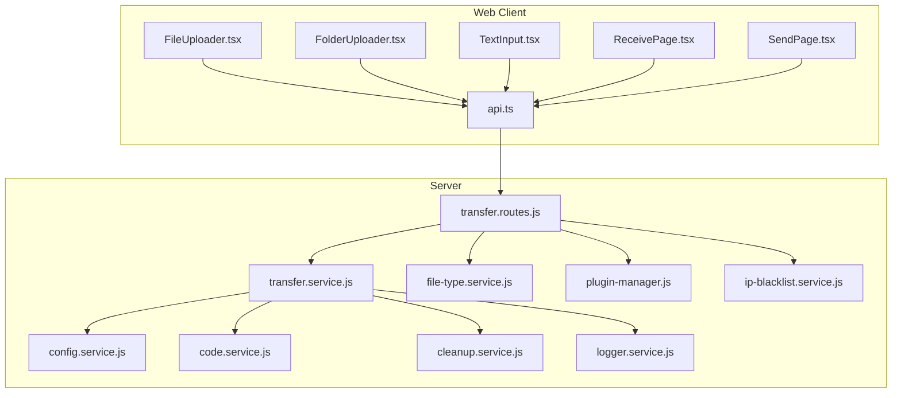
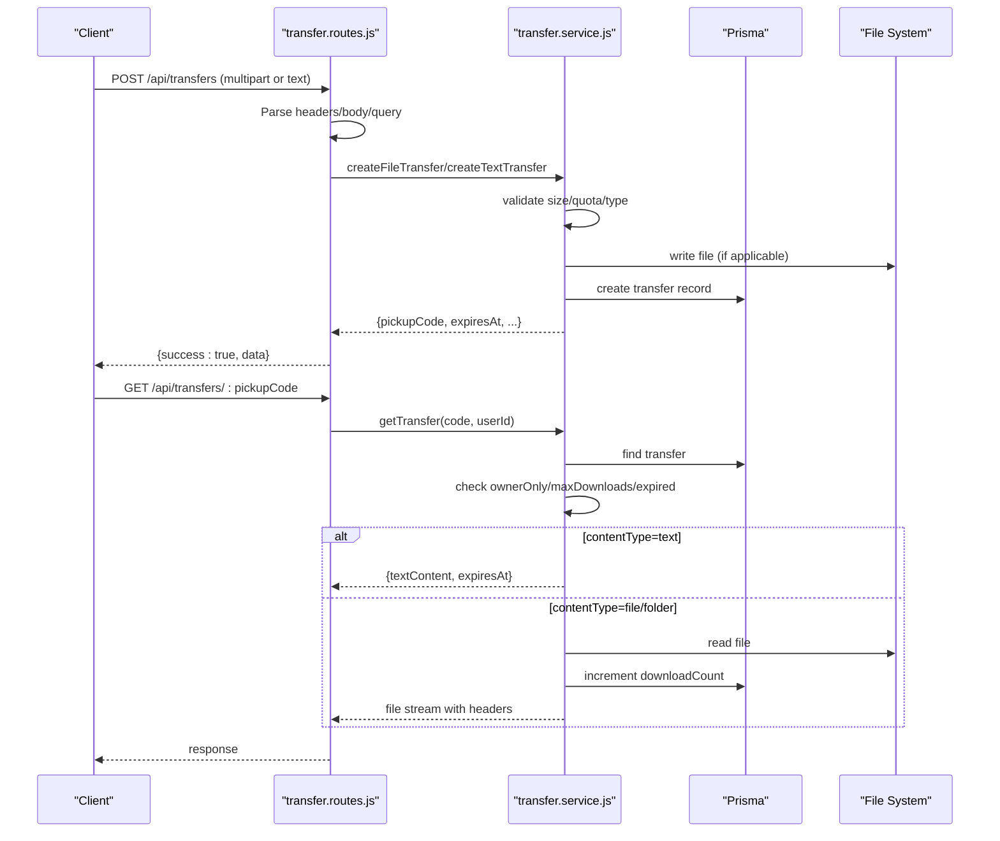
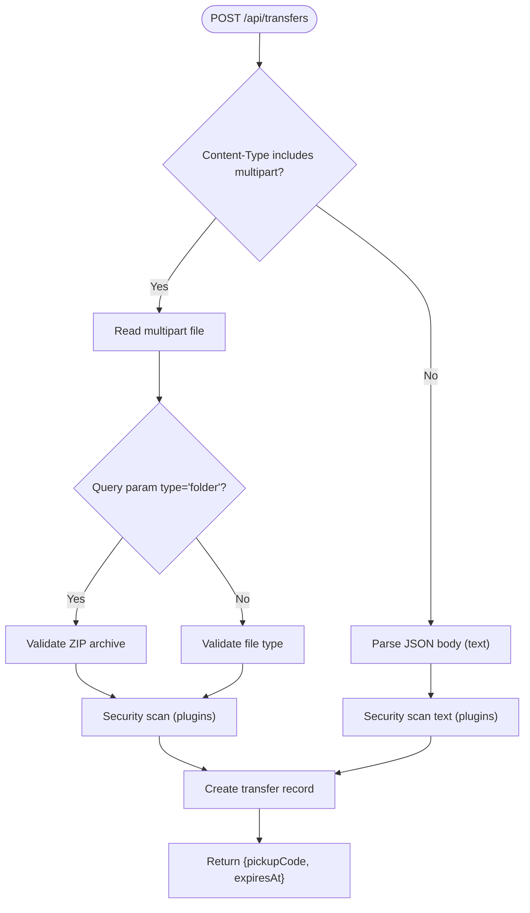
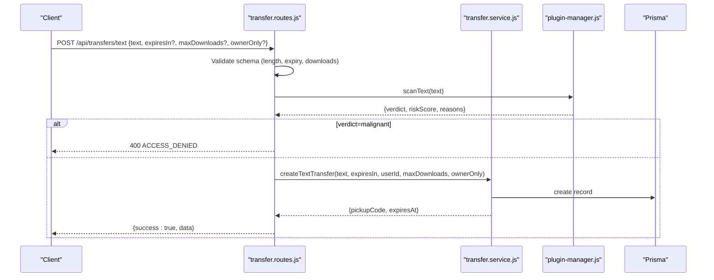
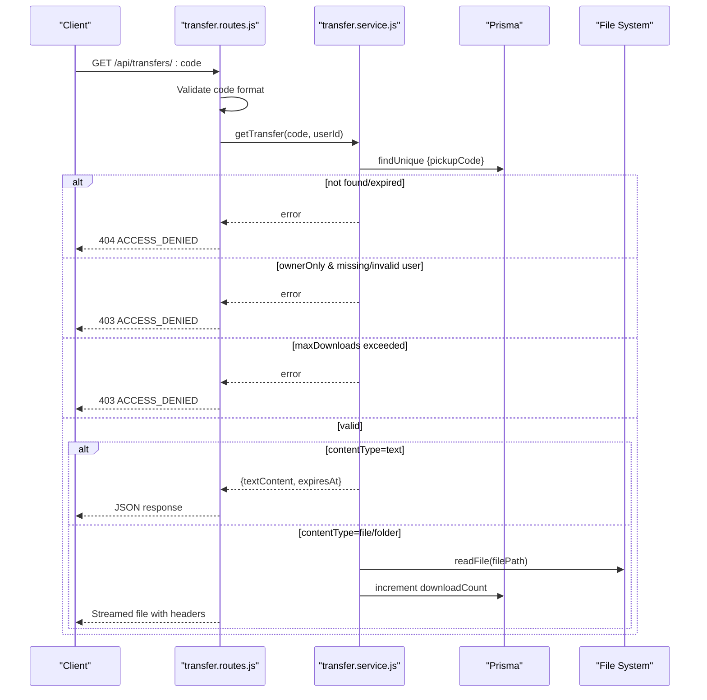
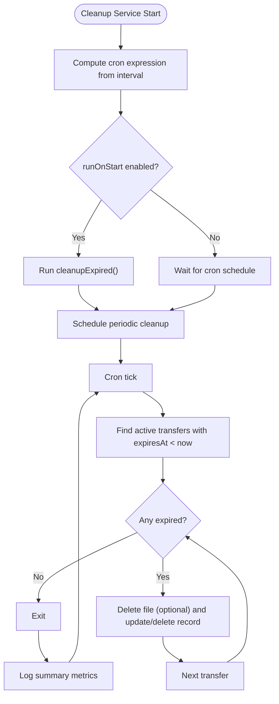
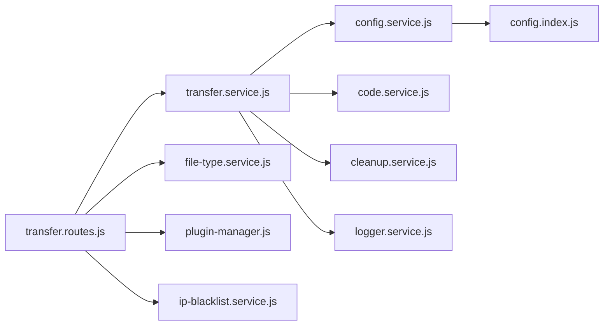

# Transfer Endpoints

<cite>
**Referenced Files in This Document**
- [transfer.routes.js](file://packages/server/dist/routes/transfer.routes.js)
- [transfer.service.js](file://packages/server/dist/services/transfer.service.js)
- [cleanup.service.js](file://packages/server/dist/services/cleanup.service.js)
- [code.service.js](file://packages/server/dist/services/code.service.js)
- [file-type.service.js](file://packages/server/dist/services/file-type.service.js)
- [config.service.js](file://packages/server/dist/services/config.service.js)
- [config.index.js](file://packages/server/dist/config/index.js)
- [plugin-manager.js](file://packages/server/dist/plugins/plugin-manager.js)
- [ip-blacklist.service.js](file://packages/server/dist/services/ip-blacklist.service.js)
- [logger.service.js](file://packages/server/dist/services/logger.service.js)
- [api.ts](file://packages/web/src/services/api.ts)
- [FileUploader.tsx](file://packages/web/src/components/FileUploader.tsx)
- [FolderUploader.tsx](file://packages/web/src/components/FolderUploader.tsx)
- [TextInput.tsx](file://packages/web/src/components/TextInput.tsx)
- [ReceivePage.tsx](file://packages/web/src/pages/ReceivePage.tsx)
- [SendPage.tsx](file://packages/web/src/pages/SendPage.tsx)
</cite>

## Table of Contents
1. [Introduction](#introduction)
2. [Project Structure](#project-structure)
3. [Core Components](#core-components)
4. [Architecture Overview](#architecture-overview)
5. [Detailed Component Analysis](#detailed-component-analysis)
6. [Dependency Analysis](#dependency-analysis)
7. [Performance Considerations](#performance-considerations)
8. [Troubleshooting Guide](#troubleshooting-guide)
9. [Conclusion](#conclusion)
10. [Appendices](#appendices)

## Introduction
This document provides comprehensive API documentation for the file and text transfer management endpoints. It covers:
- POST /api/transfers for file uploads (multipart form data handling, validation, size limits, and security scanning)
- POST /api/transfers/text for text content sharing with character limits and formatting options
- GET /api/transfers/:pickupCode for download verification and retrieval with security checks and access control
- Internal cleanup scheduling and expiration policies
- Error handling for various failure scenarios
- Client-side implementation patterns and integration with frontend components

## Project Structure
The transfer system spans backend routes and services, plus frontend components and API clients:
- Backend routes define the HTTP endpoints and middleware integration
- Services encapsulate business logic for creation, retrieval, validation, and cleanup
- Frontend components demonstrate client-side upload and receive flows

**Diagram sources**
- [transfer.routes.js:1-278](file://packages/server/dist/routes/transfer.routes.js#L1-L278)
- [transfer.service.js:1-263](file://packages/server/dist/services/transfer.service.js#L1-L263)
- [config.service.js:1-216](file://packages/server/dist/services/config.service.js#L1-L216)
- [code.service.js:1-18](file://packages/server/dist/services/code.service.js#L1-L18)
- [file-type.service.js:1-191](file://packages/server/dist/services/file-type.service.js#L1-L191)
- [cleanup.service.js:1-125](file://packages/server/dist/services/cleanup.service.js#L1-L125)
- [plugin-manager.js:1-152](file://packages/server/dist/plugins/plugin-manager.js#L1-L152)
- [ip-blacklist.service.js:1-177](file://packages/server/dist/services/ip-blacklist.service.js#L1-L177)
- [logger.service.js:1-63](file://packages/server/dist/services/logger.service.js#L1-L63)
- [api.ts](file://packages/web/src/services/api.ts)

**Section sources**
- [transfer.routes.js:1-278](file://packages/server/dist/routes/transfer.routes.js#L1-L278)
- [transfer.service.js:1-263](file://packages/server/dist/services/transfer.service.js#L1-L263)

## Core Components
- Transfer routes: Define endpoints, parse requests, enforce validation, and delegate to services
- Transfer service: Handles creation, retrieval, quota checks, cleanup, and safety measures
- Cleanup service: Periodic job to remove expired transfers and associated files
- Validation services: File type detection and security scanning via plugins
- Configuration: Centralized runtime configuration with environment overrides
- Frontend API client and components: Demonstrate client-side integration patterns

**Section sources**
- [transfer.routes.js:1-278](file://packages/server/dist/routes/transfer.routes.js#L1-L278)
- [transfer.service.js:1-263](file://packages/server/dist/services/transfer.service.js#L1-L263)
- [cleanup.service.js:1-125](file://packages/server/dist/services/cleanup.service.js#L1-L125)
- [file-type.service.js:1-191](file://packages/server/dist/services/file-type.service.js#L1-L191)
- [config.service.js:1-216](file://packages/server/dist/services/config.service.js#L1-L216)

## Architecture Overview
The transfer system follows a layered architecture:
- HTTP layer: Fastify routes handle requests and apply middleware
- Service layer: Business logic for transfer lifecycle management
- Persistence: Prisma ORM manages transfer records
- Storage: File system stores uploaded files
- Security: Validation, scanning, and IP blacklisting
- Scheduling: Cron-based cleanup of expired transfers

**Diagram sources**
- [transfer.routes.js:32-271](file://packages/server/dist/routes/transfer.routes.js#L32-L271)
- [transfer.service.js:23-187](file://packages/server/dist/services/transfer.service.js#L23-L187)

## Detailed Component Analysis

### POST /api/transfers (File Upload)
Purpose: Accept file uploads via multipart form data or text content. Supports:
- File validation (type detection, dangerous type blocking)
- ZIP archive validation for folder uploads
- Security scanning via pluggable scanners
- Owner-only access enforcement
- Rate limiting and IP blacklisting
- Disk quota checks and path traversal protection

Key behaviors:
- Detects multipart/form-data vs JSON body
- Validates file size against configured limits
- Enforces blocked extensions for single-file uploads
- Checks disk quota before accepting
- Sanitizes filenames and prevents path traversal
- Generates unique pickup codes
- Applies ownerOnly, maxDownloads, and expiry constraints

**Diagram sources**
- [transfer.routes.js:32-216](file://packages/server/dist/routes/transfer.routes.js#L32-L216)
- [transfer.service.js:56-121](file://packages/server/dist/services/transfer.service.js#L56-L121)
- [file-type.service.js:107-147](file://packages/server/dist/services/file-type.service.js#L107-L147)
- [plugin-manager.js:46-75](file://packages/server/dist/plugins/plugin-manager.js#L46-L75)

**Section sources**
- [transfer.routes.js:32-216](file://packages/server/dist/routes/transfer.routes.js#L32-L216)
- [transfer.service.js:56-121](file://packages/server/dist/services/transfer.service.js#L56-L121)
- [file-type.service.js:107-147](file://packages/server/dist/services/file-type.service.js#L107-L147)
- [plugin-manager.js:46-75](file://packages/server/dist/plugins/plugin-manager.js#L46-L75)

### POST /api/transfers/text (Text Content Sharing)
Purpose: Share text content with configurable expiration, download limits, and owner-only access.

Key behaviors:
- Validates text length against configuration
- Optional owner-only enforcement requires authentication
- Optional security scanning for malicious content
- Creates transfer record with expiration and limits

**Diagram sources**
- [transfer.routes.js:12-17](file://packages/server/dist/routes/transfer.routes.js#L12-L17)
- [transfer.routes.js:169-202](file://packages/server/dist/routes/transfer.routes.js#L169-L202)
- [transfer.service.js:23-55](file://packages/server/dist/services/transfer.service.js#L23-L55)
- [plugin-manager.js:76-98](file://packages/server/dist/plugins/plugin-manager.js#L76-L98)

**Section sources**
- [transfer.routes.js:12-17](file://packages/server/dist/routes/transfer.routes.js#L12-L17)
- [transfer.routes.js:169-202](file://packages/server/dist/routes/transfer.routes.js#L169-L202)
- [transfer.service.js:23-55](file://packages/server/dist/services/transfer.service.js#L23-L55)

### GET /api/transfers/:pickupCode (Verification and Retrieval)
Purpose: Verify access to a transfer and either return text content or stream a file.

Key behaviors:
- Validates pickup code format against configuration
- Retrieves transfer record and enforces:
  - Expiration checks (auto-deletes expired entries)
  - Owner-only restrictions (requires authenticated user)
  - Max downloads limits
- Returns text content for text transfers
- Streams file with appropriate headers for file/folder transfers

**Diagram sources**
- [transfer.routes.js:218-271](file://packages/server/dist/routes/transfer.routes.js#L218-L271)
- [transfer.service.js:153-187](file://packages/server/dist/services/transfer.service.js#L153-L187)

**Section sources**
- [transfer.routes.js:218-271](file://packages/server/dist/routes/transfer.routes.js#L218-L271)
- [transfer.service.js:153-187](file://packages/server/dist/services/transfer.service.js#L153-L187)

### Cleanup and Expiration Policies
Purpose: Automatically remove expired transfers and associated files to maintain system health.

Key behaviors:
- Scheduled cleanup via cron based on interval configuration
- Removes files and updates/deletes records based on configuration
- Prevents concurrent runs and logs metrics
- Runs on startup optionally

**Diagram sources**
- [cleanup.service.js:9-40](file://packages/server/dist/services/cleanup.service.js#L9-L40)
- [cleanup.service.js:41-118](file://packages/server/dist/services/cleanup.service.js#L41-L118)

**Section sources**
- [cleanup.service.js:1-125](file://packages/server/dist/services/cleanup.service.js#L1-L125)

### Security and Validation
- File type validation: Detects real MIME type via magic bytes and blocks dangerous types
- ZIP validation: Enforces entry count, uncompressed size, compression ratio, and filename constraints
- Security plugins: Pluggable scanning for files and text with aggregated verdicts
- IP blacklist: Automatic blocking based on thresholds and windows
- Path traversal protection: Sanitizes filenames and validates resolved paths
- Disk quota: Prevents overuse of storage by summing active file sizes

**Section sources**
- [file-type.service.js:1-191](file://packages/server/dist/services/file-type.service.js#L1-L191)
- [transfer.routes.js:69-158](file://packages/server/dist/routes/transfer.routes.js#L69-L158)
- [plugin-manager.js:46-149](file://packages/server/dist/plugins/plugin-manager.js#L46-L149)
- [ip-blacklist.service.js:1-177](file://packages/server/dist/services/ip-blacklist.service.js#L1-L177)
- [transfer.service.js:125-152](file://packages/server/dist/services/transfer.service.js#L125-L152)

### Client-Side Implementation Patterns
Frontend components demonstrate typical integration patterns:
- FileUploader: Multipart upload with progress indication
- FolderUploader: Zipped folder upload with validation and security scanning
- TextInput: Text upload with character limits and optional owner-only
- ReceivePage: Verification and retrieval flow with error handling
- SendPage: Creation of transfers and display of pickup codes

Example patterns:
- Use the API client to POST to /api/transfers with multipart/form-data
- For text, send JSON with text content and optional params
- On success, display the pickup code and expiration details
- On retrieval, handle 404/403 responses for invalid/expired/not authorized access

**Section sources**
- [api.ts](file://packages/web/src/services/api.ts)
- [FileUploader.tsx](file://packages/web/src/components/FileUploader.tsx)
- [FolderUploader.tsx](file://packages/web/src/components/FolderUploader.tsx)
- [TextInput.tsx](file://packages/web/src/components/TextInput.tsx)
- [ReceivePage.tsx](file://packages/web/src/pages/ReceivePage.tsx)
- [SendPage.tsx](file://packages/web/src/pages/SendPage.tsx)

## Dependency Analysis
The following diagram shows key dependencies among components:

**Diagram sources**
- [transfer.routes.js:1-10](file://packages/server/dist/routes/transfer.routes.js#L1-L10)
- [transfer.service.js:1-8](file://packages/server/dist/services/transfer.service.js#L1-L8)
- [config.service.js:1-12](file://packages/server/dist/services/config.service.js#L1-L12)
- [config.index.js:1-12](file://packages/server/dist/config/index.js#L1-L12)

**Section sources**
- [transfer.routes.js:1-10](file://packages/server/dist/routes/transfer.routes.js#L1-L10)
- [transfer.service.js:1-8](file://packages/server/dist/services/transfer.service.js#L1-L8)
- [config.service.js:1-12](file://packages/server/dist/services/config.service.js#L1-L12)
- [config.index.js:1-12](file://packages/server/dist/config/index.js#L1-L12)

## Performance Considerations
- Streaming: File retrieval streams data from disk to avoid loading entire files into memory
- Asynchronous operations: File writes, reads, and database operations are awaited to prevent blocking
- Cleanup cadence: Configure cleanup interval to balance resource usage and data freshness
- Rate limiting: Upload endpoints apply rate limits to mitigate abuse
- Scanning overhead: Security scanning adds latency; consider plugin configuration tuning

[No sources needed since this section provides general guidance]

## Troubleshooting Guide
Common issues and resolutions:
- Invalid pickup code: Ensure the code matches configured length and alphabet
- Access denied (403): Verify authentication for owner-only transfers and download limits
- Not found (404): Transfer may have expired; cleanup removes expired entries
- Upload failed: Check file size limits, blocked extensions, and disk quota
- Security block: Content flagged by security plugins; review reasons and adjust content
- IP blocked: Automatic blocking due to repeated failed attempts; contact support if误封

**Section sources**
- [transfer.routes.js:222-270](file://packages/server/dist/routes/transfer.routes.js#L222-L270)
- [transfer.service.js:153-187](file://packages/server/dist/services/transfer.service.js#L153-L187)
- [ip-blacklist.service.js:62-98](file://packages/server/dist/services/ip-blacklist.service.js#L62-L98)

## Conclusion
The transfer endpoints provide a secure, scalable mechanism for sharing files and text with robust validation, security scanning, and automated cleanup. Clients should follow the documented patterns for uploads and retrievals, respecting size limits, access controls, and expiration policies.

[No sources needed since this section summarizes without analyzing specific files]

## Appendices

### Endpoint Reference

- POST /api/transfers
  - Purpose: Upload file or text
  - Authentication: Optional (enforced for owner-only)
  - Request body:
    - multipart/form-data: file field, query params for type, folderName, fileCount, expiresIn, maxDownloads, ownerOnly
    - JSON (text): { text, expiresIn?, maxDownloads?, ownerOnly? }
  - Response: { success: true, data: { pickupCode, expiresAt, ... } }
  - Errors: 400 UPLOAD_FAILED, INVALID_FILE_TYPE, INVALID_ZIP, SECURITY_BLOCK, LOGIN_REQUIRED

- GET /api/transfers/:pickupCode
  - Purpose: Retrieve transfer content
  - Authentication: Optional (enforced for owner-only)
  - Response:
    - Text: { contentType: "text", textContent, expiresAt }
    - File/Folder: Streamed file with appropriate headers
  - Errors: 400 INVALID_CODE, 404 ACCESS_DENIED (not found/expired), 403 ACCESS_DENIED (owner-only, max downloads)

- GET /api/transfers/history
  - Purpose: List user's active transfers
  - Authentication: Required
  - Response: { success: true, data: transfers[] }

**Section sources**
- [transfer.routes.js:32-277](file://packages/server/dist/routes/transfer.routes.js#L32-L277)

### Configuration Options
Key configuration keys (environment variable overrides):
- security.upload.maxFileSize, maxTextLength, maxTotalStorage, blockedExtensions
- security.upload.folderUpload.* (enabled, maxUncompressedSize, maxCompressionRatio, maxEntries, maxFileNameLength)
- security.rateLimit.uploadMax, uploadWindowMs
- security.securityPlugin.enabled, heuristic.*, behavior.*
- security.ipBlacklist.enabled, autoBlockThreshold, autoBlockWindow, autoBlockDuration, whitelist, blacklist
- transfer.codeLength, defaultExpiry, maxExpiry
- cleanup.interval, runOnStart, cleanFiles, cleanRecords, recordAction
- log.level, log.file

**Section sources**
- [config.service.js:41-129](file://packages/server/dist/services/config.service.js#L41-L129)