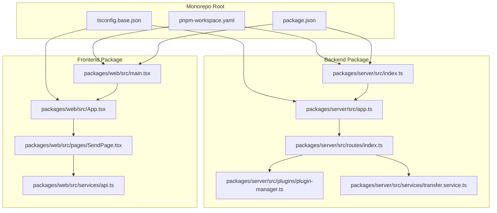
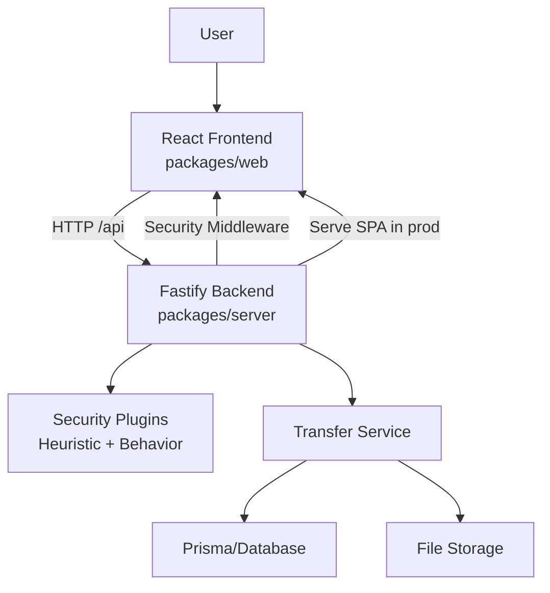
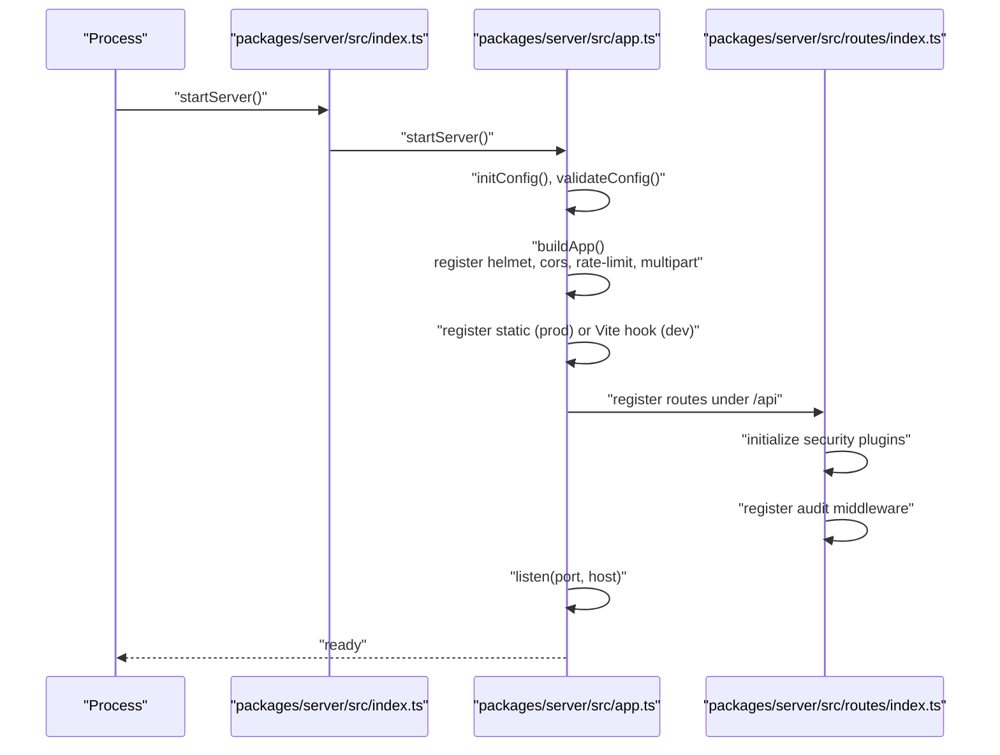
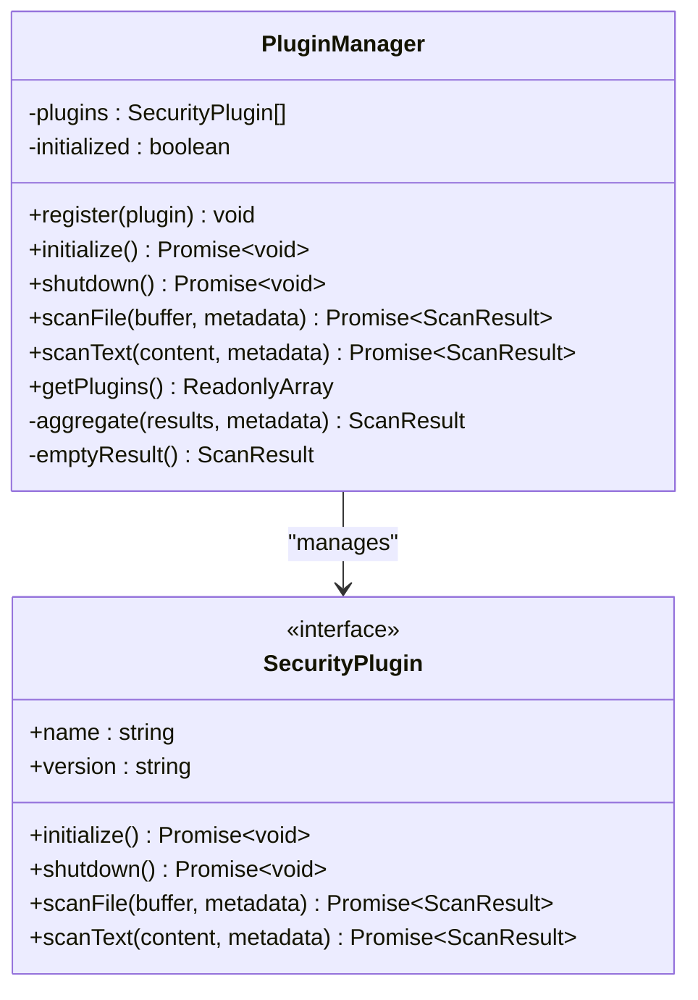
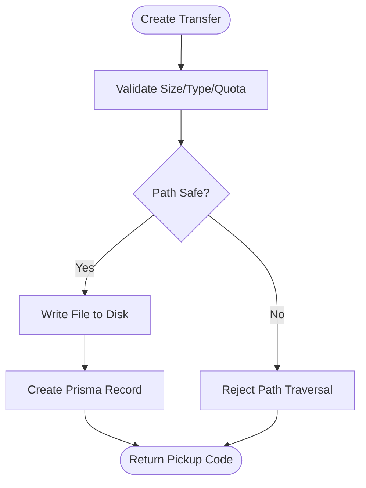
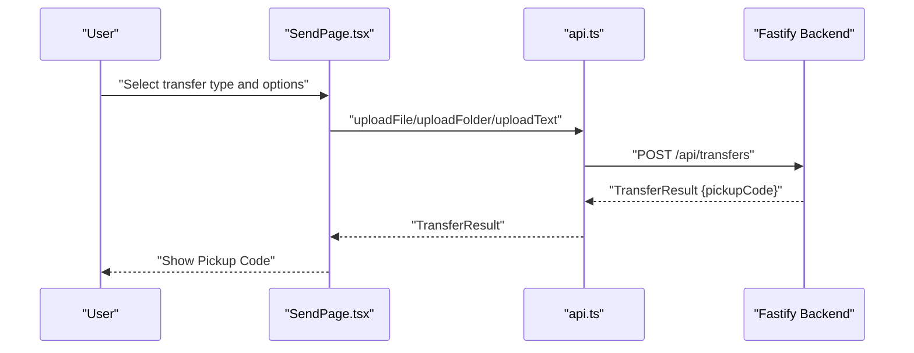
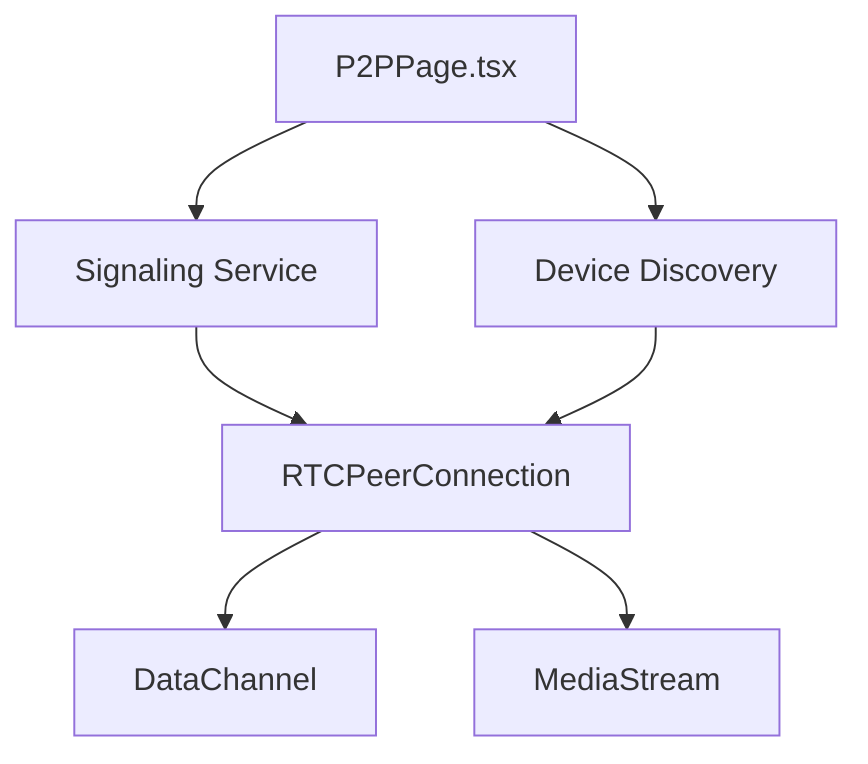
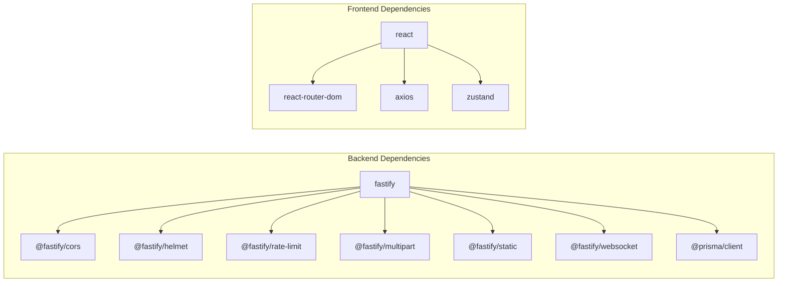

# Architecture Overview

<cite>
**Referenced Files in This Document**
- [package.json](file://package.json)
- [pnpm-workspace.yaml](file://pnpm-workspace.yaml)
- [tsconfig.base.json](file://tsconfig.base.json)
- [config.json](file://config.json)
- [packages/server/src/index.ts](file://packages/server/src/index.ts)
- [packages/server/src/app.ts](file://packages/server/src/app.ts)
- [packages/server/src/routes/index.ts](file://packages/server/src/routes/index.ts)
- [packages/server/src/plugins/plugin-manager.ts](file://packages/server/src/plugins/plugin-manager.ts)
- [packages/server/src/services/transfer.service.ts](file://packages/server/src/services/transfer.service.ts)
- [packages/web/src/main.tsx](file://packages/web/src/main.tsx)
- [packages/web/src/App.tsx](file://packages/web/src/App.tsx)
- [packages/web/src/pages/SendPage.tsx](file://packages/web/src/pages/SendPage.tsx)
- [packages/web/src/services/api.ts](file://packages/web/src/services/api.ts)
</cite>

## Table of Contents
1. [Introduction](#introduction)
2. [Project Structure](#project-structure)
3. [Core Components](#core-components)
4. [Architecture Overview](#architecture-overview)
5. [Detailed Component Analysis](#detailed-component-analysis)
6. [Dependency Analysis](#dependency-analysis)
7. [Performance Considerations](#performance-considerations)
8. [Troubleshooting Guide](#troubleshooting-guide)
9. [Conclusion](#conclusion)

## Introduction
This document describes the system architecture of Airportal, a secure file and text transfer application. The system follows a monorepo design using pnpm workspaces, separating frontend and backend concerns into distinct packages. The backend is a Fastify server providing REST APIs and optional P2P capabilities via WebRTC, while the frontend is a React application with TypeScript and Vite. Security is enforced through layered middleware, configurable policies, and a pluggable scanner system. The document also covers data flow, API communication patterns, state management, and the P2P architecture for direct device-to-device transfers.

## Project Structure
Airportal uses a pnpm workspace to manage two packages:
- packages/server: Fastify-based backend with routing, services, plugins, and database integration
- packages/web: React-based frontend with routing, UI components, and API clients

The monorepo is configured to share TypeScript compiler options and tooling across packages.

**Diagram sources**
- [pnpm-workspace.yaml:1-3](file://pnpm-workspace.yaml#L1-L3)
- [tsconfig.base.json:1-22](file://tsconfig.base.json#L1-L22)
- [package.json:1-21](file://package.json#L1-L21)
- [packages/server/src/index.ts:1-7](file://packages/server/src/index.ts#L1-L7)
- [packages/server/src/app.ts:1-205](file://packages/server/src/app.ts#L1-L205)
- [packages/server/src/routes/index.ts:1-63](file://packages/server/src/routes/index.ts#L1-L63)
- [packages/server/src/plugins/plugin-manager.ts:1-167](file://packages/server/src/plugins/plugin-manager.ts#L1-L167)
- [packages/server/src/services/transfer.service.ts:1-335](file://packages/server/src/services/transfer.service.ts#L1-L335)
- [packages/web/src/main.tsx:1-11](file://packages/web/src/main.tsx#L1-L11)
- [packages/web/src/App.tsx:1-26](file://packages/web/src/App.tsx#L1-L26)
- [packages/web/src/pages/SendPage.tsx:1-193](file://packages/web/src/pages/SendPage.tsx#L1-L193)
- [packages/web/src/services/api.ts:1-133](file://packages/web/src/services/api.ts#L1-L133)

**Section sources**
- [pnpm-workspace.yaml:1-3](file://pnpm-workspace.yaml#L1-L3)
- [tsconfig.base.json:1-22](file://tsconfig.base.json#L1-L22)
- [package.json:1-21](file://package.json#L1-L21)

## Core Components
- Backend server (Fastify)
  - Initializes security middleware (CSP, HSTS, X-Frame-Options, etc.), CORS, rate limiting, multipart uploads, and static serving for the frontend in production.
  - Registers API routes under /api and sets SPA fallback behavior.
  - Starts services (transfer and cleanup) and logs security configuration summary.
- Security plugin system
  - Pluggable scanner manager supporting heuristic scanning and behavior tracking plugins.
  - Aggregates plugin results into a unified risk assessment with verdict and score.
- Transfer service
  - Manages creation, retrieval, and lifecycle of file/text transfers with disk quota checks, path safety, and expiration handling.
  - Integrates with Prisma for persistence and enforces upload limits and blocked extensions.
- Frontend (React)
  - Single-page application with React Router for navigation.
  - API client using Axios with interceptors for auth tokens and unauthorized handling.
  - Pages for sending files, folders, and text, with configuration fetched from backend.

**Section sources**
- [packages/server/src/app.ts:19-148](file://packages/server/src/app.ts#L19-L148)
- [packages/server/src/routes/index.ts:10-62](file://packages/server/src/routes/index.ts#L10-L62)
- [packages/server/src/plugins/plugin-manager.ts:4-167](file://packages/server/src/plugins/plugin-manager.ts#L4-L167)
- [packages/server/src/services/transfer.service.ts:12-335](file://packages/server/src/services/transfer.service.ts#L12-L335)
- [packages/web/src/main.tsx:1-11](file://packages/web/src/main.tsx#L1-11)
- [packages/web/src/App.tsx:1-26](file://packages/web/src/App.tsx#L1-L26)
- [packages/web/src/services/api.ts:1-133](file://packages/web/src/services/api.ts#L1-L133)

## Architecture Overview
The system separates concerns across a backend API server and a frontend web application. The backend exposes REST endpoints under /api, integrates security plugins, and serves the compiled frontend in production. The frontend communicates with the backend via Axios, using request/response interceptors for authentication and error handling. Optional P2P transfers leverage WebRTC for direct device-to-device connections.

**Diagram sources**
- [packages/server/src/app.ts:19-148](file://packages/server/src/app.ts#L19-L148)
- [packages/server/src/routes/index.ts:10-62](file://packages/server/src/routes/index.ts#L10-L62)
- [packages/server/src/plugins/plugin-manager.ts:4-167](file://packages/server/src/plugins/plugin-manager.ts#L4-L167)
- [packages/server/src/services/transfer.service.ts:12-335](file://packages/server/src/services/transfer.service.ts#L12-L335)
- [packages/web/src/services/api.ts:1-133](file://packages/web/src/services/api.ts#L1-L133)

## Detailed Component Analysis

### Backend Server Initialization and Routing
The backend initializes configuration, registers security middleware, rate limiting, multipart handling, and static assets. It then registers route modules under /api and sets SPA fallback behavior for non-API routes in production. The server starts services and logs a security summary.

**Diagram sources**
- [packages/server/src/index.ts:1-7](file://packages/server/src/index.ts#L1-L7)
- [packages/server/src/app.ts:150-204](file://packages/server/src/app.ts#L150-L204)
- [packages/server/src/routes/index.ts:10-62](file://packages/server/src/routes/index.ts#L10-L62)

**Section sources**
- [packages/server/src/index.ts:1-7](file://packages/server/src/index.ts#L1-L7)
- [packages/server/src/app.ts:19-148](file://packages/server/src/app.ts#L19-L148)
- [packages/server/src/routes/index.ts:10-62](file://packages/server/src/routes/index.ts#L10-L62)

### Security Plugin System
The plugin manager supports registering and initializing plugins, aggregating results, and handling failures gracefully. Heuristic and behavior plugins can be enabled/disabled via configuration.

**Diagram sources**
- [packages/server/src/plugins/plugin-manager.ts:4-167](file://packages/server/src/plugins/plugin-manager.ts#L4-L167)

**Section sources**
- [packages/server/src/plugins/plugin-manager.ts:4-167](file://packages/server/src/plugins/plugin-manager.ts#L4-L167)
- [packages/server/src/routes/index.ts:16-39](file://packages/server/src/routes/index.ts#L16-L39)

### Transfer Service and Data Persistence
The transfer service creates and retrieves transfers, validates sizes and paths, enforces quotas, and manages file storage and database records. It integrates with Prisma for persistence and applies upload policies.

**Diagram sources**
- [packages/server/src/services/transfer.service.ts:78-166](file://packages/server/src/services/transfer.service.ts#L78-L166)
- [packages/server/src/services/transfer.service.ts:171-198](file://packages/server/src/services/transfer.service.ts#L171-L198)

**Section sources**
- [packages/server/src/services/transfer.service.ts:12-335](file://packages/server/src/services/transfer.service.ts#L12-L335)

### Frontend API Communication and State Management
The frontend uses a centralized API module to communicate with backend endpoints. It fetches configuration, uploads files/folders/text, and retrieves content using Axios interceptors for authentication and error handling. State is managed via React hooks and a Zustand store.

**Diagram sources**
- [packages/web/src/pages/SendPage.tsx:26-63](file://packages/web/src/pages/SendPage.tsx#L26-L63)
- [packages/web/src/services/api.ts:56-130](file://packages/web/src/services/api.ts#L56-L130)
- [packages/server/src/routes/index.ts:51-58](file://packages/server/src/routes/index.ts#L51-L58)

**Section sources**
- [packages/web/src/pages/SendPage.tsx:1-193](file://packages/web/src/pages/SendPage.tsx#L1-L193)
- [packages/web/src/services/api.ts:1-133](file://packages/web/src/services/api.ts#L1-L133)
- [packages/web/src/App.tsx:1-26](file://packages/web/src/App.tsx#L1-L26)
- [packages/web/src/main.tsx:1-11](file://packages/web/src/main.tsx#L1-L11)

### P2P Architecture Using WebRTC
Airportal supports peer-to-peer transfers using WebRTC for direct device-to-device data exchange. The P2P page coordinates signaling and media channels, enabling efficient local-area network transfers. Configuration controls enablement, maximum file size, concurrency, and timeouts.

**Diagram sources**
- [config.json:94-100](file://config.json#L94-L100)
- [packages/web/src/pages/P2PPage.tsx](file://packages/web/src/pages/P2PPage.tsx)
- [packages/server/src/routes/p2p.routes.ts](file://packages/server/src/routes/p2p.routes.ts)

**Section sources**
- [config.json:94-100](file://config.json#L94-L100)

## Dependency Analysis
The backend depends on Fastify and multiple official plugins for security, CORS, rate limiting, multipart handling, static serving, and WebSocket support. The frontend depends on React, React Router, Axios, and state management via Zustand. Both packages share TypeScript configuration from the monorepo base.

**Diagram sources**
- [packages/server/package.json:19-35](file://packages/server/package.json#L19-L35)
- [packages/web/package.json:15-22](file://packages/web/package.json#L15-L22)

**Section sources**
- [packages/server/package.json:19-35](file://packages/server/package.json#L19-L35)
- [packages/web/package.json:15-22](file://packages/web/package.json#L15-L22)

## Performance Considerations
- Backend
  - Rate limiting reduces abuse and protects resources.
  - Multipart limits enforce upload size and field constraints.
  - Static serving in production avoids redundant proxy overhead.
  - Cleanup service periodically removes expired or stale records.
- Frontend
  - Axios interceptors centralize auth and error handling.
  - React Router enables SPA navigation without full reloads.
- P2P
  - Concurrency limits and timeouts prevent resource exhaustion during direct transfers.

[No sources needed since this section provides general guidance]

## Troubleshooting Guide
- Authentication failures
  - Unauthorized responses trigger removal of tokens and redirect to home.
- Upload failures
  - Validation errors surface messages from backend; check size/type/blocklist policies.
- P2P connectivity
  - Verify signaling service availability and firewall/NAT traversal settings.

**Section sources**
- [packages/web/src/services/api.ts:20-31](file://packages/web/src/services/api.ts#L20-L31)
- [packages/server/src/services/transfer.service.ts:92-106](file://packages/server/src/services/transfer.service.ts#L92-L106)
- [config.json:94-100](file://config.json#L94-L100)

## Conclusion
Airportal’s architecture cleanly separates frontend and backend concerns within a pnpm-managed monorepo. The Fastify backend enforces strong security through middleware and a pluggable scanner system, while the React frontend provides a responsive user experience with robust API integration. Optional P2P transfers using WebRTC enable efficient local-area network transfers. Configuration-driven policies ensure scalability and security across file, text, and folder transfer scenarios.