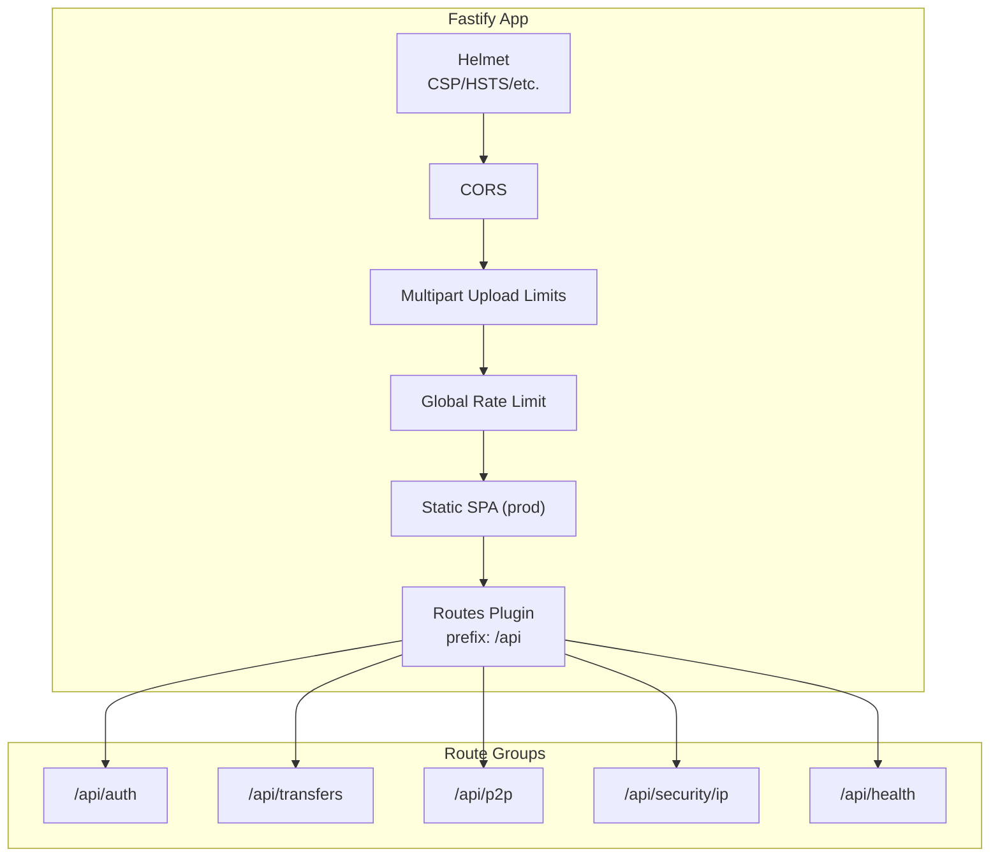
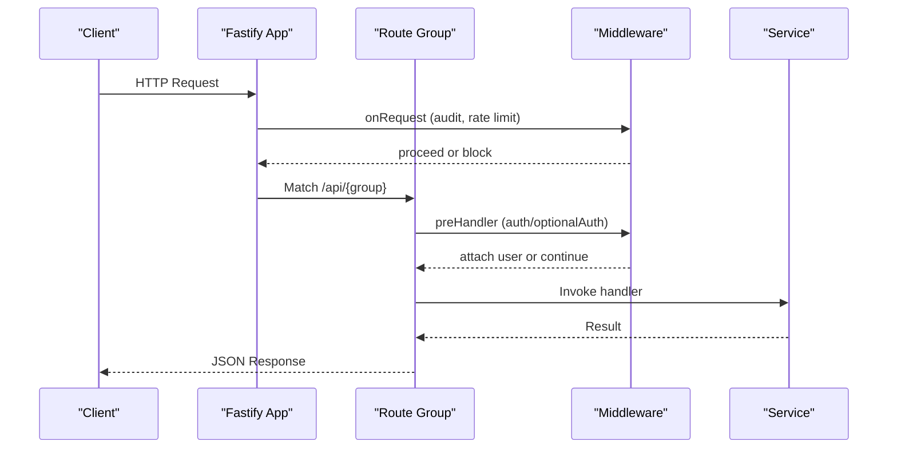
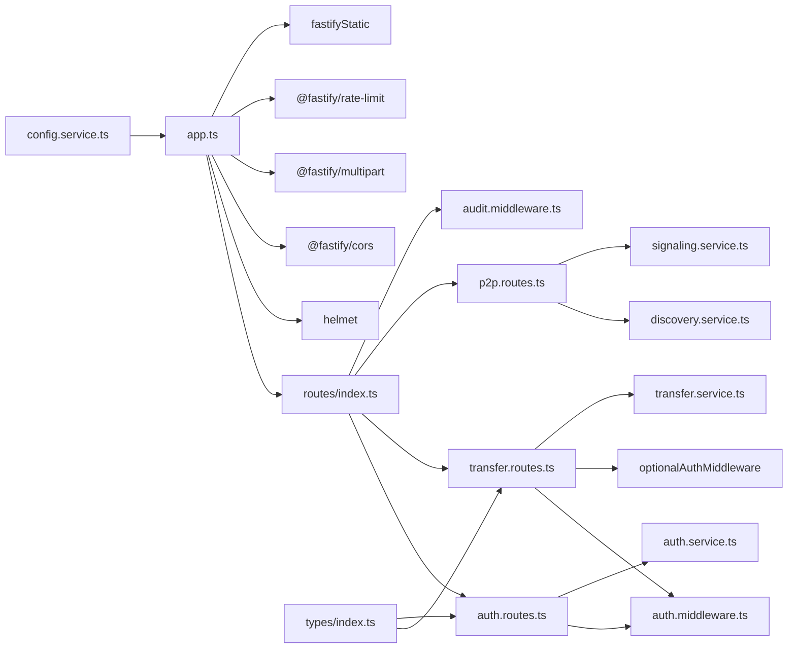

# API Endpoints

<cite>
**Referenced Files in This Document**
- [app.ts](file://packages/server/src/app.ts)
- [routes/index.ts](file://packages/server/src/routes/index.ts)
- [auth.routes.ts](file://packages/server/src/routes/auth.routes.ts)
- [transfer.routes.ts](file://packages/server/src/routes/transfer.routes.ts)
- [p2p.routes.ts](file://packages/server/src/routes/p2p.routes.ts)
- [auth.middleware.ts](file://packages/server/src/middlewares/auth.middleware.ts)
- [audit.middleware.ts](file://packages/server/src/middlewares/audit.middleware.ts)
- [config.service.ts](file://packages/server/src/services/config.service.ts)
- [auth.service.ts](file://packages/server/src/services/auth.service.ts)
- [transfer.service.ts](file://packages/server/src/services/transfer.service.ts)
- [types/index.ts](file://packages/server/src/types/index.ts)
</cite>

## Table of Contents
1. [Introduction](#introduction)
2. [Project Structure](#project-structure)
3. [Core Components](#core-components)
4. [Architecture Overview](#architecture-overview)
5. [Detailed Component Analysis](#detailed-component-analysis)
6. [Dependency Analysis](#dependency-analysis)
7. [Performance Considerations](#performance-considerations)
8. [Troubleshooting Guide](#troubleshooting-guide)
9. [Conclusion](#conclusion)

## Introduction
This document provides comprehensive API documentation for Airportal’s backend. It covers all RESTful endpoints grouped under the base path /api, including authentication (/api/auth), transfer management (/api/transfers), and peer-to-peer signaling (/api/p2p). For each endpoint, you will find HTTP methods, URL patterns, request/response schemas, authentication requirements, validation rules, and error responses. It also documents middleware behavior, rate limiting, CORS, and security considerations.

Airportal uses Fastify with TypeScript. The API is versioned implicitly via the base route prefix /api. No explicit version segment is present in the routes shown here.

## Project Structure
The API is organized into route groups mounted under /api:
- Authentication endpoints: /api/auth
- Transfer endpoints: /api/transfers
- P2P signaling endpoints: /api/p2p
- Health check: /api/health
- Security IP management: /api/security/ip

**Diagram sources**
- [app.ts:19-148](file://packages/server/src/app.ts#L19-L148)
- [routes/index.ts:10-62](file://packages/server/src/routes/index.ts#L10-L62)

**Section sources**
- [app.ts:19-148](file://packages/server/src/app.ts#L19-L148)
- [routes/index.ts:10-62](file://packages/server/src/routes/index.ts#L10-L62)

## Core Components
- Authentication middleware enforces Bearer tokens for protected routes.
- Optional authentication middleware allows anonymous access while attaching user context when present.
- Audit middleware logs requests and optionally blocks blacklisted IPs.
- Global rate limiter applies to all routes; upload-specific rate limits apply to transfer creation.
- CORS is configured to allow selected methods and headers.
- Helmet hardens security headers, including CSP and HSTS.

**Section sources**
- [auth.middleware.ts:11-48](file://packages/server/src/middlewares/auth.middleware.ts#L11-L48)
- [audit.middleware.ts:48-124](file://packages/server/src/middlewares/audit.middleware.ts#L48-L124)
- [app.ts:68-97](file://packages/server/src/app.ts#L68-L97)

## Architecture Overview
The API follows a layered architecture:
- HTTP layer: Fastify with plugins for security, CORS, rate limiting, and multipart uploads.
- Routing layer: Route groups mounted under /api.
- Middleware layer: Auth and audit hooks applied globally or per-route.
- Service layer: Business logic for authentication, transfers, and P2P signaling.
- Configuration layer: Centralized runtime configuration with environment overrides.

**Diagram sources**
- [app.ts:68-97](file://packages/server/src/app.ts#L68-L97)
- [routes/index.ts:10-62](file://packages/server/src/routes/index.ts#L10-L62)
- [auth.middleware.ts:11-48](file://packages/server/src/middlewares/auth.middleware.ts#L11-L48)
- [audit.middleware.ts:48-124](file://packages/server/src/middlewares/audit.middleware.ts#L48-L124)

## Detailed Component Analysis

### Authentication Endpoints (/api/auth)
Base path: /api/auth

- POST /api/auth/register
  - Purpose: Register a new user account.
  - Authentication: Not required.
  - Request body:
    - username: string, min length 3, max length 50
    - password: string, min length 6, max length 100
  - Response:
    - success: boolean
    - data: { token: string, user: { id, username, createdAt } }
  - Errors:
    - 400: REGISTER_FAILED with code and message
  - Validation:
    - Zod schema enforces field lengths and presence.
  - Example request:
    - POST /api/auth/register with JSON body containing username and password.
  - Example response:
    - 201 Created with success=true and data.token.

- POST /api/auth/login
  - Purpose: Authenticate user and issue JWT.
  - Authentication: Not required.
  - Request body:
    - username: string, required
    - password: string, required
  - Response:
    - success: boolean
    - data: { token: string, user: { id, username, createdAt } }
  - Errors:
    - 401: LOGIN_FAILED with code and message.
  - Validation:
    - Zod schema enforces non-empty fields.
  - Example request:
    - POST /api/auth/login with JSON body containing username and password.
  - Example response:
    - 200 OK with success=true and data.token.

- GET /api/auth/me
  - Purpose: Get current user profile.
  - Authentication: Required (Bearer token).
  - Request headers:
    - Authorization: Bearer <token>
  - Response:
    - success: boolean
    - data: { id, username, createdAt }
  - Errors:
    - 401: UNAUTHORIZED or INVALID_TOKEN
    - 404: ACCESS_DENIED if user not found
  - Example request:
    - GET /api/auth/me with Authorization: Bearer <token>.
  - Example response:
    - 200 OK with success=true and user info.

Security and rate limiting:
- No per-endpoint rate limit configured for /api/auth.
- Global rate limit applies to all routes.

**Section sources**
- [auth.routes.ts:16-54](file://packages/server/src/routes/auth.routes.ts#L16-L54)
- [auth.middleware.ts:11-48](file://packages/server/src/middlewares/auth.middleware.ts#L11-L48)
- [auth.service.ts:10-88](file://packages/server/src/services/auth.service.ts#L10-L88)
- [types/index.ts:44-47](file://packages/server/src/types/index.ts#L44-L47)

### Transfer Management Endpoints (/api/transfers)
Base path: /api/transfers

- GET /api/transfers/config
  - Purpose: Retrieve client-facing upload limits and defaults.
  - Authentication: Not required.
  - Response:
    - success: boolean
    - data: {
        maxFileSize: number,
        maxTextLength: number,
        defaultExpiry: number,
        maxExpiry: number,
        folderUploadEnabled: boolean
      }
  - Errors:
    - None documented; returns 200 on success.
  - Example request:
    - GET /api/transfers/config
  - Example response:
    - 200 OK with success=true and data fields.

- POST /api/transfers
  - Purpose: Create a new transfer (text or file/folder).
  - Authentication: Optional (Bearer token accepted; required for ownerOnly).
  - Request headers:
    - Authorization: Bearer <token> (optional)
    - Content-Type: application/json or multipart/form-data
  - Query parameters (for multipart):
    - type: "folder" to treat uploaded archive as folder
    - folderName: string, default "folder"
    - fileCount: number, count of files in folder
    - expiresIn: number, seconds, capped by maxExpiry
    - maxDownloads: number, min 0, capped by service logic
    - ownerOnly: boolean, requires login when true
  - JSON body (for text uploads):
    - text: string, min length 1, max length from config
    - expiresIn: number, optional, seconds
    - maxDownloads: number, optional
    - ownerOnly: boolean, optional
  - Response:
    - success: boolean
    - data: {
        pickupCode: string,
        expiresAt: string (ISO 8601),
        expiresIn: number,
        fileCount?: number,
        folderName?: string
      }
  - Errors:
    - 400: NO_FILE, INVALID_ZIP, INVALID_FILE_TYPE, SECURITY_BLOCK, UPLOAD_FAILED, LOGIN_REQUIRED
    - 401: INVALID_TOKEN (if token verification fails)
    - 403: ACCESS_DENIED (if ownerOnly is enforced)
  - Validation and security:
    - Text length validated against config.
    - ZIP archives validated with configurable limits (entries, filename length, compression ratio, uncompressed size).
    - File type detection performed when enabled.
    - Security plugin scans file/text when enabled; malicious content rejected.
    - Disk quota checked before accepting uploads.
  - Rate limiting:
    - Per-route rate limit configured for uploads (uploadMax/uploadWindowMs).
  - Example request (multipart):
    - POST /api/transfers?type=folder&folderName=backup&fileCount=10&expiresIn=300&maxDownloads=5&ownerOnly=false
  - Example response:
    - 201 Created with success=true and transfer metadata.

- GET /api/transfers/:code
  - Purpose: Fetch transfer content by pickup code.
  - Authentication: Optional (Bearer token accepted).
  - Path parameters:
    - code: string, length from config, alphanumeric pattern
  - Response (text):
    - success: boolean
    - data: {
        contentType: "text",
        textContent: string,
        expiresAt: string (ISO 8601)
      }
  - Response (file/folder):
    - success: boolean
    - File stream with headers:
      - Content-Type: file mime type or application/octet-stream
      - Content-Disposition: attachment with UTF-8 encoded filename
      - X-Content-Type-Options: nosniff
      - X-Download-Options: noopen
      - Cache-Control: no-store, no-cache, must-revalidate
      - Content-Security-Policy: default-src 'none'
  - Errors:
    - 400: INVALID_CODE, ACCESS_DENIED
    - 404: ACCESS_DENIED (resource not found/expired)
    - 403: ACCESS_DENIED (ownerOnly enforcement)
  - Example request:
    - GET /api/transfers/{pickupCode}
  - Example response (text):
    - 200 OK with success=true and text content.
  - Example response (file):
    - 200 OK with file stream and headers.

- GET /api/transfers/history
  - Purpose: List user’s transfer history.
  - Authentication: Required (Bearer token).
  - Response:
    - success: boolean
    - data: array of transfer records
  - Errors:
    - 401: UNAUTHORIZED or INVALID_TOKEN
  - Example request:
    - GET /api/transfers/history with Authorization: Bearer <token>.
  - Example response:
    - 200 OK with success=true and history array.

Security and rate limiting:
- Global rate limit applies to all routes.
- Upload endpoint has a separate per-route rate limit.
- Owner-only enforcement requires authentication.
- ZIP and file validation reduce attack surface.
- Security plugin scanning can block malicious content.

**Section sources**
- [transfer.routes.ts:12-347](file://packages/server/src/routes/transfer.routes.ts#L12-L347)
- [auth.middleware.ts:11-48](file://packages/server/src/middlewares/auth.middleware.ts#L11-L48)
- [config.service.ts:64-73](file://packages/server/src/services/config.service.ts#L64-L73)
- [config.service.ts:81-85](file://packages/server/src/services/config.service.ts#L81-L85)
- [transfer.service.ts:12-200](file://packages/server/src/services/transfer.service.ts#L12-L200)
- [types/index.ts:16-28](file://packages/server/src/types/index.ts#L16-L28)

### P2P Communication Endpoints (/api/p2p)
Base path: /api/p2p

- GET /api/p2p/ws [WebSocket]
  - Purpose: Establish WebSocket connection for peer discovery and signaling.
  - Authentication: Not required.
  - Query parameters:
    - deviceName: string, up to 50 chars (overrides UA-derived device name)
  - WebSocket messages:
    - Server sends initial message with type "init", including socketId and peers list.
    - Client can send structured messages; server parses and delegates to signaling service.
  - Lifecycle:
    - On open: registers peer and sends initial state.
    - On message: parses JSON and forwards to signaling service.
    - On close/error: removes peer and logs.
  - Example request:
    - GET /api/p2p/ws?deviceName=iPhone
  - Example server message (initial):
    - {"type":"init","socketId":"...","peers":[{"socketId":"...","deviceName":"...","status":"available"}]}

- GET /api/p2p/status
  - Purpose: Check P2P service availability and peer count.
  - Authentication: Not required.
  - Response:
    - success: boolean
    - data: { enabled: boolean, peerCount: number }
  - Example request:
    - GET /api/p2p/status
  - Example response:
    - 200 OK with success=true and status info.

Security and rate limiting:
- No per-endpoint rate limit configured for /api/p2p.
- WebSocket message size limited to 1 MB.

**Section sources**
- [p2p.routes.ts:48-133](file://packages/server/src/routes/p2p.routes.ts#L48-L133)

### Security IP Management Endpoints (/api/security/ip)
Base path: /api/security/ip

- GET /api/security/ip/stats
  - Purpose: Retrieve security statistics.
  - Authentication: Not required.
  - Response:
    - success: boolean
    - data: stats object
  - Rate limit: 5 requests per minute.

- GET /api/security/ip/blocked
  - Purpose: List currently blocked IPs.
  - Authentication: Not required.
  - Response:
    - success: boolean
    - data: array of blocked IPs
  - Rate limit: 5 requests per minute.

- POST /api/security/ip/block
  - Purpose: Manually block an IP.
  - Authentication: Not required.
  - Request body:
    - ip: string, required
    - reason: string, required
    - duration: number, optional
  - Response:
    - success: boolean
    - message: string
  - Errors:
    - 400: INVALID_PARAMS

- DELETE /api/security/ip/unblock
  - Purpose: Remove an IP from blacklist.
  - Authentication: Not required.
  - Request body:
    - ip: string, required
  - Response:
    - success: boolean
    - message: string
  - Errors:
    - 400: INVALID_PARAMS

**Section sources**
- [audit.middleware.ts:129-186](file://packages/server/src/middlewares/audit.middleware.ts#L129-L186)

## Dependency Analysis

**Diagram sources**
- [routes/index.ts:10-62](file://packages/server/src/routes/index.ts#L10-L62)
- [auth.routes.ts:16-54](file://packages/server/src/routes/auth.routes.ts#L16-L54)
- [transfer.routes.ts:12-347](file://packages/server/src/routes/transfer.routes.ts#L12-L347)
- [p2p.routes.ts:48-133](file://packages/server/src/routes/p2p.routes.ts#L48-L133)
- [auth.middleware.ts:11-48](file://packages/server/src/middlewares/auth.middleware.ts#L11-L48)
- [audit.middleware.ts:48-124](file://packages/server/src/middlewares/audit.middleware.ts#L48-L124)
- [app.ts:19-148](file://packages/server/src/app.ts#L19-L148)
- [config.service.ts:155-259](file://packages/server/src/services/config.service.ts#L155-L259)
- [types/index.ts:16-63](file://packages/server/src/types/index.ts#L16-L63)

**Section sources**
- [routes/index.ts:10-62](file://packages/server/src/routes/index.ts#L10-L62)
- [app.ts:19-148](file://packages/server/src/app.ts#L19-L148)

## Performance Considerations
- Global rate limiting reduces abuse across all endpoints.
- Upload endpoint has a dedicated per-route rate limit to protect ingestion.
- File and text size limits prevent oversized payloads.
- ZIP validation and file type checks reduce CPU and disk usage on malicious inputs.
- Disk quota checks prevent storage exhaustion.
- WebSocket message size capped to 1 MB to avoid memory pressure.

[No sources needed since this section provides general guidance]

## Troubleshooting Guide
Common issues and resolutions:
- Authentication failures:
  - Ensure Authorization header uses Bearer token format.
  - Verify token validity and expiration.
- Access denied:
  - Some endpoints require login (e.g., ownerOnly enforcement).
  - Check that the requesting user matches ownership requirements.
- Invalid or expired resource:
  - Pickup codes must match configured length and pattern.
  - Transfers may expire or be deleted.
- Blocked IP:
  - Requests from blacklisted IPs receive 403.
  - Contact administrator to unblock if necessary.
- Upload failures:
  - Respect maxFileSize and maxTextLength limits.
  - ZIP archives must pass validation thresholds.
  - Blocked file extensions are rejected.
- Security scanning:
  - Malicious or suspicious content is rejected with SECURITY_BLOCK.
- CORS errors:
  - Ensure Origin is included in allowed list and credentials are supported.

**Section sources**
- [auth.middleware.ts:11-48](file://packages/server/src/middlewares/auth.middleware.ts#L11-L48)
- [audit.middleware.ts:48-124](file://packages/server/src/middlewares/audit.middleware.ts#L48-L124)
- [transfer.routes.ts:284-340](file://packages/server/src/routes/transfer.routes.ts#L284-L340)
- [config.service.ts:212-224](file://packages/server/src/services/config.service.ts#L212-L224)

## Conclusion
Airportal’s API is organized under /api with clear separation of concerns:
- Authentication endpoints manage user registration, login, and profile retrieval.
- Transfer endpoints support text and file/folder uploads with robust validation and security.
- P2P endpoints enable WebSocket-based peer discovery and signaling.
Security is enforced via middleware, rate limiting, and configuration-driven policies. The API is designed for reliability, scalability, and safety with comprehensive logging and auditing.

[No sources needed since this section summarizes without analyzing specific files]