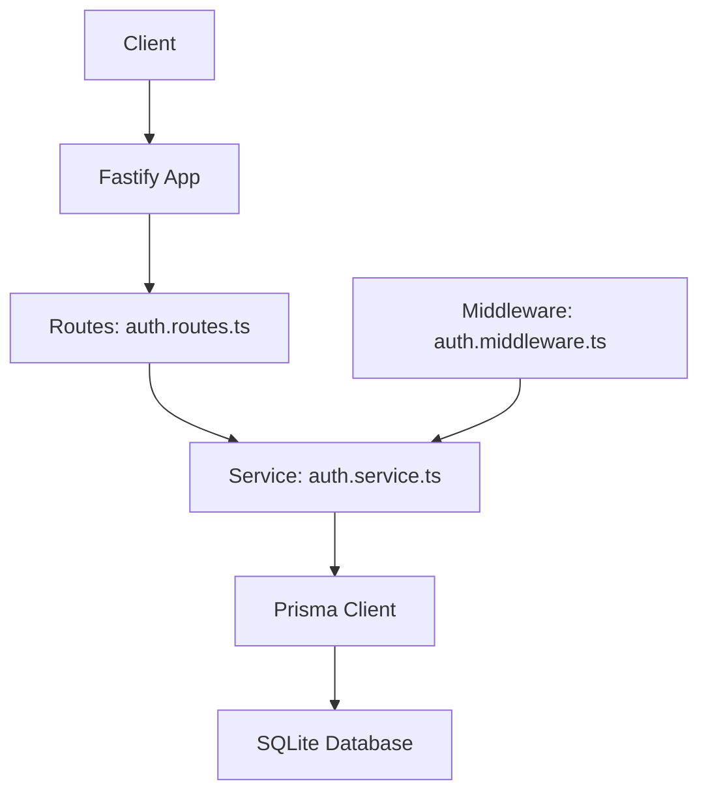
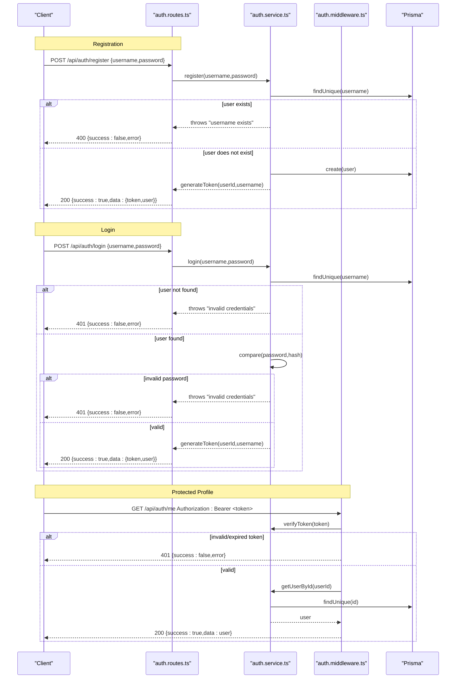
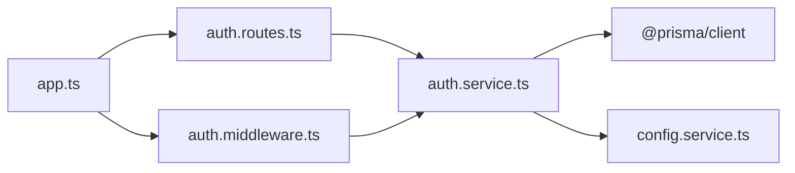

# Authentication Endpoints

<cite>
**Referenced Files in This Document**
- [auth.routes.ts](file://packages/server/src/routes/auth.routes.ts)
- [auth.service.ts](file://packages/server/src/services/auth.service.ts)
- [auth.middleware.ts](file://packages/server/src/middlewares/auth.middleware.ts)
- [app.ts](file://packages/server/src/app.ts)
- [config.service.ts](file://packages/server/src/services/config.service.ts)
- [schema.prisma](file://packages/server/prisma/schema.prisma)
- [index.ts](file://packages/server/src/types/index.ts)
</cite>

## Table of Contents
1. [Introduction](#introduction)
2. [Project Structure](#project-structure)
3. [Core Components](#core-components)
4. [Architecture Overview](#architecture-overview)
5. [Detailed Component Analysis](#detailed-component-analysis)
6. [Dependency Analysis](#dependency-analysis)
7. [Performance Considerations](#performance-considerations)
8. [Troubleshooting Guide](#troubleshooting-guide)
9. [Conclusion](#conclusion)

## Introduction
This document provides comprehensive API documentation for Airportal’s authentication endpoints. It covers user registration, login, and protected profile retrieval. It also documents JWT token generation and verification, middleware-based authentication enforcement, and related security controls. The focus is on HTTP endpoints under the /api/auth namespace, including request/response schemas, authentication requirements, error responses, and operational notes such as token expiration and logout behavior.

## Project Structure
Airportal’s server is implemented with Fastify and organized by concerns:
- Routes define HTTP endpoints and bind handlers.
- Services encapsulate business logic (authentication, persistence).
- Middleware enforces authentication via JWT.
- Configuration manages runtime settings (including JWT secret and expiry).
- Prisma defines the user model persisted by the application.

**Diagram sources**
- [auth.routes.ts:1-55](file://packages/server/src/routes/auth.routes.ts#L1-L55)
- [auth.middleware.ts:1-49](file://packages/server/src/middlewares/auth.middleware.ts#L1-L49)
- [auth.service.ts:1-88](file://packages/server/src/services/auth.service.ts#L1-L88)
- [app.ts:1-205](file://packages/server/src/app.ts#L1-L205)

**Section sources**
- [auth.routes.ts:1-55](file://packages/server/src/routes/auth.routes.ts#L1-L55)
- [auth.service.ts:1-88](file://packages/server/src/services/auth.service.ts#L1-L88)
- [auth.middleware.ts:1-49](file://packages/server/src/middlewares/auth.middleware.ts#L1-L49)
- [app.ts:1-205](file://packages/server/src/app.ts#L1-L205)

## Core Components
- Authentication routes:
  - POST /api/auth/register: Registers a new user with validated username and password.
  - POST /api/auth/login: Authenticates an existing user and returns a JWT.
  - GET /api/auth/me: Returns the current authenticated user’s profile.
- Authentication service:
  - Implements registration, login, user lookup, JWT generation, and token verification.
- Authentication middleware:
  - Enforces Bearer token authentication for protected routes.
- Configuration:
  - JWT secret and expiry are configurable via environment variables or config file.
- Persistence:
  - User entity stored in SQLite via Prisma.

**Section sources**
- [auth.routes.ts:16-54](file://packages/server/src/routes/auth.routes.ts#L16-L54)
- [auth.service.ts:10-88](file://packages/server/src/services/auth.service.ts#L10-L88)
- [auth.middleware.ts:11-32](file://packages/server/src/middlewares/auth.middleware.ts#L11-L32)
- [config.service.ts:168-171](file://packages/server/src/services/config.service.ts#L168-L171)
- [schema.prisma:10-18](file://packages/server/prisma/schema.prisma#L10-L18)

## Architecture Overview
The authentication flow integrates route handlers, service logic, and middleware. Requests to protected endpoints are validated by middleware that verifies JWTs against the configured secret. Successful authentication attaches user metadata to the request for downstream handlers.

**Diagram sources**
- [auth.routes.ts:16-54](file://packages/server/src/routes/auth.routes.ts#L16-L54)
- [auth.service.ts:10-88](file://packages/server/src/services/auth.service.ts#L10-L88)
- [auth.middleware.ts:11-32](file://packages/server/src/middlewares/auth.middleware.ts#L11-L32)
- [schema.prisma:10-18](file://packages/server/prisma/schema.prisma#L10-L18)

## Detailed Component Analysis

### Endpoint: POST /api/auth/register
- Description: Creates a new user account with a unique username and hashed password.
- Authentication: Not required.
- Request body schema:
  - username: string, min length 3, max length 50.
  - password: string, min length 6, max length 100.
- Response:
  - On success: 200 OK with { success: true, data: { token: string, user: { userId: number, username: string } } }.
  - On failure: 400 Bad Request with { success: false, error: { code: "REGISTER_FAILED", message: string } }.
- Validation:
  - Username uniqueness enforced by Prisma unique constraint.
  - Password hashed using bcrypt before storage.
- Notes:
  - Token returned immediately upon successful registration.

**Section sources**
- [auth.routes.ts:16-31](file://packages/server/src/routes/auth.routes.ts#L16-L31)
- [auth.service.ts:10-33](file://packages/server/src/services/auth.service.ts#L10-L33)
- [schema.prisma:10-18](file://packages/server/prisma/schema.prisma#L10-L18)

### Endpoint: POST /api/auth/login
- Description: Logs in an existing user and returns a JWT.
- Authentication: Not required.
- Request body schema:
  - username: string, min length 1.
  - password: string, min length 1.
- Response:
  - On success: 200 OK with { success: true, data: { token: string, user: { userId: number, username: string } } }.
  - On failure: 401 Unauthorized with { success: false, error: { code: "LOGIN_FAILED", message: string } }.
- Validation:
  - User existence checked by username.
  - Password verified using bcrypt compare.
- Notes:
  - On invalid credentials, logs warning and returns standardized error.

**Section sources**
- [auth.routes.ts:33-47](file://packages/server/src/routes/auth.routes.ts#L33-L47)
- [auth.service.ts:35-55](file://packages/server/src/services/auth.service.ts#L35-L55)

### Endpoint: GET /api/auth/me
- Description: Retrieves the authenticated user’s profile.
- Authentication: Required. Bearer token in Authorization header.
- Request headers:
  - Authorization: Bearer <token>.
- Response:
  - On success: 200 OK with { success: true, data: { id: number, username: string, createdAt: datetime } }.
  - On unauthorized: 401 Unauthorized with { success: false, error: { code: "UNAUTHORIZED"|"INVALID_TOKEN", message: string } }.
- Behavior:
  - Middleware validates token against configured JWT secret.
  - On success, service fetches user by ID.

**Section sources**
- [auth.routes.ts:49-53](file://packages/server/src/routes/auth.routes.ts#L49-L53)
- [auth.middleware.ts:11-32](file://packages/server/src/middlewares/auth.middleware.ts#L11-L32)
- [auth.service.ts:57-68](file://packages/server/src/services/auth.service.ts#L57-L68)

### JWT Token Handling
- Generation:
  - Payload includes userId and username.
  - Signed with HS256 using the configured JWT secret.
  - Expiration set from configuration (default "7d").
- Verification:
  - Middleware extracts Bearer token and verifies signature.
  - On failure, responds with 401 INVALID_TOKEN.
- Configuration:
  - Secret and expiry are configurable via environment variables or config file.
  - Defaults: secret placeholder and expiresIn "7d".
- Logout:
  - No server-side session store; logout is client-managed.
  - To "logout", client discards the token. No endpoint revokes tokens server-side.

**Section sources**
- [auth.service.ts:70-84](file://packages/server/src/services/auth.service.ts#L70-L84)
- [auth.middleware.ts:11-32](file://packages/server/src/middlewares/auth.middleware.ts#L11-L32)
- [config.service.ts:168-171](file://packages/server/src/services/config.service.ts#L168-L171)

### Data Model: User
- Fields:
  - id: integer, primary key.
  - username: string, unique.
  - passwordHash: string (bcrypt hash).
  - createdAt: datetime.
- Indexes and relations:
  - Unique index on username.
  - Optional relation to Transfer records via userId.

**Section sources**
- [schema.prisma:10-18](file://packages/server/prisma/schema.prisma#L10-L18)

### Request/Response Schemas
- Register/Login Request Body
  - username: string (3–50 chars).
  - password: string (6–100 chars).
- Register/Login Response
  - success: boolean.
  - data: { token: string, user: { userId: number, username: string } }.
- GET /api/auth/me Response
  - success: boolean.
  - data: { id: number, username: string, createdAt: datetime }.
- Error Response
  - success: false.
  - error: { code: string, message: string }.
  - Codes include REGISTER_FAILED, LOGIN_FAILED, UNAUTHORIZED, INVALID_TOKEN.

**Section sources**
- [auth.routes.ts:6-14](file://packages/server/src/routes/auth.routes.ts#L6-L14)
- [auth.routes.ts:18-31](file://packages/server/src/routes/auth.routes.ts#L18-L31)
- [auth.routes.ts:34-47](file://packages/server/src/routes/auth.routes.ts#L34-L47)
- [auth.routes.ts:49-53](file://packages/server/src/routes/auth.routes.ts#L49-L53)
- [auth.middleware.ts:14-31](file://packages/server/src/middlewares/auth.middleware.ts#L14-L31)
- [index.ts:44-52](file://packages/server/src/types/index.ts#L44-L52)

### Example Requests and Responses
- Register
  - Request: POST /api/auth/register with { username, password }.
  - Response: 200 OK { success: true, data: { token, user: { userId, username } } }.
- Login
  - Request: POST /api/auth/login with { username, password }.
  - Response: 200 OK { success: true, data: { token, user: { userId, username } } }.
- Get Profile
  - Request: GET /api/auth/me with Authorization: Bearer <token>.
  - Response: 200 OK { success: true, data: { id, username, createdAt } }.
- Common Errors
  - Register: 400 REGISTER_FAILED when username exists.
  - Login: 401 LOGIN_FAILED when credentials are invalid.
  - Profile: 401 UNAUTHORIZED or INVALID_TOKEN when missing/invalid token.

[No sources needed since this section provides example flows without quoting specific code]

## Dependency Analysis
- Route-to-service coupling:
  - auth.routes.ts depends on auth.service.ts for business logic.
- Middleware dependency:
  - auth.middleware.ts depends on auth.service.ts for token verification.
- Service-to-persistence:
  - auth.service.ts depends on Prisma client for user operations.
- Configuration dependency:
  - auth.service.ts reads JWT secret and expiry from configuration.
- Application bootstrap:
  - app.ts registers routes with /api prefix and security middleware.

**Diagram sources**
- [auth.routes.ts:1-55](file://packages/server/src/routes/auth.routes.ts#L1-L55)
- [auth.middleware.ts:1-49](file://packages/server/src/middlewares/auth.middleware.ts#L1-L49)
- [auth.service.ts:1-88](file://packages/server/src/services/auth.service.ts#L1-L88)
- [config.service.ts:155-259](file://packages/server/src/services/config.service.ts#L155-L259)
- [app.ts:114-115](file://packages/server/src/app.ts#L114-L115)

**Section sources**
- [auth.routes.ts:1-55](file://packages/server/src/routes/auth.routes.ts#L1-L55)
- [auth.middleware.ts:1-49](file://packages/server/src/middlewares/auth.middleware.ts#L1-L49)
- [auth.service.ts:1-88](file://packages/server/src/services/auth.service.ts#L1-L88)
- [config.service.ts:155-259](file://packages/server/src/services/config.service.ts#L155-L259)
- [app.ts:114-115](file://packages/server/src/app.ts#L114-L115)

## Performance Considerations
- Hashing cost:
  - bcrypt cost is fixed internally during hashing; ensure appropriate server resources for registration/login throughput.
- Token verification:
  - Stateless verification avoids server-side session storage, reducing memory overhead.
- Rate limiting:
  - Global rate limit applies to all routes, including auth endpoints, to mitigate brute-force attempts.
- Network and transport:
  - Helmet and CSP headers improve transport security; ensure HTTPS in production to protect tokens.

[No sources needed since this section provides general guidance]

## Troubleshooting Guide
- 400 REGISTER_FAILED: Username already exists. Resolve by choosing a unique username.
- 401 LOGIN_FAILED: Invalid credentials. Verify username and password lengths and correctness.
- 401 UNAUTHORIZED: Missing Authorization header or malformed Bearer scheme.
- 401 INVALID_TOKEN: Token missing, malformed, expired, or signed with a different secret.
- Production security:
  - Ensure JWT_SECRET is changed from the development default in production.
  - Configure expiresIn appropriately for desired session duration.
- Logging:
  - Service logs warnings for failed registration/login attempts; review logs for repeated failures.

**Section sources**
- [auth.routes.ts:24-30](file://packages/server/src/routes/auth.routes.ts#L24-L30)
- [auth.routes.ts:40-46](file://packages/server/src/routes/auth.routes.ts#L40-L46)
- [auth.middleware.ts:14-31](file://packages/server/src/middlewares/auth.middleware.ts#L14-L31)
- [auth.service.ts:16-18](file://packages/server/src/services/auth.service.ts#L16-L18)
- [auth.service.ts:40-50](file://packages/server/src/services/auth.service.ts#L40-L50)
- [config.service.ts:273-277](file://packages/server/src/services/config.service.ts#L273-L277)

## Conclusion
Airportal’s authentication system provides secure, stateless JWT-based authentication for registration, login, and protected profile access. It leverages bcrypt for password hashing, Prisma for persistence, and middleware for token validation. Token lifecycle is controlled by configuration, and logout is client-managed. Administrators should configure strong secrets and appropriate expirations, especially in production environments.