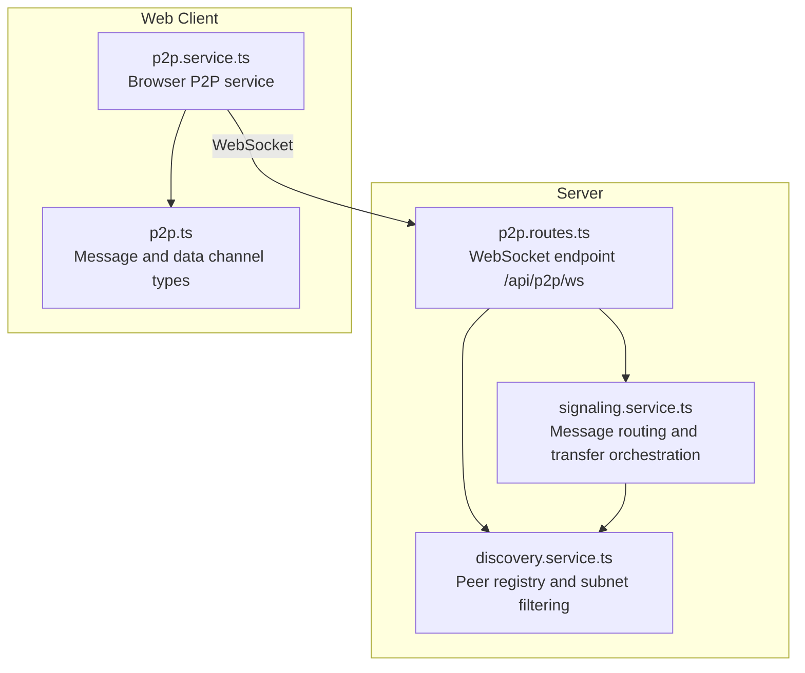
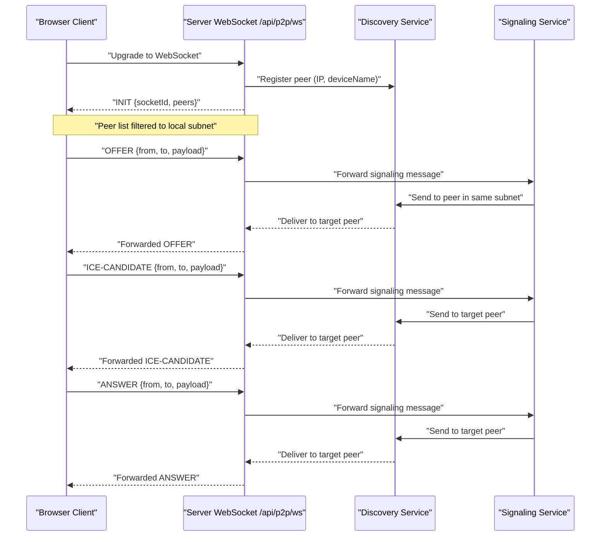
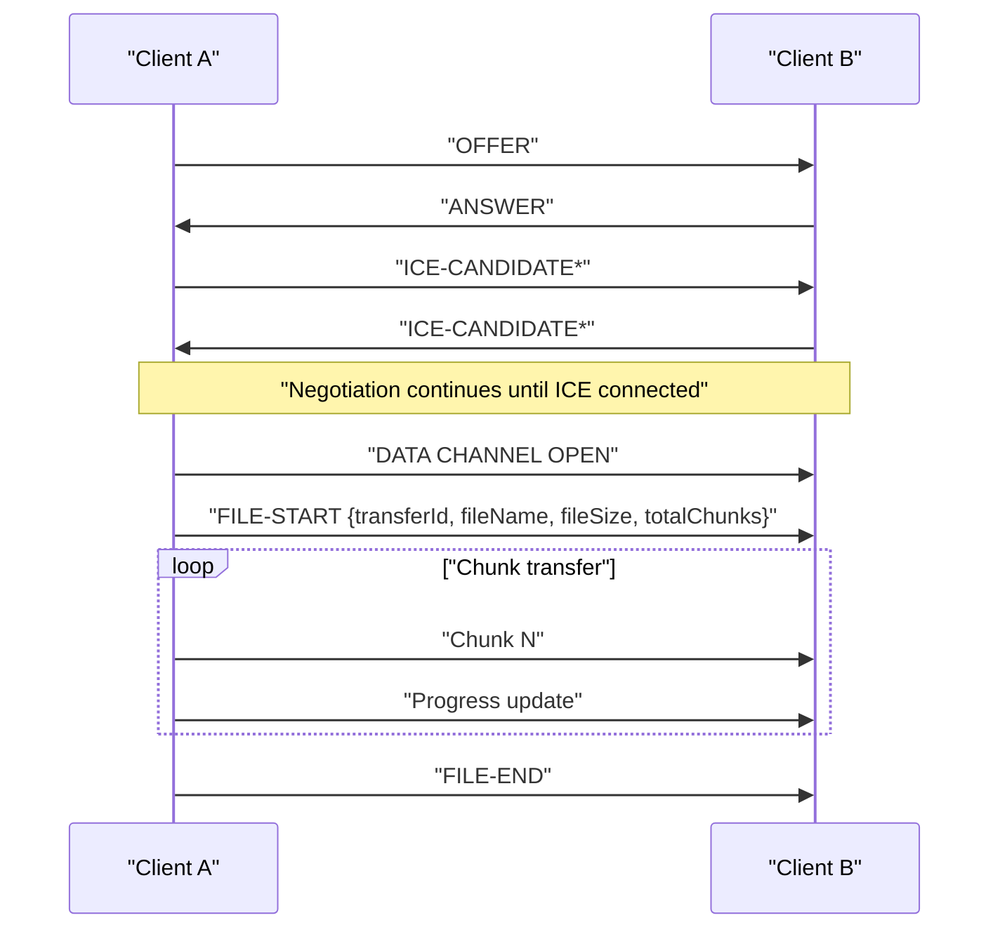
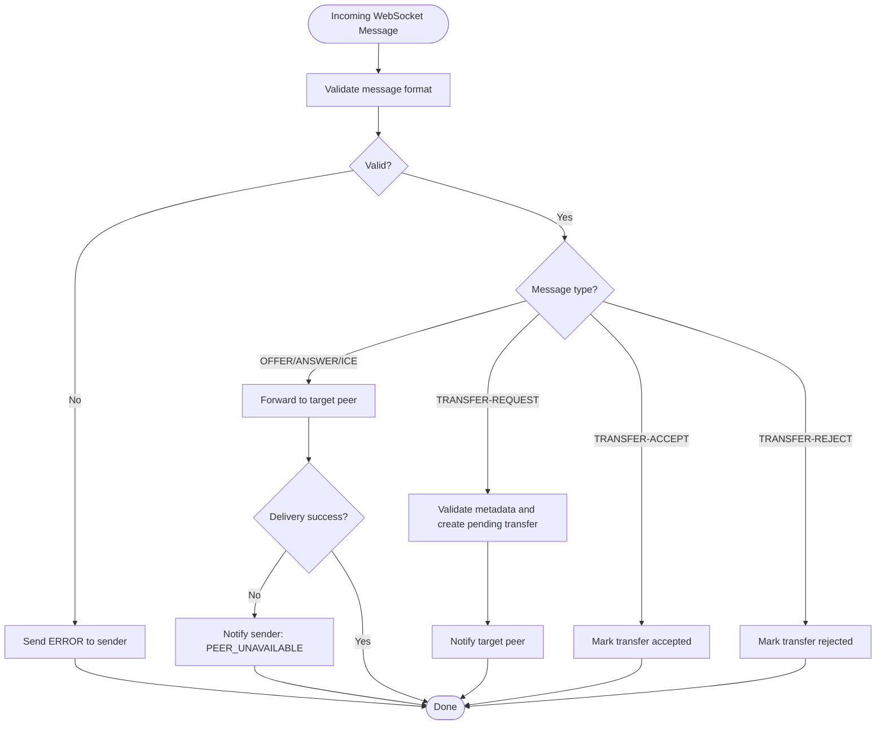
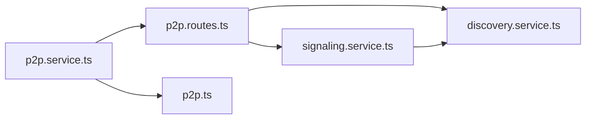

# P2P Communication Endpoints

<cite>
**Referenced Files in This Document**
- [p2p.routes.ts](file://packages/server/src/routes/p2p.routes.ts)
- [discovery.service.ts](file://packages/server/src/services/discovery.service.ts)
- [signaling.service.ts](file://packages/server/src/services/signaling.service.ts)
- [p2p.service.ts](file://packages/web/src/services/p2p.service.ts)
- [p2p.ts](file://packages/web/src/types/p2p.ts)
- [config.json](file://config.json)
</cite>

## Table of Contents
1. [Introduction](#introduction)
2. [Project Structure](#project-structure)
3. [Core Components](#core-components)
4. [Architecture Overview](#architecture-overview)
5. [Detailed Component Analysis](#detailed-component-analysis)
6. [Dependency Analysis](#dependency-analysis)
7. [Performance Considerations](#performance-considerations)
8. [Troubleshooting Guide](#troubleshooting-guide)
9. [Conclusion](#conclusion)

## Introduction
This document provides comprehensive API documentation for Airportal's peer-to-peer (P2P) communication endpoints. It covers signaling server communication, peer discovery, offer/answer exchange, ICE candidate exchange, and connection management. It also documents WebSocket upgrade handling, message formats, real-time communication patterns, WebRTC signaling parameters, connection state management, NAT traversal considerations, handshake processes, message routing, error handling, fallback mechanisms, and troubleshooting guidance for common P2P connectivity issues.

## Project Structure
Airportal implements P2P functionality across two packages:
- Server package: Provides WebSocket-based signaling routes, peer discovery, and signaling message routing.
- Web package: Implements the browser-side P2P service, including WebRTC peer connection lifecycle, data channel file transfer, and signaling message handling.

Key files:
- Server routes: packages/server/src/routes/p2p.routes.ts
- Server services: packages/server/src/services/discovery.service.ts, packages/server/src/services/signaling.service.ts
- Client service and types: packages/web/src/services/p2p.service.ts, packages/web/src/types/p2p.ts
- Global configuration: config.json

**Diagram sources**
- [p2p.routes.ts:48-132](file://packages/server/src/routes/p2p.routes.ts#L48-L132)
- [discovery.service.ts:13-206](file://packages/server/src/services/discovery.service.ts#L13-L206)
- [signaling.service.ts:50-349](file://packages/server/src/services/signaling.service.ts#L50-L349)
- [p2p.service.ts:14-579](file://packages/web/src/services/p2p.service.ts#L14-L579)
- [p2p.ts:1-101](file://packages/web/src/types/p2p.ts#L1-L101)

**Section sources**
- [p2p.routes.ts:48-132](file://packages/server/src/routes/p2p.routes.ts#L48-L132)
- [discovery.service.ts:13-206](file://packages/server/src/services/discovery.service.ts#L13-L206)
- [signaling.service.ts:50-349](file://packages/server/src/services/signaling.service.ts#L50-L349)
- [p2p.service.ts:14-579](file://packages/web/src/services/p2p.service.ts#L14-L579)
- [p2p.ts:1-101](file://packages/web/src/types/p2p.ts#L1-L101)
- [config.json:94-100](file://config.json#L94-L100)

## Core Components
- Server WebSocket endpoint: /api/p2p/ws
  - Purpose: Real-time signaling and presence updates for peers on the same local network.
  - Upgrade handling: Uses @fastify/websocket with a 1 MB max payload and custom peer tracking.
  - Query parameters: deviceName (optional, up to 50 chars).
  - Behavior: On connect, registers peer, sends initial peer list, and forwards signaling messages.

- Server REST endpoint: /api/p2p/status
  - Purpose: Returns P2P availability and current peer count.

- Client WebSocket URL: /api/p2p/ws
  - Purpose: Browser connects to the signaling server using the same path as the server route.
  - Auto-detection: Protocol switches between ws:// and wss:// based on current page protocol.

- Signaling services:
  - Discovery service: Manages peer registration, subnet-based filtering, and per-peer messaging.
  - Signaling service: Routes WebRTC signaling messages (offer, answer, ice-candidate), handles transfer requests, and enforces subnet constraints.

- Client-side P2P service:
  - Creates RTCPeerConnection instances (no STUN/TURN servers configured for local network).
  - Handles ICE candidate exchange, offer/answer exchange, and data channel file transfer.
  - Emits progress events and manages connection state changes.

**Section sources**
- [p2p.routes.ts:48-132](file://packages/server/src/routes/p2p.routes.ts#L48-L132)
- [discovery.service.ts:13-206](file://packages/server/src/services/discovery.service.ts#L13-L206)
- [signaling.service.ts:50-349](file://packages/server/src/services/signaling.service.ts#L50-L349)
- [p2p.service.ts:14-579](file://packages/web/src/services/p2p.service.ts#L14-L579)
- [p2p.ts:1-101](file://packages/web/src/types/p2p.ts#L1-L101)

## Architecture Overview
The P2P architecture consists of:
- Local network discovery: Peers are discovered and grouped by subnet.
- Signaling plane: Offers, answers, and ICE candidates are exchanged via WebSocket.
- Data plane: File transfers occur over WebRTC DataChannels after successful ICE negotiation.
- Security boundary: Cross-subnet communication is blocked; only peers within the same subnet can communicate.

**Diagram sources**
- [p2p.routes.ts:57-123](file://packages/server/src/routes/p2p.routes.ts#L57-L123)
- [discovery.service.ts:42-184](file://packages/server/src/services/discovery.service.ts#L42-L184)
- [signaling.service.ts:92-107](file://packages/server/src/services/signaling.service.ts#L92-L107)
- [p2p.service.ts:413-521](file://packages/web/src/services/p2p.service.ts#L413-L521)

## Detailed Component Analysis

### Server WebSocket Endpoint: /api/p2p/ws
- HTTP method: GET
- Path: /api/p2p/ws
- Query parameters:
  - deviceName (optional): Up to 50 characters; overrides auto-detected device name.
- WebSocket upgrade:
  - Max payload: 1 MB.
  - Client tracking disabled; managed by the application.
- Initial handshake:
  - Registers peer with IP, device name, and WebSocket.
  - Sends INIT message containing socketId and filtered peer list (excluding self).
- Message handling:
  - Parses incoming JSON messages and delegates to signaling service.
  - On parse failure, responds with ERROR message.
- Lifecycle:
  - On close: removes peer from registry.
  - On error: logs and removes peer.

**Section sources**
- [p2p.routes.ts:57-123](file://packages/server/src/routes/p2p.routes.ts#L57-L123)

### Server REST Endpoint: /api/p2p/status
- HTTP method: GET
- Path: /api/p2p/status
- Response:
  - enabled: Boolean indicating P2P capability.
  - peerCount: Number of currently connected peers.

**Section sources**
- [p2p.routes.ts:125-131](file://packages/server/src/routes/p2p.routes.ts#L125-L131)

### Client WebSocket URL Resolution
- URL pattern: /api/p2p/ws
- Protocol detection: Uses current page protocol (ws or wss).
- Example URL construction: protocol + "://" + host + "/api/p2p/ws".

**Section sources**
- [p2p.service.ts:108-111](file://packages/web/src/services/p2p.service.ts#L108-L111)

### Signaling Message Formats
- Base WebSocket message:
  - type: One of the supported message types.
  - Additional fields depend on type.
- INIT:
  - Fields: type, socketId, peers[].
  - peers[]: socketId, deviceName, status.
- PEER-LIST:
  - Fields: type, peers[].
  - peers[]: socketId, deviceName, status.
- OFFER:
  - Fields: type, from, to, payload (RTCSessionDescriptionInit).
- ANSWER:
  - Fields: type, from, to, payload (RTCSessionDescriptionInit).
- ICE-CANDIDATE:
  - Fields: type, from, to, payload (RTCIceCandidateInit).
- TRANSFER-REQUEST:
  - Fields: type, transferId, from, fromPeer, metadata, expiresAt.
  - metadata: fileName, fileSize, fileType.
- TRANSFER-ACCEPTED:
  - Fields: type, transferId, from.
- TRANSFER-REJECTED:
  - Fields: type, transferId, from.
- TRANSFER-EXPIRED:
  - Fields: type, transferId.
- ERROR:
  - Fields: type, code, message.

**Section sources**
- [p2p.ts:37-79](file://packages/web/src/types/p2p.ts#L37-L79)

### Data Channel Message Formats
- FILE-START:
  - Fields: type, transferId, fileName, fileSize, mimeType, totalChunks.
- FILE-END:
  - Fields: type, transferId.
- FILE-ERROR:
  - Fields: type, transferId, error.

**Section sources**
- [p2p.ts:81-100](file://packages/web/src/types/p2p.ts#L81-L100)

### Peer Discovery and Subnet Filtering
- Subnet calculation:
  - IPv4: First three octets (e.g., 192.168.1.x).
  - IPv6: First four segments (e.g., 2001:db8:85a3:8xxx:...).
- Registration:
  - Generates unique socketId, stores IP, subnet, deviceName, join time, and status.
- Peer list distribution:
  - Sends filtered peer lists to peers within the same subnet.
- Direct messaging:
  - Forwards messages to a specific peer if the WebSocket is open.

**Section sources**
- [discovery.service.ts:13-206](file://packages/server/src/services/discovery.service.ts#L13-L206)

### Signaling Service Routing and Validation
- Cross-subnet enforcement:
  - Rejects messages between peers in different subnets and notifies the sender.
- Message forwarding:
  - For OFFER, ANSWER, and ICE-CANDIDATE, forwards to the target peer.
  - If delivery fails, notifies the sender with PEER_UNAVAILABLE.
- Transfer request handling:
  - Validates metadata (fileName, fileSize).
  - Generates transferId, stores pending transfer, and notifies the target peer.
- Transfer acceptance/rejection:
  - Updates transfer state and notifies involved parties.
- Transfer completion:
  - Clears pending transfer and resets peer statuses.

**Section sources**
- [signaling.service.ts:50-349](file://packages/server/src/services/signaling.service.ts#L50-L349)

### Client-Side P2P Service Implementation
- Connection lifecycle:
  - connect(): Establishes WebSocket connection; idempotent.
  - disconnect(): Closes WebSocket and all peer connections.
  - onMessage()/onProgress(): Adds/removes message and progress handlers.
- Offer/Answer exchange:
  - Sender: Creates offer, sets local description, sends OFFER, waits for data channel open.
  - Receiver: Receives OFFER, creates ANSWER, sets local description, sends ANSWER.
- ICE candidate exchange:
  - Emits ICE-CANDIDATE when local ICE candidate is available.
  - Adds remote ICE candidates when received.
- Data channel file transfer:
  - Uses 16 KB chunks for safety.
  - Backpressure control: Waits until bufferedAmount decreases below 1 MB.
  - Emits progress events during transfer.
  - Sends FILE-START, file chunks, and FILE-END.
- Connection state management:
  - Logs connection state changes for each peer.
  - Handles data channel open/close/error events.
- NAT traversal considerations:
  - No STUN/TURN servers configured; designed for local network operation.

**Section sources**
- [p2p.service.ts:14-579](file://packages/web/src/services/p2p.service.ts#L14-L579)
- [p2p.ts:81-100](file://packages/web/src/types/p2p.ts#L81-L100)

### P2P Handshake and Connection Establishment Flow

**Diagram sources**
- [p2p.service.ts:413-521](file://packages/web/src/services/p2p.service.ts#L413-L521)
- [p2p.ts:81-100](file://packages/web/src/types/p2p.ts#L81-L100)

### Message Routing and Delivery

**Diagram sources**
- [signaling.service.ts:50-349](file://packages/server/src/services/signaling.service.ts#L50-L349)
- [discovery.service.ts:189-196](file://packages/server/src/services/discovery.service.ts#L189-L196)

## Dependency Analysis
- Server routes depend on:
  - @fastify/websocket for WebSocket support.
  - discoveryService for peer registry and message delivery.
  - signalingService for routing and transfer management.
- Client service depends on:
  - WebRTC APIs (RTCPeerConnection, RTCSessionDescription, RTCIceCandidate, RTCDataChannel).
  - WebSocket for signaling transport.
- Shared types define message contracts between client and server.

**Diagram sources**
- [p2p.routes.ts:1-6](file://packages/server/src/routes/p2p.routes.ts#L1-L6)
- [discovery.service.ts:1-2](file://packages/server/src/services/discovery.service.ts#L1-L2)
- [signaling.service.ts:1-2](file://packages/server/src/services/signaling.service.ts#L1-L2)
- [p2p.service.ts:1-7](file://packages/web/src/services/p2p.service.ts#L1-L7)
- [p2p.ts:1-2](file://packages/web/src/types/p2p.ts#L1-L2)

**Section sources**
- [p2p.routes.ts:1-6](file://packages/server/src/routes/p2p.routes.ts#L1-L6)
- [discovery.service.ts:1-2](file://packages/server/src/services/discovery.service.ts#L1-L2)
- [signaling.service.ts:1-2](file://packages/server/src/services/signaling.service.ts#L1-L2)
- [p2p.service.ts:1-7](file://packages/web/src/services/p2p.service.ts#L1-L7)
- [p2p.ts:1-2](file://packages/web/src/types/p2p.ts#L1-L2)

## Performance Considerations
- Chunk size: 16 KB ensures compatibility with WebRTC DataChannel constraints.
- Backpressure control: Limits bufferedAmount to prevent memory pressure during large transfers.
- Payload limits: Server enforces 1 MB WebSocket message size.
- Local network focus: No STUN/TURN servers reduce overhead and latency for LAN scenarios.
- Peer filtering: Subnet-based filtering reduces unnecessary message fan-out.

[No sources needed since this section provides general guidance]

## Troubleshooting Guide
Common issues and resolutions:
- Cross-subnet communication failures:
  - Symptom: ERROR with SUBNET_MISMATCH.
  - Cause: Peers are not on the same local network.
  - Resolution: Ensure both peers are on the same subnet (IPv4: same first three octets; IPv6: same first four segments).

- Target peer unavailable:
  - Symptom: ERROR with PEER_UNAVAILABLE.
  - Cause: Target peer disconnected or WebSocket closed.
  - Resolution: Reconnect the target peer; retry transfer after reconnection.

- Parse errors:
  - Symptom: ERROR with PARSE_ERROR.
  - Cause: Malformed JSON message.
  - Resolution: Validate client message format; ensure all required fields are present.

- Connection timeouts:
  - Symptom: Timeout waiting for data channel open.
  - Cause: ICE negotiation stalled or blocked by firewall/NAT.
  - Resolution: Verify local network connectivity; avoid restrictive firewalls; ensure UDP traffic is permitted.

- Large file transfer stalls:
  - Symptom: Slow progress or stalled transfer.
  - Cause: Backpressure due to high bufferedAmount.
  - Resolution: Allow backpressure to drain; ensure sufficient bandwidth; split large files if necessary.

- Device name detection:
  - Symptom: Unknown device name in peer list.
  - Resolution: Pass deviceName query parameter to override auto-detection.

**Section sources**
- [signaling.service.ts:50-107](file://packages/server/src/services/signaling.service.ts#L50-L107)
- [p2p.routes.ts:84-122](file://packages/server/src/routes/p2p.routes.ts#L84-L122)
- [p2p.service.ts:424-446](file://packages/web/src/services/p2p.service.ts#L424-L446)

## Conclusion
Airportal’s P2P implementation provides a streamlined signaling and data plane for local network file transfers. The server enforces subnet-based communication, routes WebRTC signaling messages, and orchestrates transfer requests. The client manages WebRTC connections, ICE exchange, and reliable file transfer over DataChannels. Together, these components enable efficient, secure, and low-latency P2P transfers within local networks, with clear error handling and troubleshooting pathways for common connectivity issues.