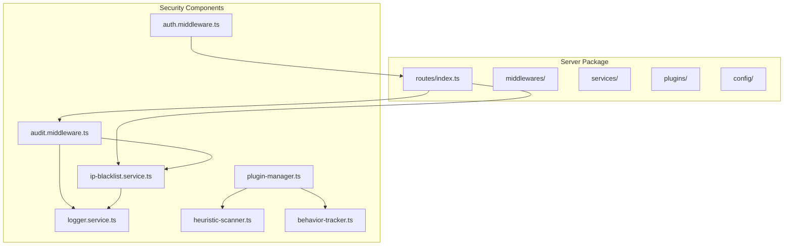
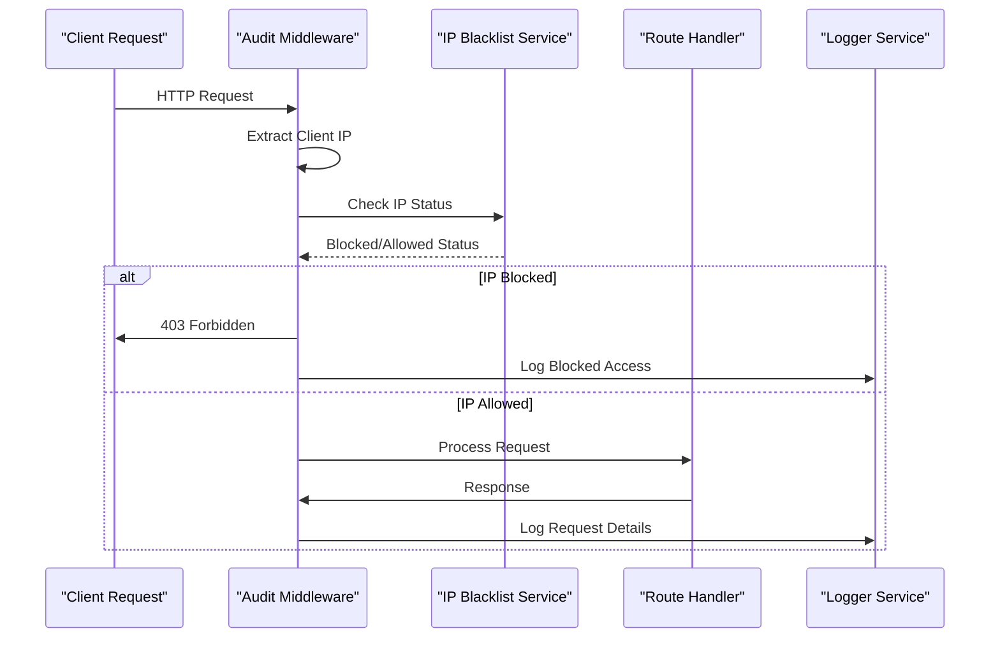
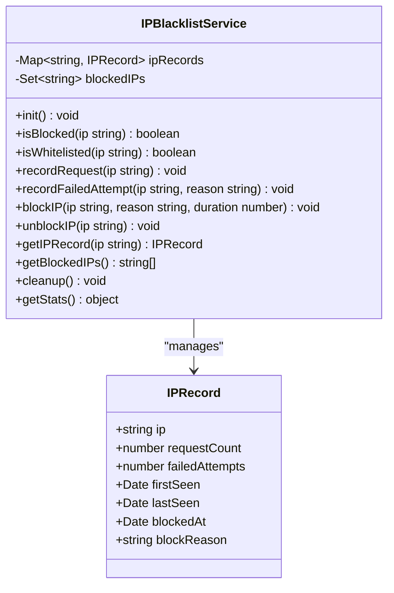
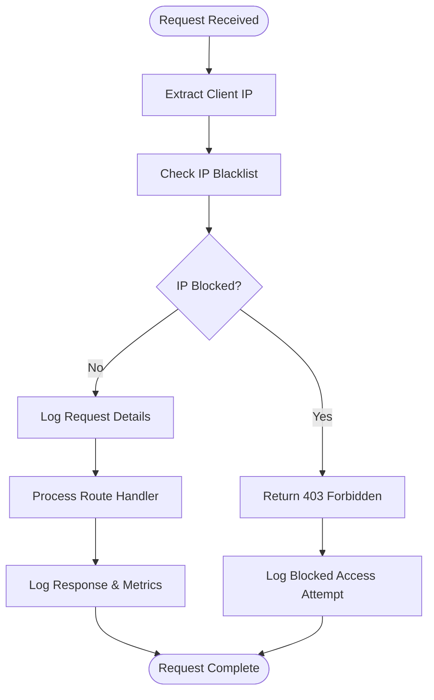
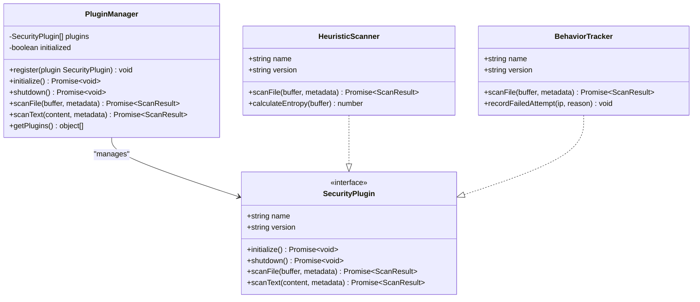

# Security and IP Management Endpoints

<cite>
**Referenced Files in This Document**
- [index.ts](file://packages/server/src/routes/index.ts)
- [audit.middleware.ts](file://packages/server/src/middlewares/audit.middleware.ts)
- [ip-blacklist.service.ts](file://packages/server/src/services/ip-blacklist.service.ts)
- [auth.middleware.ts](file://packages/server/src/middlewares/auth.middleware.ts)
- [plugin-manager.ts](file://packages/server/src/plugins/plugin-manager.ts)
- [heuristic-scanner.ts](file://packages/server/src/plugins/heuristic-scanner.ts)
- [behavior-tracker.ts](file://packages/server/src/plugins/behavior-tracker.ts)
- [logger.service.ts](file://packages/server/src/services/logger.service.ts)
- [index.ts](file://packages/server/src/config/index.ts)
</cite>

## Table of Contents
1. [Introduction](#introduction)
2. [Project Structure](#project-structure)
3. [Core Components](#core-components)
4. [Architecture Overview](#architecture-overview)
5. [Detailed Component Analysis](#detailed-component-analysis)
6. [Security Endpoint Specifications](#security-endpoint-specifications)
7. [Audit Logging Endpoints](#audit-logging-endpoints)
8. [Security Plugin Integration](#security-plugin-integration)
9. [Rate Limiting and Authentication](#rate-limiting-and-authentication)
10. [Compliance and Monitoring](#compliance-and-monitoring)
11. [Troubleshooting Guide](#troubleshooting-guide)
12. [Conclusion](#conclusion)

## Introduction

Airportal is a secure file transfer platform that implements comprehensive security measures including IP blacklisting, audit logging, and behavioral analysis. This documentation covers the security and IP management endpoints that enable administrators to monitor and control access to the system while maintaining detailed audit trails for compliance and incident response.

The security infrastructure consists of three main components: IP blacklist management for blocking malicious actors, comprehensive audit logging for security event tracking, and intelligent security plugins for automated threat detection and response.

## Project Structure

The security system is organized within the server package with clear separation of concerns:



**Diagram sources**
- [index.ts:10-62](file://packages/server/src/routes/index.ts#L10-L62)
- [audit.middleware.ts:48-124](file://packages/server/src/middlewares/audit.middleware.ts#L48-L124)

**Section sources**
- [index.ts:1-63](file://packages/server/src/routes/index.ts#L1-L63)

## Core Components

The security system comprises several interconnected components that work together to provide comprehensive protection:

### IP Blacklist Service
The IP blacklist service maintains real-time tracking of IP addresses, their activity patterns, and block/unblock status. It provides automatic blocking based on configurable thresholds and supports manual administrative controls.

### Audit Middleware
The audit middleware provides comprehensive request logging with sensitive data redaction, IP-based access control, and automatic request tracking for security analysis.

### Security Plugin System
A pluggable security architecture that supports multiple security plugins including heuristic scanning and behavioral analysis for automated threat detection.

**Section sources**
- [ip-blacklist.service.ts:14-215](file://packages/server/src/services/ip-blacklist.service.ts#L14-L215)
- [audit.middleware.ts:48-124](file://packages/server/src/middlewares/audit.middleware.ts#L48-L124)
- [plugin-manager.ts:4-167](file://packages/server/src/plugins/plugin-manager.ts#L4-L167)

## Architecture Overview

The security architecture follows a layered approach with middleware-based request processing and service-oriented design:



**Diagram sources**
- [audit.middleware.ts:48-124](file://packages/server/src/middlewares/audit.middleware.ts#L48-L124)
- [ip-blacklist.service.ts:37-42](file://packages/server/src/services/ip-blacklist.service.ts#L37-L42)

## Detailed Component Analysis

### IP Blacklist Management Service

The IP blacklist service implements a sophisticated traffic monitoring and blocking system:



**Diagram sources**
- [ip-blacklist.service.ts:14-215](file://packages/server/src/services/ip-blacklist.service.ts#L14-L215)

**Section sources**
- [ip-blacklist.service.ts:14-215](file://packages/server/src/services/ip-blacklist.service.ts#L14-L215)

### Audit Logging System

The audit middleware provides comprehensive request tracking with sensitive data protection:



**Diagram sources**
- [audit.middleware.ts:48-124](file://packages/server/src/middlewares/audit.middleware.ts#L48-L124)

**Section sources**
- [audit.middleware.ts:48-124](file://packages/server/src/middlewares/audit.middleware.ts#L48-L124)

### Security Plugin Architecture

The plugin system enables extensible security capabilities through a standardized interface:



**Diagram sources**
- [plugin-manager.ts:4-167](file://packages/server/src/plugins/plugin-manager.ts#L4-L167)
- [heuristic-scanner.ts:25-173](file://packages/server/src/plugins/heuristic-scanner.ts#L25-L173)
- [behavior-tracker.ts:12-136](file://packages/server/src/plugins/behavior-tracker.ts#L12-L136)

**Section sources**
- [plugin-manager.ts:4-167](file://packages/server/src/plugins/plugin-manager.ts#L4-L167)
- [heuristic-scanner.ts:25-173](file://packages/server/src/plugins/heuristic-scanner.ts#L25-L173)
- [behavior-tracker.ts:12-136](file://packages/server/src/plugins/behavior-tracker.ts#L12-L136)

## Security Endpoint Specifications

### IP Blacklist Management Endpoints

The security system provides comprehensive IP management capabilities through the `/security/ip` endpoint group:

#### GET /security/ip/stats
**Purpose**: Retrieve security statistics and analytics
**Authentication**: Administrative authentication required
**Rate Limit**: 5 requests per minute
**Response Schema**:
```json
{
  "success": true,
  "data": {
    "totalRecords": 0,
    "blockedCount": 0,
    "topFailedIPs": [
      {
        "ip": "string",
        "failedAttempts": 0
      }
    ]
  }
}
```

#### GET /security/ip/blocked
**Purpose**: List all currently blocked IP addresses
**Authentication**: Administrative authentication required
**Rate Limit**: 5 requests per minute
**Response Schema**:
```json
{
  "success": true,
  "data": ["string"]
}
```

#### POST /security/ip/block
**Purpose**: Add an IP address to the blacklist
**Authentication**: Administrative authentication required
**Rate Limit**: Not rate-limited
**Request Schema**:
```json
{
  "ip": "string",
  "reason": "string",
  "duration": "number"
}
```
**Response Schema**:
```json
{
  "success": true,
  "message": "IP 已封禁"
}
```

#### DELETE /security/ip/unblock
**Purpose**: Remove an IP address from the blacklist
**Authentication**: Administrative authentication required
**Rate Limit**: Not rate-limited
**Request Schema**:
```json
{
  "ip": "string"
}
```
**Response Schema**:
```json
{
  "success": true,
  "message": "IP 已解封"
}
```

**Section sources**
- [audit.middleware.ts:129-186](file://packages/server/src/middlewares/audit.middleware.ts#L129-L186)

### IP Blocking Mechanisms

The system implements multiple layers of IP blocking:

1. **Manual Blocking**: Administrative IP block via dedicated endpoints
2. **Automatic Blocking**: Threshold-based blocking based on failed attempts
3. **Temporary Blocking**: Configurable duration-based blocking
4. **Whitelist Protection**: Protected IP addresses that cannot be blocked

**Section sources**
- [ip-blacklist.service.ts:125-162](file://packages/server/src/services/ip-blacklist.service.ts#L125-L162)
- [audit.middleware.ts:54-66](file://packages/server/src/middlewares/audit.middleware.ts#L54-L66)

## Audit Logging Endpoints

### Request Monitoring and Compliance

The audit system provides comprehensive logging for security event tracking:

#### Audit Data Collection
The middleware automatically captures:
- Request method and URL
- Client IP address (with proxy support)
- User agent information
- Request/response timing metrics
- User context (when authenticated)
- Sensitive data redaction

#### Log Levels and Categories
- **Debug**: Detailed request/response bodies (when log level permits)
- **Info**: Successful request completion
- **Warn**: Client errors and blocked access attempts
- **Error**: Server errors and security incidents

**Section sources**
- [audit.middleware.ts:68-121](file://packages/server/src/middlewares/audit.middleware.ts#L68-L121)
- [logger.service.ts:14-78](file://packages/server/src/services/logger.service.ts#L14-L78)

## Security Plugin Integration

### Heuristic Scanner Plugin

The heuristic scanner provides signature-based malware detection:

#### Detection Capabilities
- Code execution patterns
- Shell command injection
- SQL injection attempts
- XSS vectors
- Reverse shell indicators
- Obfuscation techniques

#### Configuration Parameters
- **Entropy Threshold**: 7.5 (information entropy for binary detection)
- **Max Scan Size**: 10MB (file size limit for analysis)
- **Reject Threshold**: 70 (risk score for malicious classification)
- **Warning Threshold**: 40 (risk score for suspicious classification)

**Section sources**
- [heuristic-scanner.ts:35-54](file://packages/server/src/plugins/heuristic-scanner.ts#L35-L54)
- [heuristic-scanner.ts:10-23](file://packages/server/src/plugins/heuristic-scanner.ts#L10-L23)

### Behavior Tracker Plugin

The behavior tracker monitors upload patterns for anomaly detection:

#### Behavioral Analysis
- Upload frequency monitoring
- File size distribution analysis
- IP-based traffic pattern recognition
- Burst detection and scoring

#### Configuration Parameters
- **Sliding Window**: 60,000ms (time window for analysis)
- **Burst Threshold**: 5 uploads per window
- **Size Multiplier**: 3x average for outlier detection
- **Anomaly Score Threshold**: 50 for automatic blocking

**Section sources**
- [behavior-tracker.ts:23-36](file://packages/server/src/plugins/behavior-tracker.ts#L23-L36)
- [behavior-tracker.ts:16-22](file://packages/server/src/plugins/behavior-tracker.ts#L16-L22)

## Rate Limiting and Authentication

### Authentication Requirements

All security endpoints require administrative authentication:

#### Required Headers
- `Authorization: Bearer <admin-token>`

#### Token Validation
- JWT token verification
- Expiration checking
- Administrative privilege validation

**Section sources**
- [auth.middleware.ts:11-32](file://packages/server/src/middlewares/auth.middleware.ts#L11-L32)

### Rate Limiting Implementation

The system implements strategic rate limiting:

#### IP Management Endpoints
- **Requests per Minute**: 5
- **Time Window**: 60 seconds
- **Purpose**: Prevent abuse of administrative endpoints

#### Request Processing
Rate limiting is applied at the route level using Fastify's built-in rate limiting mechanism.

**Section sources**
- [audit.middleware.ts:130-151](file://packages/server/src/middlewares/audit.middleware.ts#L130-L151)

## Compliance and Monitoring

### Audit Trail Generation

The system maintains comprehensive audit trails for compliance:

#### Log Content
- Timestamps for all events
- IP address tracking
- User identification (when available)
- Request/response details
- Security incident documentation

#### Sensitive Data Protection
- Automatic redaction of passwords, tokens, and secrets
- Configurable log levels for production environments
- Structured logging for easy querying

**Section sources**
- [audit.middleware.ts:12-29](file://packages/server/src/middlewares/audit.middleware.ts#L12-L29)
- [logger.service.ts:36-58](file://packages/server/src/services/logger.service.ts#L36-L58)

### Security Event Classification

Events are categorized for effective monitoring:

#### Critical Events (Error Level)
- Server failures and system errors
- Security plugin initialization failures
- Authentication system errors

#### High Severity (Warn Level)
- IP blocking decisions
- Security policy violations
- Suspicious activity patterns

#### Medium Severity (Info Level)
- Successful security operations
- Normal request processing
- System health monitoring

## Troubleshooting Guide

### Common Issues and Solutions

#### IP Blacklist Not Working
**Symptoms**: Blocked IPs still receive access
**Causes**:
- IP blacklist service not initialized
- Whitelist configuration overriding blocks
- Proxy header configuration issues

**Solutions**:
1. Verify security configuration is enabled
2. Check whitelist entries for conflicting IPs
3. Configure proper X-Forwarded-For headers

#### Audit Logs Missing Sensitive Data
**Symptoms**: Redacted request bodies in logs
**Causes**:
- Log level set to production
- Sensitive field detection triggering

**Solutions**:
1. Adjust log level for debugging
2. Review sensitive field detection rules
3. Configure appropriate log filtering

#### Security Plugin Failures
**Symptoms**: Security operations failing silently
**Causes**:
- Plugin initialization errors
- Memory constraints
- Configuration validation failures

**Solutions**:
1. Check plugin manager initialization logs
2. Verify plugin-specific configuration
3. Monitor system resource usage

**Section sources**
- [audit.middleware.ts:34-43](file://packages/server/src/middlewares/audit.middleware.ts#L34-L43)
- [plugin-manager.ts:17-32](file://packages/server/src/plugins/plugin-manager.ts#L17-L32)

## Conclusion

Airportal's security and IP management system provides comprehensive protection through multiple layers of defense. The modular architecture allows for flexible security configurations while maintaining detailed audit trails for compliance and incident response.

Key strengths of the system include:
- Real-time IP monitoring and blocking
- Comprehensive audit logging with sensitive data protection
- Extensible plugin architecture for custom security capabilities
- Automated threat detection through behavioral analysis
- Administrative controls for manual intervention

The documented endpoints and configurations provide administrators with the tools necessary to maintain a secure environment while meeting compliance requirements and enabling effective incident response procedures.