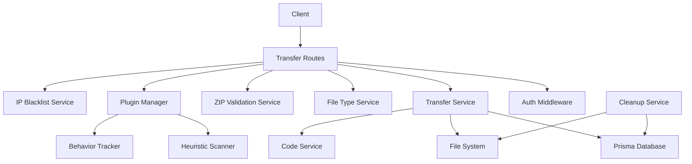
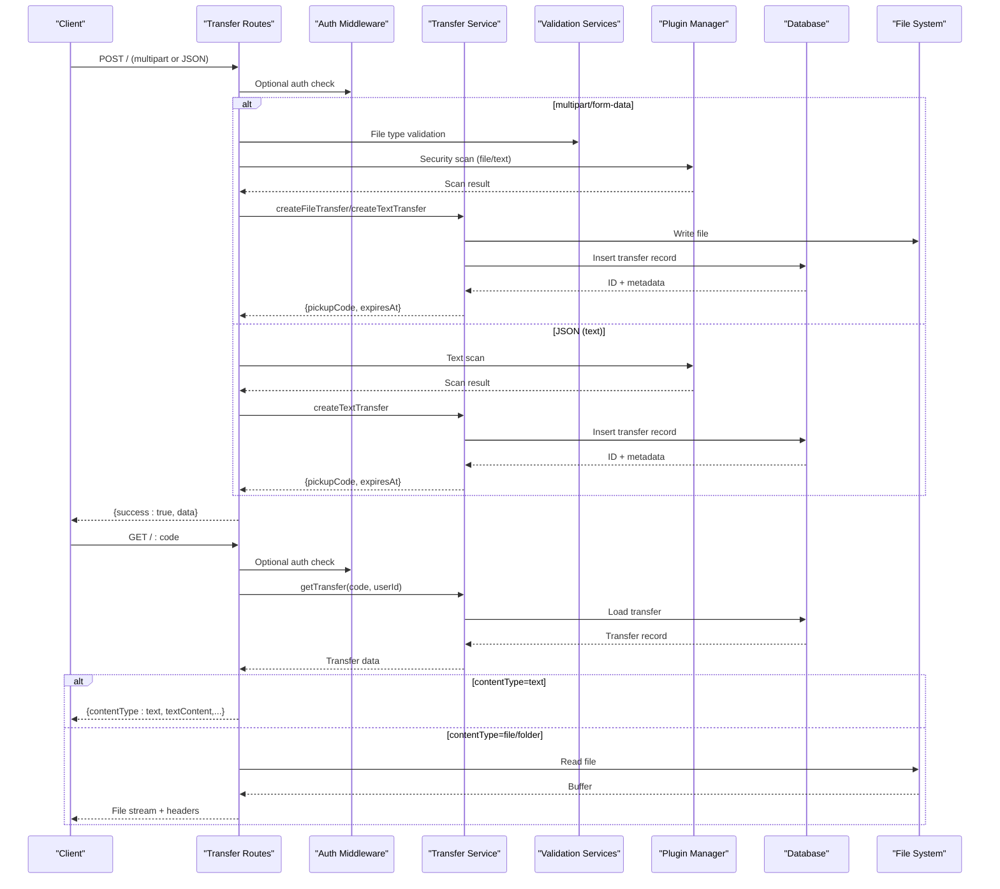
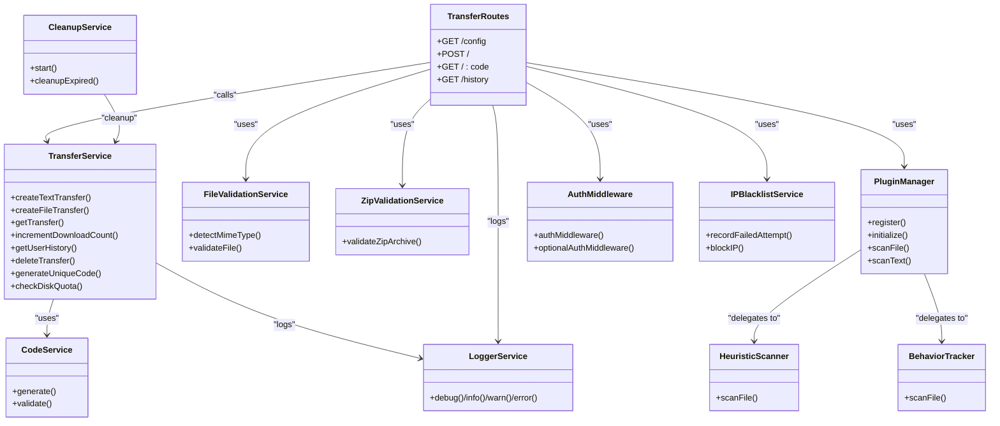

# Transfer Management Endpoints

<cite>
**Referenced Files in This Document**
- [transfer.routes.js](file://packages/server/dist/routes/transfer.routes.js)
- [transfer.service.js](file://packages/server/dist/services/transfer.service.js)
- [cleanup.service.js](file://packages/server/dist/services/cleanup.service.js)
- [code.service.js](file://packages/server/dist/services/code.service.js)
- [auth.middleware.js](file://packages/server/dist/middlewares/auth.middleware.js)
- [file-type.service.js](file://packages/server/dist/services/file-type.service.js)
- [zip-validation.service.js](file://packages/server/dist/services/zip-validation.service.js)
- [plugin-manager.js](file://packages/server/dist/plugins/plugin-manager.js)
- [heuristic-scanner.js](file://packages/server/dist/plugins/heuristic-scanner.js)
- [behavior-tracker.js](file://packages/server/dist/plugins/behavior-tracker.js)
- [ip-blacklist.service.js](file://packages/server/dist/services/ip-blacklist.service.js)
- [logger.service.js](file://packages/server/dist/services/logger.service.js)
- [config.json](file://config.json)
</cite>

## Table of Contents
1. [Introduction](#introduction)
2. [Project Structure](#project-structure)
3. [Core Components](#core-components)
4. [Architecture Overview](#architecture-overview)
5. [Detailed Component Analysis](#detailed-component-analysis)
6. [Dependency Analysis](#dependency-analysis)
7. [Performance Considerations](#performance-considerations)
8. [Troubleshooting Guide](#troubleshooting-guide)
9. [Conclusion](#conclusion)

## Introduction
This document provides comprehensive API documentation for Airportal's file and text transfer management endpoints. It covers all transfer-related HTTP endpoints for creating, retrieving, and managing transfers, including file uploads (single files and folder zips), text uploads, transfer retrieval via pick-up codes, download tracking, and automated cleanup. It also documents multipart/form-data handling, validation rules, security controls, and operational policies such as expiration, owner-only restrictions, and batch operations.

## Project Structure
The transfer management system is implemented in the server package with route handlers delegating to a dedicated transfer service. Supporting services handle authentication, file validation, ZIP archive validation, security scanning, cleanup scheduling, and logging.

**Diagram sources**
- [transfer.routes.js:1-278](file://packages/server/dist/routes/transfer.routes.js#L1-L278)
- [transfer.service.js:1-263](file://packages/server/dist/services/transfer.service.js#L1-L263)
- [code.service.js:1-18](file://packages/server/dist/services/code.service.js#L1-L18)
- [file-type.service.js:1-191](file://packages/server/dist/services/file-type.service.js#L1-L191)
- [zip-validation.service.js:1-187](file://packages/server/dist/services/zip-validation.service.js#L1-L187)
- [plugin-manager.js:1-152](file://packages/server/dist/plugins/plugin-manager.js#L1-L152)
- [heuristic-scanner.js:1-161](file://packages/server/dist/plugins/heuristic-scanner.js#L1-L161)
- [behavior-tracker.js:1-111](file://packages/server/dist/plugins/behavior-tracker.js#L1-L111)
- [ip-blacklist.service.js:1-177](file://packages/server/dist/services/ip-blacklist.service.js#L1-L177)
- [cleanup.service.js:1-125](file://packages/server/dist/services/cleanup.service.js#L1-L125)

**Section sources**
- [transfer.routes.js:1-278](file://packages/server/dist/routes/transfer.routes.js#L1-L278)
- [transfer.service.js:1-263](file://packages/server/dist/services/transfer.service.js#L1-L263)
- [config.json:1-102](file://config.json#L1-L102)

## Core Components
- Transfer Routes: Define HTTP endpoints, request parsing, validation, and response formatting.
- Transfer Service: Orchestrates persistence, file handling, pick-up code generation, quota checks, and access control.
- Code Service: Generates secure, non-confusing pick-up codes.
- Validation Services: File type detection and ZIP archive security validation.
- Security Plugins: Heuristic scanner and behavior tracker integrated via plugin manager.
- Cleanup Service: Periodic removal of expired transfers and associated files.
- Authentication Middleware: Enforces bearer token authentication and optional auth modes.
- IP Blacklist Service: Tracks and blocks abusive IPs.
- Logger Service: Centralized structured logging.

**Section sources**
- [transfer.routes.js:1-278](file://packages/server/dist/routes/transfer.routes.js#L1-L278)
- [transfer.service.js:1-263](file://packages/server/dist/services/transfer.service.js#L1-L263)
- [code.service.js:1-18](file://packages/server/dist/services/code.service.js#L1-L18)
- [file-type.service.js:1-191](file://packages/server/dist/services/file-type.service.js#L1-L191)
- [zip-validation.service.js:1-187](file://packages/server/dist/services/zip-validation.service.js#L1-L187)
- [plugin-manager.js:1-152](file://packages/server/dist/plugins/plugin-manager.js#L1-L152)
- [heuristic-scanner.js:1-161](file://packages/server/dist/plugins/heuristic-scanner.js#L1-L161)
- [behavior-tracker.js:1-111](file://packages/server/dist/plugins/behavior-tracker.js#L1-L111)
- [cleanup.service.js:1-125](file://packages/server/dist/services/cleanup.service.js#L1-L125)
- [auth.middleware.js:1-36](file://packages/server/dist/middlewares/auth.middleware.js#L1-L36)
- [ip-blacklist.service.js:1-177](file://packages/server/dist/services/ip-blacklist.service.js#L1-L177)
- [logger.service.js:1-63](file://packages/server/dist/services/logger.service.js#L1-L63)

## Architecture Overview
The transfer lifecycle spans request validation, security scanning, persistence, and retrieval with strict access control and cleanup.

**Diagram sources**
- [transfer.routes.js:32-271](file://packages/server/dist/routes/transfer.routes.js#L32-L271)
- [transfer.service.js:23-121](file://packages/server/dist/services/transfer.service.js#L23-L121)
- [file-type.service.js:107-147](file://packages/server/dist/services/file-type.service.js#L107-L147)
- [zip-validation.service.js:15-123](file://packages/server/dist/services/zip-validation.service.js#L15-L123)
- [plugin-manager.js:46-98](file://packages/server/dist/plugins/plugin-manager.js#L46-L98)

## Detailed Component Analysis

### Endpoint Catalog

#### GET /api/transfers/config
- Description: Returns client-facing limits and capabilities.
- Authentication: Not required.
- Response:
  - success: boolean
  - data:
    - maxFileSize: number (bytes)
    - maxTextLength: number (characters)
    - defaultExpiry: number (seconds)
    - maxExpiry: number (seconds)
    - folderUploadEnabled: boolean

**Section sources**
- [transfer.routes.js:19-30](file://packages/server/dist/routes/transfer.routes.js#L19-L30)
- [config.json:63-82](file://config.json#L63-L82)

#### POST /api/transfers
- Description: Creates a new transfer. Supports both file uploads (multipart/form-data) and text uploads (JSON).
- Authentication: Optional. Required when ownerOnly is true.
- Rate Limit: Upload-specific rate limit configured in security settings.
- Request Formats:
  - multipart/form-data:
    - Fields:
      - file: single file part
      - type: string, "folder" to enable ZIP validation and folder semantics
      - folderName: string, default "folder"
      - fileCount: number, estimated file count for folder uploads
      - expiresIn: number, seconds (clamped to maxExpiry)
      - maxDownloads: number, 0 means unlimited (internally stored as very large value)
      - ownerOnly: boolean, requires login
    - Content-Type: multipart/form-data
  - application/json (text):
    - text: string (length limited by maxTextLength)
    - expiresIn: number (optional)
    - maxDownloads: number (optional)
    - ownerOnly: boolean (optional)
- Validation and Security:
  - File uploads:
    - Size limit enforced by security.upload.maxFileSize
    - Extension blocking enforced by security.upload.blockedExtensions
    - Optional ZIP validation when type=folder:
      - Validates central directory, path traversal, entry count, file name length, uncompressed size, and compression ratio
    - Optional file type detection using Magic Numbers
    - Optional security plugin scanning (heuristic + behavior)
  - Text uploads:
    - Length validated against security.upload.maxTextLength
    - Optional security plugin scanning
- Access Control:
  - ownerOnly requires a valid bearer token; otherwise returns LOGIN_REQUIRED
- Response:
  - success: boolean
  - data:
    - pickupCode: string (6 characters, non-confusing alphabet)
    - expiresAt: ISO datetime
    - expiresIn: number (seconds)
    - fileCount: number (present for folders)
    - folderName: string (present for folders)

**Section sources**
- [transfer.routes.js:32-216](file://packages/server/dist/routes/transfer.routes.js#L32-L216)
- [transfer.service.js:56-121](file://packages/server/dist/services/transfer.service.js#L56-L121)
- [file-type.service.js:107-147](file://packages/server/dist/services/file-type.service.js#L107-L147)
- [zip-validation.service.js:15-123](file://packages/server/dist/services/zip-validation.service.js#L15-L123)
- [plugin-manager.js:46-98](file://packages/server/dist/plugins/plugin-manager.js#L46-L98)
- [auth.middleware.js:22-35](file://packages/server/dist/middlewares/auth.middleware.js#L22-L35)
- [config.json:63-82](file://config.json#L63-L82)

#### GET /api/transfers/:code
- Description: Retrieves transfer content by pick-up code. Enforces access control and download limits.
- Authentication: Optional. Required when ownerOnly is true.
- Path Parameters:
  - code: string (exactly 6 characters, non-confusing alphabet)
- Response:
  - For text:
    - success: boolean
    - data:
      - contentType: "text"
      - textContent: string
      - expiresAt: ISO datetime
  - For file/folder:
    - Headers:
      - Content-Type: file mime type or application/octet-stream
      - Content-Disposition: attachment with filename encoded
      - X-Content-Type-Options: nosniff
      - X-Download-Options: noopen
      - Cache-Control: no-store, no-cache, must-revalidate
      - Content-Security-Policy: default-src 'none'
    - Body: file bytes
- Access Control and Limits:
  - Validates code format and length
  - Checks expiration; expired transfers are deleted and return 404
  - Enforces ownerOnly restriction if set
  - Enforces maxDownloads limit (unlimited when stored as very large value)
  - Increments download count atomically

**Section sources**
- [transfer.routes.js:218-271](file://packages/server/dist/routes/transfer.routes.js#L218-L271)
- [transfer.service.js:153-187](file://packages/server/dist/services/transfer.service.js#L153-L187)

#### GET /api/transfers/history
- Description: Lists user's active transfers (requires login).
- Authentication: Required (bearer token).
- Response:
  - success: boolean
  - data: array of transfer records (limited to recent 50, ordered by creation time)

**Section sources**
- [transfer.routes.js:272-277](file://packages/server/dist/routes/transfer.routes.js#L272-L277)
- [transfer.service.js:194-206](file://packages/server/dist/services/transfer.service.js#L194-L206)

### Pick-up Code Generation
- Code length: 6 characters.
- Alphabet excludes ambiguous characters (0,O,I,l).
- Generation retries up to a fixed cap to ensure uniqueness.
- Code validation enforces length and character set.

**Section sources**
- [code.service.js:1-18](file://packages/server/dist/services/code.service.js#L1-L18)
- [transfer.routes.js:223-228](file://packages/server/dist/routes/transfer.routes.js#L223-L228)
- [transfer.service.js:218-236](file://packages/server/dist/services/transfer.service.js#L218-L236)

### Download Tracking and Cleanup
- Download tracking:
  - Each successful file/folder retrieval increments the download counter atomically.
- Cleanup policy:
  - Periodic cleanup removes expired transfers and associated files based on configuration.
  - Options include deleting files, updating records to expired, or deleting records.
  - Can run on startup based on configuration.

**Section sources**
- [transfer.service.js:188-193](file://packages/server/dist/services/transfer.service.js#L188-L193)
- [cleanup.service.js:41-118](file://packages/server/dist/services/cleanup.service.js#L41-L118)

### Batch Operations
- Folder uploads:
  - When type=folder is specified, the system validates the uploaded ZIP archive for safety and metadata before creating a folder transfer.
  - Parameters include folderName, fileCount, and ZIP constraints.
- Unlimited downloads:
  - Setting maxDownloads to 0 stores a very large value internally, effectively allowing unlimited downloads.

**Section sources**
- [transfer.routes.js:56-61](file://packages/server/dist/routes/transfer.routes.js#L56-L61)
- [zip-validation.service.js:15-123](file://packages/server/dist/services/zip-validation.service.js#L15-L123)
- [transfer.service.js:44-45](file://packages/server/dist/services/transfer.service.js#L44-L45)

### Example Requests and Responses

- Create a file transfer (multipart/form-data):
  - POST /api/transfers
  - Headers: Authorization: Bearer <token> (optional)
  - Body: multipart/form-data with file field
  - Query: type=folder (optional), folderName=<name>, fileCount=<count>, expiresIn=<seconds>, maxDownloads=<count>, ownerOnly=<true|false>
  - Response: { success: true, data: { pickupCode, expiresAt, expiresIn, fileCount?, folderName? } }

- Create a text transfer (JSON):
  - POST /api/transfers
  - Headers: Authorization: Bearer <token> (optional)
  - Body: { text, expiresIn?, maxDownloads?, ownerOnly? }
  - Response: { success: true, data: { pickupCode, expiresAt, expiresIn } }

- Retrieve transfer:
  - GET /api/transfers/:code
  - Headers: Authorization: Bearer <token> (required if ownerOnly=true)
  - Response (text): { success: true, data: { contentType: "text", textContent, expiresAt } }
  - Response (file/folder): Streamed file with appropriate headers

- Get user history:
  - GET /api/transfers/history
  - Headers: Authorization: Bearer <token> (required)
  - Response: { success: true, data: [...] }

**Section sources**
- [transfer.routes.js:32-271](file://packages/server/dist/routes/transfer.routes.js#L32-L271)
- [transfer.service.js:23-121](file://packages/server/dist/services/transfer.service.js#L23-L121)

### Error Handling Strategies
- Validation errors:
  - INVALID_FILE_TYPE, INVALID_ZIP, UPLOAD_FAILED, INVALID_CODE
- Access control errors:
  - LOGIN_REQUIRED, ACCESS_DENIED (includes ownerOnly and maxDownloads exceeded)
- Cleanup and quota:
  - Storage quota exceeded during upload
- Security scanning:
  - SECURITY_BLOCK with reasons when malicious or suspicious content is detected

**Section sources**
- [transfer.routes.js:49-215](file://packages/server/dist/routes/transfer.routes.js#L49-L215)
- [transfer.service.js:58-152](file://packages/server/dist/services/transfer.service.js#L58-L152)
- [ip-blacklist.service.js:62-98](file://packages/server/dist/services/ip-blacklist.service.js#L62-L98)

## Dependency Analysis

**Diagram sources**
- [transfer.routes.js:1-278](file://packages/server/dist/routes/transfer.routes.js#L1-L278)
- [transfer.service.js:1-263](file://packages/server/dist/services/transfer.service.js#L1-L263)
- [code.service.js:1-18](file://packages/server/dist/services/code.service.js#L1-L18)
- [file-type.service.js:1-191](file://packages/server/dist/services/file-type.service.js#L1-L191)
- [zip-validation.service.js:1-187](file://packages/server/dist/services/zip-validation.service.js#L1-L187)
- [plugin-manager.js:1-152](file://packages/server/dist/plugins/plugin-manager.js#L1-L152)
- [heuristic-scanner.js:1-161](file://packages/server/dist/plugins/heuristic-scanner.js#L1-L161)
- [behavior-tracker.js:1-111](file://packages/server/dist/plugins/behavior-tracker.js#L1-L111)
- [cleanup.service.js:1-125](file://packages/server/dist/services/cleanup.service.js#L1-L125)
- [auth.middleware.js:1-36](file://packages/server/dist/middlewares/auth.middleware.js#L1-L36)
- [ip-blacklist.service.js:1-177](file://packages/server/dist/services/ip-blacklist.service.js#L1-L177)
- [logger.service.js:1-63](file://packages/server/dist/services/logger.service.js#L1-L63)

**Section sources**
- [transfer.routes.js:1-278](file://packages/server/dist/routes/transfer.routes.js#L1-L278)
- [transfer.service.js:1-263](file://packages/server/dist/services/transfer.service.js#L1-L263)

## Performance Considerations
- Large file handling:
  - File buffers are loaded into memory during multipart processing; consider streaming for very large files if needed.
  - Disk quota checks prevent overload; monitor storage metrics.
- Security scanning:
  - Heuristic scanning caps scan size; adjust thresholds in configuration for balancing accuracy and latency.
- Cleanup scheduling:
  - Tune cleanup interval and action (delete/update) to balance resource usage and data retention.
- Concurrency:
  - Rate limiting prevents abuse; adjust uploadMax and uploadWindowMs as needed.

[No sources needed since this section provides general guidance]

## Troubleshooting Guide
- Common errors and resolutions:
  - INVALID_CODE: Ensure the code is exactly 6 characters and uses allowed characters.
  - LOGIN_REQUIRED: Provide a valid bearer token when ownerOnly is enabled.
  - ACCESS_DENIED: Check ownership and download limits; expired transfers are cleaned up automatically.
  - INVALID_FILE_TYPE: Verify file type and extension; Magic Number validation may reject mismatches.
  - INVALID_ZIP: Fix ZIP structure, reduce entry count or uncompressed size, avoid path traversal.
  - SECURITY_BLOCK: Review scan reasons and adjust content or configuration.
  - STORAGE_QUOTA_EXCEEDED: Reduce upload size or wait until quota frees up.
- Logging:
  - Enable detailed logs to diagnose validation failures, security scans, and cleanup operations.

**Section sources**
- [transfer.routes.js:223-270](file://packages/server/dist/routes/transfer.routes.js#L223-L270)
- [transfer.service.js:153-187](file://packages/server/dist/services/transfer.service.js#L153-L187)
- [logger.service.js:1-63](file://packages/server/dist/services/logger.service.js#L1-L63)

## Conclusion
Airportal’s transfer management endpoints provide a robust, secure, and configurable system for uploading and retrieving files and text. Strong validation, security scanning, access control, and automated cleanup ensure reliability and safety. Clients should adhere to configured limits and use bearer tokens for owner-only features. For optimal performance, tune security plugin thresholds, cleanup intervals, and rate limits according to deployment needs.