# Backend System

<cite>
**Referenced Files in This Document**
- [package.json](file://package.json)
- [pnpm-workspace.yaml](file://pnpm-workspace.yaml)
- [packages/server/package.json](file://packages/server/package.json)
- [packages/server/src/index.ts](file://packages/server/src/index.ts)
- [packages/server/src/app.ts](file://packages/server/src/app.ts)
- [packages/server/src/config/index.ts](file://packages/server/src/config/index.ts)
- [packages/server/config.json](file://packages/server/config.json)
- [packages/server/prisma/schema.prisma](file://packages/server/prisma/schema.prisma)
- [packages/server/src/middlewares/auth.middleware.ts](file://packages/server/src/middlewares/auth.middleware.ts)
- [packages/server/src/middlewares/audit.middleware.ts](file://packages/server/src/middlewares/audit.middleware.ts)
- [packages/server/src/plugins/plugin-manager.ts](file://packages/server/src/plugins/plugin-manager.ts)
- [packages/server/src/plugins/behavior-tracker.ts](file://packages/server/src/plugins/behavior-tracker.ts)
- [packages/server/src/plugins/heuristic-scanner.ts](file://packages/server/src/plugins/heuristic-scanner.ts)
- [packages/server/src/routes/index.ts](file://packages/server/src/routes/index.ts)
- [packages/server/src/routes/auth.routes.ts](file://packages/server/src/routes/auth.routes.ts)
- [packages/server/src/routes/transfer.routes.ts](file://packages/server/src/routes/transfer.routes.ts)
- [packages/server/src/routes/p2p.routes.ts](file://packages/server/src/routes/p2p.routes.ts)
- [packages/server/src/services/auth.service.ts](file://packages/server/src/services/auth.service.ts)
- [packages/server/src/services/transfer.service.ts](file://packages/server/src/services/transfer.service.ts)
- [packages/server/src/services/cleanup.service.ts](file://packages/server/src/services/cleanup.service.ts)
- [packages/server/src/services/config.service.ts](file://packages/server/src/services/config.service.ts)
- [packages/server/src/services/logger.service.ts](file://packages/server/src/services/logger.service.ts)
- [packages/server/src/services/ip-blacklist.service.ts](file://packages/server/src/services/ip-blacklist.service.ts)
- [packages/server/src/services/file-type.service.ts](file://packages/server/src/services/file-type.service.ts)
- [packages/server/src/services/code.service.ts](file://packages/server/src/services/code.service.ts)
</cite>

## Table of Contents
1. [Introduction](#introduction)
2. [Project Structure](#project-structure)
3. [Core Components](#core-components)
4. [Architecture Overview](#architecture-overview)
5. [Detailed Component Analysis](#detailed-component-analysis)
6. [Dependency Analysis](#dependency-analysis)
7. [Performance Considerations](#performance-considerations)
8. [Troubleshooting Guide](#troubleshooting-guide)
9. [Conclusion](#conclusion)
10. [Appendices](#appendices)

## Introduction
This document describes the backend system for Airportal, focusing on the Fastify server setup, middleware stack, plugin architecture, service layer, database design with Prisma ORM, and API organization. It also covers security plugins (PluginManager, HeuristicScanner, BehaviorTracker), transfer service, cleanup services, authentication middleware, route organization, request handling patterns, and error management strategies.

## Project Structure
The repository is a monorepo using pnpm workspaces. The backend server resides under packages/server and is structured into:
- app.ts: Fastify server builder and startup routine
- config/: centralized configuration loading and proxy access
- middlewares/: request auditing and authentication
- plugins/: security plugin system and implementations
- routes/: API route groups
- services/: business logic and persistence layer via Prisma
- prisma/: Prisma schema and data directory
- test/: unit and integration tests for services and plugins

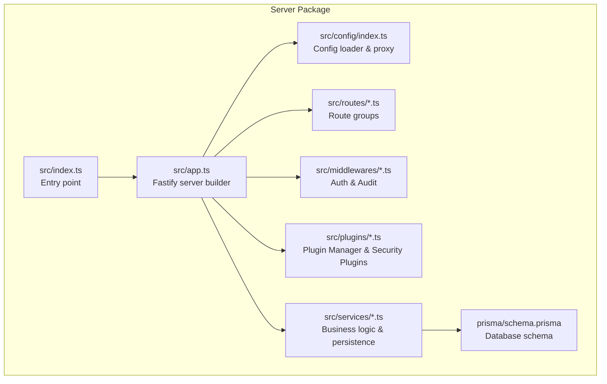

**Diagram sources**
- [packages/server/src/index.ts:1-7](file://packages/server/src/index.ts#L1-L7)
- [packages/server/src/app.ts:1-205](file://packages/server/src/app.ts#L1-L205)
- [packages/server/src/config/index.ts:1-15](file://packages/server/src/config/index.ts#L1-L15)
- [packages/server/prisma/schema.prisma:1-60](file://packages/server/prisma/schema.prisma#L1-L60)

**Section sources**
- [pnpm-workspace.yaml:1-3](file://pnpm-workspace.yaml#L1-L3)
- [package.json:6-16](file://package.json#L6-L16)
- [packages/server/package.json:6-18](file://packages/server/package.json#L6-L18)

## Core Components
- Fastify server builder: registers security middleware, CORS, multipart upload, rate limiting, static assets, routes, 404 fallback, and global error handler.
- Configuration system: loads environment variables, exposes init/get/update functions, and a Proxy-based convenience accessor.
- Middleware stack: helmet for hardening, CORS, multipart, rate limit, audit logging, and authentication.
- Plugin architecture: PluginManager orchestrates security plugins (HeuristicScanner, BehaviorTracker) and aggregates results.
- Services: transfer management, cleanup scheduler, authentication, IP blacklist, file type detection, code generation, and logging.
- Routes: organized under /api with auth and transfer endpoints, plus P2P routes.

**Section sources**
- [packages/server/src/app.ts:19-148](file://packages/server/src/app.ts#L19-L148)
- [packages/server/src/config/index.ts:1-15](file://packages/server/src/config/index.ts#L1-L15)
- [packages/server/src/plugins/plugin-manager.ts:1-167](file://packages/server/src/plugins/plugin-manager.ts#L1-L167)
- [packages/server/src/plugins/behavior-tracker.ts:1-136](file://packages/server/src/plugins/behavior-tracker.ts#L1-L136)
- [packages/server/src/plugins/heuristic-scanner.ts:1-173](file://packages/server/src/plugins/heuristic-scanner.ts#L1-L173)
- [packages/server/src/routes/index.ts](file://packages/server/src/routes/index.ts)

## Architecture Overview
The backend follows a layered architecture:
- Transport and security layer: Fastify with helmet, CORS, multipart, rate limit, static serving.
- Request lifecycle: audit middleware validates IP/blacklist, optional auth middleware attaches user payload, plugins scan content, routes handle requests.
- Persistence: Prisma ORM with SQLite datasource.
- Operations: scheduled cleanup service and startup initialization.

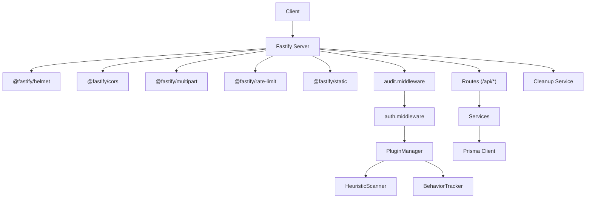

**Diagram sources**
- [packages/server/src/app.ts:22-129](file://packages/server/src/app.ts#L22-L129)
- [packages/server/src/middlewares/audit.middleware.ts:48-124](file://packages/server/src/middlewares/audit.middleware.ts#L48-L124)
- [packages/server/src/middlewares/auth.middleware.ts:11-32](file://packages/server/src/middlewares/auth.middleware.ts#L11-L32)
- [packages/server/src/plugins/plugin-manager.ts:4-47](file://packages/server/src/plugins/plugin-manager.ts#L4-L47)
- [packages/server/src/plugins/heuristic-scanner.ts:25-54](file://packages/server/src/plugins/heuristic-scanner.ts#L25-L54)
- [packages/server/src/plugins/behavior-tracker.ts:12-36](file://packages/server/src/plugins/behavior-tracker.ts#L12-L36)
- [packages/server/src/services/transfer.service.ts](file://packages/server/src/services/transfer.service.ts)
- [packages/server/src/services/cleanup.service.ts](file://packages/server/src/services/cleanup.service.ts)
- [packages/server/prisma/schema.prisma:1-60](file://packages/server/prisma/schema.prisma#L1-L60)

## Detailed Component Analysis

### Fastify Server Setup and Middleware Stack
- Security headers: helmet with CSP, HSTS, X-Frame-Options, XSS protection, and referrer policy.
- CORS: configurable origins, credentials, and allowed methods/headers.
- Multipart: upload limits aligned with configuration.
- Rate limiting: global and upload-specific limits with IP key generator.
- Static assets: serves built frontend in production; dev uses Vite hook.
- Routes: mounted under /api.
- 404 fallback: SPA fallback for non-API routes in production; API routes return JSON 404.
- Error handler: logs unhandled errors and responds with generic 500.

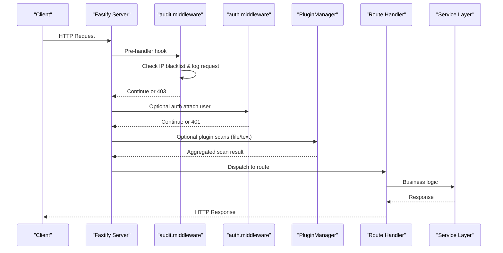

**Diagram sources**
- [packages/server/src/app.ts:38-129](file://packages/server/src/app.ts#L38-L129)
- [packages/server/src/middlewares/audit.middleware.ts:48-124](file://packages/server/src/middlewares/audit.middleware.ts#L48-L124)
- [packages/server/src/middlewares/auth.middleware.ts:11-32](file://packages/server/src/middlewares/auth.middleware.ts#L11-L32)
- [packages/server/src/plugins/plugin-manager.ts:49-104](file://packages/server/src/plugins/plugin-manager.ts#L49-L104)

**Section sources**
- [packages/server/src/app.ts:22-148](file://packages/server/src/app.ts#L22-L148)

### Plugin Architecture: PluginManager, HeuristicScanner, BehaviorTracker
- PluginManager:
  - Registers plugins, ensures uniqueness, initializes/shuts down safely.
  - Scans files and text concurrently across plugins, aggregates results by worst verdict and max risk score.
  - Returns standardized ScanResult with timing and metadata.
- HeuristicScanner:
  - Initializes thresholds and patterns from configuration (defaults provided).
  - Computes entropy for binary-like content, matches regex patterns, detects magic-number mismatches.
  - Produces risk scores and reasons for malicious/suspicious classification.
- BehaviorTracker:
  - Tracks per-IP upload counts, bytes, timestamps, and file sizes in a sliding window.
  - Flags bursts and outliers; can feed IP blacklist on anomaly.
  - Provides clean result when IP is unavailable.

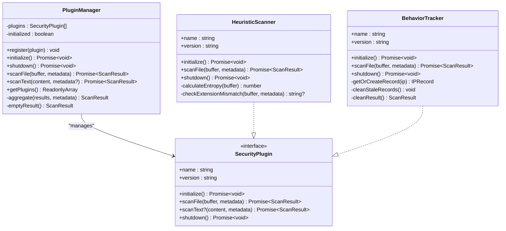

**Diagram sources**
- [packages/server/src/plugins/plugin-manager.ts:4-167](file://packages/server/src/plugins/plugin-manager.ts#L4-L167)
- [packages/server/src/plugins/heuristic-scanner.ts:25-173](file://packages/server/src/plugins/heuristic-scanner.ts#L25-L173)
- [packages/server/src/plugins/behavior-tracker.ts:12-136](file://packages/server/src/plugins/behavior-tracker.ts#L12-L136)

**Section sources**
- [packages/server/src/plugins/plugin-manager.ts:1-167](file://packages/server/src/plugins/plugin-manager.ts#L1-L167)
- [packages/server/src/plugins/heuristic-scanner.ts:1-173](file://packages/server/src/plugins/heuristic-scanner.ts#L1-L173)
- [packages/server/src/plugins/behavior-tracker.ts:1-136](file://packages/server/src/plugins/behavior-tracker.ts#L1-L136)

### Authentication Middleware
- Enforces Bearer token verification.
- On success, attaches user payload to request; on missing/invalid tokens, responds with 401.
- Optional auth variant allows anonymous access while still attaching user if present.

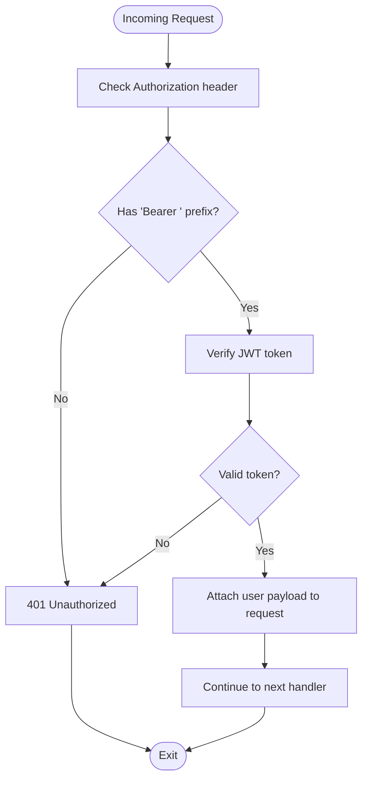

**Diagram sources**
- [packages/server/src/middlewares/auth.middleware.ts:11-32](file://packages/server/src/middlewares/auth.middleware.ts#L11-L32)

**Section sources**
- [packages/server/src/middlewares/auth.middleware.ts:1-49](file://packages/server/src/middlewares/auth.middleware.ts#L1-L49)

### Audit Middleware and IP Blacklist Management
- Sanitizes sensitive fields in request body/params/query.
- Records request metadata and user info when available.
- Checks IP blacklist before proceeding; logs and rejects blocked IPs.
- On completion, logs success/error/warn based on status code; records failed attempts for audit.
- Exposes admin endpoints to manage IP blacklist stats and blocking/unblocking.

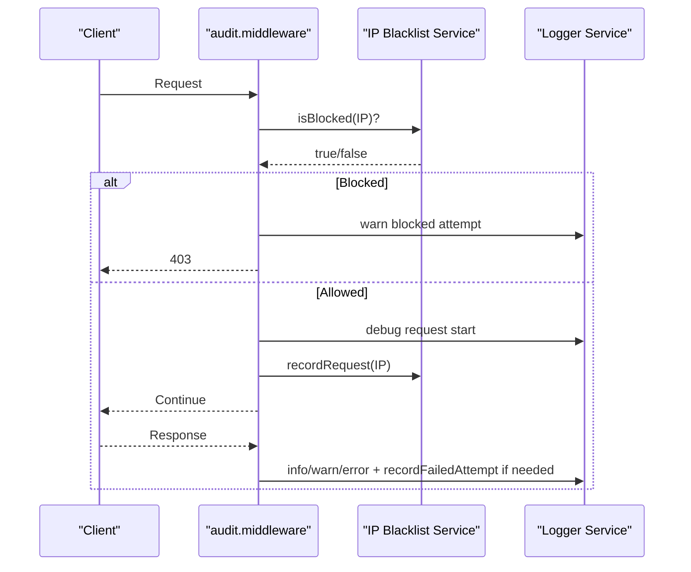

**Diagram sources**
- [packages/server/src/middlewares/audit.middleware.ts:48-124](file://packages/server/src/middlewares/audit.middleware.ts#L48-L124)
- [packages/server/src/services/ip-blacklist.service.ts](file://packages/server/src/services/ip-blacklist.service.ts)

**Section sources**
- [packages/server/src/middlewares/audit.middleware.ts:1-187](file://packages/server/src/middlewares/audit.middleware.ts#L1-L187)

### Service Layer Pattern and Database Design
- Services encapsulate business logic and coordinate with Prisma client.
- Database schema defines Users and Transfers with relationships and indexes.
- Typical service responsibilities include transfer creation, retrieval, download tracking, cleanup, authentication, and IP management.

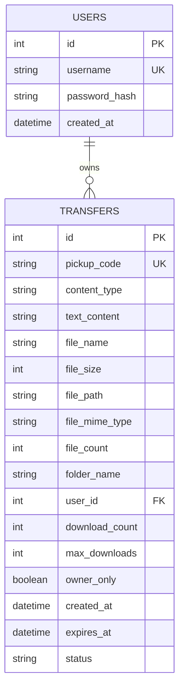

**Diagram sources**
- [packages/server/prisma/schema.prisma:10-59](file://packages/server/prisma/schema.prisma#L10-L59)

**Section sources**
- [packages/server/prisma/schema.prisma:1-60](file://packages/server/prisma/schema.prisma#L1-L60)
- [packages/server/src/services/transfer.service.ts](file://packages/server/src/services/transfer.service.ts)
- [packages/server/src/services/auth.service.ts](file://packages/server/src/services/auth.service.ts)
- [packages/server/src/services/cleanup.service.ts](file://packages/server/src/services/cleanup.service.ts)

### API Endpoint Organization
- Routes are grouped under /api with modular registration.
- Example groups include auth, transfer, and p2p.
- Each route group composes handlers that leverage services and middleware.

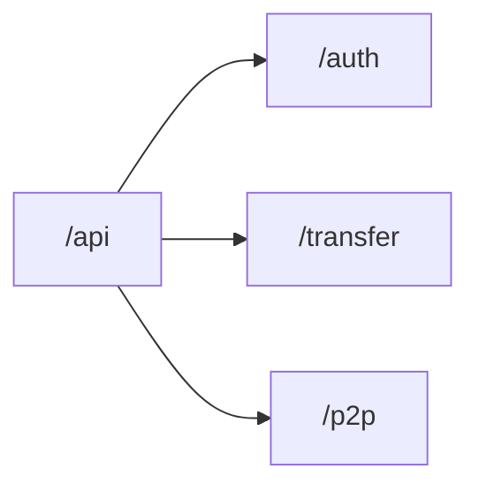

**Diagram sources**
- [packages/server/src/routes/index.ts](file://packages/server/src/routes/index.ts)
- [packages/server/src/routes/auth.routes.ts](file://packages/server/src/routes/auth.routes.ts)
- [packages/server/src/routes/transfer.routes.ts](file://packages/server/src/routes/transfer.routes.ts)
- [packages/server/src/routes/p2p.routes.ts](file://packages/server/src/routes/p2p.routes.ts)

**Section sources**
- [packages/server/src/routes/index.ts](file://packages/server/src/routes/index.ts)
- [packages/server/src/routes/auth.routes.ts](file://packages/server/src/routes/auth.routes.ts)
- [packages/server/src/routes/transfer.routes.ts](file://packages/server/src/routes/transfer.routes.ts)
- [packages/server/src/routes/p2p.routes.ts](file://packages/server/src/routes/p2p.routes.ts)

### Transfer Service Implementation
- Initializes storage and runtime state.
- Handles creation of transfers (text/file/folder), associates with user when authenticated, enforces limits and expiry.
- Manages download counters and status transitions.
- Integrates with plugin manager for security scanning during upload.

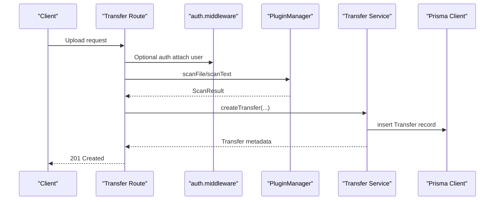

**Diagram sources**
- [packages/server/src/plugins/plugin-manager.ts:49-104](file://packages/server/src/plugins/plugin-manager.ts#L49-L104)
- [packages/server/src/services/transfer.service.ts](file://packages/server/src/services/transfer.service.ts)

**Section sources**
- [packages/server/src/services/transfer.service.ts](file://packages/server/src/services/transfer.service.ts)
- [packages/server/src/plugins/plugin-manager.ts:1-167](file://packages/server/src/plugins/plugin-manager.ts#L1-L167)

### Cleanup Services for Expired Content
- Scheduled cleanup removes expired transfers and associated records.
- Can be configured to run on startup and target files/records independently.
- Updates record actions according to configuration.

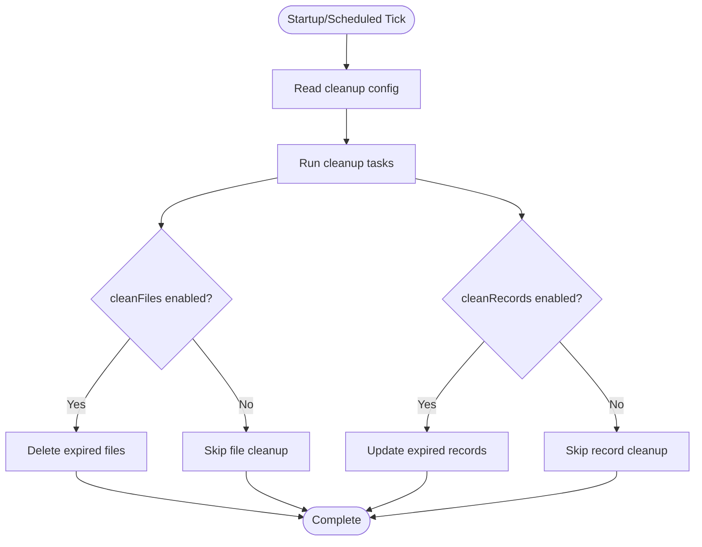

**Diagram sources**
- [packages/server/src/services/cleanup.service.ts](file://packages/server/src/services/cleanup.service.ts)
- [packages/server/config.json:83-89](file://packages/server/config.json#L83-L89)

**Section sources**
- [packages/server/src/services/cleanup.service.ts](file://packages/server/src/services/cleanup.service.ts)
- [packages/server/config.json:83-89](file://packages/server/config.json#L83-L89)

### Configuration and Environment
- Centralized configuration via config.service with init/get/update.
- Runtime configuration loaded from config.json with extensive security, upload, transfer, cleanup, and logging settings.
- Environment variables supported via dotenv.

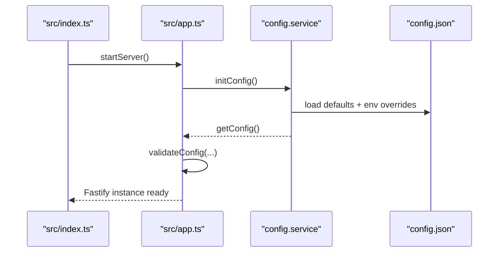

**Diagram sources**
- [packages/server/src/index.ts:1-7](file://packages/server/src/index.ts#L1-L7)
- [packages/server/src/app.ts:150-163](file://packages/server/src/app.ts#L150-L163)
- [packages/server/src/config/index.ts:1-15](file://packages/server/src/config/index.ts#L1-L15)
- [packages/server/config.json:1-95](file://packages/server/config.json#L1-L95)

**Section sources**
- [packages/server/src/config/index.ts:1-15](file://packages/server/src/config/index.ts#L1-L15)
- [packages/server/src/app.ts:150-163](file://packages/server/src/app.ts#L150-L163)
- [packages/server/config.json:1-95](file://packages/server/config.json#L1-L95)

## Dependency Analysis
External dependencies relevant to backend functionality:
- Fastify and official plugins for security, CORS, multipart, rate limiting, static serving, and WebSockets.
- Prisma client for database access.
- Utilities for hashing, JWT, ID generation, cron scheduling, and testing.

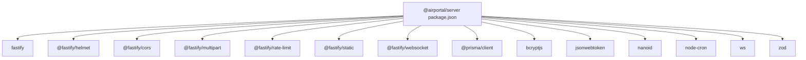

**Diagram sources**
- [packages/server/package.json:19-35](file://packages/server/package.json#L19-L35)

**Section sources**
- [packages/server/package.json:19-35](file://packages/server/package.json#L19-L35)

## Performance Considerations
- Sliding window analytics in BehaviorTracker keep memory bounded; stale records are periodically cleaned.
- HeuristicScanner caps scan size and uses efficient entropy calculation; regex patterns are compiled once per initialization.
- Rate limiting reduces load and mitigates abuse; consider tuning thresholds per deployment.
- Static asset serving avoids Node overhead for frontend in production.
- PluginManager parallelizes plugin scans; ensure plugin implementations are non-blocking.

## Troubleshooting Guide
- Configuration validation failures at startup halt the server; review printed errors and fix config.json or environment variables.
- 401/403 responses indicate auth or IP blacklist issues; check audit logs for details.
- 429 responses mean rate limit exceeded; adjust global/upload limits or client behavior.
- 500 responses are logged with error context; inspect logs for stack traces.
- Plugin initialization failures are logged with plugin name and error message; verify plugin readiness and dependencies.

**Section sources**
- [packages/server/src/app.ts:156-162](file://packages/server/src/app.ts#L156-L162)
- [packages/server/src/app.ts:131-145](file://packages/server/src/app.ts#L131-L145)
- [packages/server/src/plugins/plugin-manager.ts:20-30](file://packages/server/src/plugins/plugin-manager.ts#L20-L30)

## Conclusion
Airportal’s backend leverages Fastify with a robust middleware stack, a modular plugin architecture for security scanning, and a clear service layer backed by Prisma. The system emphasizes safety through rate limiting, audit logging, IP blacklisting, and configurable heuristic scanning, while organizing APIs under /api with maintainable route modules. Cleanup services and startup initialization ensure operational reliability.

## Appendices

### Configuration Reference Highlights
- Security: file validation, IP blacklist, audit logging, rate limits, security plugin toggles and thresholds.
- Upload: max file/text sizes, total storage, blocked extensions, folder upload constraints.
- Transfer: code length, default/max expiry.
- Cleanup: interval, run-on-start, targets, record action.
- Logging: level and file output.

**Section sources**
- [packages/server/config.json:6-94](file://packages/server/config.json#L6-L94)