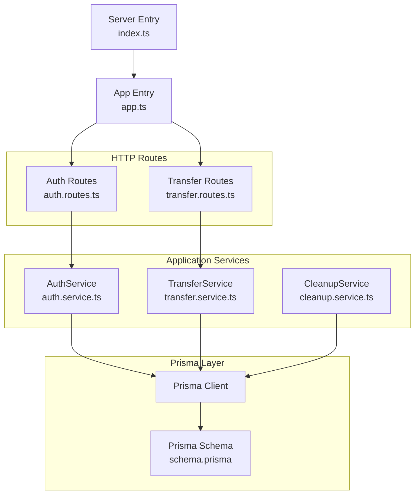
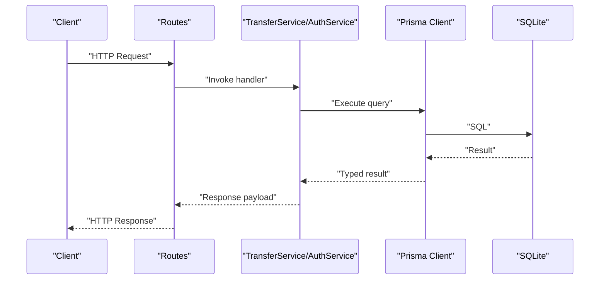
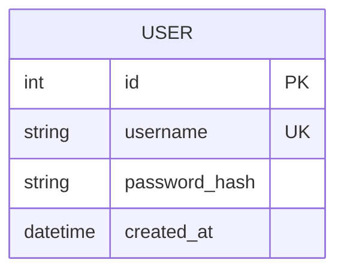
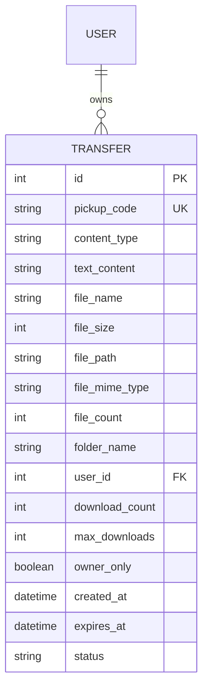
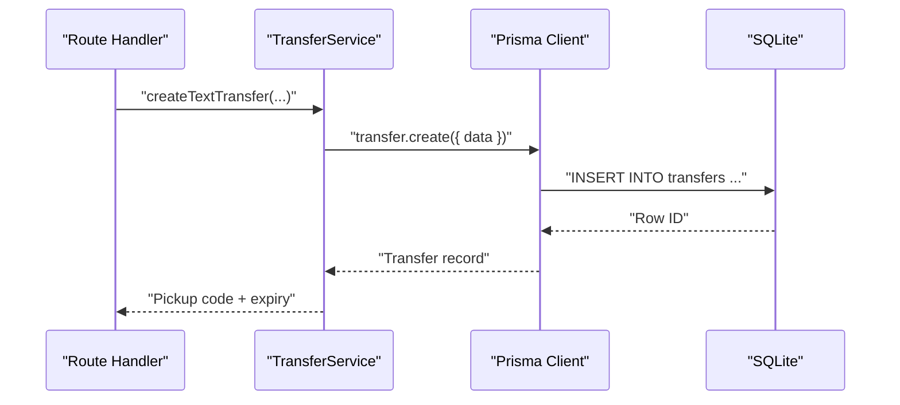
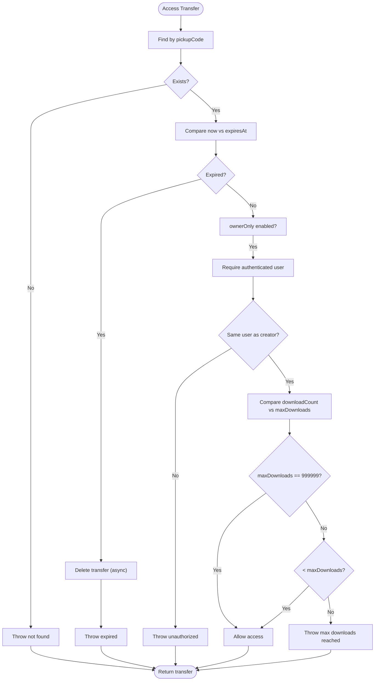
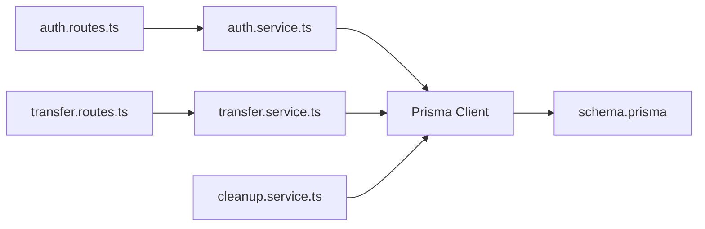

# Database Design

<cite>
**Referenced Files in This Document**
- [schema.prisma](file://packages/server/prisma/schema.prisma)
- [transfer.service.ts](file://packages/server/src/services/transfer.service.ts)
- [auth.service.ts](file://packages/server/src/services/auth.service.ts)
- [transfer.routes.ts](file://packages/server/src/routes/transfer.routes.ts)
- [auth.routes.ts](file://packages/server/src/routes/auth.routes.ts)
- [cleanup.service.ts](file://packages/server/src/services/cleanup.service.ts)
- [app.ts](file://packages/server/src/app.ts)
- [index.ts](file://packages/server/src/index.ts)
</cite>

## Table of Contents
1. [Introduction](#introduction)
2. [Project Structure](#project-structure)
3. [Core Components](#core-components)
4. [Architecture Overview](#architecture-overview)
5. [Detailed Component Analysis](#detailed-component-analysis)
6. [Dependency Analysis](#dependency-analysis)
7. [Performance Considerations](#performance-considerations)
8. [Troubleshooting Guide](#troubleshooting-guide)
9. [Conclusion](#conclusion)

## Introduction
This document describes the database design for Airportal’s Prisma ORM implementation. It covers the complete schema for Users and Transfers, including primary keys, foreign keys, indexes, and data types. It also documents migration strategies, schema evolution patterns, data integrity enforcement, Prisma client usage patterns, query optimization techniques, and performance considerations derived from the application’s service layer.

## Project Structure
Airportal uses Prisma with SQLite as the data source. The schema definition resides in a single Prisma file, and the application’s services orchestrate database operations via the Prisma client.

**Diagram sources**
- [schema.prisma:1-60](file://packages/server/prisma/schema.prisma#L1-L60)
- [auth.service.ts:1-88](file://packages/server/src/services/auth.service.ts#L1-L88)
- [transfer.service.ts:1-335](file://packages/server/src/services/transfer.service.ts#L1-L335)
- [cleanup.service.ts](file://packages/server/src/services/cleanup.service.ts)
- [auth.routes.ts](file://packages/server/src/routes/auth.routes.ts)
- [transfer.routes.ts](file://packages/server/src/routes/transfer.routes.ts)
- [app.ts](file://packages/server/src/app.ts)
- [index.ts](file://packages/server/src/index.ts)

**Section sources**
- [schema.prisma:1-60](file://packages/server/prisma/schema.prisma#L1-L60)
- [auth.service.ts:1-88](file://packages/server/src/services/auth.service.ts#L1-L88)
- [transfer.service.ts:1-335](file://packages/server/src/services/transfer.service.ts#L1-L335)
- [cleanup.service.ts](file://packages/server/src/services/cleanup.service.ts)
- [auth.routes.ts](file://packages/server/src/routes/auth.routes.ts)
- [transfer.routes.ts](file://packages/server/src/routes/transfer.routes.ts)
- [app.ts](file://packages/server/src/app.ts)
- [index.ts](file://packages/server/src/index.ts)

## Core Components
This section documents the database schema for Users and Transfers, including primary keys, foreign keys, indexes, and data types.

- Data source
  - Provider: sqlite
  - URL: environment variable DATABASE_URL

- User model
  - Fields
    - id: Int, primary key, autoincrement
    - username: String, unique
    - passwordHash: String (mapped to password_hash)
    - createdAt: DateTime (mapped to created_at), default now
  - Mapped table: users

- Transfer model
  - Fields
    - id: Int, primary key, autoincrement
    - pickupCode: String, unique (mapped to pickup_code)
    - contentType: String (mapped to content_type), values: text | file | folder
    - textContent: String? (mapped to text_content)
    - fileName: String? (mapped to file_name)
    - fileSize: Int? (mapped to file_size)
    - filePath: String? (mapped to file_path)
    - fileMimeType: String? (mapped to file_mime_type)
    - fileCount: Int? (mapped to file_count)
    - folderName: String? (mapped to folder_name)
    - userId: Int? (mapped to user_id)
    - user: Relation(User?) with onDelete: Cascade
    - downloadCount: Int (mapped to download_count), default 0
    - maxDownloads: Int (mapped to max_downloads), default 1
    - ownerOnly: Boolean (mapped to owner_only), default false
    - createdAt: DateTime (mapped to created_at), default now
    - expiresAt: DateTime (mapped to expires_at)
    - status: String, default "active"
  - Mapped table: transfers
  - Indexes
    - idx_pickup_code: on pickupCode
    - idx_expires_at: on expiresAt
    - idx_status: on status
    - idx_user_id: on userId

- Relationship
  - One-to-many: User.id -> Transfer.userId with cascade delete on User deletion

**Section sources**
- [schema.prisma:10-59](file://packages/server/prisma/schema.prisma#L10-L59)

## Architecture Overview
The application follows a layered architecture:
- HTTP routes receive requests and delegate to services.
- Services encapsulate business logic and interact with the Prisma client.
- Prisma client executes queries against the SQLite database defined in the schema.

**Diagram sources**
- [transfer.routes.ts](file://packages/server/src/routes/transfer.routes.ts)
- [auth.routes.ts](file://packages/server/src/routes/auth.routes.ts)
- [transfer.service.ts:1-335](file://packages/server/src/services/transfer.service.ts#L1-L335)
- [auth.service.ts:1-88](file://packages/server/src/services/auth.service.ts#L1-L88)
- [schema.prisma:1-60](file://packages/server/prisma/schema.prisma#L1-L60)

## Detailed Component Analysis

### User Model
- Identity and uniqueness
  - Primary key: id (autoincrement)
  - Unique constraint: username
- Mapped fields
  - passwordHash mapped to password_hash
  - createdAt mapped to created_at
- Mapped table: users

**Diagram sources**
- [schema.prisma:10-18](file://packages/server/prisma/schema.prisma#L10-L18)

**Section sources**
- [schema.prisma:10-18](file://packages/server/prisma/schema.prisma#L10-L18)

### Transfer Model
- Identity and uniqueness
  - Primary key: id (autoincrement)
  - Unique constraint: pickupCode
- Content variants
  - contentType supports three values: text, file, folder
  - Conditional fields:
    - textContent for contentType=text
    - fileName, fileSize, filePath, fileMimeType for contentType=file
    - fileCount, folderName for contentType=folder
- Ownership and visibility
  - userId links to User.id
  - user relation with onDelete=Cascade
  - ownerOnly flag restricts access to creator
- Access control and limits
  - downloadCount tracks usage
  - maxDownloads controls limit (special sentinel value 999999 means unlimited)
  - expiresAt enforces time-based expiration
  - status indicates lifecycle state (active, expired, deleted)
- Metadata and timestamps
  - createdAt defaults to now
  - Mapped fields: text_content, file_name, file_size, file_path, file_mime_type, file_count, folder_name, user_id, download_count, max_downloads, owner_only, created_at, expires_at

**Diagram sources**
- [schema.prisma:20-59](file://packages/server/prisma/schema.prisma#L20-L59)
- [schema.prisma:39-40](file://packages/server/prisma/schema.prisma#L39-L40)

**Section sources**
- [schema.prisma:20-59](file://packages/server/prisma/schema.prisma#L20-L59)

### Prisma Client Usage Patterns
- Initialization
  - Single PrismaClient instance per service module is created at module level.
- Queries in TransferService
  - Creation: create with data payload including computed fields and defaults.
  - Retrieval: findUnique by pickupCode with optional include of user.username.
  - Aggregation: aggregate sum of fileSize for quota checks on active file/folder transfers.
  - Updates: increment downloadCount; update status to expired; update by id.
  - Filtering: filter by userId, status, expiresAt, contentType.
- Queries in AuthService
  - Find unique by username; create user with hashed password; find by id with selective field selection.

**Diagram sources**
- [transfer.service.ts:31-76](file://packages/server/src/services/transfer.service.ts#L31-L76)
- [transfer.service.ts:56-66](file://packages/server/src/services/transfer.service.ts#L56-L66)
- [schema.prisma:20-59](file://packages/server/prisma/schema.prisma#L20-L59)

**Section sources**
- [transfer.service.ts:10-335](file://packages/server/src/services/transfer.service.ts#L10-L335)
- [auth.service.ts:8-88](file://packages/server/src/services/auth.service.ts#L8-L88)

### Data Integrity and Business Constraints
- Referential integrity
  - Transfer.userId references User.id with onDelete=Cascade.
- Uniqueness
  - User.username is unique.
  - Transfer.pickupCode is unique.
- Defaults
  - Transfer.downloadCount defaults to 0.
  - Transfer.maxDownloads defaults to 1.
  - Transfer.ownerOnly defaults to false.
  - Transfer.status defaults to "active".
  - Transfer.createdAt defaults to now.
- Validation and constraints enforced in services
  - Text length limit enforced before creating text transfers.
  - File size limit enforced before creating file/folder transfers.
  - Disk quota aggregation checked before accepting uploads.
  - Path traversal protection for file paths.
  - ownerOnly requires authenticated user and creator match.
  - Max downloads enforced with special sentinel for unlimited.
  - Expiration checked on access; expired items are deleted asynchronously.

**Diagram sources**
- [transfer.service.ts:200-240](file://packages/server/src/services/transfer.service.ts#L200-L240)
- [schema.prisma:40](file://packages/server/prisma/schema.prisma#L40)

**Section sources**
- [transfer.service.ts:40-48](file://packages/server/src/services/transfer.service.ts#L40-L48)
- [transfer.service.ts:92-106](file://packages/server/src/services/transfer.service.ts#L92-L106)
- [transfer.service.ts:171-198](file://packages/server/src/services/transfer.service.ts#L171-L198)
- [transfer.service.ts:217-231](file://packages/server/src/services/transfer.service.ts#L217-L231)
- [transfer.service.ts:200-240](file://packages/server/src/services/transfer.service.ts#L200-L240)
- [schema.prisma:40](file://packages/server/prisma/schema.prisma#L40)

### Migration Strategies and Schema Evolution
- Current state
  - The Prisma schema defines the full schema and indexes.
  - No migrations directory was present in the repository snapshot.
- Recommended patterns
  - Use Prisma Migrate for schema changes:
    - prisma migrate dev --name init
    - prisma migrate dev --name add_new_field
  - For production, use prisma migrate deploy to apply pending migrations safely.
  - Keep DATABASE_URL environment-driven and version-controlled via CI secrets.
- Index management
  - Add indexes for frequently filtered/sorted columns (e.g., userId, status, expiresAt).
  - Review composite indexes if query patterns grow more complex.

[No sources needed since this section provides general guidance]

### Query Optimization Techniques Observed in Application
- Selective fetching
  - Select only needed fields (e.g., user.username) to reduce payload size.
- Aggregation for quotas
  - Use aggregate with filters to compute totals efficiently.
- Indexed lookups
  - Lookup by unique pickupCode leverages the unique index.
- Conditional updates
  - Increment counters atomically to avoid race conditions.
- Pagination and ordering
  - Order by createdAt desc and limit results for user history.

**Section sources**
- [transfer.service.ts:200-204](file://packages/server/src/services/transfer.service.ts#L200-L204)
- [transfer.service.ts:177-183](file://packages/server/src/services/transfer.service.ts#L177-L183)
- [transfer.service.ts:249-262](file://packages/server/src/services/transfer.service.ts#L249-L262)

## Dependency Analysis
- Internal dependencies
  - Routes depend on services.
  - Services depend on Prisma client.
  - Cleanup service depends on Prisma client for periodic maintenance.
- External dependencies
  - Prisma client generated from schema.
  - SQLite driver configured via datasource.

**Diagram sources**
- [auth.routes.ts](file://packages/server/src/routes/auth.routes.ts)
- [transfer.routes.ts](file://packages/server/src/routes/transfer.routes.ts)
- [auth.service.ts:1-88](file://packages/server/src/services/auth.service.ts#L1-L88)
- [transfer.service.ts:1-335](file://packages/server/src/services/transfer.service.ts#L1-L335)
- [cleanup.service.ts](file://packages/server/src/services/cleanup.service.ts)
- [schema.prisma:1-60](file://packages/server/prisma/schema.prisma#L1-L60)

**Section sources**
- [auth.routes.ts](file://packages/server/src/routes/auth.routes.ts)
- [transfer.routes.ts](file://packages/server/src/routes/transfer.routes.ts)
- [auth.service.ts:1-88](file://packages/server/src/services/auth.service.ts#L1-L88)
- [transfer.service.ts:1-335](file://packages/server/src/services/transfer.service.ts#L1-L335)
- [cleanup.service.ts](file://packages/server/src/services/cleanup.service.ts)
- [schema.prisma:1-60](file://packages/server/prisma/schema.prisma#L1-L60)

## Performance Considerations
- Index utilization
  - pickupCode is unique and indexed; queries by pickupCode benefit from the index.
  - Additional indexes on expiresAt, status, and userId improve filtering and joins.
- Aggregation efficiency
  - Aggregate sums on fileSize with filters to compute quotas without scanning all rows unnecessarily.
- Atomic updates
  - Increment counters atomically to avoid contention and redundant reads.
- Query patterns
  - Prefer selective field retrieval and pagination for large result sets.
- Storage and cleanup
  - Periodic cleanup of expired transfers reduces table growth and improves query performance.

[No sources needed since this section provides general guidance]

## Troubleshooting Guide
- Common errors and causes
  - Username already exists during registration.
  - Invalid credentials during login.
  - Transfer not found or expired on access.
  - Max downloads reached.
  - ownerOnly requires authenticated user and creator match.
  - Disk quota exceeded when uploading.
- Logging and observability
  - Services log warnings and info events around failures and successful operations.
  - Cleanup service marks expired transfers and deletes associated files.
- Recovery actions
  - Re-generate unique pickup codes if collisions occur.
  - Verify DATABASE_URL and ensure the data directory exists.
  - Run migrations if schema drift is suspected.

**Section sources**
- [auth.service.ts:16-19](file://packages/server/src/services/auth.service.ts#L16-L19)
- [auth.service.ts:40-50](file://packages/server/src/services/auth.service.ts#L40-L50)
- [transfer.service.ts:206-215](file://packages/server/src/services/transfer.service.ts#L206-L215)
- [transfer.service.ts:227-231](file://packages/server/src/services/transfer.service.ts#L227-L231)
- [transfer.service.ts:217-225](file://packages/server/src/services/transfer.service.ts#L217-L225)
- [transfer.service.ts:186-190](file://packages/server/src/services/transfer.service.ts#L186-L190)

## Conclusion
The Airportal database design centers on two core models: User and Transfer, with clear primary keys, unique constraints, foreign keys, and indexes. Prisma client usage is concentrated in dedicated services that enforce business rules, manage access control, and optimize queries. Migration strategies should leverage Prisma Migrate, and ongoing performance improvements can be achieved through strategic indexing, atomic updates, and efficient aggregation patterns.