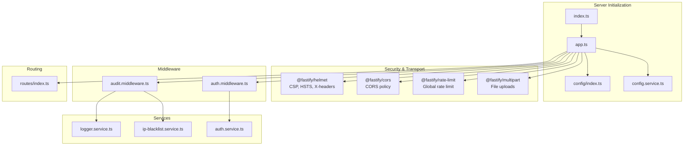
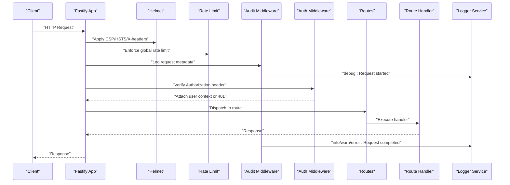
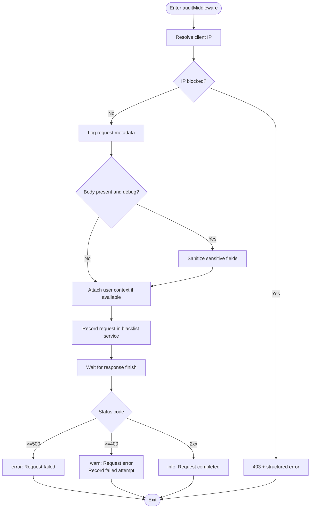
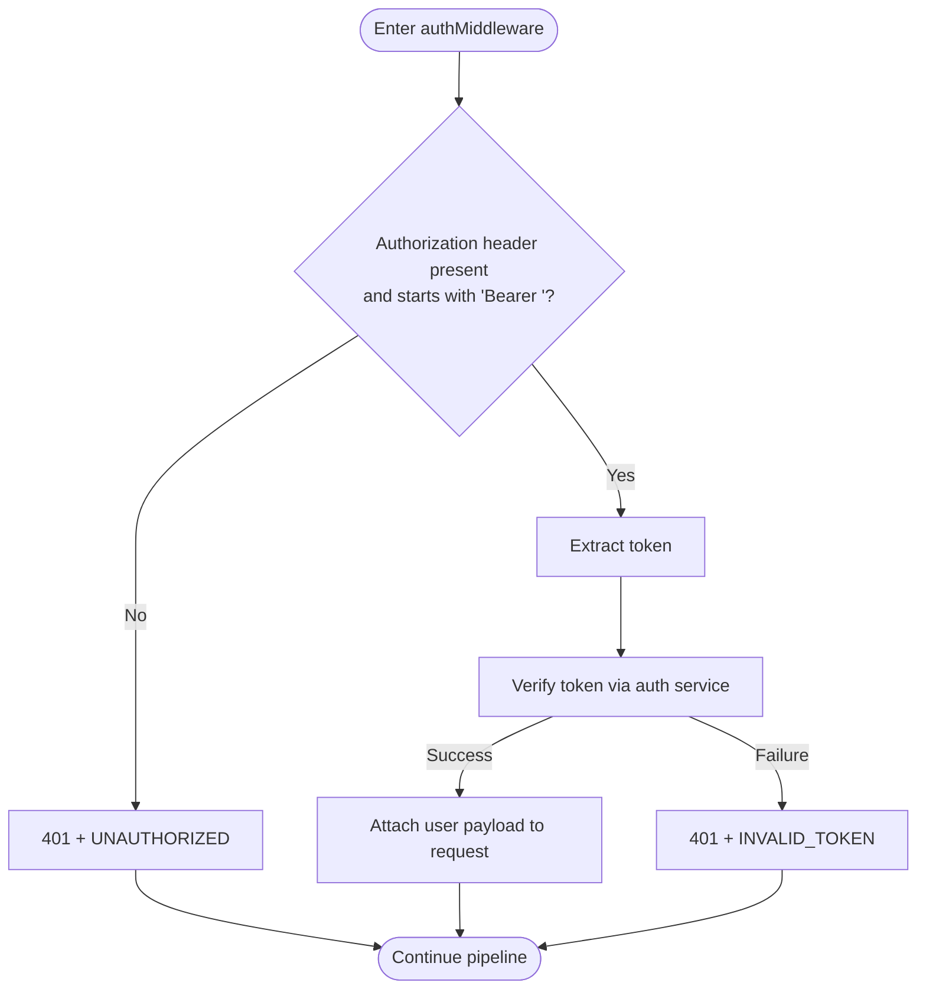
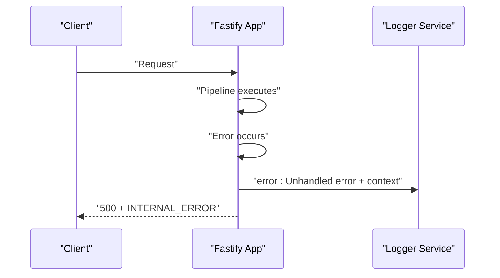
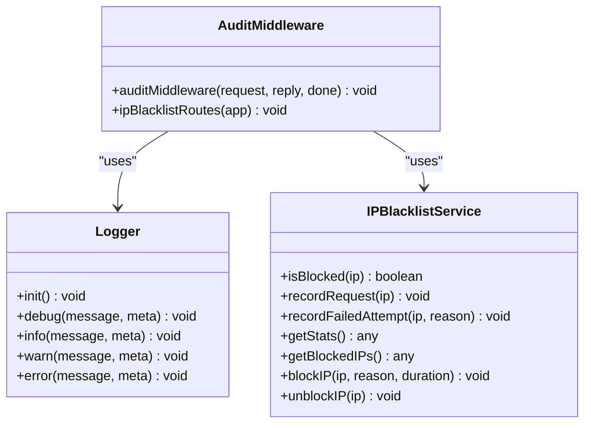
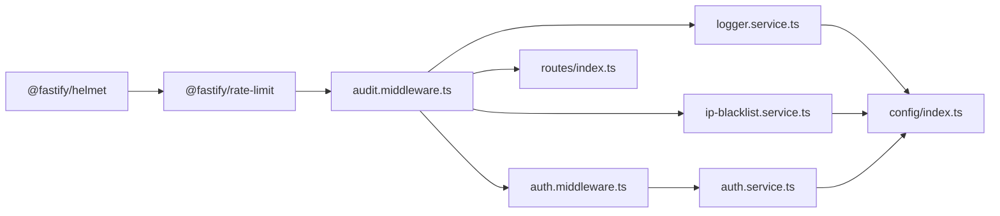

# Middleware and Error Handling

<cite>
**Referenced Files in This Document**
- [audit.middleware.ts](file://packages/server/src/middlewares/audit.middleware.ts)
- [auth.middleware.ts](file://packages/server/src/middlewares/auth.middleware.ts)
- [logger.service.ts](file://packages/server/src/services/logger.service.ts)
- [app.ts](file://packages/server/src/app.ts)
- [index.ts](file://packages/server/src/index.ts)
- [ip-blacklist.service.ts](file://packages/server/src/services/ip-blacklist.service.ts)
- [auth.service.ts](file://packages/server/src/services/auth.service.ts)
- [config.service.ts](file://packages/server/src/services/config.service.ts)
- [config/index.ts](file://packages/server/src/config/index.ts)
</cite>

## Table of Contents
1. [Introduction](#introduction)
2. [Project Structure](#project-structure)
3. [Core Components](#core-components)
4. [Architecture Overview](#architecture-overview)
5. [Detailed Component Analysis](#detailed-component-analysis)
6. [Dependency Analysis](#dependency-analysis)
7. [Performance Considerations](#performance-considerations)
8. [Troubleshooting Guide](#troubleshooting-guide)
9. [Conclusion](#conclusion)

## Introduction
This document provides comprehensive documentation for Airportal's backend middleware and error handling layers. It focuses on:
- Audit middleware for request logging, security event tracking, and compliance logging
- Authentication middleware for user authorization, session management, and access control
- Global error handling strategy, custom error types, and structured error responses
- Middleware execution order, request/response transformation patterns, and security middleware integration
- Logging strategies, audit trail generation, and debugging techniques for middleware-related issues

## Project Structure
Airportal's server is organized around a modular Fastify application with clear separation of concerns:
- Security and transport: Helmet, CORS, rate limiting, and multipart handling
- Request lifecycle: Audit and authentication middleware
- Routing: API routes registered under a prefix
- Error handling: Global error handler and route-level handlers
- Services: Authentication, IP blacklist, logging, and configuration

**Diagram sources**
- [index.ts:1-7](file://packages/server/src/index.ts#L1-L7)
- [app.ts:19-148](file://packages/server/src/app.ts#L19-L148)
- [audit.middleware.ts:48-124](file://packages/server/src/middlewares/audit.middleware.ts#L48-L124)
- [auth.middleware.ts:11-48](file://packages/server/src/middlewares/auth.middleware.ts#L11-L48)
- [logger.service.ts:14-78](file://packages/server/src/services/logger.service.ts#L14-L78)
- [ip-blacklist.service.ts](file://packages/server/src/services/ip-blacklist.service.ts)
- [auth.service.ts](file://packages/server/src/services/auth.service.ts)
- [config/index.ts](file://packages/server/src/config/index.ts)

**Section sources**
- [index.ts:1-7](file://packages/server/src/index.ts#L1-L7)
- [app.ts:19-148](file://packages/server/src/app.ts#L19-L148)

## Core Components
- Audit middleware: Enforces IP blacklist checks, sanitizes sensitive data, logs request lifecycle, and records security events
- Authentication middleware: Validates bearer tokens and attaches user context to requests
- Global error handler: Centralized error response formatting and logging
- Logger service: Structured console and file logging with configurable levels
- IP blacklist service: Runtime IP blocking, statistics, and failed attempt recording
- Auth service: Token verification used by authentication middleware

**Section sources**
- [audit.middleware.ts:48-124](file://packages/server/src/middlewares/audit.middleware.ts#L48-L124)
- [auth.middleware.ts:11-48](file://packages/server/src/middlewares/auth.middleware.ts#L11-L48)
- [app.ts:130-145](file://packages/server/src/app.ts#L130-L145)
- [logger.service.ts:14-78](file://packages/server/src/services/logger.service.ts#L14-L78)
- [ip-blacklist.service.ts](file://packages/server/src/services/ip-blacklist.service.ts)
- [auth.service.ts](file://packages/server/src/services/auth.service.ts)

## Architecture Overview
The middleware and error handling architecture integrates security, observability, and resilience early in the request lifecycle.

**Diagram sources**
- [app.ts:22-97](file://packages/server/src/app.ts#L22-L97)
- [audit.middleware.ts:48-124](file://packages/server/src/middlewares/audit.middleware.ts#L48-L124)
- [auth.middleware.ts:11-48](file://packages/server/src/middlewares/auth.middleware.ts#L11-L48)
- [logger.service.ts:14-78](file://packages/server/src/services/logger.service.ts#L14-L78)

## Detailed Component Analysis

### Audit Middleware
Responsibilities:
- IP blacklist enforcement and logging
- Request metadata capture (method, URL, IP, user agent)
- Optional body/query/params sanitization for sensitive fields
- User context injection (userId, username) when present
- Duration calculation and response status classification
- Security event recording for failures and IP blacklisting

Key behaviors:
- Sanitization of sensitive fields during debug-level logging
- Client IP resolution via proxy headers
- Asynchronous finish event logging with status classification
- Integration with IP blacklist service for stats and blocking

**Diagram sources**
- [audit.middleware.ts:48-124](file://packages/server/src/middlewares/audit.middleware.ts#L48-L124)
- [audit.middleware.ts:12-29](file://packages/server/src/middlewares/audit.middleware.ts#L12-L29)
- [audit.middleware.ts:34-43](file://packages/server/src/middlewares/audit.middleware.ts#L34-L43)
- [ip-blacklist.service.ts](file://packages/server/src/services/ip-blacklist.service.ts)
- [logger.service.ts:14-78](file://packages/server/src/services/logger.service.ts#L14-L78)

**Section sources**
- [audit.middleware.ts:48-124](file://packages/server/src/middlewares/audit.middleware.ts#L48-L124)
- [audit.middleware.ts:12-29](file://packages/server/src/middlewares/audit.middleware.ts#L12-L29)
- [audit.middleware.ts:34-43](file://packages/server/src/middlewares/audit.middleware.ts#L34-L43)

### Authentication Middleware
Responsibilities:
- Validate Authorization header presence and Bearer scheme
- Verify JWT via auth service and attach user payload to request
- Optional variant allows anonymous access with graceful failure

Behavior highlights:
- Structured 401 responses for missing/invalid tokens
- Token extraction and verification abstraction via auth service
- Type-safe user payload extension on Fastify request

**Diagram sources**
- [auth.middleware.ts:11-48](file://packages/server/src/middlewares/auth.middleware.ts#L11-L48)
- [auth.service.ts](file://packages/server/src/services/auth.service.ts)

**Section sources**
- [auth.middleware.ts:11-48](file://packages/server/src/middlewares/auth.middleware.ts#L11-L48)

### Global Error Handling
Responsibilities:
- Centralized unhandled error logging with request context
- Consistent 500 error response format
- Non-API 404 handling with SPA fallback behavior

Implementation details:
- Error handler logs error message, stack, URL, method, and IP
- Returns structured error response with internal error code
- NotFound handler serves SPA fallback for non-API routes in production

**Diagram sources**
- [app.ts:130-145](file://packages/server/src/app.ts#L130-L145)
- [logger.service.ts:14-78](file://packages/server/src/services/logger.service.ts#L14-L78)

**Section sources**
- [app.ts:130-145](file://packages/server/src/app.ts#L130-L145)

### Logging Strategy and Audit Trail
- Logger service supports debug/info/warn/error levels with configurable threshold
- Console output mirrors log level; optional file output with auto-created directory
- Audit middleware leverages structured logging for request lifecycle and security events
- IP blacklist service augments audit trail with block/unblock actions and statistics

**Diagram sources**
- [logger.service.ts:14-78](file://packages/server/src/services/logger.service.ts#L14-L78)
- [audit.middleware.ts:48-124](file://packages/server/src/middlewares/audit.middleware.ts#L48-L124)
- [ip-blacklist.service.ts](file://packages/server/src/services/ip-blacklist.service.ts)

**Section sources**
- [logger.service.ts:14-78](file://packages/server/src/services/logger.service.ts#L14-L78)
- [audit.middleware.ts:48-124](file://packages/server/src/middlewares/audit.middleware.ts#L48-L124)

## Dependency Analysis
- Security middleware order: Helmet (CSP/HSTS/X-headers) precedes rate limiting and audit middleware
- Audit middleware depends on configuration, logger, and IP blacklist service
- Authentication middleware depends on auth service for token verification
- Global error handler depends on logger for centralized logging

**Diagram sources**
- [app.ts:22-97](file://packages/server/src/app.ts#L22-L97)
- [audit.middleware.ts:48-124](file://packages/server/src/middlewares/audit.middleware.ts#L48-L124)
- [auth.middleware.ts:11-48](file://packages/server/src/middlewares/auth.middleware.ts#L11-L48)
- [logger.service.ts:14-78](file://packages/server/src/services/logger.service.ts#L14-L78)
- [ip-blacklist.service.ts](file://packages/server/src/services/ip-blacklist.service.ts)
- [auth.service.ts](file://packages/server/src/services/auth.service.ts)
- [config/index.ts](file://packages/server/src/config/index.ts)

**Section sources**
- [app.ts:22-97](file://packages/server/src/app.ts#L22-L97)
- [audit.middleware.ts:48-124](file://packages/server/src/middlewares/audit.middleware.ts#L48-L124)
- [auth.middleware.ts:11-48](file://packages/server/src/middlewares/auth.middleware.ts#L11-L48)

## Performance Considerations
- Audit middleware performs minimal synchronous work; sanitization is bounded by depth and only applied in debug mode
- IP blacklist operations occur on request completion and are designed for low overhead
- Global rate limit key generation considers forwarded-for header for accurate client identification
- Logger writes are asynchronous and gated by configured log level

[No sources needed since this section provides general guidance]

## Troubleshooting Guide
Common issues and resolutions:
- Authentication failures: Verify Authorization header format and token validity; check auth service configuration
- IP blocked responses: Confirm IP blacklist configuration and review audit logs for blocked attempts
- Excessive logging: Adjust log level in configuration to reduce verbosity
- Global rate limit exceeded: Review rate limit configuration and client-side retry policies
- 404 responses in production: Ensure non-API routes serve SPA fallback appropriately

Debugging techniques:
- Enable debug-level logging to inspect sanitized request bodies
- Inspect audit logs for request lifecycle and security events
- Use IP blacklist routes to query stats and blocked IPs
- Validate configuration with config service validation prior to startup

**Section sources**
- [audit.middleware.ts:129-186](file://packages/server/src/middlewares/audit.middleware.ts#L129-L186)
- [app.ts:150-162](file://packages/server/src/app.ts#L150-L162)
- [config.service.ts](file://packages/server/src/services/config.service.ts)

## Conclusion
Airportal’s middleware and error handling layers provide a robust foundation for secure, observable, and resilient request processing. The audit middleware ensures comprehensive logging and security event tracking, while the authentication middleware enforces access control with structured error responses. The global error handler centralizes error reporting and maintains consistent user-facing messages. Together, these components support compliance logging, incident investigation, and operational reliability.