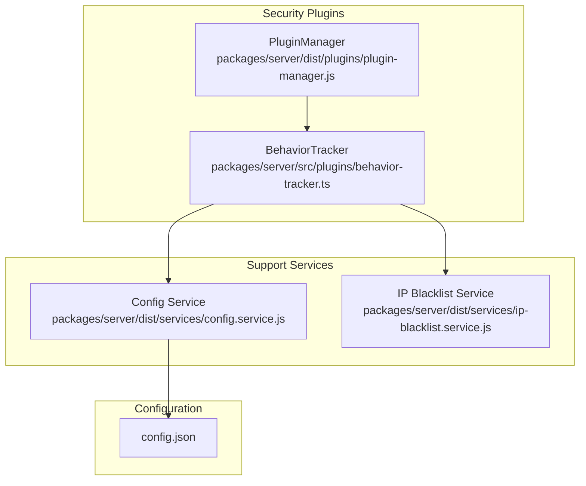
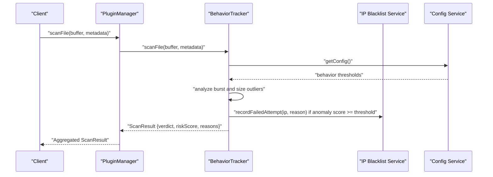
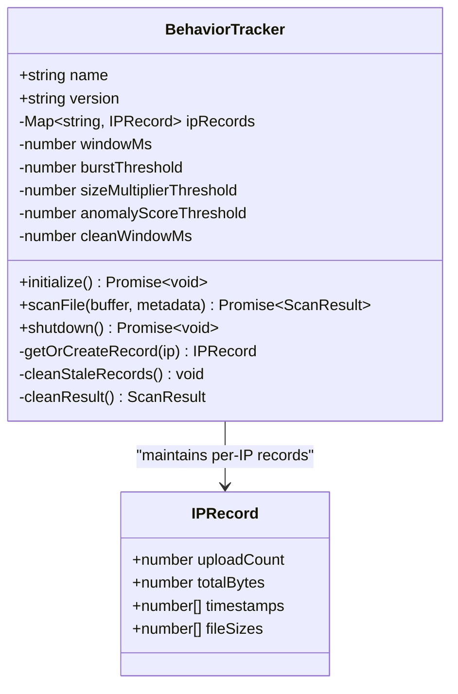
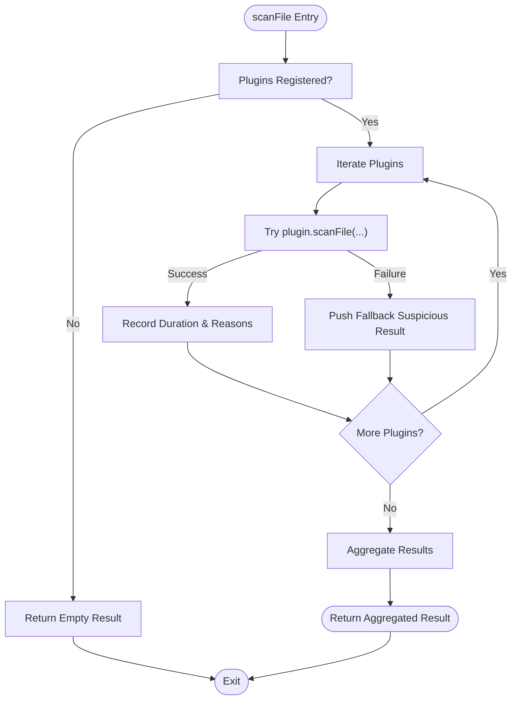
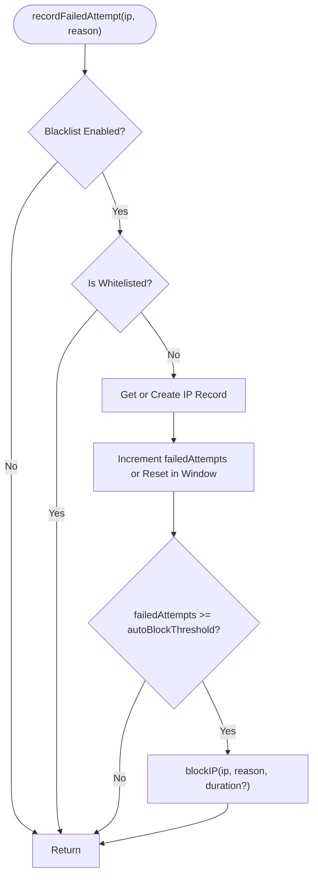
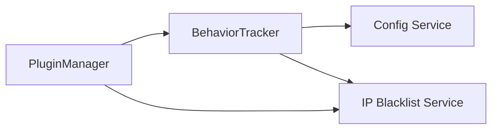

# Behavior Tracker

<cite>
**Referenced Files in This Document**
- [behavior-tracker.ts](file://packages/server/src/plugins/behavior-tracker.ts)
- [behavior-tracker.test.ts](file://packages/server/test/plugins/behavior-tracker.test.ts)
- [ip-blacklist.service.js](file://packages/server/dist/services/ip-blacklist.service.js)
- [plugin-manager.js](file://packages/server/dist/plugins/plugin-manager.js)
- [types.d.ts](file://packages/server/dist/plugins/types.d.ts)
- [config.service.js](file://packages/server/dist/services/config.service.js)
- [config.json](file://config.json)
</cite>

## Table of Contents
1. [Introduction](#introduction)
2. [Project Structure](#project-structure)
3. [Core Components](#core-components)
4. [Architecture Overview](#architecture-overview)
5. [Detailed Component Analysis](#detailed-component-analysis)
6. [Dependency Analysis](#dependency-analysis)
7. [Performance Considerations](#performance-considerations)
8. [Troubleshooting Guide](#troubleshooting-guide)
9. [Conclusion](#conclusion)
10. [Appendices](#appendices)

## Introduction
This document describes the BehaviorTracker security plugin system responsible for monitoring user file upload requests, detecting suspicious patterns, generating behavioral risk scores, and integrating with IP blacklisting and rate-limiting subsystems. It explains how the system analyzes request patterns, applies anomaly detection heuristics, and triggers automated security responses such as blacklisting and verdict assignment.

## Project Structure
The BehaviorTracker is part of a modular security plugin framework. Key elements include:
- BehaviorTracker plugin implementation
- Plugin manager orchestrating plugin lifecycle and aggregation
- IP blacklist service for automatic blocking decisions
- Configuration service exposing security-related tunables
- Test suite validating anomaly detection scenarios

**Diagram sources**
- [behavior-tracker.ts:12-136](file://packages/server/src/plugins/behavior-tracker.ts#L12-L136)
- [plugin-manager.js:1-152](file://packages/server/dist/plugins/plugin-manager.js#L1-L152)
- [ip-blacklist.service.js:1-177](file://packages/server/dist/services/ip-blacklist.service.js#L1-L177)
- [config.service.js:41-216](file://packages/server/dist/services/config.service.js#L41-L216)
- [config.json:1-102](file://config.json#L1-L102)

**Section sources**
- [behavior-tracker.ts:12-136](file://packages/server/src/plugins/behavior-tracker.ts#L12-L136)
- [plugin-manager.js:1-152](file://packages/server/dist/plugins/plugin-manager.js#L1-L152)
- [ip-blacklist.service.js:1-177](file://packages/server/dist/services/ip-blacklist.service.js#L1-L177)
- [config.service.js:41-216](file://packages/server/dist/services/config.service.js#L41-L216)
- [config.json:1-102](file://config.json#L1-L102)

## Core Components
- BehaviorTracker: Implements sliding-window-based anomaly detection for upload bursts and file size outliers, computes risk scores, and integrates with IP blacklisting.
- PluginManager: Manages plugin registration, initialization, lifecycle, and result aggregation across multiple security plugins.
- IP Blacklist Service: Tracks per-IP metrics, supports auto-blocking based on thresholds, and maintains blocked IP sets.
- Configuration Service: Centralizes security-related configuration including behavior tracker thresholds, rate limits, and IP blacklist policies.

**Section sources**
- [behavior-tracker.ts:12-136](file://packages/server/src/plugins/behavior-tracker.ts#L12-L136)
- [plugin-manager.js:1-152](file://packages/server/dist/plugins/plugin-manager.js#L1-L152)
- [ip-blacklist.service.js:1-177](file://packages/server/dist/services/ip-blacklist.service.js#L1-L177)
- [config.service.js:41-216](file://packages/server/dist/services/config.service.js#L41-L216)

## Architecture Overview
BehaviorTracker participates in the plugin pipeline and collaborates with the IP blacklist service and configuration system. The plugin manager coordinates scanning and result aggregation.

**Diagram sources**
- [plugin-manager.js:46-75](file://packages/server/dist/plugins/plugin-manager.js#L46-L75)
- [behavior-tracker.ts:23-36](file://packages/server/src/plugins/behavior-tracker.ts#L23-L36)
- [behavior-tracker.ts:38-108](file://packages/server/src/plugins/behavior-tracker.ts#L38-L108)
- [ip-blacklist.service.js:62-98](file://packages/server/dist/services/ip-blacklist.service.js#L62-L98)
- [config.service.js:201-206](file://packages/server/dist/services/config.service.js#L201-L206)

## Detailed Component Analysis

### BehaviorTracker
BehaviorTracker monitors per-IP upload activity and detects anomalies using two primary heuristics:
- Burst detection: Counts uploads within a sliding time window and penalizes high-frequency bursts.
- Size outlier detection: Flags unusually large files compared to recent average sizes.

It also integrates with IP blacklisting by recording failed attempts when anomaly scores exceed configured thresholds.

**Diagram sources**
- [behavior-tracker.ts:5-21](file://packages/server/src/plugins/behavior-tracker.ts#L5-L21)
- [behavior-tracker.ts:12-136](file://packages/server/src/plugins/behavior-tracker.ts#L12-L136)

#### Anomaly Detection Heuristics
- Burst detection: Computes recent uploads within the sliding window and assigns anomaly score proportional to excess uploads.
- Size outlier detection: Maintains recent file sizes, calculates recent average, and flags files exceeding the size multiplier threshold.
- Score capping: Risk score is capped at 100 to prevent overflow.

#### Verdict Assignment
- Clean: riskScore below anomaly threshold
- Suspicious: riskScore meets but not exceeds malicious threshold
- Malicious: riskScore reaches or exceeds malicious threshold

#### IP Blacklisting Integration
- When anomaly score meets or exceeds the configured threshold, the system records multiple failed attempts to the IP blacklist service, increasing the likelihood of auto-blocking.

**Section sources**
- [behavior-tracker.ts:38-108](file://packages/server/src/plugins/behavior-tracker.ts#L38-L108)
- [behavior-tracker.ts:80-85](file://packages/server/src/plugins/behavior-tracker.ts#L80-L85)

### Plugin Manager
The PluginManager coordinates plugin lifecycle and aggregates results from multiple security plugins. It measures individual plugin durations, deduplicates reasons, and selects the worst verdict among all plugins.

**Diagram sources**
- [plugin-manager.js:46-75](file://packages/server/dist/plugins/plugin-manager.js#L46-L75)
- [plugin-manager.js:102-140](file://packages/server/dist/plugins/plugin-manager.js#L102-L140)

**Section sources**
- [plugin-manager.js:13-45](file://packages/server/dist/plugins/plugin-manager.js#L13-L45)
- [plugin-manager.js:46-75](file://packages/server/dist/plugins/plugin-manager.js#L46-L75)
- [plugin-manager.js:102-140](file://packages/server/dist/plugins/plugin-manager.js#L102-L140)

### IP Blacklist Service
The IP Blacklist Service tracks per-IP request counts, failed attempts, and last-seen timestamps. It supports:
- Auto-block thresholds within a configurable time window
- Whitelisting and blacklisting lists
- Optional timed blocking with automatic unblocking
- Cleanup of stale records

**Diagram sources**
- [ip-blacklist.service.js:62-98](file://packages/server/dist/services/ip-blacklist.service.js#L62-L98)
- [ip-blacklist.service.js:102-122](file://packages/server/dist/services/ip-blacklist.service.js#L102-L122)

**Section sources**
- [ip-blacklist.service.js:6-18](file://packages/server/dist/services/ip-blacklist.service.js#L6-L18)
- [ip-blacklist.service.js:62-98](file://packages/server/dist/services/ip-blacklist.service.js#L62-L98)
- [ip-blacklist.service.js:102-122](file://packages/server/dist/services/ip-blacklist.service.js#L102-L122)
- [ip-blacklist.service.js:149-159](file://packages/server/dist/services/ip-blacklist.service.js#L149-L159)

### Configuration Options
BehaviorTracker thresholds and policies are configurable via environment variables and config.json. The configuration service resolves values with precedence: environment variables > config file > defaults.

Key behavior tracker configuration keys:
- security.securityPlugin.behavior.enabled
- security.securityPlugin.behavior.windowMs
- security.securityPlugin.behavior.burstThreshold
- security.securityPlugin.behavior.sizeMultiplierThreshold
- security.securityPlugin.behavior.anomalyScoreThreshold

Rate limiting and IP blacklist policies:
- security.rateLimit.globalMax/globalWindowMs
- security.rateLimit.uploadMax/uploadWindowMs
- security.ipBlacklist.enabled/autoBlockThreshold/autoBlockWindow/autoBlockDuration/whitelist/blacklist

These configurations are validated during startup to ensure sane values.

**Section sources**
- [config.service.js:76-92](file://packages/server/dist/services/config.service.js#L76-L92)
- [config.json:31-62](file://config.json#L31-L62)
- [config.service.js:184-196](file://packages/server/dist/services/config.service.js#L184-L196)

## Dependency Analysis
BehaviorTracker depends on:
- Configuration service for runtime thresholds
- IP Blacklist Service for auto-blocking integration
- PluginManager for orchestration and result aggregation

**Diagram sources**
- [behavior-tracker.ts:23-36](file://packages/server/src/plugins/behavior-tracker.ts#L23-L36)
- [behavior-tracker.ts:38-108](file://packages/server/src/plugins/behavior-tracker.ts#L38-L108)
- [plugin-manager.js:46-75](file://packages/server/dist/plugins/plugin-manager.js#L46-L75)
- [ip-blacklist.service.js:62-98](file://packages/server/dist/services/ip-blacklist.service.js#L62-L98)

**Section sources**
- [behavior-tracker.ts:1-4](file://packages/server/src/plugins/behavior-tracker.ts#L1-L4)
- [plugin-manager.js:1-12](file://packages/server/dist/plugins/plugin-manager.js#L1-L12)

## Performance Considerations
- Memory footprint: Per-IP records are stored in-memory with periodic cleanup of stale entries older than a configured window. This keeps memory bounded while preserving recent activity for detection.
- Computational cost: Each scan performs O(n) filtering over recent timestamps and maintains rolling statistics over recent file sizes. The cost scales with recent history length but remains efficient for typical traffic.
- Aggregation overhead: PluginManager measures and aggregates results across multiple plugins, adding minimal overhead proportional to the number of active plugins.

Recommendations:
- Tune windowMs and burstThreshold to balance sensitivity against false positives.
- Monitor anomalyScoreThreshold and sizeMultiplierThreshold to adapt to legitimate usage patterns.
- Consider adjusting cleanWindowMs to control memory retention.

**Section sources**
- [behavior-tracker.ts:114-128](file://packages/server/src/plugins/behavior-tracker.ts#L114-L128)
- [behavior-tracker.ts:17-21](file://packages/server/src/plugins/behavior-tracker.ts#L17-L21)
- [plugin-manager.js:52-74](file://packages/server/dist/plugins/plugin-manager.js#L52-L74)

## Troubleshooting Guide
Common issues and resolutions:
- No IP in metadata: BehaviorTracker returns a clean result without scoring or blacklisting.
- Configuration not initialized in tests: BehaviorTracker falls back to default thresholds when configuration is unavailable.
- Plugin failures: PluginManager treats plugin exceptions as suspicious results to maintain system resilience.
- Auto-block not triggering: Verify IP blacklist is enabled, autoBlockThreshold and autoBlockWindow are set appropriately, and the IP is not whitelisted.

Verification via tests:
- Normal uploads produce clean verdicts with zero risk score.
- Burst uploads trigger anomaly scoring and suspicious verdicts.
- Size outliers are flagged and contribute to anomaly scoring.
- Shutdown clears internal counters, resetting subsequent scans.

**Section sources**
- [behavior-tracker.ts:23-36](file://packages/server/src/plugins/behavior-tracker.ts#L23-L36)
- [behavior-tracker.ts:130-132](file://packages/server/src/plugins/behavior-tracker.ts#L130-L132)
- [plugin-manager.js:59-72](file://packages/server/dist/plugins/plugin-manager.js#L59-L72)
- [behavior-tracker.test.ts:34-155](file://packages/server/test/plugins/behavior-tracker.test.ts#L34-L155)

## Conclusion
BehaviorTracker provides lightweight, sliding-window-based anomaly detection for file upload patterns, assigning risk scores and integrating with IP blacklisting to support automated security responses. Its configuration-driven design enables operators to tune sensitivity and integrate with broader rate-limiting and audit systems.

## Appendices

### Configuration Reference
BehaviorTracker configuration keys:
- behavior.enabled: Enable/disable the plugin
- behavior.windowMs: Sliding window duration for burst detection
- behavior.burstThreshold: Upload count threshold within window to trigger anomaly
- behavior.sizeMultiplierThreshold: Multiplier for file size outlier detection
- behavior.anomalyScoreThreshold: Threshold to classify suspicious vs. malicious

Related security policies:
- security.rateLimit.globalMax/globalWindowMs
- security.rateLimit.uploadMax/uploadWindowMs
- security.ipBlacklist.enabled/autoBlockThreshold/autoBlockWindow/autoBlockDuration/whitelist/blacklist

**Section sources**
- [config.service.js:76-92](file://packages/server/dist/services/config.service.js#L76-L92)
- [config.json:24-30](file://config.json#L24-L30)
- [config.json:11-19](file://config.json#L11-L19)