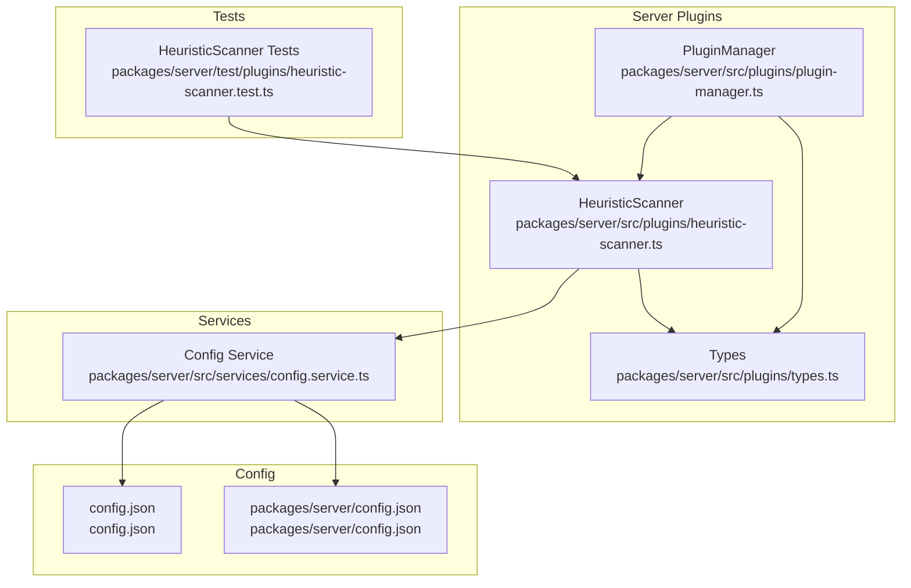
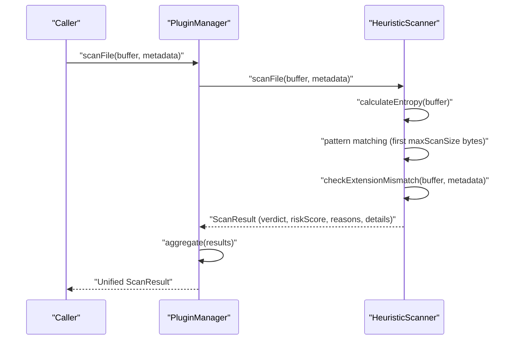
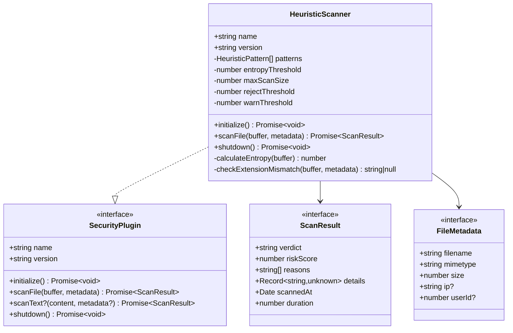
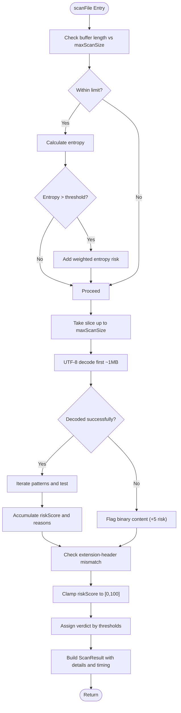
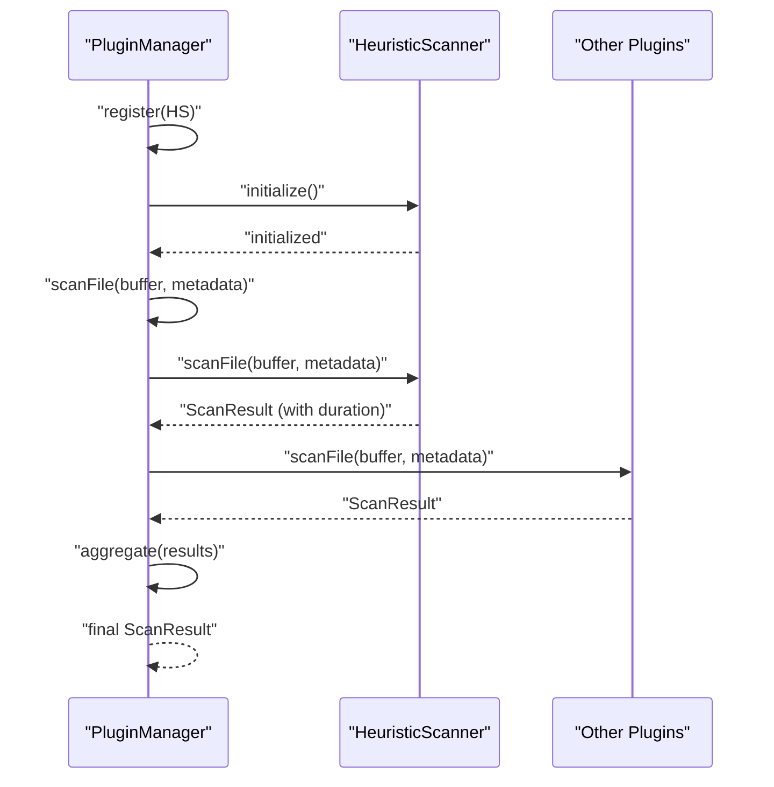
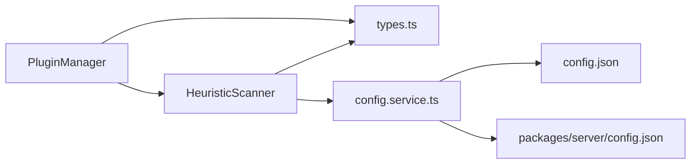

# Heuristic Scanner

<cite>
**Referenced Files in This Document**
- [heuristic-scanner.ts](file://packages/server/src/plugins/heuristic-scanner.ts)
- [plugin-manager.ts](file://packages/server/src/plugins/plugin-manager.ts)
- [types.ts](file://packages/server/src/plugins/types.ts)
- [config.service.ts](file://packages/server/src/services/config.service.ts)
- [config.json](file://config.json)
- [heuristic-scanner.test.ts](file://packages/server/test/plugins/heuristic-scanner.test.ts)
</cite>

## Table of Contents
1. [Introduction](#introduction)
2. [Project Structure](#project-structure)
3. [Core Components](#core-components)
4. [Architecture Overview](#architecture-overview)
5. [Detailed Component Analysis](#detailed-component-analysis)
6. [Dependency Analysis](#dependency-analysis)
7. [Performance Considerations](#performance-considerations)
8. [Troubleshooting Guide](#troubleshooting-guide)
9. [Conclusion](#conclusion)

## Introduction
This document describes the HeuristicScanner security plugin implementation. It explains the file content analysis algorithms, malicious pattern detection mechanisms, and risk scoring methodology used by the heuristic scanner. It also covers supported file types, detection patterns for malware signatures, suspicious code constructs, and behavioral indicators; the scanning pipeline including buffer processing, pattern matching, and result generation; integration with the PluginManager via scanFile and scanText; examples of detected threat patterns; false positive handling; tuning parameters for different security contexts; and performance considerations, memory usage optimization, and scalability aspects.

## Project Structure
The HeuristicScanner resides in the server package under the plugins subsystem. It integrates with the PluginManager to orchestrate scanning across multiple security plugins. Configuration is centralized in the configuration service and JSON configuration files.

**Diagram sources**
- [heuristic-scanner.ts](file://packages/server/src/plugins/heuristic-scanner.ts)
- [plugin-manager.ts](file://packages/server/src/plugins/plugin-manager.ts)
- [types.ts](file://packages/server/src/plugins/types.ts)
- [config.service.ts](file://packages/server/src/services/config.service.ts)
- [config.json](file://config.json)
- [heuristic-scanner.test.ts](file://packages/server/test/plugins/heuristic-scanner.test.ts)

**Section sources**
- [heuristic-scanner.ts](file://packages/server/src/plugins/heuristic-scanner.ts)
- [plugin-manager.ts](file://packages/server/src/plugins/plugin-manager.ts)
- [types.ts](file://packages/server/src/plugins/types.ts)
- [config.service.ts](file://packages/server/src/services/config.service.ts)
- [config.json](file://config.json)
- [heuristic-scanner.test.ts](file://packages/server/test/plugins/heuristic-scanner.test.ts)

## Core Components
- HeuristicScanner: Implements SecurityPlugin with scanFile and optional scanText. Performs entropy analysis, pattern matching, extension-header mismatch checks, and produces a ScanResult with riskScore and reasons.
- PluginManager: Manages plugin lifecycle and orchestrates scanning across registered plugins, aggregating results into a unified verdict.
- Types: Defines SecurityPlugin contract, ScanResult shape, and FileMetadata structure.
- Config Service: Loads and validates configuration, including heuristic plugin parameters and environment overrides.
- Configuration JSON: Provides default heuristic thresholds, pattern sets, and limits.

Key capabilities:
- Risk scoring bounded at 0–100 with thresholds determining clean/suspicious/malicious verdicts.
- Pattern weights contribute additively to risk score; early termination when score nears 100.
- Entropy-based anomaly detection for encrypted/binary-like content.
- Extension-header mismatch detection for common disguises (e.g., txt as PE/ELF/Mach-O).
- Optional text scanning via scanText for content-only flows.

**Section sources**
- [heuristic-scanner.ts](file://packages/server/src/plugins/heuristic-scanner.ts)
- [plugin-manager.ts](file://packages/server/src/plugins/plugin-manager.ts)
- [types.ts](file://packages/server/src/plugins/types.ts)
- [config.service.ts](file://packages/server/src/services/config.service.ts)
- [config.json](file://config.json)

## Architecture Overview
The scanning pipeline is invoked through PluginManager.scanFile, which delegates to each registered plugin’s scanFile. HeuristicScanner applies entropy, pattern matching, and extension-header checks, then aggregates results with PluginManager.

**Diagram sources**
- [plugin-manager.ts](file://packages/server/src/plugins/plugin-manager.ts)
- [heuristic-scanner.ts](file://packages/server/src/plugins/heuristic-scanner.ts)

## Detailed Component Analysis

### HeuristicScanner Implementation
Responsibilities:
- Initialize from configuration (entropy threshold, max scan size, thresholds, and pattern set).
- Analyze file entropy for high-disorder content.
- Match configured regular expressions against text content.
- Detect file extension/header mismatches.
- Produce a normalized ScanResult with timing and details.

Key behaviors:
- Entropy analysis: Computes Shannon entropy per byte histogram and adds weighted risk when exceeding threshold.
- Pattern matching: Scans UTF-8 decoded text slice up to maxScanSize; each match adds pattern weight; capped at 100.
- Extension-header mismatch: Checks for executable headers in non-executable files.
- Verdict assignment: Based on thresholds; supports optional scanText if implemented by plugin.

**Diagram sources**
- [heuristic-scanner.ts](file://packages/server/src/plugins/heuristic-scanner.ts)
- [types.ts](file://packages/server/src/plugins/types.ts)

**Section sources**
- [heuristic-scanner.ts](file://packages/server/src/plugins/heuristic-scanner.ts)
- [types.ts](file://packages/server/src/plugins/types.ts)

### Pattern Detection Mechanisms
Patterns are defined as name/regex/weight tuples. Matching uses case-insensitive and multiline flags against a UTF-8 decoded slice of the buffer. Detected categories include:
- Code execution: eval, dynamic evaluation constructs
- Shell/system execution: exec, passthru, shell_exec, popen, os.system, subprocess, child_process
- PowerShell and command-line utilities: powershell, Invoke-Expression, IEX, Start-Process, cmd.exe
- SQL injection and XSS vectors: destructive keywords, script tags, event handlers, javascript URIs
- Destructive commands: rm -rf, del /f, format c:
- Base64 decoding and character decoding: base64_decode, atob, fromCharCode, unescape, decodeURIComponent
- Download-and-execute patterns: wget/curl piped to sh/bash
- Reverse shells and network-based execution: nc switches, /dev/tcp, bash -i >&

Weighted contributions increase risk score; scores are capped at 100.

**Section sources**
- [heuristic-scanner.ts](file://packages/server/src/plugins/heuristic-scanner.ts)
- [config.json](file://config.json)

### Risk Scoring Methodology
- Initialization: Loads thresholds and pattern set from configuration; falls back to defaults if none provided.
- Entropy: Adds risk proportional to excess over threshold; capped contribution.
- Patterns: Sum of pattern weights; early exit when score nears 100.
- Extension-header mismatch: Adds fixed risk and reason.
- Finalization: Clamps risk to [0, 100]; assigns verdict based on thresholds; attaches details (entropy, file size) and timestamps.

**Section sources**
- [heuristic-scanner.ts](file://packages/server/src/plugins/heuristic-scanner.ts)

### Supported File Types and Behavioral Indicators
- Supported content: Any file processed as a byte stream; text decoding attempts occur for pattern matching.
- Behavioral indicators: High information entropy, extension-header mismatch, presence of suspicious constructs.
- File type detection: Extension-header mismatch detection targets common disguises (e.g., txt as PE/ELF/Mach-O).

**Section sources**
- [heuristic-scanner.ts](file://packages/server/src/plugins/heuristic-scanner.ts)

### Scanning Pipeline Details
- Buffer processing: Limits scanning to maxScanSize bytes; decodes first megabyte-like chunk to UTF-8 for pattern matching.
- Pattern matching: Iterates configured patterns; skips invalid regexes; accumulates reasons.
- Result generation: Builds ScanResult with verdict, riskScore, reasons, details, timestamps, and duration.

**Diagram sources**
- [heuristic-scanner.ts](file://packages/server/src/plugins/heuristic-scanner.ts)

**Section sources**
- [heuristic-scanner.ts](file://packages/server/src/plugins/heuristic-scanner.ts)

### Integration with PluginManager
- Registration: Plugins are registered by name/version; duplicates are skipped.
- Initialization: Each plugin’s initialize is awaited; failures logged and rethrown.
- Shutdown: Each plugin’s shutdown is called; failures logged.
- scanFile orchestration: For each plugin, duration is measured; exceptions are caught and treated as suspicious results; aggregation selects worst verdict and deduplicates reasons.
- scanText: Only plugins implementing scanText are invoked; results aggregated similarly.

**Diagram sources**
- [plugin-manager.ts](file://packages/server/src/plugins/plugin-manager.ts)
- [heuristic-scanner.ts](file://packages/server/src/plugins/heuristic-scanner.ts)

**Section sources**
- [plugin-manager.ts](file://packages/server/src/plugins/plugin-manager.ts)
- [heuristic-scanner.ts](file://packages/server/src/plugins/heuristic-scanner.ts)

### Examples of Detected Threat Patterns
- eval-based code execution triggers code_exec pattern.
- PHP shell execution functions trigger shell_exec pattern.
- Destructive commands trigger destructive_cmd pattern.
- High-entropy content triggers entropy-based reason.
- Executable headers in txt files trigger extension-header mismatch.
- XSS-related constructs trigger xss_vector pattern.
- Aggregation caps risk at 100 and elevates to malicious when threshold exceeded.

**Section sources**
- [heuristic-scanner.test.ts](file://packages/server/test/plugins/heuristic-scanner.test.ts)
- [heuristic-scanner.ts](file://packages/server/src/plugins/heuristic-scanner.ts)

### False Positive Handling and Tuning
- Thresholds: tune rejectRiskThreshold and warnRiskThreshold to adjust sensitivity.
- Pattern weights: reduce weights for benign but suspicious-looking constructs.
- Pattern set: customize patterns array to reflect environment-specific risks.
- maxScanSize: larger scans increase CPU and memory; smaller sizes reduce overhead but may miss patterns outside the slice.
- Entropy threshold: raise to reduce false positives from compressed/binary-like content; lower to catch more obfuscated content.
- Extension-header mismatch: useful for catching disguised executables; may require adjustments for legitimate mixed-content files.

Environment variables override configuration values for heuristic parameters.

**Section sources**
- [config.service.ts](file://packages/server/src/services/config.service.ts)
- [config.json](file://config.json)
- [heuristic-scanner.ts](file://packages/server/src/plugins/heuristic-scanner.ts)

## Dependency Analysis
- HeuristicScanner depends on:
  - Types for SecurityPlugin, ScanResult, FileMetadata contracts.
  - Config service for runtime configuration loading and validation.
- PluginManager depends on:
  - Types for plugin contracts.
  - Logger service (external) for diagnostics.
- Configuration service depends on:
  - Environment variables and JSON config files for values and defaults.

**Diagram sources**
- [heuristic-scanner.ts](file://packages/server/src/plugins/heuristic-scanner.ts)
- [plugin-manager.ts](file://packages/server/src/plugins/plugin-manager.ts)
- [types.ts](file://packages/server/src/plugins/types.ts)
- [config.service.ts](file://packages/server/src/services/config.service.ts)
- [config.json](file://config.json)
- [packages/server/config.json](file://packages/server/config.json)

**Section sources**
- [heuristic-scanner.ts](file://packages/server/src/plugins/heuristic-scanner.ts)
- [plugin-manager.ts](file://packages/server/src/plugins/plugin-manager.ts)
- [types.ts](file://packages/server/src/plugins/types.ts)
- [config.service.ts](file://packages/server/src/services/config.service.ts)
- [config.json](file://config.json)
- [packages/server/config.json](file://packages/server/config.json)

## Performance Considerations
- Memory usage:
  - Scanning is limited to maxScanSize bytes; entropy calculation uses a fixed 256-bin frequency table.
  - UTF-8 decoding occurs on a bounded slice (~1MB) to avoid excessive memory allocation.
- CPU cost:
  - Entropy computation is O(n) with a small constant-time loop over 256 bins.
  - Pattern matching iterates over configured patterns; regex compilation happens per pattern.
- Scalability:
  - Parallelism: PluginManager invokes plugins sequentially; consider concurrent invocation if needed.
  - Large files: maxScanSize bounds processing; very large files are truncated for performance.
  - Regex robustness: Invalid patterns are skipped to prevent crashes and maintain throughput.
- I/O:
  - No disk I/O; operates purely on in-memory buffers.

Recommendations:
- Adjust maxScanSize for workload characteristics.
- Reduce pattern count or complexity for high-throughput environments.
- Monitor entropyThreshold and pattern weights to balance sensitivity and performance.

**Section sources**
- [heuristic-scanner.ts](file://packages/server/src/plugins/heuristic-scanner.ts)
- [plugin-manager.ts](file://packages/server/src/plugins/plugin-manager.ts)
- [config.service.ts](file://packages/server/src/services/config.service.ts)

## Troubleshooting Guide
Common issues and resolutions:
- Unexpected clean verdicts:
  - Verify entropyThreshold and pattern weights; consider raising thresholds for stricter checks.
  - Confirm maxScanSize captures the suspicious content region.
- False positives:
  - Lower pattern weights or remove benign-matching patterns.
  - Increase entropyThreshold to filter out compressed/binary-like content.
- Plugin failures during scan:
  - PluginManager treats failures as suspicious results; inspect logs for plugin-specific errors.
- Extension-header mismatches:
  - Validate file metadata; ensure filename extensions reflect actual content.
- Large files:
  - If legitimate suspicious content appears after maxScanSize, increase maxScanSize cautiously.

Validation and defaults:
- Configuration validation enforces minimums and logical constraints (e.g., thresholds ordering).
- Environment variables override configuration values for quick tuning.

**Section sources**
- [plugin-manager.ts](file://packages/server/src/plugins/plugin-manager.ts)
- [config.service.ts](file://packages/server/src/services/config.service.ts)
- [heuristic-scanner.ts](file://packages/server/src/plugins/heuristic-scanner.ts)

## Conclusion
The HeuristicScanner provides a configurable, efficient, and extensible heuristic-based security scanning capability. Its entropy analysis, pattern matching, and extension-header mismatch detection form a practical baseline for identifying suspicious content. Through PluginManager integration, results are aggregated consistently, enabling layered security strategies. With tunable thresholds, pattern sets, and scan limits, the scanner adapts to diverse environments while maintaining performance and scalability.