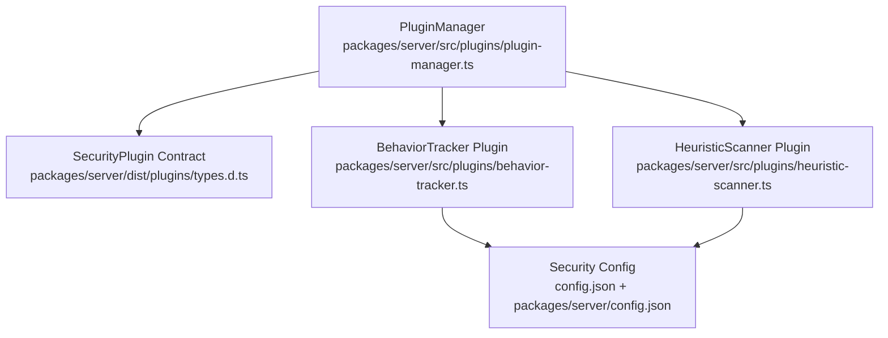
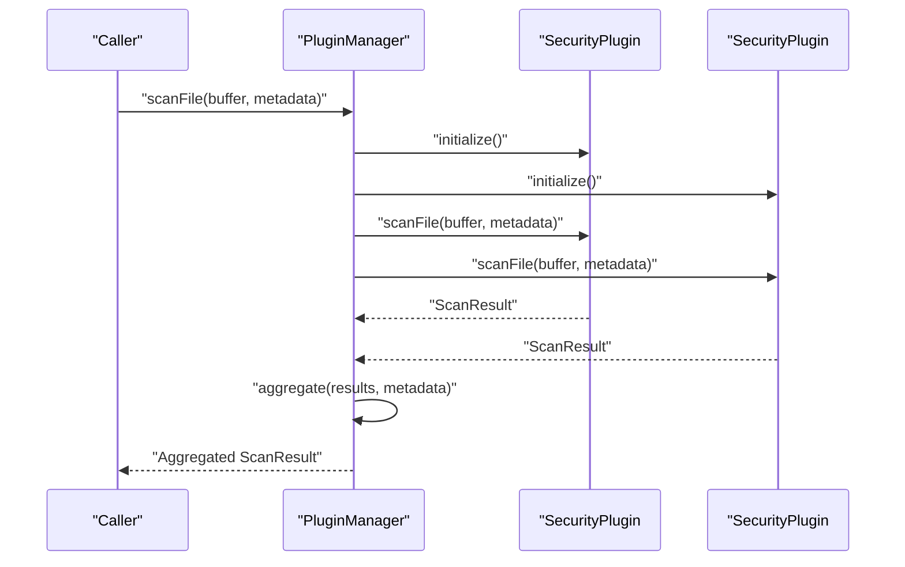
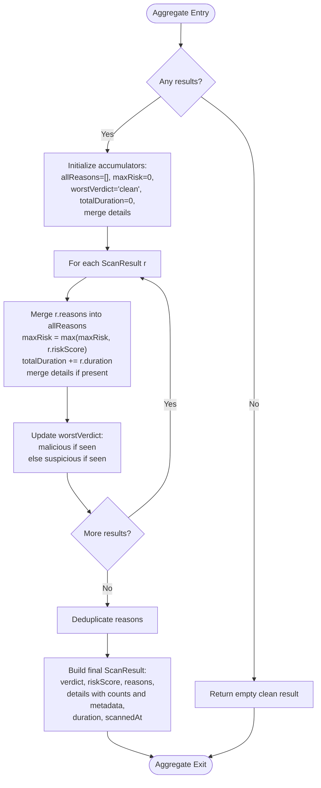
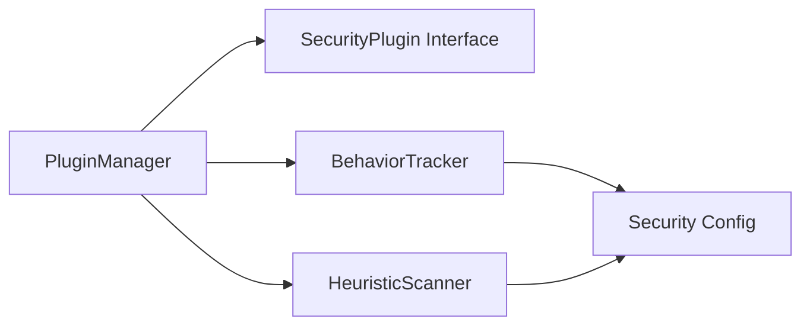

# Plugin Manager Core

<cite>
**Referenced Files in This Document**
- [plugin-manager.ts](file://packages/server/src/plugins/plugin-manager.ts)
- [types.d.ts](file://packages/server/dist/plugins/types.d.ts)
- [behavior-tracker.ts](file://packages/server/src/plugins/behavior-tracker.ts)
- [heuristic-scanner.ts](file://packages/server/src/plugins/heuristic-scanner.ts)
- [plugin-manager.test.ts](file://packages/server/test/plugins/plugin-manager.test.ts)
- [config.json](file://config.json)
- [config.json](file://packages/server/config.json)
</cite>

## Table of Contents
1. [Introduction](#introduction)
2. [Project Structure](#project-structure)
3. [Core Components](#core-components)
4. [Architecture Overview](#architecture-overview)
5. [Detailed Component Analysis](#detailed-component-analysis)
6. [Dependency Analysis](#dependency-analysis)
7. [Performance Considerations](#performance-considerations)
8. [Troubleshooting Guide](#troubleshooting-guide)
9. [Conclusion](#conclusion)
10. [Appendices](#appendices)

## Introduction
This document describes the PluginManager core system that powers Airportal’s security architecture. It covers the PluginManager class implementation, the SecurityPlugin interface specification, plugin registration and lifecycle management, aggregation of multiple plugin results, error handling and recovery patterns, and practical integration guidance. It also includes configuration, debugging techniques, and troubleshooting steps for plugin management.

## Project Structure
Airportal organizes its server-side security plugins under a dedicated plugins folder. The core PluginManager orchestrates plugin registration, initialization, scanning, and shutdown. Two concrete plugins demonstrate the interface: a behavioral tracker and a heuristic scanner. Tests validate the manager’s behavior and aggregation logic.



**Diagram sources**
- [plugin-manager.ts:1-167](file://packages/server/src/plugins/plugin-manager.ts#L1-L167)
- [types.d.ts:1-24](file://packages/server/dist/plugins/types.d.ts#L1-L24)
- [behavior-tracker.ts:1-136](file://packages/server/src/plugins/behavior-tracker.ts#L1-L136)
- [heuristic-scanner.ts:1-173](file://packages/server/src/plugins/heuristic-scanner.ts#L1-L173)
- [config.json:1-102](file://config.json#L1-L102)
- [config.json:1-95](file://packages/server/config.json#L1-L95)

**Section sources**
- [plugin-manager.ts:1-167](file://packages/server/src/plugins/plugin-manager.ts#L1-L167)
- [types.d.ts:1-24](file://packages/server/dist/plugins/types.d.ts#L1-L24)
- [behavior-tracker.ts:1-136](file://packages/server/src/plugins/behavior-tracker.ts#L1-L136)
- [heuristic-scanner.ts:1-173](file://packages/server/src/plugins/heuristic-scanner.ts#L1-L173)
- [config.json:1-102](file://config.json#L1-L102)
- [config.json:1-95](file://packages/server/config.json#L1-L95)

## Core Components
- PluginManager: Central coordinator for plugin lifecycle and result aggregation.
- SecurityPlugin interface: Defines the contract for all security plugins.
- Concrete Plugins: BehaviorTracker and HeuristicScanner implement the interface.
- Configuration: Security plugin settings are loaded from configuration files.

Key responsibilities:
- Register plugins and prevent duplicates.
- Initialize and shutdown plugins with robust error logging.
- Execute file and text scans, collect timing and metadata.
- Aggregate results into a unified verdict and risk score.
- Provide introspection via getPlugins().

**Section sources**
- [plugin-manager.ts:4-167](file://packages/server/src/plugins/plugin-manager.ts#L4-L167)
- [types.d.ts:16-23](file://packages/server/dist/plugins/types.d.ts#L16-L23)
- [behavior-tracker.ts:12-136](file://packages/server/src/plugins/behavior-tracker.ts#L12-L136)
- [heuristic-scanner.ts:25-173](file://packages/server/src/plugins/heuristic-scanner.ts#L25-L173)

## Architecture Overview
The PluginManager acts as a façade around multiple SecurityPlugin instances. It ensures each plugin is initialized before scanning, collects results, and aggregates them into a single ScanResult. Plugins may optionally implement scanText for textual content evaluation.



**Diagram sources**
- [plugin-manager.ts:17-79](file://packages/server/src/plugins/plugin-manager.ts#L17-L79)
- [types.d.ts:8-15](file://packages/server/dist/plugins/types.d.ts#L8-L15)

## Detailed Component Analysis

### PluginManager Class
Responsibilities:
- Registration: Prevents duplicate plugin names and logs registration events.
- Initialization: Calls initialize() on each plugin; stops and logs on failure.
- Shutdown: Calls shutdown() on each plugin; continues despite errors.
- Scanning:
  - scanFile: Executes all plugins, measures duration, attaches scannedAt, and aggregates results.
  - scanText: Filters plugins implementing scanText, executes them, and aggregates results.
- Aggregation: Combines multiple ScanResult objects into a single result with:
  - Verdict: highest severity among results (malicious > suspicious > clean).
  - Risk score: maximum risk score observed.
  - Reasons: deduplicated list of reasons.
  - Details: merged details plus pluginCount, fileSize, fileName.
  - Duration: total duration across all plugins.
- Introspection: getPlugins() returns plugin metadata.

Error handling:
- Initialization failures abort immediately with error propagation.
- Per-plugin scan failures are logged and treated conservatively as suspicious results.
- Shutdown errors are logged but do not prevent cleanup.

```mermaid
classDiagram
class PluginManager {
-plugins : SecurityPlugin[]
-initialized : boolean
+register(plugin) void
+initialize() Promise~void~
+shutdown() Promise~void~
+scanFile(buffer, metadata) Promise~ScanResult~
+scanText(content, metadata) Promise~ScanResult~
+getPlugins() ReadonlyArray~{name, version}~
-aggregate(results, metadata) ScanResult
-emptyResult() ScanResult
}
class SecurityPlugin {
<<interface>>
+name : string
+version : string
+initialize() Promise~void~
+scanFile(buffer, metadata) Promise~ScanResult~
+scanText?(content, metadata) Promise~ScanResult~
+shutdown() Promise~void~
}
class BehaviorTracker {
+name : string
+version : string
+initialize() Promise~void~
+scanFile(buffer, metadata) Promise~ScanResult~
+shutdown() Promise~void~
}
class HeuristicScanner {
+name : string
+version : string
+initialize() Promise~void~
+scanFile(buffer, metadata) Promise~ScanResult~
+shutdown() Promise~void~
}
PluginManager --> SecurityPlugin : "manages"
BehaviorTracker ..|> SecurityPlugin
HeuristicScanner ..|> SecurityPlugin
```

**Diagram sources**
- [plugin-manager.ts:4-167](file://packages/server/src/plugins/plugin-manager.ts#L4-L167)
- [types.d.ts:16-23](file://packages/server/dist/plugins/types.d.ts#L16-L23)
- [behavior-tracker.ts:12-136](file://packages/server/src/plugins/behavior-tracker.ts#L12-L136)
- [heuristic-scanner.ts:25-173](file://packages/server/src/plugins/heuristic-scanner.ts#L25-L173)

**Section sources**
- [plugin-manager.ts:8-167](file://packages/server/src/plugins/plugin-manager.ts#L8-L167)
- [types.d.ts:16-23](file://packages/server/dist/plugins/types.d.ts#L16-L23)

### SecurityPlugin Interface Specification
Contract definition:
- name and version: plugin identity and version.
- initialize(): asynchronous setup (e.g., load configuration).
- scanFile(buffer, metadata): file scanning returning ScanResult.
- scanText?(content, metadata): optional textual scanning.
- shutdown(): asynchronous teardown.

ScanResult fields:
- verdict: clean | suspicious | malicious.
- riskScore: numeric risk level.
- reasons: array of human-readable reasons.
- details?: arbitrary metadata.
- scannedAt: timestamp of scan completion.
- duration: milliseconds taken to execute the plugin.

FileMetadata fields:
- filename, mimetype, size.
- Optional: ip, userId.

**Section sources**
- [types.d.ts:1-24](file://packages/server/dist/plugins/types.d.ts#L1-L24)

### Plugin Aggregation Mechanism
Aggregation logic:
- Verdict selection:
  - If any plugin reports malicious, the result is malicious.
  - Else if any plugin reports suspicious, the result is suspicious.
  - Otherwise, clean.
- Risk score: maximum riskScore across all results.
- Reasons: deduplicated union of reasons.
- Details: merged details plus pluginCount, fileSize, fileName.
- Duration: sum of durations across all plugins.
- Empty input: returns a clean result with zero riskScore and zero duration.



**Diagram sources**
- [plugin-manager.ts:110-153](file://packages/server/src/plugins/plugin-manager.ts#L110-L153)

**Section sources**
- [plugin-manager.ts:110-153](file://packages/server/src/plugins/plugin-manager.ts#L110-L153)

### Concrete Plugins

#### BehaviorTracker
Purpose: Detect anomalous upload behavior by IP address using sliding windows and thresholds.

Key behaviors:
- Tracks per-IP metrics: upload count, total bytes, timestamps, and recent file sizes.
- Computes anomaly score based on burst detection and size outliers.
- On high anomaly score, records failed attempts via IP blacklist service.
- Supports configurable thresholds via security configuration.

Lifecycle:
- initialize(): reads behavior-related configuration.
- scanFile(): evaluates metadata.ip; returns clean if missing.
- shutdown(): clears internal state.

**Section sources**
- [behavior-tracker.ts:12-136](file://packages/server/src/plugins/behavior-tracker.ts#L12-L136)
- [config.json:55-61](file://config.json#L55-L61)
- [config.json:55-61](file://packages/server/config.json#L55-L61)

#### HeuristicScanner
Purpose: Heuristic file scanning using entropy analysis, regex pattern matching, and extension mismatch detection.

Key behaviors:
- Calculates Shannon entropy for files up to a configured maximum size.
- Applies a set of regex patterns weighted by suspiciousness.
- Flags mismatches between declared and detected file types.
- Supports configurable thresholds and custom pattern sets via security configuration.

Lifecycle:
- initialize(): loads configuration and defaults.
- scanFile(): computes riskScore, reasons, and entropy details.
- shutdown(): cleans up internal state.

**Section sources**
- [heuristic-scanner.ts:25-173](file://packages/server/src/plugins/heuristic-scanner.ts#L25-L173)
- [config.json:34-54](file://config.json#L34-L54)
- [config.json:34-54](file://packages/server/config.json#L34-L54)

### Integration with Security Middleware Stack
While the provided files do not show explicit middleware integration, PluginManager is designed to be used within the server’s security pipeline:
- Initialize plugins during server startup.
- Call scanFile or scanText in appropriate middleware or route handlers.
- Use aggregated results to decide policy (e.g., block, flag, allow).
- Shutdown plugins gracefully on server shutdown.

Practical integration steps:
- Import pluginManager and register concrete plugins.
- Call initialize() before accepting requests.
- In upload routes, call scanFile(buffer, metadata) and enforce the returned verdict.
- In text-input handlers, call scanText(content, metadata) when applicable.
- On shutdown, call shutdown() to release resources.

**Section sources**
- [plugin-manager.ts:17-47](file://packages/server/src/plugins/plugin-manager.ts#L17-L47)

## Dependency Analysis
- PluginManager depends on:
  - SecurityPlugin interface for type safety.
  - Concrete plugins (BehaviorTracker, HeuristicScanner) for runtime behavior.
  - Configuration for tuning plugin behavior.
  - Logging service for operational visibility.



**Diagram sources**
- [plugin-manager.ts:1-167](file://packages/server/src/plugins/plugin-manager.ts#L1-L167)
- [behavior-tracker.ts:1-136](file://packages/server/src/plugins/behavior-tracker.ts#L1-L136)
- [heuristic-scanner.ts:1-173](file://packages/server/src/plugins/heuristic-scanner.ts#L1-L173)
- [config.json:31-61](file://config.json#L31-L61)

**Section sources**
- [plugin-manager.ts:1-167](file://packages/server/src/plugins/plugin-manager.ts#L1-L167)
- [behavior-tracker.ts:1-136](file://packages/server/src/plugins/behavior-tracker.ts#L1-L136)
- [heuristic-scanner.ts:1-173](file://packages/server/src/plugins/heuristic-scanner.ts#L1-L173)
- [config.json:31-61](file://config.json#L31-L61)

## Performance Considerations
- Concurrency: Plugins are executed sequentially. For high throughput, consider parallelization with bounded concurrency and timeouts.
- Scanning limits: HeuristicScanner caps scan size and uses early exits when risk reaches thresholds.
- Timing: Each plugin’s duration is recorded; aggregation sums durations for total latency.
- Memory: BehaviorTracker maintains per-IP records; ensure cleanup policies prevent unbounded growth.
- Configuration tuning: Adjust thresholds and scan sizes to balance accuracy and performance.

[No sources needed since this section provides general guidance]

## Troubleshooting Guide
Common issues and resolutions:
- Duplicate plugin registration: The manager skips plugins with existing names. Verify plugin names and versions.
- Initialization failures: Failures halt initialization. Check plugin-specific configuration and dependencies.
- Scan exceptions: Exceptions in scanFile are caught, logged, and treated as suspicious results. Review plugin logs and fix underlying causes.
- Missing IP metadata: BehaviorTracker returns clean when IP is absent. Ensure metadata includes IP for behavioral checks.
- No plugins supporting scanText: scanText returns clean when no plugin implements it. Register a plugin with scanText or avoid calling it.
- Verdict not as expected: Inspect aggregated reasons and details; adjust plugin thresholds or disable conflicting plugins.

Debugging techniques:
- Enable detailed logging around plugin initialization and scanning.
- Inspect ScanResult details for pluginCount, fileSize, and fileName.
- Temporarily disable plugins to isolate problematic ones.
- Validate configuration values for securityPlugin.heuristic and securityPlugin.behavior.

**Section sources**
- [plugin-manager.ts:8-47](file://packages/server/src/plugins/plugin-manager.ts#L8-L47)
- [plugin-manager.ts:49-104](file://packages/server/src/plugins/plugin-manager.ts#L49-L104)
- [plugin-manager.test.ts:40-248](file://packages/server/test/plugins/plugin-manager.test.ts#L40-L248)

## Conclusion
The PluginManager provides a robust foundation for Airportal’s security plugin ecosystem. It enforces a clear SecurityPlugin contract, manages plugin lifecycles, and aggregates results into a unified, actionable outcome. With configurable thresholds and comprehensive logging, it supports both accurate threat detection and operational observability.

[No sources needed since this section summarizes without analyzing specific files]

## Appendices

### Practical Examples

- Registering and initializing plugins:
  - Instantiate concrete plugins and register them with PluginManager.
  - Call initialize() before accepting traffic.
  - Example paths:
    - [plugin-manager.ts:8-32](file://packages/server/src/plugins/plugin-manager.ts#L8-L32)
    - [behavior-tracker.ts:12-36](file://packages/server/src/plugins/behavior-tracker.ts#L12-L36)
    - [heuristic-scanner.ts:25-54](file://packages/server/src/plugins/heuristic-scanner.ts#L25-L54)

- Executing file scans:
  - Prepare FileMetadata and call scanFile(buffer, metadata).
  - Enforce the returned verdict in middleware or routes.
  - Example paths:
    - [plugin-manager.ts:49-79](file://packages/server/src/plugins/plugin-manager.ts#L49-L79)
    - [types.d.ts:1-7](file://packages/server/dist/plugins/types.d.ts#L1-L7)

- Executing text scans:
  - Ensure at least one plugin implements scanText.
  - Call scanText(content, metadata) and act on the result.
  - Example paths:
    - [plugin-manager.ts:81-104](file://packages/server/src/plugins/plugin-manager.ts#L81-L104)
    - [types.d.ts](file://packages/server/dist/plugins/types.d.ts#L21)

- Shutdown and cleanup:
  - Call shutdown() during graceful server termination.
  - Example paths:
    - [plugin-manager.ts:34-47](file://packages/server/src/plugins/plugin-manager.ts#L34-L47)

- Configuration:
  - Tune heuristic and behavior plugin parameters via security config.
  - Example paths:
    - [config.json:34-61](file://config.json#L34-L61)
    - [config.json:34-61](file://packages/server/config.json#L34-L61)

**Section sources**
- [plugin-manager.ts:8-47](file://packages/server/src/plugins/plugin-manager.ts#L8-L47)
- [plugin-manager.ts:49-104](file://packages/server/src/plugins/plugin-manager.ts#L49-L104)
- [types.d.ts:1-24](file://packages/server/dist/plugins/types.d.ts#L1-L24)
- [config.json:34-61](file://config.json#L34-L61)
- [config.json:34-61](file://packages/server/config.json#L34-L61)