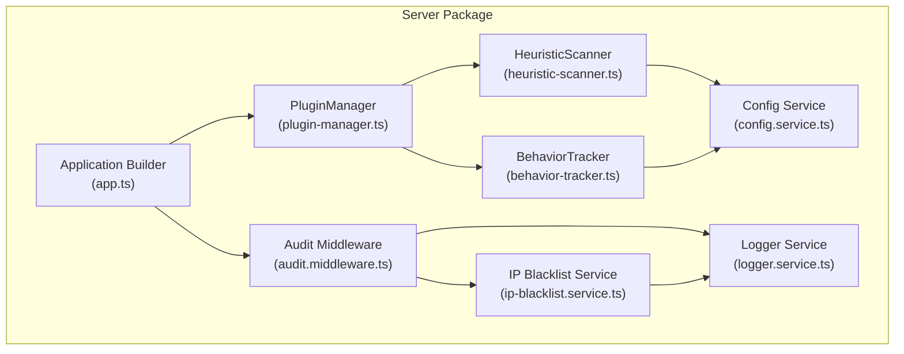
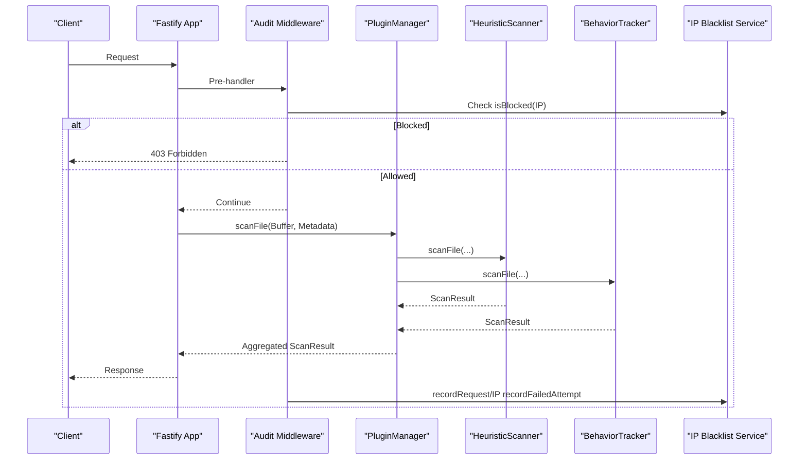
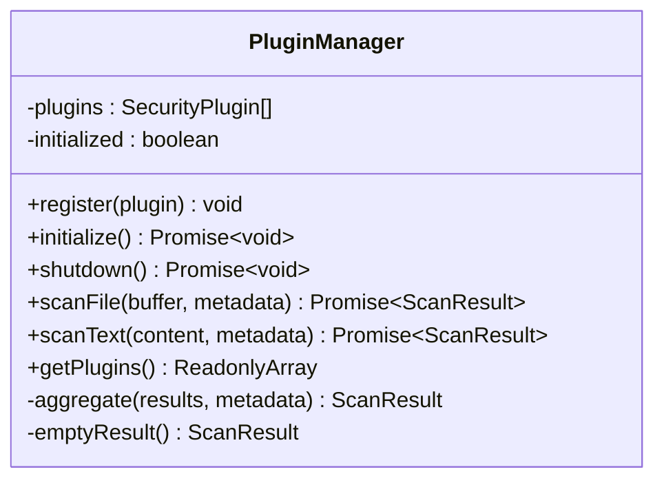
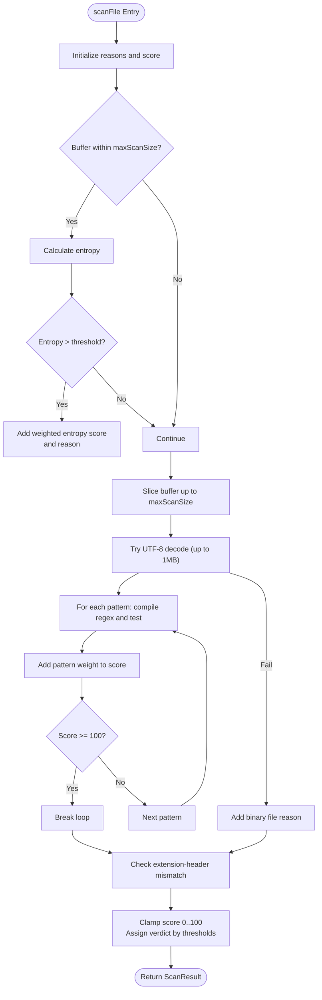
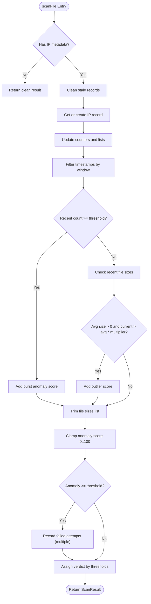
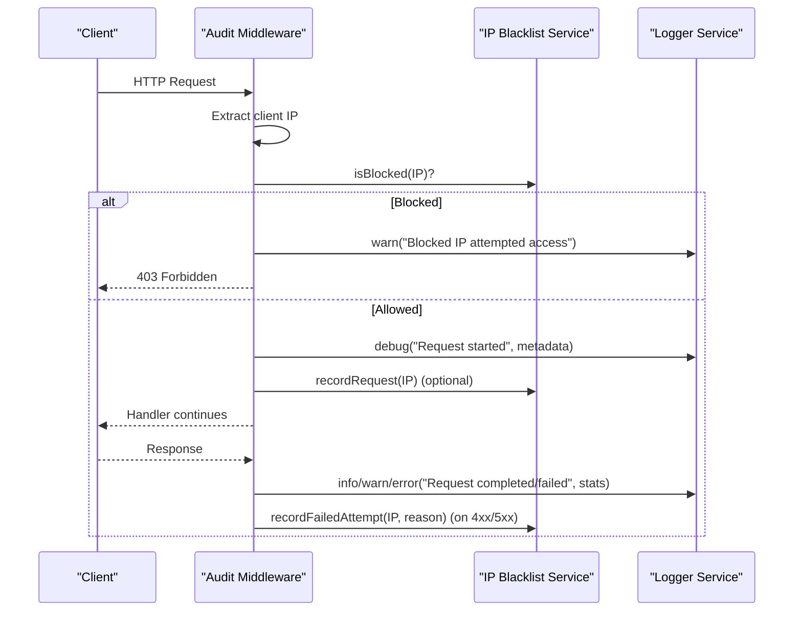
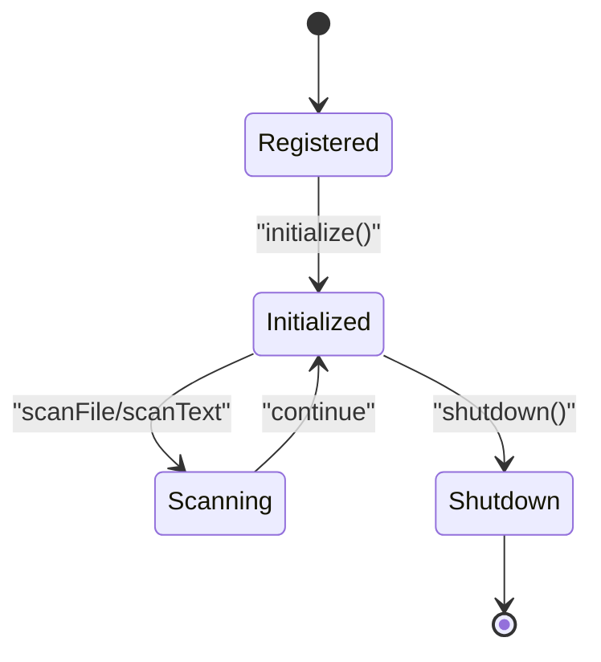
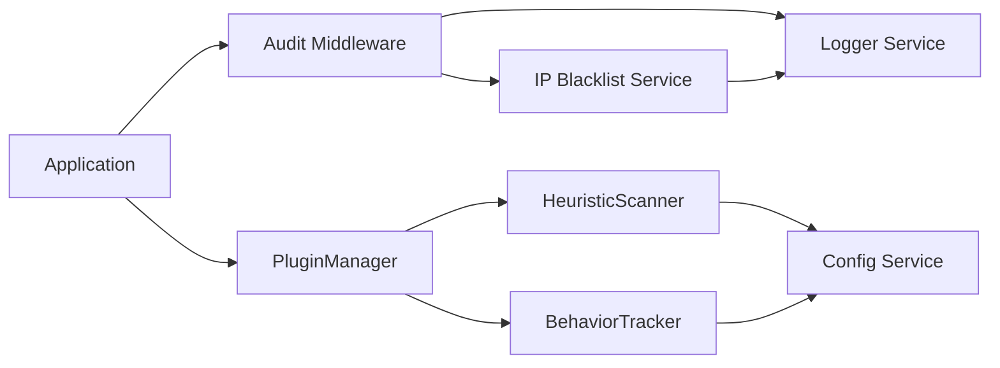

# Security Plugin System

<cite>
**Referenced Files in This Document**
- [plugin-manager.ts](file://packages/server/src/plugins/plugin-manager.ts)
- [heuristic-scanner.ts](file://packages/server/src/plugins/heuristic-scanner.ts)
- [behavior-tracker.ts](file://packages/server/src/plugins/behavior-tracker.ts)
- [audit.middleware.ts](file://packages/server/src/middlewares/audit.middleware.ts)
- [ip-blacklist.service.ts](file://packages/server/src/services/ip-blacklist.service.ts)
- [logger.service.ts](file://packages/server/src/services/logger.service.ts)
- [config.service.ts](file://packages/server/src/services/config.service.ts)
- [app.ts](file://packages/server/src/app.ts)
</cite>

## Table of Contents
1. [Introduction](#introduction)
2. [Project Structure](#project-structure)
3. [Core Components](#core-components)
4. [Architecture Overview](#architecture-overview)
5. [Detailed Component Analysis](#detailed-component-analysis)
6. [Dependency Analysis](#dependency-analysis)
7. [Performance Considerations](#performance-considerations)
8. [Troubleshooting Guide](#troubleshooting-guide)
9. [Conclusion](#conclusion)
10. [Appendices](#appendices)

## Introduction
This document describes Airportal's extensible security plugin system. It covers the PluginManager implementation, the security plugin interface specification, plugin lifecycle management, the heuristic scanner for file content analysis and risk scoring, the behavior tracker for request pattern analysis and anomaly detection, IP blacklisting mechanisms, security middleware stack, audit logging, and security event handling. It also provides plugin development guidelines, configuration options, performance considerations, and troubleshooting guidance.

## Project Structure
The security plugin system is implemented in the server package under the plugins directory, with supporting services for configuration, logging, and IP blacklisting. The middleware stack integrates security checks early in the request lifecycle.

**Diagram sources**
- [plugin-manager.ts:1-167](file://packages/server/src/plugins/plugin-manager.ts#L1-L167)
- [heuristic-scanner.ts:1-173](file://packages/server/src/plugins/heuristic-scanner.ts#L1-L173)
- [behavior-tracker.ts:1-136](file://packages/server/src/plugins/behavior-tracker.ts#L1-L136)
- [audit.middleware.ts:1-187](file://packages/server/src/middlewares/audit.middleware.ts#L1-L187)
- [ip-blacklist.service.ts:1-215](file://packages/server/src/services/ip-blacklist.service.ts#L1-L215)
- [config.service.ts:1-364](file://packages/server/src/services/config.service.ts#L1-L364)
- [logger.service.ts:1-78](file://packages/server/src/services/logger.service.ts#L1-L78)
- [app.ts:1-205](file://packages/server/src/app.ts#L1-L205)

**Section sources**
- [plugin-manager.ts:1-167](file://packages/server/src/plugins/plugin-manager.ts#L1-L167)
- [audit.middleware.ts:1-187](file://packages/server/src/middlewares/audit.middleware.ts#L1-L187)
- [ip-blacklist.service.ts:1-215](file://packages/server/src/services/ip-blacklist.service.ts#L1-L215)
- [config.service.ts:1-364](file://packages/server/src/services/config.service.ts#L1-L364)
- [logger.service.ts:1-78](file://packages/server/src/services/logger.service.ts#L1-L78)
- [app.ts:1-205](file://packages/server/src/app.ts#L1-L205)

## Core Components
- PluginManager: Central orchestrator for registering, initializing, scanning, and shutting down security plugins. It aggregates results from multiple plugins into a unified ScanResult.
- HeuristicScanner: Implements file content analysis using entropy calculation, regex-based pattern matching, and file header validation to compute risk scores and verdicts.
- BehaviorTracker: Tracks per-IP upload patterns, detects bursts and outliers, computes anomaly scores, and triggers IP blacklisting via the IP blacklist service.
- Audit Middleware: Enforces IP blacklisting, sanitizes sensitive data, logs request lifecycle events, and records failed attempts for automatic blacklisting.
- IP Blacklist Service: Manages IP records, supports manual blocking/unblocking, auto-block thresholds, and statistics.
- Logger Service: Provides structured logging with configurable levels and optional file output.
- Config Service: Defines security plugin configurations and environment variable overrides.

**Section sources**
- [plugin-manager.ts:1-167](file://packages/server/src/plugins/plugin-manager.ts#L1-L167)
- [heuristic-scanner.ts:1-173](file://packages/server/src/plugins/heuristic-scanner.ts#L1-L173)
- [behavior-tracker.ts:1-136](file://packages/server/src/plugins/behavior-tracker.ts#L1-L136)
- [audit.middleware.ts:1-187](file://packages/server/src/middlewares/audit.middleware.ts#L1-L187)
- [ip-blacklist.service.ts:1-215](file://packages/server/src/services/ip-blacklist.service.ts#L1-L215)
- [logger.service.ts:1-78](file://packages/server/src/services/logger.service.ts#L1-L78)
- [config.service.ts:1-364](file://packages/server/src/services/config.service.ts#L1-L364)

## Architecture Overview
Airportal's security architecture is layered:
- Application bootstrap initializes configuration and services.
- Middleware stack enforces IP blacklisting and audit logging before route handlers.
- PluginManager coordinates multiple security plugins during file scans.
- Services handle persistent state (IP records) and logging.

**Diagram sources**
- [audit.middleware.ts:48-124](file://packages/server/src/middlewares/audit.middleware.ts#L48-L124)
- [plugin-manager.ts:49-79](file://packages/server/src/plugins/plugin-manager.ts#L49-L79)
- [heuristic-scanner.ts:56-115](file://packages/server/src/plugins/heuristic-scanner.ts#L56-L115)
- [behavior-tracker.ts:38-108](file://packages/server/src/plugins/behavior-tracker.ts#L38-L108)
- [ip-blacklist.service.ts:37-120](file://packages/server/src/services/ip-blacklist.service.ts#L37-L120)

## Detailed Component Analysis

### PluginManager
Responsibilities:
- Register plugins and prevent duplicates.
- Initialize and shutdown plugins with error handling.
- Execute file and text scans across all registered plugins.
- Aggregate results into a single ScanResult with deduplicated reasons, max risk score, and combined details.

Key behaviors:
- Duplicate registration detection and warning.
- Per-plugin timing and error logging.
- Fallback to suspicious verdict when a plugin fails.
- Aggregation logic prioritizes malicious over suspicious verdicts.

**Diagram sources**
- [plugin-manager.ts:4-167](file://packages/server/src/plugins/plugin-manager.ts#L4-L167)

**Section sources**
- [plugin-manager.ts:1-167](file://packages/server/src/plugins/plugin-manager.ts#L1-L167)

### HeuristicScanner
Responsibilities:
- Analyze uploaded files for suspicious patterns and entropy anomalies.
- Validate file extension against detected headers.
- Compute risk score and verdict based on thresholds.

Core logic:
- Entropy analysis capped by maxScanSize.
- Regex-based pattern matching with weights.
- Extension/header mismatch detection.
- Threshold-based verdict assignment.

**Diagram sources**
- [heuristic-scanner.ts:56-115](file://packages/server/src/plugins/heuristic-scanner.ts#L56-L115)

**Section sources**
- [heuristic-scanner.ts:1-173](file://packages/server/src/plugins/heuristic-scanner.ts#L1-L173)
- [config.service.ts:14-35](file://packages/server/src/services/config.service.ts#L14-L35)

### BehaviorTracker
Responsibilities:
- Track per-IP upload counts, sizes, and timestamps within a sliding window.
- Detect burst uploads and file size outliers.
- Compute anomaly scores and trigger IP blacklisting via the IP blacklist service.

**Diagram sources**
- [behavior-tracker.ts:38-108](file://packages/server/src/plugins/behavior-tracker.ts#L38-L108)
- [ip-blacklist.service.ts:80-120](file://packages/server/src/services/ip-blacklist.service.ts#L80-L120)

**Section sources**
- [behavior-tracker.ts:1-136](file://packages/server/src/plugins/behavior-tracker.ts#L1-L136)
- [ip-blacklist.service.ts:1-215](file://packages/server/src/services/ip-blacklist.service.ts#L1-L215)
- [config.service.ts:23-29](file://packages/server/src/services/config.service.ts#L23-L29)

### Audit Middleware and IP Blacklist Integration
Responsibilities:
- Enforce IP blacklisting before routing.
- Sanitize sensitive fields in request bodies.
- Log request lifecycle with structured metadata.
- Record successful and failed requests for blacklisting decisions.

**Diagram sources**
- [audit.middleware.ts:48-124](file://packages/server/src/middlewares/audit.middleware.ts#L48-L124)
- [ip-blacklist.service.ts:37-120](file://packages/server/src/services/ip-blacklist.service.ts#L37-L120)
- [logger.service.ts:1-78](file://packages/server/src/services/logger.service.ts#L1-L78)

**Section sources**
- [audit.middleware.ts:1-187](file://packages/server/src/middlewares/audit.middleware.ts#L1-L187)
- [ip-blacklist.service.ts:1-215](file://packages/server/src/services/ip-blacklist.service.ts#L1-L215)
- [logger.service.ts:1-78](file://packages/server/src/services/logger.service.ts#L1-L78)

### Security Plugin Interface Specification
All plugins must implement:
- name: string
- version: string
- initialize(): Promise<void>
- shutdown(): Promise<void>
- scanFile(buffer: Buffer, metadata: FileMetadata): Promise<ScanResult>
Optional:
- scanText?(content: string, metadata?: Record<string, unknown>): Promise<ScanResult>

ScanResult fields:
- verdict: "clean" | "suspicious" | "malicious"
- riskScore: number (0–100)
- reasons: string[]
- details: Record<string, unknown>
- scannedAt: Date
- duration: number (milliseconds)

FileMetadata fields used by current plugins:
- ip: string (BehaviorTracker)
- size: number (used for aggregation and anomaly calculations)
- filename: string (used by HeuristicScanner for extension checks)

**Section sources**
- [plugin-manager.ts:1-167](file://packages/server/src/plugins/plugin-manager.ts#L1-L167)
- [heuristic-scanner.ts:1-173](file://packages/server/src/plugins/heuristic-scanner.ts#L1-L173)
- [behavior-tracker.ts:1-136](file://packages/server/src/plugins/behavior-tracker.ts#L1-L136)

### Plugin Lifecycle Management
Lifecycle stages:
- Registration: Plugins are registered with PluginManager. Duplicate names are skipped with a warning.
- Initialization: Each plugin's initialize() is called. Failures are logged and rethrown to prevent partial activation.
- Scanning: Plugins receive buffers and metadata; durations and timestamps are recorded.
- Shutdown: Each plugin's shutdown() is invoked during graceful termination.

**Diagram sources**
- [plugin-manager.ts:8-47](file://packages/server/src/plugins/plugin-manager.ts#L8-L47)

**Section sources**
- [plugin-manager.ts:1-167](file://packages/server/src/plugins/plugin-manager.ts#L1-L167)

### Heuristic Scanner Functionality
- Entropy analysis: Computes Shannon entropy for byte distributions; higher entropy suggests obfuscation or encryption.
- Pattern matching: Uses regex patterns with weights; cumulative score determines risk.
- Header validation: Checks for executable headers in mismatched extensions.
- Thresholds: Separate thresholds for suspicious and malicious verdicts.

Configuration keys (environment variables override):
- HEURISTIC_ENABLED
- HEURISTIC_ENTROPY_THRESHOLD
- HEURISTIC_MAX_SCAN_SIZE
- HEURISTIC_REJECT_THRESHOLD
- HEURISTIC_WARN_THRESHOLD
- SECURITY_PLUGIN_HEURISTIC_PATTERNS (JSON array)

**Section sources**
- [heuristic-scanner.ts:1-173](file://packages/server/src/plugins/heuristic-scanner.ts#L1-L173)
- [config.service.ts:194-210](file://packages/server/src/services/config.service.ts#L194-L210)

### Behavior Tracker and Anomaly Detection
- Sliding window: Tracks recent uploads and trims old timestamps.
- Burst detection: Flags IPs exceeding upload thresholds within the window.
- Size outlier detection: Flags unusually large files compared to recent average.
- Auto-blacklist: Records failed attempts proportional to anomaly severity.

Configuration keys:
- BEHAVIOR_ENABLED
- BEHAVIOR_WINDOW_MS
- BEHAVIOR_BURST_THRESHOLD
- BEHAVIOR_SIZE_MULTIPLIER
- BEHAVIOR_ANOMALY_THRESHOLD

**Section sources**
- [behavior-tracker.ts:1-136](file://packages/server/src/plugins/behavior-tracker.ts#L1-L136)
- [config.service.ts:204-210](file://packages/server/src/services/config.service.ts#L204-L210)

### IP Blacklisting Mechanisms
- Manual management: Block/unblock endpoints and statistics retrieval.
- Auto-block: Based on failed attempt counts within a configurable time window.
- Whitelist enforcement: Whitelisted IPs are never blocked.
- Temporary blocks: Optional duration-based auto-unblock.

Key endpoints:
- GET /stats: Statistics
- GET /blocked: List blocked IPs
- POST /block: Block an IP
- DELETE /unblock: Unblock an IP

**Section sources**
- [audit.middleware.ts:129-186](file://packages/server/src/middlewares/audit.middleware.ts#L129-L186)
- [ip-blacklist.service.ts:1-215](file://packages/server/src/services/ip-blacklist.service.ts#L1-L215)
- [config.service.ts:48-55](file://packages/server/src/services/config.service.ts#L48-L55)

### Security Middleware Stack
- Helmet: Hardens HTTP headers.
- CORS: Controlled cross-origin access.
- Rate Limit: Global and upload-specific limits keyed by client IP.
- Static: Serves frontend in production.
- Audit Middleware: Enforces IP blacklisting and logs requests.

**Section sources**
- [app.ts:22-147](file://packages/server/src/app.ts#L22-L147)
- [audit.middleware.ts:48-124](file://packages/server/src/middlewares/audit.middleware.ts#L48-L124)

### Audit Logging Implementation
- Structured logs with timestamps and levels.
- Sensitive field redaction in request bodies.
- Request lifecycle events: start, completion, and error.
- Optional file output with directory creation.

**Section sources**
- [audit.middleware.ts:1-187](file://packages/server/src/middlewares/audit.middleware.ts#L1-L187)
- [logger.service.ts:1-78](file://packages/server/src/services/logger.service.ts#L1-L78)

### Security Event Handling
- IP blocked/unblocked events are logged with reasons and durations.
- Failed attempts increment counters and may trigger auto-block.
- Top failed IPs are tracked for diagnostics.

**Section sources**
- [ip-blacklist.service.ts:109-148](file://packages/server/src/services/ip-blacklist.service.ts#L109-L148)
- [audit.middleware.ts:111-120](file://packages/server/src/middlewares/audit.middleware.ts#L111-L120)

## Dependency Analysis

**Diagram sources**
- [plugin-manager.ts:1-167](file://packages/server/src/plugins/plugin-manager.ts#L1-L167)
- [heuristic-scanner.ts:1-173](file://packages/server/src/plugins/heuristic-scanner.ts#L1-L173)
- [behavior-tracker.ts:1-136](file://packages/server/src/plugins/behavior-tracker.ts#L1-L136)
- [audit.middleware.ts:1-187](file://packages/server/src/middlewares/audit.middleware.ts#L1-L187)
- [ip-blacklist.service.ts:1-215](file://packages/server/src/services/ip-blacklist.service.ts#L1-L215)
- [logger.service.ts:1-78](file://packages/server/src/services/logger.service.ts#L1-L78)
- [app.ts:1-205](file://packages/server/src/app.ts#L1-L205)

**Section sources**
- [plugin-manager.ts:1-167](file://packages/server/src/plugins/plugin-manager.ts#L1-L167)
- [audit.middleware.ts:1-187](file://packages/server/src/middlewares/audit.middleware.ts#L1-L187)
- [ip-blacklist.service.ts:1-215](file://packages/server/src/services/ip-blacklist.service.ts#L1-L215)
- [config.service.ts:1-364](file://packages/server/src/services/config.service.ts#L1-L364)

## Performance Considerations
- PluginManager:
  - Aggregates results sequentially; consider parallelization if plugins are independent and thread-safe.
  - Duration tracking per plugin aids profiling.
- HeuristicScanner:
  - maxScanSize bounds CPU and memory usage for entropy and regex scanning.
  - Regex compilation occurs per pattern; caching compiled regexes could reduce overhead.
  - UTF-8 decoding capped at 1MB to avoid excessive memory allocation.
- BehaviorTracker:
  - Sliding window and trimming keep memory bounded.
  - Anomaly scoring caps at 100 to prevent overflow.
- Audit Middleware:
  - Sanitization traverses nested objects; depth limit prevents excessive recursion.
  - Logging to file is asynchronous; ensure appropriate log level to minimize I/O.

[No sources needed since this section provides general guidance]

## Troubleshooting Guide
Common issues and resolutions:
- Plugin initialization failures:
  - Symptom: Errors logged during initialize().
  - Resolution: Fix plugin configuration and retry initialization.
- Suspicious verdicts from failing plugins:
  - Symptom: Unexpected suspicious results when a plugin throws.
  - Resolution: Ensure plugins handle exceptions gracefully or disable failing plugins.
- Entropy-based false positives:
  - Symptom: High-risk scores for legitimate compressed/binary files.
  - Resolution: Adjust HEURISTIC_ENTROPY_THRESHOLD and HEURISTIC_MAX_SCAN_SIZE.
- Burst false positives:
  - Symptom: Legitimate burst uploads flagged.
  - Resolution: Increase BEHAVIOR_WINDOW_MS or BEHAVIOR_BURST_THRESHOLD.
- IP auto-block loops:
  - Symptom: Repeated blocking/unblocking.
  - Resolution: Review IP_WHITELIST and IP_AUTO_BLOCK_* settings; adjust thresholds.
- Audit logs missing sensitive data:
  - Symptom: Bodies not shown in debug logs.
  - Resolution: Verify LOG_LEVEL and body presence; note that sensitive fields are redacted.

**Section sources**
- [plugin-manager.ts:20-30](file://packages/server/src/plugins/plugin-manager.ts#L20-L30)
- [heuristic-scanner.ts:35-54](file://packages/server/src/plugins/heuristic-scanner.ts#L35-L54)
- [behavior-tracker.ts:23-36](file://packages/server/src/plugins/behavior-tracker.ts#L23-L36)
- [audit.middleware.ts:76-78](file://packages/server/src/middlewares/audit.middleware.ts#L76-L78)
- [ip-blacklist.service.ts:117-120](file://packages/server/src/services/ip-blacklist.service.ts#L117-L120)

## Conclusion
Airportal’s security plugin system provides a modular, extensible framework for file content analysis, behavioral monitoring, and IP-based threat mitigation. The PluginManager ensures robust lifecycle management and result aggregation, while the HeuristicScanner and BehaviorTracker offer complementary detection capabilities. The audit middleware and IP blacklist service integrate tightly with the middleware stack to enforce security policies and maintain audit trails. Proper configuration and monitoring enable effective protection with tunable sensitivity.

[No sources needed since this section summarizes without analyzing specific files]

## Appendices

### Plugin Development Guidelines
- Implement the SecurityPlugin interface with initialize/shutdown/scanFile and optional scanText.
- Keep scanFile deterministic and bounded in time/memory; avoid heavy I/O.
- Use riskScore within 0–100 and provide concise reasons.
- Respect metadata fields (ip, size, filename) consistently.
- Handle errors without crashing; return a ScanResult with appropriate verdict.

**Section sources**
- [plugin-manager.ts:1-167](file://packages/server/src/plugins/plugin-manager.ts#L1-L167)
- [heuristic-scanner.ts:1-173](file://packages/server/src/plugins/heuristic-scanner.ts#L1-L173)
- [behavior-tracker.ts:1-136](file://packages/server/src/plugins/behavior-tracker.ts#L1-L136)

### Configuration Reference
Security plugin configuration keys:
- SECURITY_PLUGIN_ENABLED
- SECURITY_PLUGIN_HEURISTIC_ENABLED
- HEURISTIC_ENTROPY_THRESHOLD
- HEURISTIC_MAX_SCAN_SIZE
- HEURISTIC_REJECT_THRESHOLD
- HEURISTIC_WARN_THRESHOLD
- SECURITY_PLUGIN_HEURISTIC_PATTERNS
- SECURITY_PLUGIN_BEHAVIOR_ENABLED
- BEHAVIOR_WINDOW_MS
- BEHAVIOR_BURST_THRESHOLD
- BEHAVIOR_SIZE_MULTIPLIER
- BEHAVIOR_ANOMALY_THRESHOLD

IP Blacklist configuration keys:
- IP_BLACKLIST_ENABLED
- IP_AUTO_BLOCK_THRESHOLD
- IP_AUTO_BLOCK_WINDOW
- IP_AUTO_BLOCK_DURATION
- IP_WHITELIST
- IP_BLACKLIST

**Section sources**
- [config.service.ts:194-256](file://packages/server/src/services/config.service.ts#L194-L256)