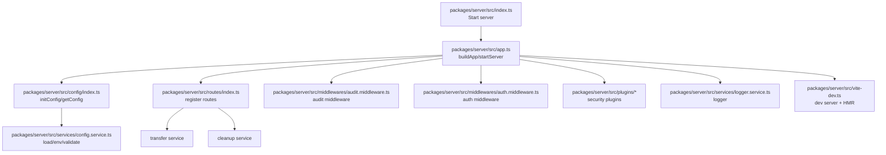
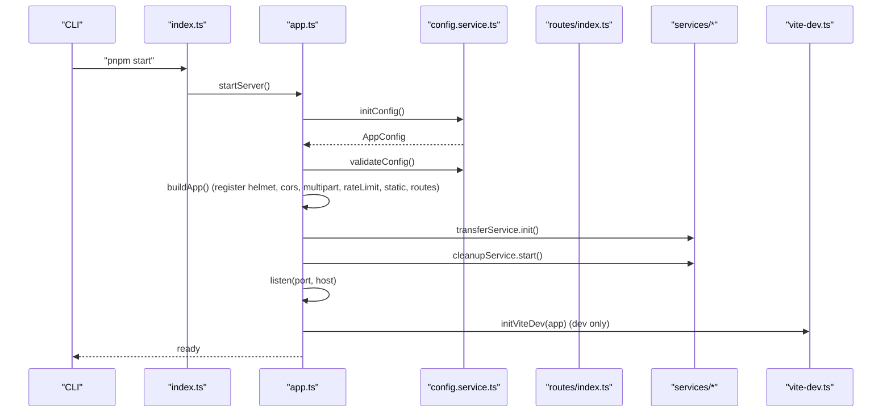
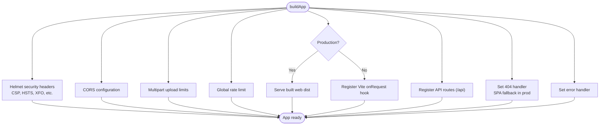
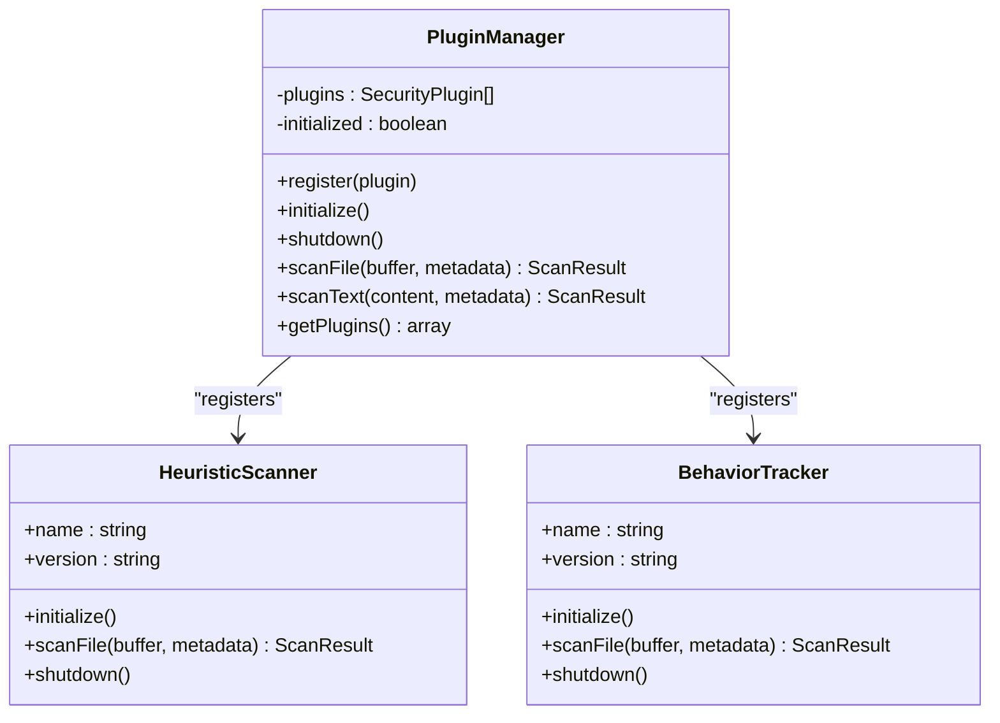
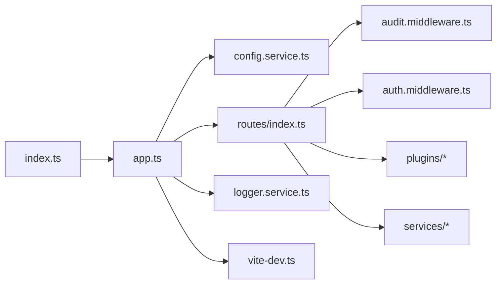

# Server Setup and Configuration

<cite>
**Referenced Files in This Document**
- [config.json](file://config.json)
- [package.json](file://package.json)
- [packages/server/src/index.ts](file://packages/server/src/index.ts)
- [packages/server/src/app.ts](file://packages/server/src/app.ts)
- [packages/server/src/config/index.ts](file://packages/server/src/config/index.ts)
- [packages/server/src/services/config.service.ts](file://packages/server/src/services/config.service.ts)
- [packages/server/src/services/logger.service.ts](file://packages/server/src/services/logger.service.ts)
- [packages/server/src/vite-dev.ts](file://packages/server/src/vite-dev.ts)
- [packages/server/src/routes/index.ts](file://packages/server/src/routes/index.ts)
- [packages/server/src/middlewares/audit.middleware.ts](file://packages/server/src/middlewares/audit.middleware.ts)
- [packages/server/src/middlewares/auth.middleware.ts](file://packages/server/src/middlewares/auth.middleware.ts)
- [packages/server/src/plugins/plugin-manager.ts](file://packages/server/src/plugins/plugin-manager.ts)
- [packages/server/src/plugins/behavior-tracker.ts](file://packages/server/src/plugins/behavior-tracker.ts)
- [packages/server/src/plugins/heuristic-scanner.ts](file://packages/server/src/plugins/heuristic-scanner.ts)
</cite>

## Table of Contents
1. [Introduction](#introduction)
2. [Project Structure](#project-structure)
3. [Core Components](#core-components)
4. [Architecture Overview](#architecture-overview)
5. [Detailed Component Analysis](#detailed-component-analysis)
6. [Dependency Analysis](#dependency-analysis)
7. [Performance Considerations](#performance-considerations)
8. [Troubleshooting Guide](#troubleshooting-guide)
9. [Conclusion](#conclusion)
10. [Appendices](#appendices)

## Introduction
This document explains how the Airportal backend server is set up and configured. It covers Fastify initialization, middleware stack (including security headers via Helmet, CORS, multipart uploads, and rate limiting), configuration loading from config.json and environment variables, runtime validation, development versus production differences, static file serving for the frontend, error handling, security middleware, and logging configuration. It also documents the server startup sequence, service initialization order, and provides practical examples for configuring security headers, Content Security Policy (CSP), and proxy trust.

## Project Structure
The server is implemented as a Fastify application with modularized concerns:
- Entry point initializes and starts the server.
- Application builder registers plugins, middleware, static assets, routes, and error handlers.
- Configuration system loads defaults, merges environment variables, validates, and exposes runtime configuration.
- Services implement domain logic (transfers, cleanup, logging, IP blacklisting, etc.).
- Plugins implement security scanning (heuristic and behavior-based).
- Development mode integrates Vite for hot module replacement without conflicting WebSocket upgrades.

**Diagram sources**
- [packages/server/src/index.ts:1-7](file://packages/server/src/index.ts#L1-L7)
- [packages/server/src/app.ts:19-148](file://packages/server/src/app.ts#L19-L148)
- [packages/server/src/config/index.ts:1-15](file://packages/server/src/config/index.ts#L1-L15)
- [packages/server/src/services/config.service.ts:155-259](file://packages/server/src/services/config.service.ts#L155-L259)
- [packages/server/src/routes/index.ts:10-62](file://packages/server/src/routes/index.ts#L10-L62)
- [packages/server/src/middlewares/audit.middleware.ts:48-124](file://packages/server/src/middlewares/audit.middleware.ts#L48-L124)
- [packages/server/src/middlewares/auth.middleware.ts:11-32](file://packages/server/src/middlewares/auth.middleware.ts#L11-L32)
- [packages/server/src/plugins/plugin-manager.ts:4-167](file://packages/server/src/plugins/plugin-manager.ts#L4-L167)
- [packages/server/src/services/logger.service.ts:14-78](file://packages/server/src/services/logger.service.ts#L14-L78)
- [packages/server/src/vite-dev.ts:17-98](file://packages/server/src/vite-dev.ts#L17-L98)

**Section sources**
- [package.json:6-16](file://package.json#L6-L16)
- [packages/server/src/index.ts:1-7](file://packages/server/src/index.ts#L1-L7)
- [packages/server/src/app.ts:19-148](file://packages/server/src/app.ts#L19-L148)

## Core Components
- Fastify server builder registers security headers, CORS, multipart, rate limiting, static assets, routes, and error handlers.
- Configuration system loads config.json, merges environment variables, validates, and exposes runtime configuration.
- Audit middleware logs requests, redacts sensitive data, checks IP blacklist, and records failures.
- Authentication middleware enforces bearer tokens.
- Security plugin manager orchestrates heuristic scanner and behavior tracker plugins.
- Logger supports console and optional file output with configurable levels.
- Vite integration for development with a dedicated HMR server to avoid conflicts.

**Section sources**
- [packages/server/src/app.ts:22-148](file://packages/server/src/app.ts#L22-L148)
- [packages/server/src/services/config.service.ts:155-363](file://packages/server/src/services/config.service.ts#L155-L363)
- [packages/server/src/middlewares/audit.middleware.ts:48-124](file://packages/server/src/middlewares/audit.middleware.ts#L48-L124)
- [packages/server/src/middlewares/auth.middleware.ts:11-49](file://packages/server/src/middlewares/auth.middleware.ts#L11-L49)
- [packages/server/src/plugins/plugin-manager.ts:4-167](file://packages/server/src/plugins/plugin-manager.ts#L4-L167)
- [packages/server/src/services/logger.service.ts:14-78](file://packages/server/src/services/logger.service.ts#L14-L78)
- [packages/server/src/vite-dev.ts:17-98](file://packages/server/src/vite-dev.ts#L17-L98)

## Architecture Overview
The server follows a layered architecture:
- Entry point delegates to the application builder.
- Application builder composes middleware and plugins, registers routes, and sets error/404 handlers.
- Configuration is centralized and validated before server start.
- Services are initialized after the server listens, ensuring availability of HTTP resources for dev-time Vite integration.

**Diagram sources**
- [packages/server/src/index.ts:1-7](file://packages/server/src/index.ts#L1-L7)
- [packages/server/src/app.ts:150-204](file://packages/server/src/app.ts#L150-L204)
- [packages/server/src/services/config.service.ts:155-259](file://packages/server/src/services/config.service.ts#L155-L259)
- [packages/server/src/routes/index.ts:10-62](file://packages/server/src/routes/index.ts#L10-L62)
- [packages/server/src/vite-dev.ts:45-98](file://packages/server/src/vite-dev.ts#L45-L98)

## Detailed Component Analysis

### Fastify Server Initialization and Middleware Stack
- Trust proxy is enabled to correctly extract client IPs behind reverse proxies.
- Helmet secures responses with hardened headers, including CSP directives, HSTS, X-Frame-Options, and more.
- CORS allows cross-origin requests from configured origins with credentials and selected methods/headers.
- Multipart enables single-file uploads with size and field limits derived from configuration.
- Global rate limiter uses forwarded IP or real IP with a structured error response.
- Static file serving serves the built frontend in production; development uses Vite middleware with a dedicated HMR server.
- NotFound handler serves index.html for SPA fallback in production; returns structured 404 for API routes or dev.
- Error handler logs unhandled errors and responds with a generic internal error.

**Diagram sources**
- [packages/server/src/app.ts:22-148](file://packages/server/src/app.ts#L22-L148)

**Section sources**
- [packages/server/src/app.ts:22-148](file://packages/server/src/app.ts#L22-L148)

### Security Headers and CSP Policies
- Helmet is configured with a strict CSP that:
  - Restricts default, style, image, script, connect, frame ancestor, and form action sources.
  - Allows self for most sources; adds unsafe-inline for development (React Refresh).
  - Adds ws/wss for HMR in development.
- Additional security headers include HSTS, X-Frame-Options deny, X-Content-Type-Options, Referrer-Policy, and others.
- Cross-Origin policies are tuned for isolation and security.

Practical examples (descriptive):
- Default CSP restricts resource loading to same-origin plus specific inline/script allowances in development.
- Connect-src includes ws/wss for HMR in development; production restricts to same-origin.
- Frame-Ancestor is set to none to prevent clickjacking.

**Section sources**
- [packages/server/src/app.ts:38-66](file://packages/server/src/app.ts#L38-L66)

### CORS Settings
- Origins are configurable and loaded from environment or config.json.
- Credentials are allowed; methods include GET, POST, DELETE.
- Allowed headers include Content-Type and Authorization.

**Section sources**
- [packages/server/src/app.ts:68-74](file://packages/server/src/app.ts#L68-L74)
- [packages/server/src/services/config.service.ts:246-248](file://packages/server/src/services/config.service.ts#L246-L248)

### Multipart File Upload Handling
- Limits are derived from configuration:
  - fileSize, files, fields, fieldNameSize.
- Used by upload routes to enforce size and field constraints.

**Section sources**
- [packages/server/src/app.ts:76-84](file://packages/server/src/app.ts#L76-L84)
- [packages/server/src/services/config.service.ts:212-224](file://packages/server/src/services/config.service.ts#L212-L224)

### Rate Limiting Implementation
- Global rate limiter uses a key generator that prefers forwarded IP for proxy environments.
- Returns a structured error response when exceeded.
- Separate upload-specific limits are configurable but not explicitly applied in the middleware stack shown.

**Section sources**
- [packages/server/src/app.ts:86-97](file://packages/server/src/app.ts#L86-L97)
- [packages/server/src/services/config.service.ts:188-193](file://packages/server/src/services/config.service.ts#L188-L193)

### Configuration System: config.json, Environment Variables, and Validation
- Environment variables are loaded via dotenv at module import.
- Configuration is loaded from config.json with fallback paths checked.
- Environment variables override config.json values with type parsing where applicable.
- Validation ensures port range, JWT secret in production, positive numeric constraints, and logical relationships (e.g., maxExpiry ≥ defaultExpiry).
- Runtime updates are supported via a partial update function.

Key environment variable mappings (examples):
- PORT, HOST
- DATABASE_URL
- JWT_SECRET, JWT_EXPIRES_IN
- FILE_VALIDATION, IP_BLACKLIST_ENABLED, AUDIT_LOG
- RATE_LIMIT_MAX, RATE_LIMIT_WINDOW, UPLOAD_RATE_MAX, UPLOAD_RATE_WINDOW
- MAX_FILE_SIZE, MAX_TEXT_LENGTH, MAX_TOTAL_STORAGE
- ALLOWED_ORIGINS (comma-separated)
- P2P_* settings

**Section sources**
- [packages/server/src/config/index.ts:1-15](file://packages/server/src/config/index.ts#L1-L15)
- [packages/server/src/services/config.service.ts:113-259](file://packages/server/src/services/config.service.ts#L113-L259)
- [packages/server/src/services/config.service.ts:264-343](file://packages/server/src/services/config.service.ts#L264-L343)
- [config.json:1-102](file://config.json#L1-L102)

### Development vs Production Setup Differences
- Production:
  - Serves built frontend static files from the web distribution directory.
  - Uses trustProxy for accurate client IP detection.
- Development:
  - Registers a Vite onRequest hook that defers to Vite middleware for non-API routes.
  - Initializes a dedicated HMR HTTP server on a random local port to avoid conflicts with Fastify’s WebSocket upgrade handling.
  - CSP allows unsafe-inline and ws/wss for HMR.

**Section sources**
- [packages/server/src/app.ts:99-112](file://packages/server/src/app.ts#L99-L112)
- [packages/server/src/vite-dev.ts:17-98](file://packages/server/src/vite-dev.ts#L17-L98)

### Static File Serving for the Frontend
- Production: fastify-static serves the web dist directory under the root prefix.
- Development: Vite middleware handles SPA routing; index.html fallback occurs for non-API routes.

**Section sources**
- [packages/server/src/app.ts:100-128](file://packages/server/src/app.ts#L100-L128)

### Error Handling Strategies
- Unhandled exceptions are logged with request context and responded with a generic internal error.
- 404 handling:
  - In production and non-API routes, serves index.html for SPA fallback.
  - For API routes or dev, returns a structured 404 response.

**Section sources**
- [packages/server/src/app.ts:130-145](file://packages/server/src/app.ts#L130-L145)

### Security Middleware Configuration
- Audit middleware:
  - Redacts sensitive fields in request body/query/params.
  - Records request lifecycle events with timing and status.
  - Checks IP blacklist and records failed attempts.
- IP Blacklist Management:
  - Stats, blocked list endpoints with per-route rate limiting.
  - Block/unblock endpoints with validation.

**Section sources**
- [packages/server/src/middlewares/audit.middleware.ts:48-124](file://packages/server/src/middlewares/audit.middleware.ts#L48-L124)
- [packages/server/src/middlewares/audit.middleware.ts:129-186](file://packages/server/src/middlewares/audit.middleware.ts#L129-L186)

### Authentication Middleware
- Enforces Bearer token authentication.
- Optional variant allows anonymous access and attaches user payload if present.

**Section sources**
- [packages/server/src/middlewares/auth.middleware.ts:11-49](file://packages/server/src/middlewares/auth.middleware.ts#L11-L49)

### Security Plugin System
- Plugin Manager:
  - Registers plugins, initializes/shuts them down, aggregates results, and handles failures gracefully.
- Heuristic Scanner:
  - Scans buffers for suspicious patterns, entropy anomalies, and extension mismatches.
- Behavior Tracker:
  - Tracks upload bursts and size outliers per IP, raises anomaly scores, and can feed blacklist.

**Diagram sources**
- [packages/server/src/plugins/plugin-manager.ts:4-167](file://packages/server/src/plugins/plugin-manager.ts#L4-L167)
- [packages/server/src/plugins/heuristic-scanner.ts:25-173](file://packages/server/src/plugins/heuristic-scanner.ts#L25-L173)
- [packages/server/src/plugins/behavior-tracker.ts:12-136](file://packages/server/src/plugins/behavior-tracker.ts#L12-L136)

**Section sources**
- [packages/server/src/routes/index.ts:16-39](file://packages/server/src/routes/index.ts#L16-L39)
- [packages/server/src/plugins/plugin-manager.ts:4-167](file://packages/server/src/plugins/plugin-manager.ts#L4-L167)
- [packages/server/src/plugins/heuristic-scanner.ts:25-173](file://packages/server/src/plugins/heuristic-scanner.ts#L25-L173)
- [packages/server/src/plugins/behavior-tracker.ts:12-136](file://packages/server/src/plugins/behavior-tracker.ts#L12-L136)

### Logging Configuration
- Console output with level-based filtering.
- Optional file output with directory creation and JSON-formatted entries.
- Levels: debug, info, warn, error.

**Section sources**
- [packages/server/src/services/logger.service.ts:14-78](file://packages/server/src/services/logger.service.ts#L14-L78)

### Server Startup Sequence and Service Initialization Order
- Load and validate configuration.
- Build application with middleware/plugins/static/routes/error handlers.
- Initialize transfer service.
- Start cleanup service.
- Listen on configured host/port.
- In development, initialize Vite dev server and HMR on a separate port.
- Log security configuration summary and environment details.

**Section sources**
- [packages/server/src/app.ts:150-204](file://packages/server/src/app.ts#L150-L204)

## Dependency Analysis
The server composes a clear dependency chain:
- Entry depends on app.
- App depends on config, routes, services, and plugins.
- Routes depend on middleware and services.
- Plugins depend on configuration and services.

**Diagram sources**
- [packages/server/src/index.ts:1-7](file://packages/server/src/index.ts#L1-L7)
- [packages/server/src/app.ts:9-14](file://packages/server/src/app.ts#L9-L14)
- [packages/server/src/routes/index.ts:1-8](file://packages/server/src/routes/index.ts#L1-L8)

**Section sources**
- [packages/server/src/index.ts:1-7](file://packages/server/src/index.ts#L1-L7)
- [packages/server/src/app.ts:9-14](file://packages/server/src/app.ts#L9-L14)
- [packages/server/src/routes/index.ts:1-8](file://packages/server/src/routes/index.ts#L1-L8)

## Performance Considerations
- Rate limiting prevents abuse and protects downstream services.
- Multipart limits reduce memory pressure and disk usage.
- Plugin scanning is bounded by maxScanSize and aggregated results minimize overhead.
- In production, static assets are served efficiently; in development, Vite middleware introduces minimal overhead with a dedicated HMR server.

[No sources needed since this section provides general guidance]

## Troubleshooting Guide
Common issues and remedies:
- Configuration errors on startup:
  - Review validation messages for port, JWT secret, numeric constraints, and logical relationships.
- 404 responses:
  - In production, non-API routes fall back to index.html; API routes return structured 404.
- Rate limit exceeded:
  - Verify forwarded IP handling and adjust global/upload limits.
- Audit logs not appearing:
  - Ensure audit log is enabled and logger level is appropriate.
- Development HMR not working:
  - Confirm Vite dev server is initialized after listen and HMR server is running on a separate port.

**Section sources**
- [packages/server/src/app.ts:150-204](file://packages/server/src/app.ts#L150-L204)
- [packages/server/src/app.ts:118-128](file://packages/server/src/app.ts#L118-L128)
- [packages/server/src/app.ts:86-97](file://packages/server/src/app.ts#L86-L97)
- [packages/server/src/services/config.service.ts:264-343](file://packages/server/src/services/config.service.ts#L264-L343)
- [packages/server/src/vite-dev.ts:45-98](file://packages/server/src/vite-dev.ts#L45-L98)

## Conclusion
The Airportal backend uses a robust Fastify foundation with strong security defaults, flexible configuration, and modular middleware/plugins. It cleanly separates development and production concerns, integrates a secure audit trail, and provides structured logging and error handling. Following the documented configuration and deployment practices ensures a secure, maintainable, and performant server setup.

[No sources needed since this section summarizes without analyzing specific files]

## Appendices

### Appendix A: Environment Variable Reference
- PORT, HOST
- DATABASE_URL
- JWT_SECRET, JWT_EXPIRES_IN
- FILE_VALIDATION
- IP_BLACKLIST_ENABLED, IP_AUTO_BLOCK_THRESHOLD, IP_AUTO_BLOCK_WINDOW, IP_AUTO_BLOCK_DURATION, IP_WHITELIST, IP_BLACKLIST
- AUDIT_LOG
- RATE_LIMIT_MAX, RATE_LIMIT_WINDOW, UPLOAD_RATE_MAX, UPLOAD_RATE_WINDOW
- MAX_FILE_SIZE, MAX_TEXT_LENGTH, MAX_TOTAL_STORAGE
- ALLOWED_ORIGINS
- P2P_ENABLED, P2P_MAX_FILE_SIZE, P2P_MAX_CONCURRENT, P2P_REQUEST_TIMEOUT

**Section sources**
- [packages/server/src/services/config.service.ts:155-259](file://packages/server/src/services/config.service.ts#L155-L259)

### Appendix B: Example Security Header Values
- Content-Security-Policy (example directives):
  - default-src: "'self'"
  - style-src: "'self' 'unsafe-inline'"
  - img-src: "'self' data:"
  - script-src: "'self'" (development adds "'unsafe-inline'"; production removes it)
  - connect-src: "'self'" (development adds "ws: wss:")
  - frame-ancestors: "'none'"
  - form-action: "'self'"
- Strict-Transport-Security: maxAge=31536000, includeSubDomains, preload
- X-Frame-Options: DENY
- X-Content-Type-Options: nosniff
- Referrer-Policy: strict-origin-when-cross-origin

**Section sources**
- [packages/server/src/app.ts:38-66](file://packages/server/src/app.ts#L38-L66)

### Appendix C: Proxy Trust Configuration
- trustProxy is enabled to correctly derive client IPs from headers like X-Forwarded-For.
- Rate limiter key generation prefers X-Forwarded-For or falls back to request.ip.

**Section sources**
- [packages/server/src/app.ts:24](file://packages/server/src/app.ts#L24)
- [packages/server/src/app.ts:90-92](file://packages/server/src/app.ts#L90-L92)