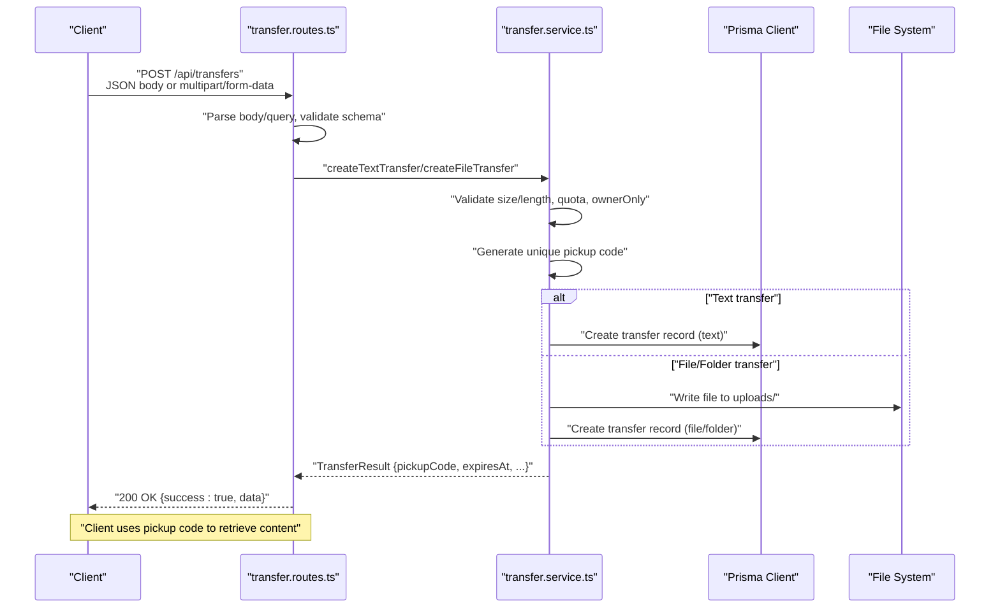
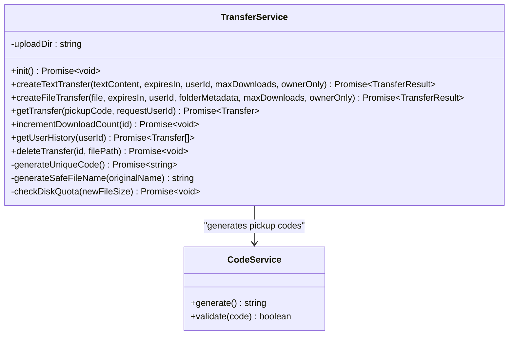
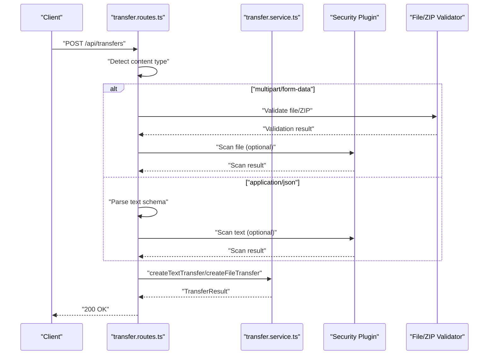
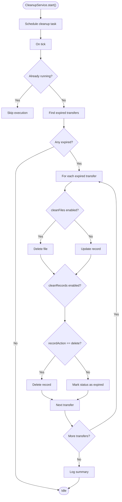
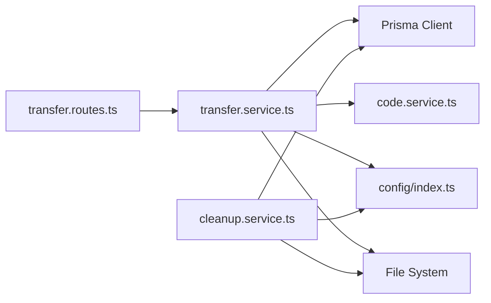

# Transfer Service

<cite>
**Referenced Files in This Document**
- [transfer.service.ts](file://packages/server/src/services/transfer.service.ts)
- [transfer.routes.ts](file://packages/server/src/routes/transfer.routes.ts)
- [cleanup.service.ts](file://packages/server/src/services/cleanup.service.ts)
- [code.service.ts](file://packages/server/src/services/code.service.ts)
- [index.ts](file://packages/server/src/config/index.ts)
- [schema.prisma](file://packages/server/prisma/schema.prisma)
- [types/index.ts](file://packages/server/src/types/index.ts)
- [api.ts](file://packages/web/src/services/api.ts)
</cite>

## Table of Contents
1. [Introduction](#introduction)
2. [Project Structure](#project-structure)
3. [Core Components](#core-components)
4. [Architecture Overview](#architecture-overview)
5. [Detailed Component Analysis](#detailed-component-analysis)
6. [Dependency Analysis](#dependency-analysis)
7. [Performance Considerations](#performance-considerations)
8. [Troubleshooting Guide](#troubleshooting-guide)
9. [Conclusion](#conclusion)

## Introduction
This document provides comprehensive documentation for Airportal's transfer service, covering file and text transfer management, folder compression handling, download tracking, cleanup of expired content, storage management, and database cleanup operations. It explains transfer lifecycle management, pickup code generation and validation, owner-only transfer restrictions, and transfer metadata handling. The guide includes practical examples, error handling strategies, and performance optimization techniques, along with integration details for storage systems, database operations, and cleanup scheduling mechanisms.

## Project Structure
The transfer service spans several modules:
- HTTP routes define endpoints for creating transfers (file/text/folder) and retrieving content
- Transfer service encapsulates business logic for creation, validation, persistence, and retrieval
- Cleanup service manages periodic deletion of expired transfers and associated files
- Code service generates and validates unique pickup codes
- Configuration module supplies runtime settings for limits, expiry, and cleanup behavior
- Prisma schema defines the database model for transfers and users
- Types define shared interfaces for requests, responses, and metadata

```mermaid
graph TB
subgraph "HTTP Layer"
Routes["transfer.routes.ts"]
end
subgraph "Service Layer"
TransferSvc["transfer.service.ts"]
CleanupSvc["cleanup.service.ts"]
CodeSvc["code.service.ts"]
end
subgraph "Persistence"
Prisma["Prisma Client"]
SQLite["SQLite Database"]
FS["File System"]
end
subgraph "Configuration"
ConfigIdx["config/index.ts"]
Schema["prisma/schema.prisma"]
end
subgraph "Types"
Types["types/index.ts"]
end
Routes --> TransferSvc
TransferSvc --> Prisma
TransferSvc --> FS
CleanupSvc --> Prisma
CleanupSvc --> FS
TransferSvc --> CodeSvc
Routes --> ConfigIdx
TransferSvc --> ConfigIdx
CleanupSvc --> ConfigIdx
Prisma --> SQLite
Types --> Routes
Types --> TransferSvc
```

**Diagram sources**
- [transfer.routes.ts:1-348](file://packages/server/src/routes/transfer.routes.ts#L1-L348)
- [transfer.service.ts:1-335](file://packages/server/src/services/transfer.service.ts#L1-L335)
- [cleanup.service.ts:1-138](file://packages/server/src/services/cleanup.service.ts#L1-L138)
- [code.service.ts:1-22](file://packages/server/src/services/code.service.ts#L1-L22)
- [index.ts:1-15](file://packages/server/src/config/index.ts#L1-L15)
- [schema.prisma:1-59](file://packages/server/prisma/schema.prisma#L1-L59)
- [types/index.ts:1-63](file://packages/server/src/types/index.ts#L1-L63)

**Section sources**
- [transfer.routes.ts:1-348](file://packages/server/src/routes/transfer.routes.ts#L1-L348)
- [transfer.service.ts:1-335](file://packages/server/src/services/transfer.service.ts#L1-L335)
- [cleanup.service.ts:1-138](file://packages/server/src/services/cleanup.service.ts#L1-L138)
- [code.service.ts:1-22](file://packages/server/src/services/code.service.ts#L1-L22)
- [index.ts:1-15](file://packages/server/src/config/index.ts#L1-L15)
- [schema.prisma:1-59](file://packages/server/prisma/schema.prisma#L1-L59)
- [types/index.ts:1-63](file://packages/server/src/types/index.ts#L1-L63)

## Core Components
- TransferService: Handles creation of text and file/folder transfers, validates inputs, enforces quotas, persists metadata, generates unique pickup codes, and manages retrieval with owner-only and download-count restrictions.
- Transfer routes: Expose HTTP endpoints for creating transfers (multipart/form-data for files/folders, JSON for text), retrieving content by pickup code, and fetching configuration.
- CleanupService: Periodically scans for expired transfers and removes associated files and/or updates records based on configuration.
- CodeService: Generates secure, unique pickup codes and validates their format.
- Configuration: Centralized runtime configuration for limits, expiry windows, and cleanup behavior.
- Prisma schema: Defines the Transfer and User models, indexes, and relationships.
- Types: Shared interfaces for request/response shapes and metadata.

Key responsibilities:
- File upload processing: Validates file types, applies ZIP validation for folders, performs security scanning, checks disk quota, writes files to disk, and stores metadata.
- Text content handling: Validates text length, optionally scans via security plugins, persists text content, and sets expiration.
- Folder compression: Accepts folder uploads via ZIP archives with configurable validation parameters.
- Download tracking: Increments download counts per successful retrieval and enforces maxDownloads limits.
- Cleanup service: Removes expired files and updates or deletes records according to configuration.
- Owner-only restriction: Enforces login requirement and creator-only access for sensitive transfers.
- Metadata handling: Stores and retrieves transfer metadata including content type, file info, user association, expiration, and download counters.

**Section sources**
- [transfer.service.ts:31-166](file://packages/server/src/services/transfer.service.ts#L31-L166)
- [transfer.routes.ts:37-273](file://packages/server/src/routes/transfer.routes.ts#L37-L273)
- [cleanup.service.ts:47-129](file://packages/server/src/services/cleanup.service.ts#L47-L129)
- [code.service.ts:7-21](file://packages/server/src/services/code.service.ts#L7-L21)
- [schema.prisma:20-59](file://packages/server/prisma/schema.prisma#L20-L59)
- [types/index.ts:1-63](file://packages/server/src/types/index.ts#L1-L63)

## Architecture Overview
The transfer service follows a layered architecture:
- HTTP routes handle request parsing, authentication, and rate limiting
- Transfer service orchestrates validation, persistence, and file operations
- Cleanup service runs independently on a schedule to maintain storage hygiene
- Prisma manages database operations and schema enforcement
- File system stores uploaded files under a controlled directory
- Configuration module centralizes policy settings



**Diagram sources**
- [transfer.routes.ts:37-273](file://packages/server/src/routes/transfer.routes.ts#L37-L273)
- [transfer.service.ts:31-166](file://packages/server/src/services/transfer.service.ts#L31-L166)

**Section sources**
- [transfer.routes.ts:1-348](file://packages/server/src/routes/transfer.routes.ts#L1-L348)
- [transfer.service.ts:1-335](file://packages/server/src/services/transfer.service.ts#L1-L335)

## Detailed Component Analysis

### TransferService
Responsibilities:
- Initialize upload directory and ensure database directory exists
- Create text transfers with validation, owner-only enforcement, and expiration calculation
- Create file/folder transfers with type validation, ZIP validation for folders, security scanning, disk quota checks, safe filename generation, path traversal protection, and persistence
- Retrieve transfers with expiration, owner-only, and maxDownloads checks
- Increment download counts and mark transfers as expired
- Generate unique pickup codes and sanitize filenames

Key implementation patterns:
- Validation pipeline: size/length limits, blocked extensions, owner-only login requirement, and disk quota aggregation
- Security: file type detection, ZIP archive validation, and optional security plugin scanning
- Persistence: Prisma ORM for structured metadata and filesystem for raw content
- Idempotency: Unique pickup code generation with collision retries
- Safety: Path traversal prevention and safe filename sanitization



**Diagram sources**
- [transfer.service.ts:12-335](file://packages/server/src/services/transfer.service.ts#L12-L335)
- [code.service.ts:7-21](file://packages/server/src/services/code.service.ts#L7-L21)

**Section sources**
- [transfer.service.ts:15-335](file://packages/server/src/services/transfer.service.ts#L15-L335)

### Transfer Routes
Endpoints:
- GET /api/transfers/config: Returns client-facing limits and defaults
- POST /api/transfers: Creates text or file/folder transfers
  - Content-Type: application/json for text
  - Content-Type: multipart/form-data for files/folders
  - Query parameters for folder uploads: type, folderName, fileCount, expiresIn, maxDownloads, ownerOnly
- GET /api/transfers/:code: Retrieves content by pickup code with appropriate headers and security controls
- GET /api/transfers/history: Lists user's active transfers (authenticated)

Processing logic:
- Rate limiting for upload endpoint
- Optional authentication middleware
- ZIP validation for folder uploads
- File type validation for single-file uploads
- Security plugin scanning for files and text
- Owner-only enforcement and maxDownloads checks during retrieval



**Diagram sources**
- [transfer.routes.ts:37-273](file://packages/server/src/routes/transfer.routes.ts#L37-L273)
- [transfer.service.ts:31-166](file://packages/server/src/services/transfer.service.ts#L31-L166)

**Section sources**
- [transfer.routes.ts:23-348](file://packages/server/src/routes/transfer.routes.ts#L23-L348)

### CleanupService
Purpose:
- Periodically remove expired transfers and associated files
- Respect configuration for cleaning files, updating records, and scheduling intervals

Behavior:
- Cron-based scheduling with adaptive expressions based on configured interval
- Concurrent safety guard to prevent overlapping runs
- Iterates expired transfers, deletes files if enabled, and either deletes or marks records as expired
- Comprehensive logging for metrics and failures



**Diagram sources**
- [cleanup.service.ts:12-129](file://packages/server/src/services/cleanup.service.ts#L12-L129)

**Section sources**
- [cleanup.service.ts:1-138](file://packages/server/src/services/cleanup.service.ts#L1-L138)

### CodeService
- Generates secure, unique 6-character codes using a custom alphabet excluding ambiguous characters
- Validates pickup code format against length and character set constraints

**Section sources**
- [code.service.ts:1-22](file://packages/server/src/services/code.service.ts#L1-L22)

### Configuration and Prisma Schema
- Configuration: Centralized via config/index.ts proxying getConfig from config.service
- Prisma schema: Defines Transfer and User models with indexes, relations, and default values for status, downloadCount, and maxDownloads

**Section sources**
- [index.ts:1-15](file://packages/server/src/config/index.ts#L1-L15)
- [schema.prisma:20-59](file://packages/server/prisma/schema.prisma#L20-L59)

### Frontend Integration Example
- Web client demonstrates uploading text and folder content and retrieving content by pickup code

**Section sources**
- [api.ts:89-132](file://packages/web/src/services/api.ts#L89-L132)

## Dependency Analysis
TransferService depends on:
- PrismaClient for database operations
- CodeService for unique pickup code generation
- Configuration module for limits and policies
- File system for storing uploaded files
- Logger service for audit trails

Routes depend on:
- TransferService for business logic
- Authentication middleware for owner-only enforcement
- Validation services for file and ZIP integrity
- Security plugin manager for scanning

CleanupService depends on:
- PrismaClient for querying expired transfers
- File system for cleanup
- Configuration for scheduling and actions



**Diagram sources**
- [transfer.routes.ts:1-348](file://packages/server/src/routes/transfer.routes.ts#L1-L348)
- [transfer.service.ts:1-335](file://packages/server/src/services/transfer.service.ts#L1-L335)
- [cleanup.service.ts:1-138](file://packages/server/src/services/cleanup.service.ts#L1-L138)

**Section sources**
- [transfer.routes.ts:1-348](file://packages/server/src/routes/transfer.routes.ts#L1-L348)
- [transfer.service.ts:1-335](file://packages/server/src/services/transfer.service.ts#L1-L335)
- [cleanup.service.ts:1-138](file://packages/server/src/services/cleanup.service.ts#L1-L138)

## Performance Considerations
- Asynchronous I/O: File writes and reads are asynchronous to avoid blocking the event loop
- Disk quota aggregation: Uses Prisma aggregation to estimate total storage usage before accepting uploads
- Indexes: Prisma schema includes indexes on frequently queried fields (pickupCode, expiresAt, status, userId) to optimize lookups
- Cleanup scheduling: Adaptive cron expressions reduce overhead for short intervals
- Concurrency guard: CleanupService prevents overlapping runs to avoid resource contention
- Safe filename sanitization: Prevents path traversal and reduces filesystem errors
- Content-type headers: Proper headers for downloads enhance browser handling and security

[No sources needed since this section provides general guidance]

## Troubleshooting Guide
Common issues and resolutions:
- Upload rejected due to size or length limits: Verify client-side configuration and adjust accordingly
- Invalid ZIP archive for folder upload: Check archive integrity and compression ratio limits
- Malicious content blocked: Review security plugin logs and adjust policies if needed
- Expired transfer on access: Trigger a new transfer or extend expiry window
- Owner-only access denied: Ensure user is logged in and is the transfer creator
- Max downloads reached: Increase maxDownloads or create a new transfer
- Cleanup failures: Inspect logs for file permission issues or missing files

Operational checks:
- Confirm cleanup service is scheduled and running
- Validate database connectivity and Prisma migrations
- Monitor disk space and quota thresholds
- Verify pickup code generation and uniqueness

**Section sources**
- [transfer.routes.ts:284-340](file://packages/server/src/routes/transfer.routes.ts#L284-L340)
- [transfer.service.ts:200-247](file://packages/server/src/services/transfer.service.ts#L200-L247)
- [cleanup.service.ts:47-129](file://packages/server/src/services/cleanup.service.ts#L47-L129)

## Conclusion
Airportal’s transfer service provides a robust, secure, and scalable solution for managing file and text transfers. It enforces strict validation, integrates with security plugins, maintains storage quotas, and automates cleanup of expired content. The modular design ensures clear separation of concerns, while the Prisma schema and indexes support efficient data operations. By following the documented patterns and best practices, developers can extend and maintain the service effectively.