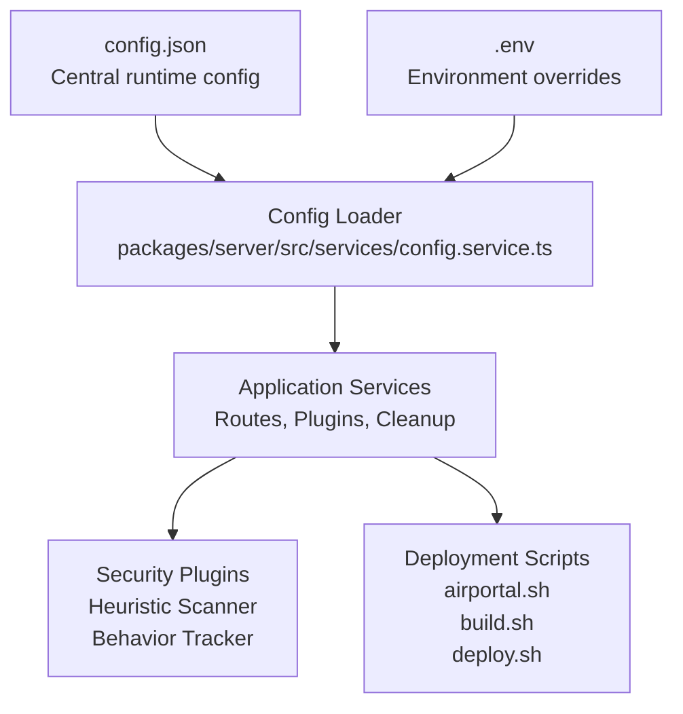
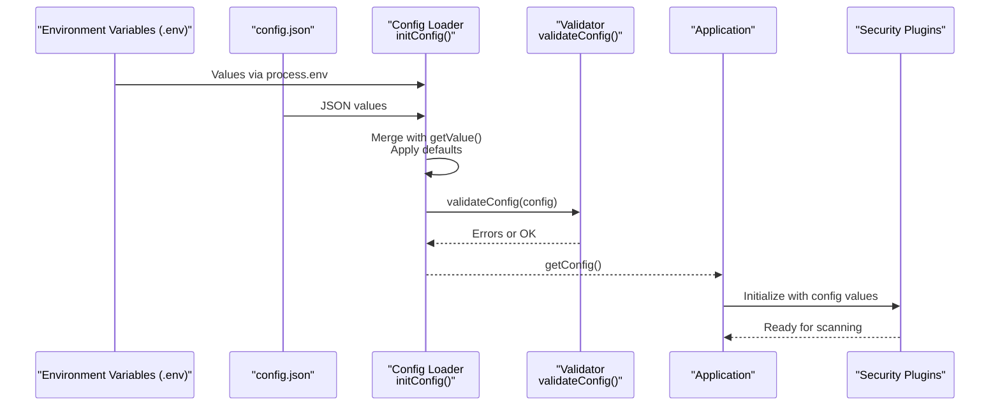
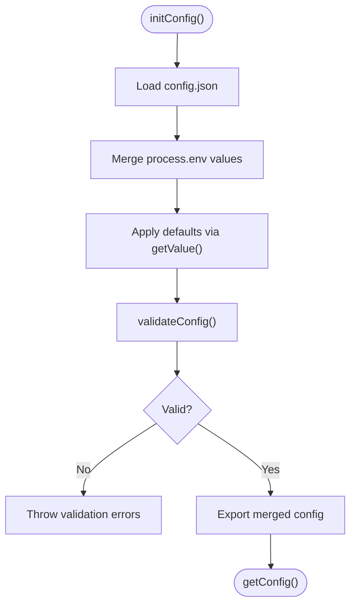
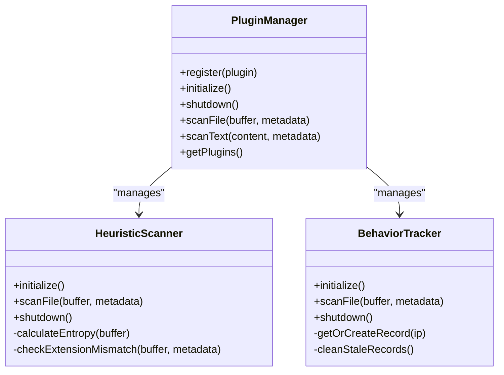
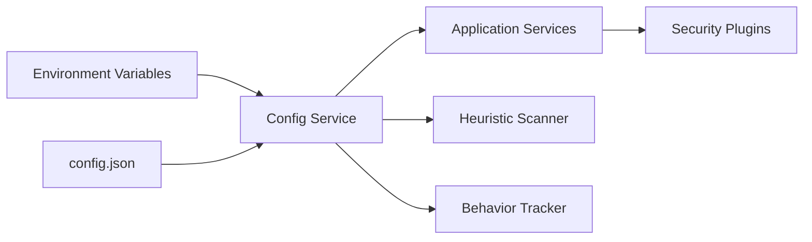

# Configuration Management

<cite>
**Referenced Files in This Document**
- [config.json](file://config.json)
- [CLAUDE.md](file://CLAUDE.md)
- [package.json](file://package.json)
- [packages/server/src/config/index.ts](file://packages/server/src/config/index.ts)
- [packages/server/src/services/config.service.ts](file://packages/server/src/services/config.service.ts)
- [packages/server/src/plugins/plugin-manager.ts](file://packages/server/src/plugins/plugin-manager.ts)
- [packages/server/src/plugins/heuristic-scanner.ts](file://packages/server/src/plugins/heuristic-scanner.ts)
- [packages/server/src/plugins/behavior-tracker.ts](file://packages/server/src/plugins/behavior-tracker.ts)
- [airportal.sh](file://airportal.sh)
- [build.sh](file://build.sh)
- [deploy.sh](file://deploy.sh)
</cite>

## Table of Contents
1. [Introduction](#introduction)
2. [Project Structure](#project-structure)
3. [Core Components](#core-components)
4. [Architecture Overview](#architecture-overview)
5. [Detailed Component Analysis](#detailed-component-analysis)
6. [Dependency Analysis](#dependency-analysis)
7. [Performance Considerations](#performance-considerations)
8. [Troubleshooting Guide](#troubleshooting-guide)
9. [Conclusion](#conclusion)
10. [Appendices](#appendices)

## Introduction
This document provides comprehensive configuration management documentation for Airportal's centralized configuration system. It explains the config.json structure, environment variable integration, configuration loading mechanisms, validation, defaults, and dynamic updates. It also covers security configuration options (file validation, rate limiting, IP blacklist), feature flags (upload limits, expiration policies, P2P network settings), and production deployment considerations.

## Project Structure
Airportal follows a monorepo layout with a shared configuration system:
- Central runtime configuration: config.json
- Environment overrides: .env files
- Configuration loading and validation: server-side service
- Security plugins: pluggable heuristic scanner and behavior tracker
- Deployment scripts: development, build, and production deployment automation

**Diagram sources**
- [config.json:1-102](file://config.json#L1-L102)
- [packages/server/src/services/config.service.ts:113-259](file://packages/server/src/services/config.service.ts#L113-L259)
- [packages/server/src/plugins/heuristic-scanner.ts:25-54](file://packages/server/src/plugins/heuristic-scanner.ts#L25-L54)
- [packages/server/src/plugins/behavior-tracker.ts:12-36](file://packages/server/src/plugins/behavior-tracker.ts#L12-L36)
- [airportal.sh:64-106](file://airportal.sh#L64-L106)
- [build.sh:93-152](file://build.sh#L93-L152)
- [deploy.sh:149-194](file://deploy.sh#L149-L194)

**Section sources**
- [CLAUDE.md:70-74](file://CLAUDE.md#L70-L74)
- [package.json:6-16](file://package.json#L6-L16)

## Core Components
- Central configuration file: config.json defines server, security, transfer, cleanup, logging, CORS, and P2P settings.
- Environment variable integration: .env files override config.json values at runtime.
- Configuration loader: loads, merges, validates, and exposes configuration to the application.
- Security plugin system: pluggable components (heuristic scanner, behavior tracker) consume configuration values.
- Deployment scripts: manage development, building, packaging, and production deployment.

**Section sources**
- [config.json:1-102](file://config.json#L1-L102)
- [packages/server/src/services/config.service.ts:113-259](file://packages/server/src/services/config.service.ts#L113-L259)
- [CLAUDE.md:70-74](file://CLAUDE.md#L70-L74)

## Architecture Overview
The configuration system follows a layered approach:
- Priority: Environment variables > config.json > defaults
- Validation ensures correctness and safety (especially in production)
- Dynamic updates are supported for select runtime settings
- Security plugins read configuration values at initialization and runtime

**Diagram sources**
- [packages/server/src/services/config.service.ts:136-259](file://packages/server/src/services/config.service.ts#L136-L259)
- [packages/server/src/services/config.service.ts:264-343](file://packages/server/src/services/config.service.ts#L264-L343)
- [packages/server/src/plugins/heuristic-scanner.ts:35-54](file://packages/server/src/plugins/heuristic-scanner.ts#L35-L54)
- [packages/server/src/plugins/behavior-tracker.ts:23-36](file://packages/server/src/plugins/behavior-tracker.ts#L23-L36)

## Detailed Component Analysis

### Configuration Loading Mechanism
- Loads config.json from multiple possible locations and parses JSON.
- Merges environment variables with config.json values, applying defaults when missing.
- Validates configuration and throws if invalid.
- Exposes a proxy-accessible config object for convenient access.

**Diagram sources**
- [packages/server/src/services/config.service.ts:113-131](file://packages/server/src/services/config.service.ts#L113-L131)
- [packages/server/src/services/config.service.ts:136-259](file://packages/server/src/services/config.service.ts#L136-L259)
- [packages/server/src/services/config.service.ts:264-343](file://packages/server/src/services/config.service.ts#L264-L343)

**Section sources**
- [packages/server/src/services/config.service.ts:113-259](file://packages/server/src/services/config.service.ts#L113-L259)
- [packages/server/src/config/index.ts:1-15](file://packages/server/src/config/index.ts#L1-L15)

### Environment Variable Integration
- Environment variables override config.json values.
- Special handling for boolean-like strings and numeric parsing.
- CORS origins and IP lists support comma-separated values from environment.

Examples of environment variable keys (non-exhaustive):
- PORT, HOST
- DATABASE_URL
- JWT_SECRET, JWT_EXPIRES_IN
- FILE_VALIDATION
- IP_BLACKLIST_ENABLED, IP_AUTO_BLOCK_THRESHOLD, IP_AUTO_BLOCK_WINDOW, IP_AUTO_BLOCK_DURATION, IP_WHITELIST, IP_BLACKLIST
- AUDIT_LOG
- RATE_LIMIT_MAX, RATE_LIMIT_WINDOW, UPLOAD_RATE_MAX, UPLOAD_RATE_WINDOW
- SECURITY_PLUGIN_ENABLED, HEURISTIC_ENABLED, HEURISTIC_ENTROPY_THRESHOLD, HEURISTIC_MAX_SCAN_SIZE, HEURISTIC_REJECT_THRESHOLD, HEURISTIC_WARN_THRESHOLD, BEHAVIOR_ENABLED, BEHAVIOR_WINDOW_MS, BEHAVIOR_BURST_THRESHOLD, BEHAVIOR_SIZE_MULTIPLIER, BEHAVIOR_ANOMALY_THRESHOLD
- MAX_FILE_SIZE, MAX_TEXT_LENGTH, MAX_TOTAL_STORAGE, FOLDER_UPLOAD_ENABLED, ZIP_MAX_UNCOMPRESSED_SIZE, ZIP_MAX_COMPRESSION_RATIO, ZIP_MAX_ENTRIES, ZIP_MAX_FILENAME_LENGTH
- CODE_LENGTH, DEFAULT_EXPIRY, MAX_EXPIRY
- CLEANUP_INTERVAL, CLEANUP_ON_START, CLEANUP_FILES, CLEANUP_RECORDS, CLEANUP_RECORD_ACTION
- LOG_LEVEL, LOG_FILE
- ALLOWED_ORIGINS
- P2P_ENABLED, P2P_MAX_FILE_SIZE, P2P_MAX_CONCURRENT, P2P_REQUEST_TIMEOUT

**Section sources**
- [packages/server/src/services/config.service.ts:136-259](file://packages/server/src/services/config.service.ts#L136-L259)
- [CLAUDE.md:70-74](file://CLAUDE.md#L70-L74)

### Configuration Structure (config.json)
Key sections and their roles:
- server: Port and host binding for the single-process Fastify server.
- security: Comprehensive security controls including file validation, IP blacklist, audit logging, rate limiting, security plugin system, and upload restrictions.
- transfer: Pickup code length and expiration policy defaults and limits.
- cleanup: Scheduled cleanup intervals, actions, and startup behavior.
- log: Logging level and optional log file path.
- p2p: P2P network settings for local device discovery and direct transfers.

**Section sources**
- [config.json:1-102](file://config.json#L1-L102)

### Security Configuration Options
- File validation: Enables magic-number-based file type detection to prevent extension spoofing.
- IP blacklist: Enables automatic blocking of IPs exceeding thresholds within a sliding window, with configurable whitelist/blacklist.
- Audit logging: Enables request audit logging for security monitoring.
- Rate limiting: Global and upload-specific limits with configurable windows.
- Security plugin system: Pluggable heuristic scanner and behavior tracker with tunable thresholds and patterns.
- Upload restrictions: Max file size, max text length, total storage quota, blocked extensions, and folder upload limits.

**Section sources**
- [config.json:6-77](file://config.json#L6-L77)
- [packages/server/src/plugins/heuristic-scanner.ts:25-54](file://packages/server/src/plugins/heuristic-scanner.ts#L25-L54)
- [packages/server/src/plugins/behavior-tracker.ts:12-36](file://packages/server/src/plugins/behavior-tracker.ts#L12-L36)

### Feature Flags and Runtime Configurations
- Upload size limits: maxFileSize, maxTextLength, maxTotalStorage.
- Expiration policies: codeLength, defaultExpiry, maxExpiry.
- P2P network settings: enabled, maxFileSize, maxConcurrentTransfers, requestTimeout.
- Cleanup scheduling: interval, runOnStart, cleanFiles, cleanRecords, recordAction.
- CORS origins: configurable allowed origins list.

**Section sources**
- [config.json:63-100](file://config.json#L63-L100)
- [packages/server/src/services/config.service.ts:227-255](file://packages/server/src/services/config.service.ts#L227-L255)

### Configuration Validation and Defaults
- Validation enforces:
  - Numeric bounds (ports, sizes, thresholds).
  - Logical relationships (e.g., maxExpiry ≥ defaultExpiry).
  - Required fields (e.g., JWT expiration).
  - Security-sensitive checks (e.g., production JWT_SECRET change requirement).
- Defaults are applied when environment variables or config.json values are missing.

**Section sources**
- [packages/server/src/services/config.service.ts:264-343](file://packages/server/src/services/config.service.ts#L264-L343)

### Dynamic Configuration Updates
- The configuration supports runtime updates via updateConfig for select settings.
- Use this capability carefully and ensure affected subsystems handle updates gracefully.

**Section sources**
- [packages/server/src/services/config.service.ts:358-363](file://packages/server/src/services/config.service.ts#L358-L363)

### Security Plugin System Integration
- Heuristic scanner reads configuration for entropy thresholds, max scan size, and pattern lists.
- Behavior tracker reads configuration for sliding window, burst thresholds, size multiplier, and anomaly scoring.
- Plugin manager orchestrates plugin lifecycle and aggregation of scan results.

**Diagram sources**
- [packages/server/src/plugins/plugin-manager.ts:4-167](file://packages/server/src/plugins/plugin-manager.ts#L4-L167)
- [packages/server/src/plugins/heuristic-scanner.ts:25-173](file://packages/server/src/plugins/heuristic-scanner.ts#L25-L173)
- [packages/server/src/plugins/behavior-tracker.ts:12-136](file://packages/server/src/plugins/behavior-tracker.ts#L12-L136)

**Section sources**
- [packages/server/src/plugins/plugin-manager.ts:1-167](file://packages/server/src/plugins/plugin-manager.ts#L1-L167)
- [packages/server/src/plugins/heuristic-scanner.ts:35-54](file://packages/server/src/plugins/heuristic-scanner.ts#L35-L54)
- [packages/server/src/plugins/behavior-tracker.ts:23-36](file://packages/server/src/plugins/behavior-tracker.ts#L23-L36)

### Environment-Specific Configurations
- Development: Single-process Fastify server on port 3000 with Vite HMR.
- Production: Built artifacts served by Fastify static plugin; environment variables override config.json.
- Environment variables commonly used:
  - NODE_ENV, PORT, HOST, DATABASE_URL, JWT_SECRET, JWT_EXPIRES_IN
  - Security and plugin toggles and thresholds
  - Upload and cleanup settings
  - Allowed origins and logging preferences

**Section sources**
- [CLAUDE.md:9-36](file://CLAUDE.md#L9-L36)
- [build.sh:123-152](file://build.sh#L123-L152)
- [deploy.sh:149-194](file://deploy.sh#L149-L194)

### Production Deployment Considerations
- Use .env files to set production secrets and environment-specific values.
- Ensure JWT_SECRET is changed from the development default in production.
- Configure firewalls and reverse proxies (e.g., Nginx) to expose port 3000.
- Use process managers (PM2) and systemd for reliable service management.
- Validate configuration before starting the service.

**Section sources**
- [build.sh:154-232](file://build.sh#L154-L232)
- [deploy.sh:234-285](file://deploy.sh#L234-L285)
- [deploy.sh:287-304](file://deploy.sh#L287-L304)

## Dependency Analysis
Configuration dependencies and relationships:
- config.service.ts depends on environment variables and config.json.
- Security plugins depend on configuration values for thresholds and behaviors.
- Application services rely on validated configuration for runtime behavior.

**Diagram sources**
- [packages/server/src/services/config.service.ts:155-259](file://packages/server/src/services/config.service.ts#L155-L259)
- [packages/server/src/plugins/heuristic-scanner.ts:35-54](file://packages/server/src/plugins/heuristic-scanner.ts#L35-L54)
- [packages/server/src/plugins/behavior-tracker.ts:23-36](file://packages/server/src/plugins/behavior-tracker.ts#L23-L36)

**Section sources**
- [packages/server/src/services/config.service.ts:155-259](file://packages/server/src/services/config.service.ts#L155-L259)

## Performance Considerations
- Keep rate limit windows and thresholds balanced to avoid excessive CPU usage on scans.
- Tune heuristic scan size and entropy thresholds to reduce false positives and scanning overhead.
- Monitor cleanup intervals to balance resource usage and data hygiene.
- Use appropriate P2P timeouts and concurrent transfer limits for network stability.

## Troubleshooting Guide
Common configuration issues and resolutions:
- Invalid port or host values: Ensure server.port is within 1–65535 and server.host is set.
- Missing or default JWT_SECRET in production: Set JWT_SECRET in .env and restart.
- Upload size violations: Adjust security.upload.maxFileSize and related limits.
- Cleanup misconfiguration: Verify cleanup.interval and recordAction values.
- Security plugin anomalies: Review heuristic and behavior thresholds; confirm plugin initialization.

**Section sources**
- [packages/server/src/services/config.service.ts:264-343](file://packages/server/src/services/config.service.ts#L264-L343)

## Conclusion
Airportal’s configuration system centralizes runtime settings, integrates environment overrides, validates inputs, and supports dynamic updates. Security and feature configurations are modular and pluggable, enabling fine-grained control over file validation, rate limiting, IP blacklisting, upload policies, and P2P behavior. Production deployments require careful environment variable management and validation to ensure secure and reliable operation.

## Appendices

### Appendix A: Environment Variable Reference
- Server: PORT, HOST
- Database: DATABASE_URL
- JWT: JWT_SECRET, JWT_EXPIRES_IN
- Security: FILE_VALIDATION, IP_BLACKLIST_ENABLED, IP_AUTO_BLOCK_THRESHOLD, IP_AUTO_BLOCK_WINDOW, IP_AUTO_BLOCK_DURATION, IP_WHITELIST, IP_BLACKLIST, AUDIT_LOG, RATE_LIMIT_MAX, RATE_LIMIT_WINDOW, UPLOAD_RATE_MAX, UPLOAD_RATE_WINDOW
- Security Plugins: SECURITY_PLUGIN_ENABLED, HEURISTIC_ENABLED, HEURISTIC_ENTROPY_THRESHOLD, HEURISTIC_MAX_SCAN_SIZE, HEURISTIC_REJECT_THRESHOLD, HEURISTIC_WARN_THRESHOLD, BEHAVIOR_ENABLED, BEHAVIOR_WINDOW_MS, BEHAVIOR_BURST_THRESHOLD, BEHAVIOR_SIZE_MULTIPLIER, BEHAVIOR_ANOMALY_THRESHOLD
- Upload: MAX_FILE_SIZE, MAX_TEXT_LENGTH, MAX_TOTAL_STORAGE, FOLDER_UPLOAD_ENABLED, ZIP_MAX_UNCOMPRESSED_SIZE, ZIP_MAX_COMPRESSION_RATIO, ZIP_MAX_ENTRIES, ZIP_MAX_FILENAME_LENGTH
- Transfer: CODE_LENGTH, DEFAULT_EXPIRY, MAX_EXPIRY
- Cleanup: CLEANUP_INTERVAL, CLEANUP_ON_START, CLEANUP_FILES, CLEANUP_RECORDS, CLEANUP_RECORD_ACTION
- Logging: LOG_LEVEL, LOG_FILE
- CORS: ALLOWED_ORIGINS
- P2P: P2P_ENABLED, P2P_MAX_FILE_SIZE, P2P_MAX_CONCURRENT, P2P_REQUEST_TIMEOUT

**Section sources**
- [packages/server/src/services/config.service.ts:136-259](file://packages/server/src/services/config.service.ts#L136-L259)

### Appendix B: Development and Production Scripts
- Development: airportal.sh manages a single-process server with logging and status checks.
- Building: build.sh creates a production-ready package with config.json, .env.example, and start/stop scripts.
- Deployment: deploy.sh automates installation, environment setup, dependency installation, database initialization, building, service creation, and firewall configuration.

**Section sources**
- [airportal.sh:64-106](file://airportal.sh#L64-L106)
- [build.sh:93-152](file://build.sh#L93-L152)
- [deploy.sh:149-194](file://deploy.sh#L149-L194)