# Development and Testing

<cite>
**Referenced Files in This Document**
- [package.json](file://package.json)
- [pnpm-workspace.yaml](file://pnpm-workspace.yaml)
- [tsconfig.base.json](file://tsconfig.base.json)
- [config.json](file://config.json)
- [airportal.sh](file://airportal.sh)
- [build.sh](file://build.sh)
- [deploy.sh](file://deploy.sh)
- [packages/server/package.json](file://packages/server/package.json)
- [packages/server/vitest.config.ts](file://packages/server/vitest.config.ts)
- [packages/server/tsconfig.json](file://packages/server/tsconfig.json)
- [packages/web/package.json](file://packages/web/package.json)
- [packages/web/vitest.config.ts](file://packages/web/vitest.config.ts)
- [packages/web/vite.config.ts](file://packages/web/vite.config.ts)
- [packages/web/tsconfig.json](file://packages/web/tsconfig.json)
</cite>

## Table of Contents
1. [Introduction](#introduction)
2. [Project Structure](#project-structure)
3. [Core Components](#core-components)
4. [Architecture Overview](#architecture-overview)
5. [Detailed Component Analysis](#detailed-component-analysis)
6. [Dependency Analysis](#dependency-analysis)
7. [Performance Considerations](#performance-considerations)
8. [Troubleshooting Guide](#troubleshooting-guide)
9. [Conclusion](#conclusion)
10. [Appendices](#appendices)

## Introduction
This document describes the development and testing workflow for Airportal, a full-stack file transfer application built with a monorepo structure using pnpm workspaces. It covers:
- Development environment setup for both server and web packages
- Hot reload and debugging strategies
- Testing strategy with Vitest (unit and integration tests)
- Build process for frontend and backend
- Scripts and commands for development, testing, and production deployment
- Code quality practices, linting considerations, and CI readiness
- Test organization patterns and debugging techniques for both frontend and backend

## Project Structure
Airportal follows a pnpm workspace layout with two packages:
- packages/server: Fastify-based backend with Prisma ORM, security plugins, and API routes
- packages/web: React-based frontend using Vite, TailwindCSS, and Zustand for state

Key configuration and scripts are orchestrated from the root workspace.

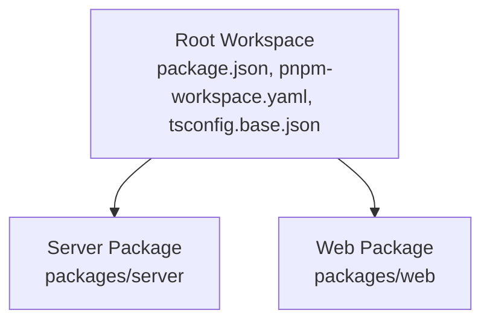

**Diagram sources**
- [pnpm-workspace.yaml:1-3](file://pnpm-workspace.yaml#L1-L3)
- [package.json:1-21](file://package.json#L1-L21)

**Section sources**
- [pnpm-workspace.yaml:1-3](file://pnpm-workspace.yaml#L1-L3)
- [package.json:1-21](file://package.json#L1-L21)

## Core Components
- Root scripts orchestrate development, building, testing, database operations, and starting the server.
- Server package defines Fastify routes, middleware, services, and security plugins; includes Vitest configuration and Prisma integration.
- Web package defines React UI, Vite configuration, and Vitest configuration for DOM-like testing.

**Section sources**
- [package.json:6-16](file://package.json#L6-L16)
- [packages/server/package.json:6-18](file://packages/server/package.json#L6-L18)
- [packages/web/package.json:6-14](file://packages/web/package.json#L6-L14)

## Architecture Overview
The runtime architecture combines a single-process server that serves both API endpoints and static frontend assets. The server exposes:
- REST endpoints for authentication, transfers, and P2P signaling
- Static file serving for the built React application
- Security plugins for heuristic scanning, behavior tracking, rate limiting, and audit logging

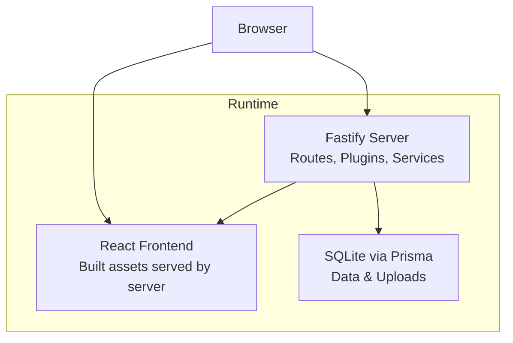

**Diagram sources**
- [packages/server/package.json:19-35](file://packages/server/package.json#L19-L35)
- [config.json:1-102](file://config.json#L1-L102)

## Detailed Component Analysis

### Development Environment Setup

#### Server Development
- Script: The server uses a TypeScript watcher to enable hot reload during development.
- Database: Prisma client generation and database push are supported via dedicated scripts.
- Debugging: Use the development script to launch the server; attach Node.js debugger to the spawned process.

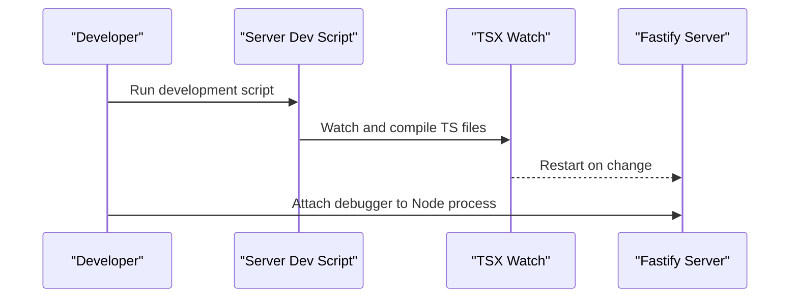

**Diagram sources**
- [packages/server/package.json:7](file://packages/server/package.json#L7)

**Section sources**
- [packages/server/package.json:7](file://packages/server/package.json#L7)

#### Web Development
- Script: Vite dev server runs the React app with React Fast Refresh.
- Port: Default port is configured in the Vite configuration.
- Debugging: Use browser devtools and React DevTools; breakpoints in TS/TSX files are supported.

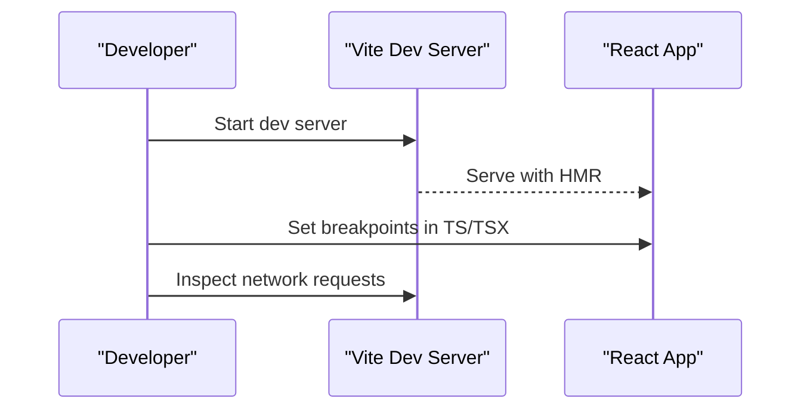

**Diagram sources**
- [packages/web/vite.config.ts:6-8](file://packages/web/vite.config.ts#L6-L8)
- [packages/web/package.json:7](file://packages/web/package.json#L7)

**Section sources**
- [packages/web/vite.config.ts:1-10](file://packages/web/vite.config.ts#L1-L10)
- [packages/web/package.json:7](file://packages/web/package.json#L7)

#### Combined Development with Single-Process Script
- The root shell script launches the server in development mode and prints helpful URLs and logs.
- It checks port availability and manages PID and logs.

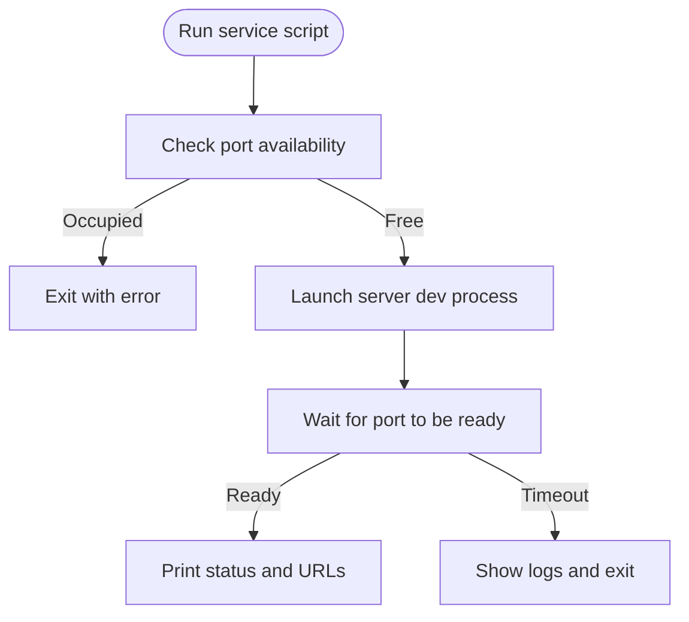

**Diagram sources**
- [airportal.sh:64-106](file://airportal.sh#L64-L106)

**Section sources**
- [airportal.sh:1-211](file://airportal.sh#L1-L211)

### Testing Strategy

#### Unit Testing with Vitest
- Server tests run in a Node environment with global helpers and coverage reporting.
- Web tests run in a jsdom environment simulating a DOM for React components.

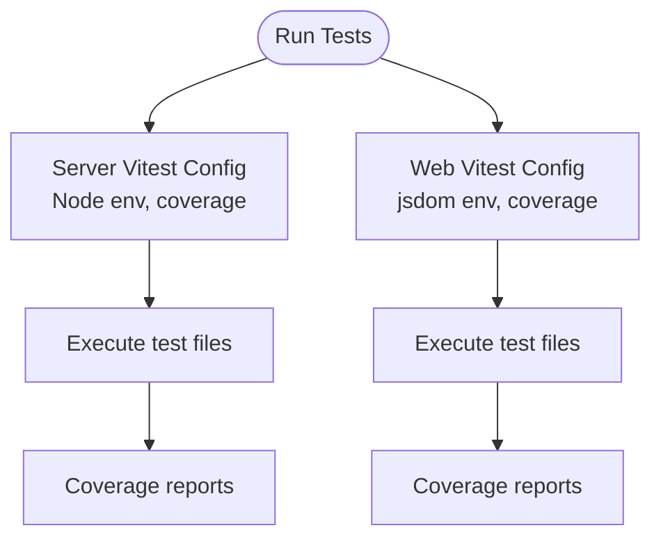

**Diagram sources**
- [packages/server/vitest.config.ts:4-16](file://packages/server/vitest.config.ts#L4-L16)
- [packages/web/vitest.config.ts:6-18](file://packages/web/vitest.config.ts#L6-L18)

**Section sources**
- [packages/server/vitest.config.ts:1-17](file://packages/server/vitest.config.ts#L1-L17)
- [packages/web/vitest.config.ts:1-19](file://packages/web/vitest.config.ts#L1-L19)

#### Integration Testing Patterns
- Server integration tests can leverage the test setup file to initialize services and mocks.
- Web integration tests can mount components and simulate user interactions using testing libraries.

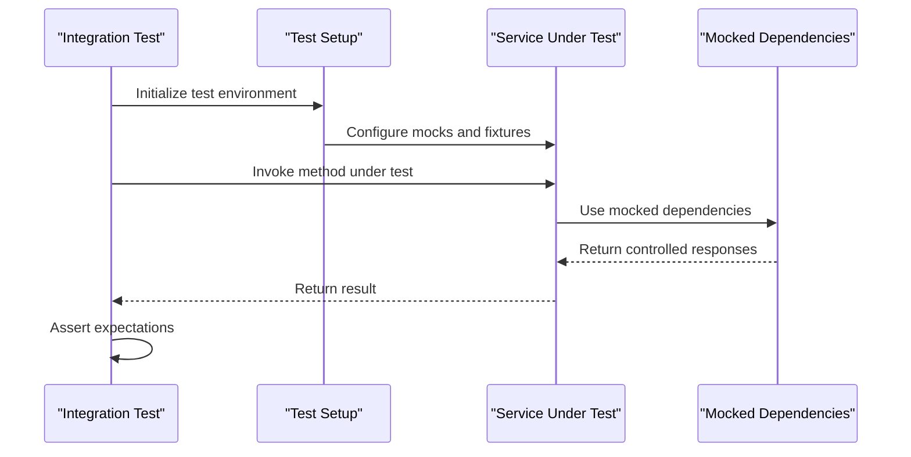

**Diagram sources**
- [packages/server/vitest.config.ts:14](file://packages/server/vitest.config.ts#L14)
- [packages/web/vitest.config.ts:9](file://packages/web/vitest.config.ts#L9)

**Section sources**
- [packages/server/vitest.config.ts:14](file://packages/server/vitest.config.ts#L14)
- [packages/web/vitest.config.ts:9](file://packages/web/vitest.config.ts#L9)

#### Mock Implementations for Services
- Use Vitest spies and stubs to mock external dependencies and side effects.
- For server services, isolate HTTP clients and database calls behind interfaces or factories to simplify mocking.

[No sources needed since this section provides general guidance]

### Build Process

#### Backend Build
- TypeScript compilation produces distributable JavaScript under the server’s dist directory.
- Prisma client generation is part of the build pipeline.

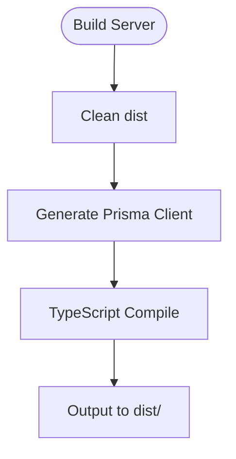

**Diagram sources**
- [packages/server/package.json:8](file://packages/server/package.json#L8)
- [packages/server/package.json:10](file://packages/server/package.json#L10)

**Section sources**
- [packages/server/package.json:8-10](file://packages/server/package.json#L8-L10)

#### Frontend Build
- Vite builds the React application with optimized assets and TypeScript emit.
- The built assets are served by the server in production.

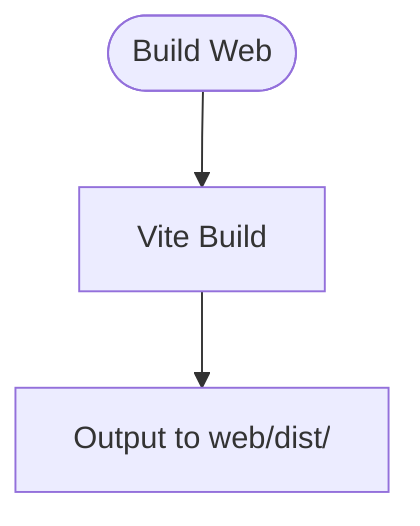

**Diagram sources**
- [packages/web/package.json:8](file://packages/web/package.json#L8)

**Section sources**
- [packages/web/package.json:8](file://packages/web/package.json#L8)

#### Production Packaging
- The packaging script orchestrates dependency installation, Prisma generation, frontend build, backend build, and creates a deployment archive with start/stop scripts and documentation.

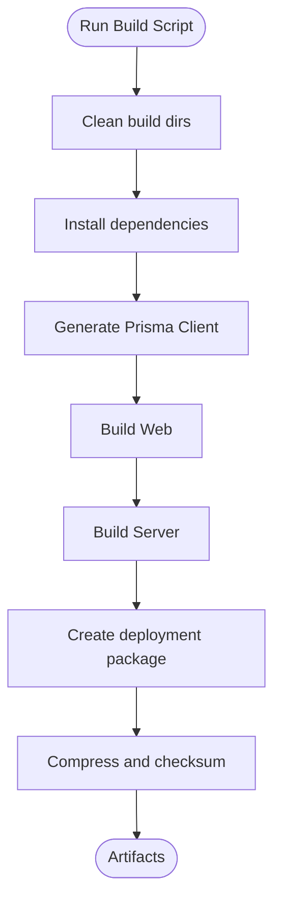

**Diagram sources**
- [build.sh:34-293](file://build.sh#L34-L293)

**Section sources**
- [build.sh:1-293](file://build.sh#L1-L293)

### Scripts and Commands

#### Root Scripts
- Development: Starts the server in watch mode via the server filter.
- Build: Builds both web and server packages.
- Test: Runs tests for both packages.
- Database: Generates Prisma client and pushes schema.
- Start: Starts the compiled server.

**Section sources**
- [package.json:6-16](file://package.json#L6-L16)

#### Server Scripts
- dev: Watch mode with TSX.
- build: TypeScript compile.
- start: Run compiled server.
- db:*: Prisma operations.
- test/test:watch/test:coverage: Vitest commands.
- clean: Remove dist.

**Section sources**
- [packages/server/package.json:6-18](file://packages/server/package.json#L6-L18)

#### Web Scripts
- dev: Vite dev server.
- build: TypeScript emit and Vite build.
- preview: Preview production build locally.
- test/test:watch/test:coverage: Vitest commands.
- clean: Remove dist.

**Section sources**
- [packages/web/package.json:6-14](file://packages/web/package.json#L6-L14)

### Configuration Files

#### Global TypeScript Base Config
- Shared compiler options across packages for strictness, module resolution, declaration maps, and source maps.

**Section sources**
- [tsconfig.base.json:1-22](file://tsconfig.base.json#L1-L22)

#### Server TypeScript Config
- Extends base config with NodeNext module resolution and output directory.

**Section sources**
- [packages/server/tsconfig.json:1-12](file://packages/server/tsconfig.json#L1-L12)

#### Web TypeScript Config
- Extends base config with bundler module resolution, JSX transform, and references to node-specific tsconfig.

**Section sources**
- [packages/web/tsconfig.json:1-19](file://packages/web/tsconfig.json#L1-L19)

#### Server Vitest Config
- Node environment, global setup, coverage, and include patterns.

**Section sources**
- [packages/server/vitest.config.ts:1-17](file://packages/server/vitest.config.ts#L1-L17)

#### Web Vitest Config
- jsdom environment, React plugin, setup files, and coverage.

**Section sources**
- [packages/web/vitest.config.ts:1-19](file://packages/web/vitest.config.ts#L1-L19)

#### Web Vite Config
- React plugin and dev server port.

**Section sources**
- [packages/web/vite.config.ts:1-10](file://packages/web/vite.config.ts#L1-L10)

### Code Quality Practices and Linting
- TypeScript strictness is enabled globally via the base configuration.
- Declaration maps and source maps are enabled for improved debugging.
- Coverage reporting is configured in both Vitest setups to track test completeness.
- Consider adding ESLint with TypeScript support and Prettier for formatting to complement existing TS configuration.

[No sources needed since this section provides general guidance]

### Continuous Integration Considerations
- CI should install dependencies using the workspace configuration, run tests for both packages, and collect coverage artifacts.
- Separate jobs for server and web tests can improve feedback speed.
- Use caching for pnpm to reduce CI runtime.

[No sources needed since this section provides general guidance]

## Dependency Analysis
The server package depends on Fastify and related plugins, Prisma client, and security-related libraries. The web package depends on React, React Router, and testing libraries. Both packages rely on Vitest and Vite for testing and development respectively.

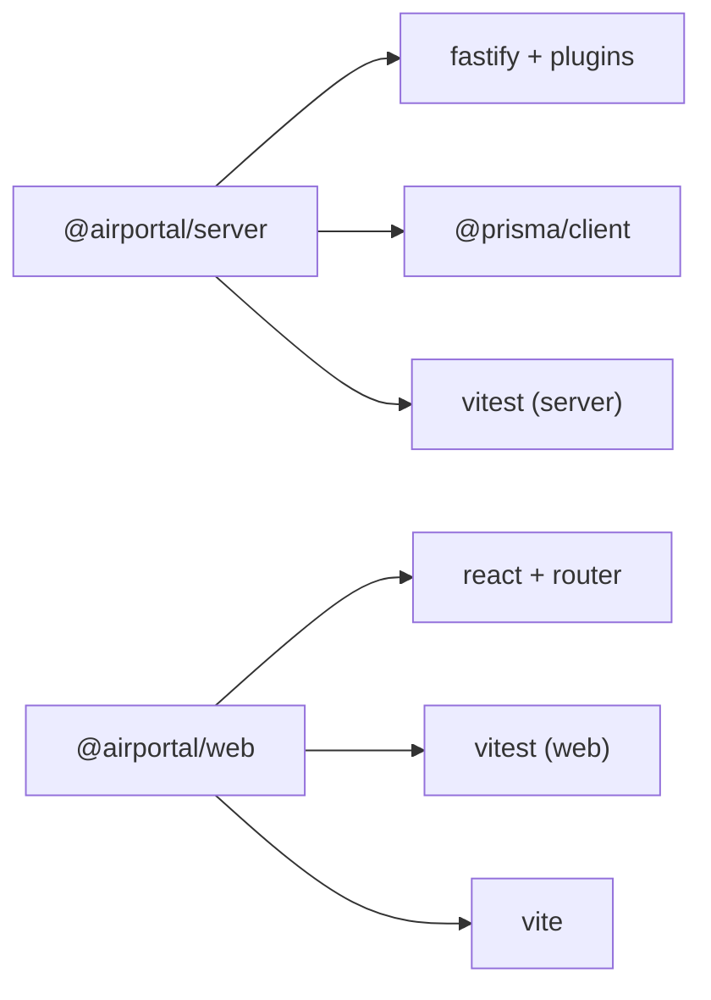

**Diagram sources**
- [packages/server/package.json:19-35](file://packages/server/package.json#L19-L35)
- [packages/web/package.json:15-22](file://packages/web/package.json#L15-L22)

**Section sources**
- [packages/server/package.json:19-35](file://packages/server/package.json#L19-L35)
- [packages/web/package.json:15-22](file://packages/web/package.json#L15-L22)

## Performance Considerations
- Prefer incremental builds and watch mode during development to minimize rebuild times.
- Keep test suites focused and isolated to maintain fast feedback loops.
- Use coverage thresholds to ensure critical paths are covered without over-testing.

[No sources needed since this section provides general guidance]

## Troubleshooting Guide

### Development Issues
- Port conflicts: The service script checks port availability and exits if occupied. Stop conflicting processes or change the port.
- Logs: Use the service script’s logs command to tail the server log file.
- Hot reload: Ensure TSX watch is running for the server and Vite dev server for the web package.

**Section sources**
- [airportal.sh:40-62](file://airportal.sh#L40-L62)
- [airportal.sh:171-178](file://airportal.sh#L171-L178)

### Testing Issues
- Server tests failing due to environment: Verify the Node environment and setup files are correctly configured.
- Web tests failing due to DOM: Ensure jsdom environment and React plugin are present.

**Section sources**
- [packages/server/vitest.config.ts:6](file://packages/server/vitest.config.ts#L6)
- [packages/web/vitest.config.ts:8](file://packages/web/vitest.config.ts#L8)

### Build Issues
- Missing Prisma client: Run the Prisma generation script before building.
- Build failures: Clean dist directories and rerun the build scripts.

**Section sources**
- [packages/server/package.json:10](file://packages/server/package.json#L10)
- [packages/server/package.json:17](file://packages/server/package.json#L17)

## Conclusion
Airportal’s development workflow leverages pnpm workspaces, Vite for the frontend, and TSX/watch for the backend to provide efficient hot reload and debugging. Vitest is configured for both packages with coverage reporting. The build and packaging scripts streamline production deployment. By following the testing patterns and debugging strategies outlined here, contributors can efficiently develop, test, and iterate on Airportal.

## Appendices

### Configuration Reference
- Server runtime configuration keys are defined in the central configuration file.
- Adjust ports, security policies, upload limits, and logging levels according to environment needs.

**Section sources**
- [config.json:1-102](file://config.json#L1-L102)

### Deployment Scripts
- One-click deployment script automates environment detection, dependency installation, database initialization, building, and service startup with PM2.

**Section sources**
- [deploy.sh:339-386](file://deploy.sh#L339-L386)