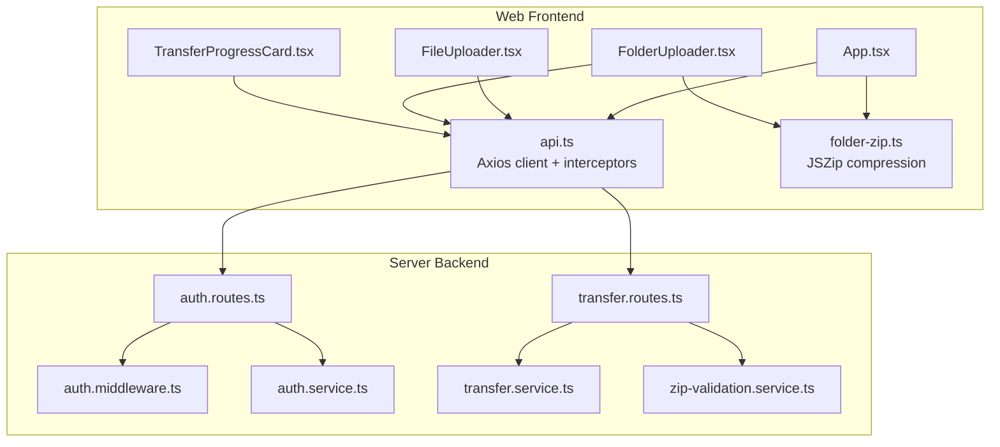
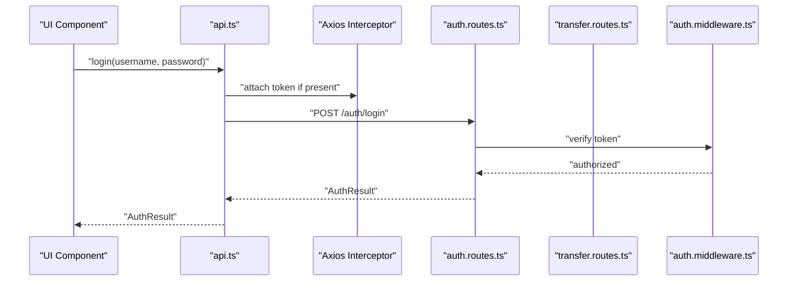
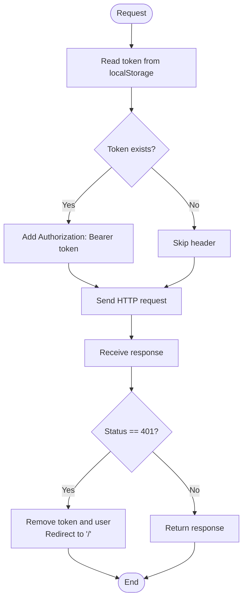
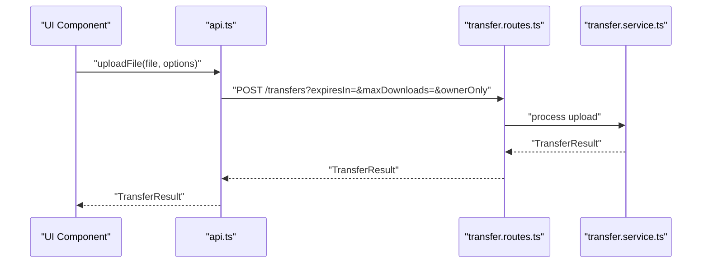
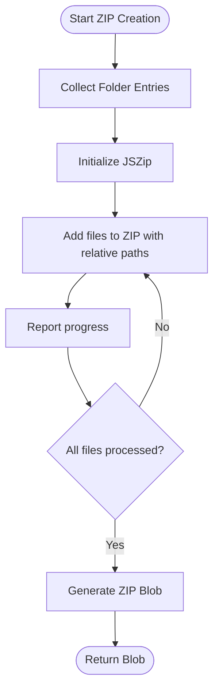
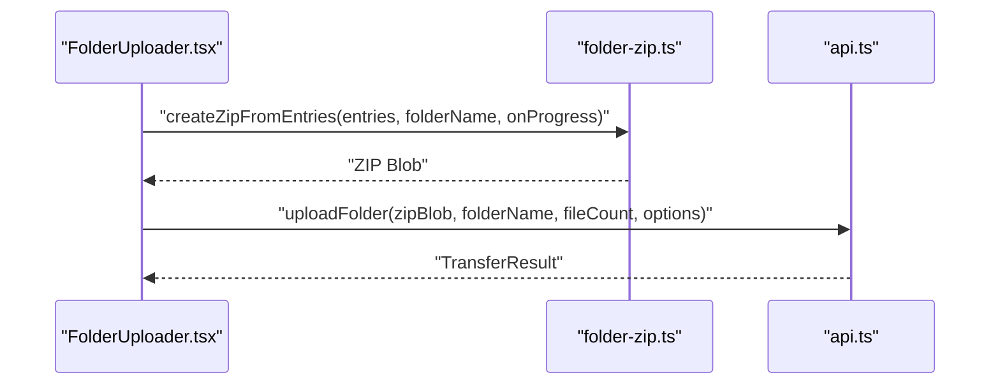
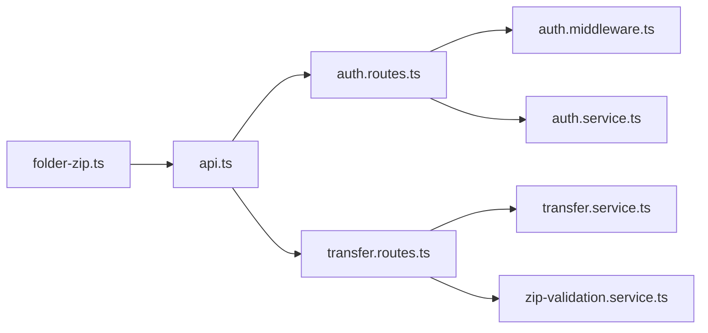

# API Integration

<cite>
**Referenced Files in This Document**
- [api.ts](file://packages/web/src/services/api.ts)
- [folder-zip.ts](file://packages/web/src/services/folder-zip.ts)
- [App.tsx](file://packages/web/src/App.tsx)
- [FileUploader.tsx](file://packages/web/src/components/FileUploader.tsx)
- [FolderUploader.tsx](file://packages/web/src/components/FolderUploader.tsx)
- [TransferProgressCard.tsx](file://packages/web/src/components/TransferProgressCard.tsx)
- [auth.routes.ts](file://packages/server/src/routes/auth.routes.ts)
- [auth.middleware.ts](file://packages/server/src/middlewares/auth.middleware.ts)
- [auth.service.ts](file://packages/server/src/services/auth.service.ts)
- [transfer.routes.ts](file://packages/server/src/routes/transfer.routes.ts)
- [transfer.service.ts](file://packages/server/src/services/transfer.service.ts)
- [zip-validation.service.ts](file://packages/server/src/services/zip-validation.service.ts)
</cite>

## Table of Contents
1. [Introduction](#introduction)
2. [Project Structure](#project-structure)
3. [Core Components](#core-components)
4. [Architecture Overview](#architecture-overview)
5. [Detailed Component Analysis](#detailed-component-analysis)
6. [Dependency Analysis](#dependency-analysis)
7. [Performance Considerations](#performance-considerations)
8. [Troubleshooting Guide](#troubleshooting-guide)
9. [Conclusion](#conclusion)

## Introduction
This document explains Airportal's API integration patterns with a focus on the frontend service layer, authentication, file handling, and backend routes. It covers HTTP client configuration, request/response handling, error management, token handling, request interceptors, response transformers, folder compression using JSZip, upload progress tracking, and large file optimization strategies. It also outlines API versioning considerations, error boundaries, and retry mechanisms.

## Project Structure
Airportal consists of a frontend web application and a backend server. The frontend exposes an Axios-based service layer for API communication and a folder-zip service for client-side compression. The backend defines authentication and transfer routes, middleware for authentication, and services for business logic.

**Diagram sources**
- [App.tsx](file://packages/web/src/App.tsx)
- [api.ts](file://packages/web/src/services/api.ts)
- [folder-zip.ts](file://packages/web/src/services/folder-zip.ts)
- [FileUploader.tsx](file://packages/web/src/components/FileUploader.tsx)
- [FolderUploader.tsx](file://packages/web/src/components/FolderUploader.tsx)
- [TransferProgressCard.tsx](file://packages/web/src/components/TransferProgressCard.tsx)
- [auth.routes.ts](file://packages/server/src/routes/auth.routes.ts)
- [auth.middleware.ts](file://packages/server/src/middlewares/auth.middleware.ts)
- [auth.service.ts](file://packages/server/src/services/auth.service.ts)
- [transfer.routes.ts](file://packages/server/src/routes/transfer.routes.ts)
- [transfer.service.ts](file://packages/server/src/services/transfer.service.ts)
- [zip-validation.service.ts](file://packages/server/src/services/zip-validation.service.ts)

**Section sources**
- [api.ts](file://packages/web/src/services/api.ts)
- [folder-zip.ts](file://packages/web/src/services/folder-zip.ts)
- [auth.routes.ts](file://packages/server/src/routes/auth.routes.ts)
- [transfer.routes.ts](file://packages/server/src/routes/transfer.routes.ts)

## Core Components
- HTTP client and interceptors: Centralized Axios instance with base URL and request/response interceptors for token injection and 401 handling.
- Authentication API: Registration, login, and profile retrieval endpoints.
- Transfer API: Configuration retrieval, file upload, folder upload (via pre-compressed ZIP), text upload, and content retrieval.
- Folder compression: Client-side ZIP creation with progress callbacks.
- UI integration: Components that orchestrate uploads and display progress.

Key responsibilities:
- api.ts: Configure Axios, inject Authorization header, handle 401 logout, expose typed auth and transfer APIs.
- folder-zip.ts: Traverse filesystem entries, create ZIP archives, and report compression progress.

**Section sources**
- [api.ts](file://packages/web/src/services/api.ts)
- [folder-zip.ts](file://packages/web/src/services/folder-zip.ts)

## Architecture Overview
The frontend communicates with the backend via Axios interceptors that attach tokens and handle unauthorized responses. The backend enforces authentication via middleware and exposes routes for authentication and transfers. Folder uploads are handled by sending a pre-compressed ZIP with metadata parameters.

**Diagram sources**
- [api.ts](file://packages/web/src/services/api.ts)
- [auth.routes.ts](file://packages/server/src/routes/auth.routes.ts)
- [auth.middleware.ts](file://packages/server/src/middlewares/auth.middleware.ts)

## Detailed Component Analysis

### HTTP Client and Interceptors (api.ts)
- Base configuration: Axios instance configured with a base URL and JSON content type.
- Request interceptor: Reads token from local storage and attaches an Authorization header if present.
- Response interceptor: On 401 Unauthorized, clears token and user from local storage and redirects to home.
- Typed endpoints:
  - authApi.register, authApi.login, authApi.getMe
  - transferApi.getConfig, transferApi.uploadFile, transferApi.uploadFolder, transferApi.uploadText, transferApi.getContent

**Diagram sources**
- [api.ts](file://packages/web/src/services/api.ts)

**Section sources**
- [api.ts](file://packages/web/src/services/api.ts)

### Authentication API
- Endpoints: register, login, get profile.
- Payloads: username/password for register/login; returns an AuthResult containing user and token.
- Profile retrieval: GET /auth/me returns current user.

Integration pattern:
- Components call authApi.register or authApi.login.
- On success, store token and user in local storage.
- Subsequent requests automatically include the token via the request interceptor.

**Section sources**
- [api.ts](file://packages/web/src/services/api.ts)
- [auth.routes.ts](file://packages/server/src/routes/auth.routes.ts)
- [auth.middleware.ts](file://packages/server/src/middlewares/auth.middleware.ts)
- [auth.service.ts](file://packages/server/src/services/auth.service.ts)

### Transfer API
- Configuration: GET /transfers/config returns server-side limits and options.
- File upload: POST /transfers with multipart/form-data, optional query parameters for expiration, download limits, and ownership.
- Folder upload: POST /transfers with type=folder, folderName, fileCount, plus the same optional parameters.
- Text upload: POST /transfers with text payload and optional parameters.
- Content retrieval: GET /transfers/:code returns either a Blob (downloadable file) or a text content object depending on content-type detection.

**Diagram sources**
- [api.ts](file://packages/web/src/services/api.ts)
- [transfer.routes.ts](file://packages/server/src/routes/transfer.routes.ts)
- [transfer.service.ts](file://packages/server/src/services/transfer.service.ts)

**Section sources**
- [api.ts](file://packages/web/src/services/api.ts)
- [transfer.routes.ts](file://packages/server/src/routes/transfer.routes.ts)
- [transfer.service.ts](file://packages/server/src/services/transfer.service.ts)

### Folder Compression Service (folder-zip.ts)
- Folder traversal: Recursively collects files from a FileSystemDirectoryEntry, handling batches returned by readEntries.
- ZIP creation: Uses JSZip to create a compressed archive with DEFLATE compression and a moderate compression level.
- Progress reporting: Calls onProgress callback with percentage completion during file addition.
- Fallback: Supports creating ZIP from FileList when filesystem directory APIs are unavailable.

**Diagram sources**
- [folder-zip.ts](file://packages/web/src/services/folder-zip.ts)

**Section sources**
- [folder-zip.ts](file://packages/web/src/services/folder-zip.ts)

### UI Integration Points
- App.tsx: Root component orchestrating routing and global state.
- FileUploader.tsx: Handles single-file selection and invokes transferApi.uploadFile.
- FolderUploader.tsx: Uses folder-zip.ts to create a ZIP and invokes transferApi.uploadFolder.
- TransferProgressCard.tsx: Displays upload progress and status.

**Diagram sources**
- [FolderUploader.tsx](file://packages/web/src/components/FolderUploader.tsx)
- [folder-zip.ts](file://packages/web/src/services/folder-zip.ts)
- [api.ts](file://packages/web/src/services/api.ts)

**Section sources**
- [App.tsx](file://packages/web/src/App.tsx)
- [FileUploader.tsx](file://packages/web/src/components/FileUploader.tsx)
- [FolderUploader.tsx](file://packages/web/src/components/FolderUploader.tsx)
- [TransferProgressCard.tsx](file://packages/web/src/components/TransferProgressCard.tsx)

## Dependency Analysis
- Frontend dependencies:
  - api.ts depends on local storage for tokens and on backend routes for auth and transfers.
  - folder-zip.ts depends on JSZip and browser filesystem APIs.
- Backend dependencies:
  - auth.routes.ts depends on auth.middleware.ts for authentication and auth.service.ts for business logic.
  - transfer.routes.ts depends on transfer.service.ts for processing and zip-validation.service.ts for ZIP validation.

**Diagram sources**
- [api.ts](file://packages/web/src/services/api.ts)
- [auth.routes.ts](file://packages/server/src/routes/auth.routes.ts)
- [auth.middleware.ts](file://packages/server/src/middlewares/auth.middleware.ts)
- [auth.service.ts](file://packages/server/src/services/auth.service.ts)
- [transfer.routes.ts](file://packages/server/src/routes/transfer.routes.ts)
- [transfer.service.ts](file://packages/server/src/services/transfer.service.ts)
- [zip-validation.service.ts](file://packages/server/src/services/zip-validation.service.ts)
- [folder-zip.ts](file://packages/web/src/services/folder-zip.ts)

**Section sources**
- [api.ts](file://packages/web/src/services/api.ts)
- [auth.routes.ts](file://packages/server/src/routes/auth.routes.ts)
- [auth.middleware.ts](file://packages/server/src/middlewares/auth.middleware.ts)
- [auth.service.ts](file://packages/server/src/services/auth.service.ts)
- [transfer.routes.ts](file://packages/server/src/routes/transfer.routes.ts)
- [transfer.service.ts](file://packages/server/src/services/transfer.service.ts)
- [zip-validation.service.ts](file://packages/server/src/services/zip-validation.service.ts)
- [folder-zip.ts](file://packages/web/src/services/folder-zip.ts)

## Performance Considerations
- Compression level: JSZip uses DEFLATE with a moderate compression level to balance speed and size.
- Batched directory reading: The folder traversal loops until all entries are read, preventing missed items.
- Multipart uploads: Files and ZIPs are uploaded as multipart/form-data to leverage efficient streaming.
- Content-type handling: The transfer API detects JSON-wrapped responses versus binary content to avoid unnecessary parsing overhead.

[No sources needed since this section provides general guidance]

## Troubleshooting Guide
Common issues and resolutions:
- 401 Unauthorized: The response interceptor clears tokens and redirects to the home page. Ensure tokens are stored after login and that the interceptor is applied to all requests.
- CORS errors: Verify the frontend base URL matches the backend origin and that the backend serves appropriate CORS headers.
- ZIP creation failures: Confirm browser support for filesystem directory APIs or use fallback file list mode. Validate that all files are readable and not blocked by browser policies.
- Large file uploads: Prefer chunked transfer strategies on the backend and monitor upload progress via the UI components. Consider server-side timeouts and size limits.

**Section sources**
- [api.ts](file://packages/web/src/services/api.ts)
- [folder-zip.ts](file://packages/web/src/services/folder-zip.ts)

## Conclusion
Airportal's API integration centers around a robust Axios client with interceptors for token management and automatic 401 handling. The frontend provides a cohesive set of services for authentication and transfers, including client-side folder compression with progress tracking. The backend enforces authentication and processes uploads with validation. Together, these components deliver a reliable, user-friendly file and text transfer experience.