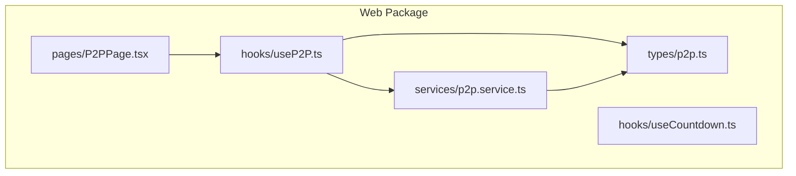
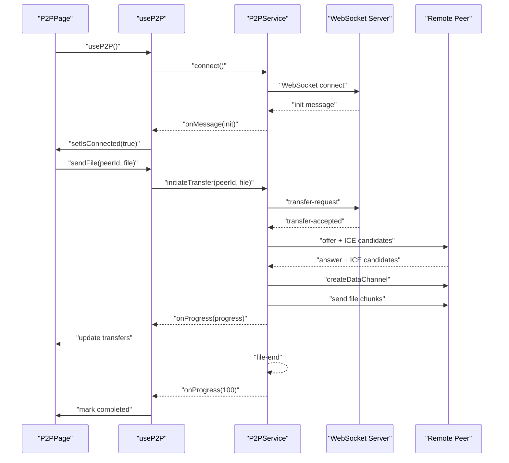
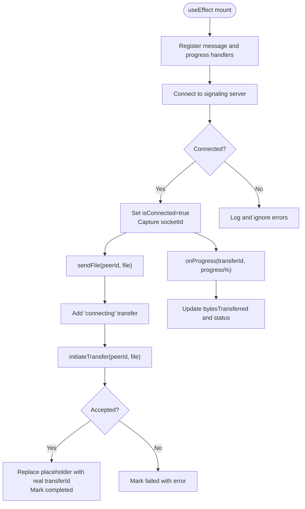
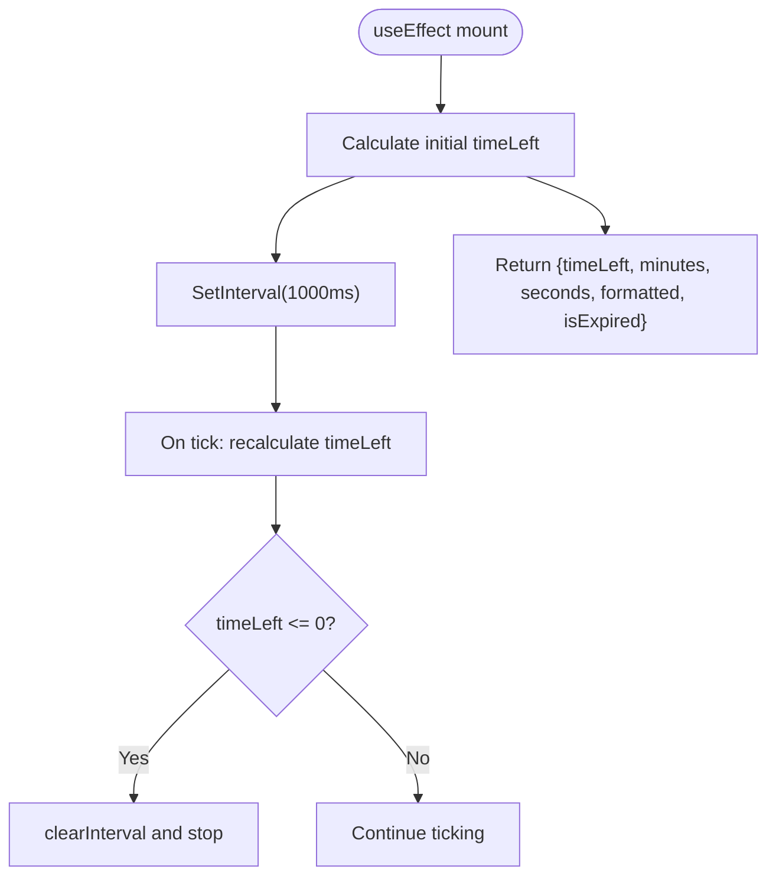
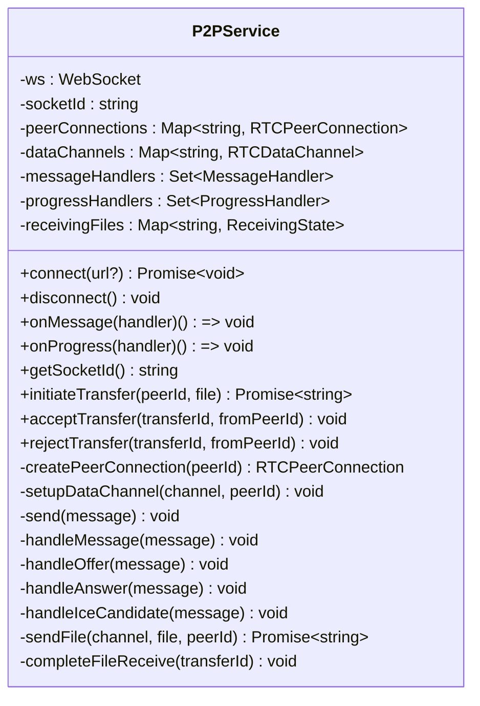
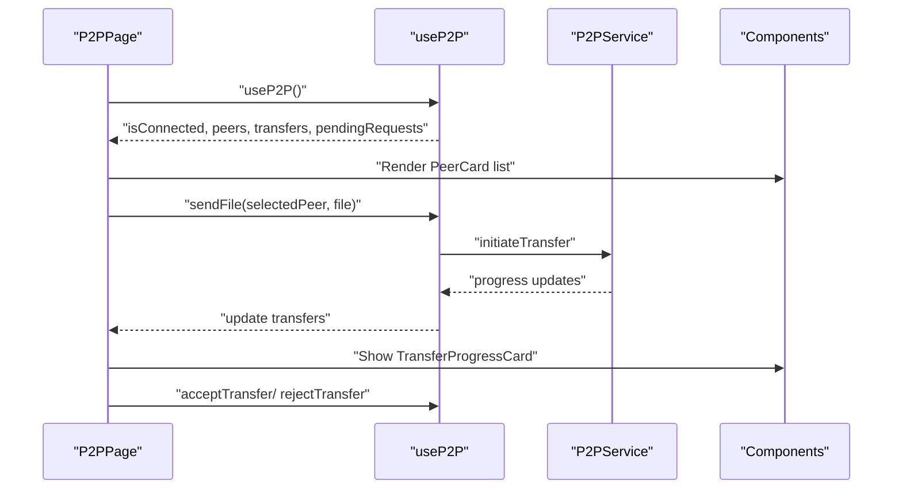
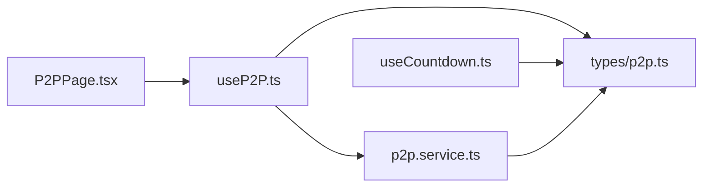

# Custom Hooks System

<cite>
**Referenced Files in This Document**
- [useP2P.ts](file://packages/web/src/hooks/useP2P.ts)
- [useCountdown.ts](file://packages/web/src/hooks/useCountdown.ts)
- [p2p.service.ts](file://packages/web/src/services/p2p.service.ts)
- [P2PPage.tsx](file://packages/web/src/pages/P2PPage.tsx)
- [p2p.ts](file://packages/web/src/types/p2p.ts)
- [useCountdown.test.ts](file://packages/web/test/hooks/useCountdown.test.ts)
</cite>

## Table of Contents
1. [Introduction](#introduction)
2. [Project Structure](#project-structure)
3. [Core Components](#core-components)
4. [Architecture Overview](#architecture-overview)
5. [Detailed Component Analysis](#detailed-component-analysis)
6. [Dependency Analysis](#dependency-analysis)
7. [Performance Considerations](#performance-considerations)
8. [Troubleshooting Guide](#troubleshooting-guide)
9. [Conclusion](#conclusion)
10. [Appendices](#appendices)

## Introduction
This document provides comprehensive documentation for Airportal's custom React hooks system, focusing on two primary hooks:
- useP2P: Manages WebRTC peer-to-peer file transfer lifecycle, including signaling, peer discovery, data channel creation, and real-time transfer coordination.
- useCountdown: Provides expiration timer management with automatic cleanup and formatted display values.

The documentation covers implementation patterns, state management, dependency handling, performance optimizations, testing strategies, and best practices for hook composition and naming conventions.

## Project Structure
The hooks system resides in the web package under the hooks directory. It integrates with a dedicated P2P service singleton and shared TypeScript types.

**Diagram sources**
- [useP2P.ts:1-155](file://packages/web/src/hooks/useP2P.ts#L1-L155)
- [useCountdown.ts:1-37](file://packages/web/src/hooks/useCountdown.ts#L1-L37)
- [p2p.service.ts:1-580](file://packages/web/src/services/p2p.service.ts#L1-L580)
- [p2p.ts:1-101](file://packages/web/src/types/p2p.ts#L1-L101)
- [P2PPage.tsx:1-155](file://packages/web/src/pages/P2PPage.tsx#L1-L155)

**Section sources**
- [useP2P.ts:1-155](file://packages/web/src/hooks/useP2P.ts#L1-L155)
- [useCountdown.ts:1-37](file://packages/web/src/hooks/useCountdown.ts#L1-L37)
- [p2p.service.ts:1-580](file://packages/web/src/services/p2p.service.ts#L1-L580)
- [p2p.ts:1-101](file://packages/web/src/types/p2p.ts#L1-L101)
- [P2PPage.tsx:1-155](file://packages/web/src/pages/P2PPage.tsx#L1-L155)

## Core Components
- useP2P: Centralized hook for WebRTC P2P operations. Exposes connection state, peer list, transfer progress, and pending requests, along with actions to send files and manage transfer requests.
- useCountdown: Timer hook that computes remaining time, minutes, seconds, and formatted display string, with automatic cleanup.

Key responsibilities:
- useP2P orchestrates signaling via WebSocket, manages peer connections, creates data channels, handles file chunking and backpressure, and coordinates UI state updates.
- useCountdown encapsulates interval-based countdown logic with memoized calculations and cleanup.

**Section sources**
- [useP2P.ts:23-154](file://packages/web/src/hooks/useP2P.ts#L23-L154)
- [useCountdown.ts:3-36](file://packages/web/src/hooks/useCountdown.ts#L3-L36)

## Architecture Overview
The P2P system follows a layered architecture:
- Hook Layer: useP2P exposes a simple API to components and manages React state.
- Service Layer: p2p.service.ts encapsulates WebSocket signaling, WebRTC peer connection management, data channel operations, and file transfer logic.
- Type Layer: Shared TypeScript interfaces define message schemas and state structures.
- UI Layer: P2PPage consumes useP2P to render peers, transfers, and request modals.

**Diagram sources**
- [useP2P.ts:30-92](file://packages/web/src/hooks/useP2P.ts#L30-L92)
- [p2p.service.ts:36-103](file://packages/web/src/services/p2p.service.ts#L36-L103)
- [p2p.service.ts:362-398](file://packages/web/src/services/p2p.service.ts#L362-L398)
- [p2p.service.ts:403-446](file://packages/web/src/services/p2p.service.ts#L403-L446)
- [p2p.service.ts:451-498](file://packages/web/src/services/p2p.service.ts#L451-L498)

## Detailed Component Analysis

### useP2P Hook Implementation
The useP2P hook centralizes WebRTC P2P operations and maintains UI state. It registers message and progress handlers during mount, connects to the signaling server, and exposes APIs for file transfer and request management.

Implementation highlights:
- Idempotent connection: The underlying service ensures safe reconnection under React 18 StrictMode.
- Handler registration order: Message handlers are registered before connection to avoid missing initial broadcast messages.
- State management: Maintains connection state, socket ID, peer list, transfer progress, and pending requests.
- Transfer orchestration: Creates a temporary "connecting" transfer entry, initiates transfer via the service, and updates state upon completion or failure.
- Cleanup: Unregisters handlers on component unmount while preserving the singleton service lifecycle.

**Diagram sources**
- [useP2P.ts:30-92](file://packages/web/src/hooks/useP2P.ts#L30-L92)
- [useP2P.ts:94-132](file://packages/web/src/hooks/useP2P.ts#L94-L132)
- [useP2P.ts:65-78](file://packages/web/src/hooks/useP2P.ts#L65-L78)

**Section sources**
- [useP2P.ts:23-154](file://packages/web/src/hooks/useP2P.ts#L23-L154)
- [p2p.service.ts:35-103](file://packages/web/src/services/p2p.service.ts#L35-L103)
- [p2p.service.ts:362-398](file://packages/web/src/services/p2p.service.ts#L362-L398)
- [p2p.service.ts:403-446](file://packages/web/src/services/p2p.service.ts#L403-L446)
- [p2p.service.ts:451-498](file://packages/web/src/services/p2p.service.ts#L451-L498)

### useCountdown Hook Implementation
The useCountdown hook provides a simple, reusable timer mechanism with automatic cleanup. It calculates remaining time, minutes, seconds, and a formatted MM:SS string, and exposes an expiration flag.

Key aspects:
- Memoized calculation: Uses useCallback to prevent recalculation on every render.
- Interval management: Sets up a 1-second interval and clears it on unmount.
- Edge handling: Ensures timeLeft never goes below zero and stops the timer at expiration.

**Diagram sources**
- [useCountdown.ts:12-24](file://packages/web/src/hooks/useCountdown.ts#L12-L24)
- [useCountdown.ts:6-10](file://packages/web/src/hooks/useCountdown.ts#L6-L10)

**Section sources**
- [useCountdown.ts:3-36](file://packages/web/src/hooks/useCountdown.ts#L3-L36)

### P2P Service Singleton
The P2PService class encapsulates all WebRTC and signaling logic. It manages:
- WebSocket connection and message routing
- Peer connections and ICE candidate exchange
- Data channel creation and event handling
- File transfer protocol including chunking, backpressure, and progress reporting
- Request acceptance/rejection flow

Important behaviors:
- Singleton pattern: Designed as a page-wide singleton to persist across component mounts.
- Idempotent connect: Handles existing connections and pending connections safely.
- Backpressure control: Limits buffered amount in data channels to prevent memory pressure.
- Chunking strategy: Sends file metadata, binary chunks, and completion markers.

**Diagram sources**
- [p2p.service.ts:14-576](file://packages/web/src/services/p2p.service.ts#L14-L576)

**Section sources**
- [p2p.service.ts:14-576](file://packages/web/src/services/p2p.service.ts#L14-L576)

### UI Integration Example
P2PPage demonstrates hook composition and state-driven rendering:
- Consumes useP2P to access connection state, peers, transfers, and pending requests.
- Integrates file selection and send actions with controlled UI state.
- Renders peer cards, transfer progress cards, and a transfer request modal.

**Diagram sources**
- [P2PPage.tsx:7-16](file://packages/web/src/pages/P2PPage.tsx#L7-L16)
- [P2PPage.tsx:22-39](file://packages/web/src/pages/P2PPage.tsx#L22-L39)
- [P2PPage.tsx:145-151](file://packages/web/src/pages/P2PPage.tsx#L145-L151)

**Section sources**
- [P2PPage.tsx:1-155](file://packages/web/src/pages/P2PPage.tsx#L1-L155)

## Dependency Analysis
The hooks system exhibits clear separation of concerns:
- useP2P depends on p2p.service.ts for all networking and WebRTC operations.
- Both hooks rely on shared TypeScript types for message and state structures.
- UI components depend on hooks for state and actions.

**Diagram sources**
- [P2PPage.tsx:1-155](file://packages/web/src/pages/P2PPage.tsx#L1-L155)
- [useP2P.ts:1-11](file://packages/web/src/hooks/useP2P.ts#L1-L11)
- [p2p.service.ts:1-7](file://packages/web/src/services/p2p.service.ts#L1-L7)
- [p2p.ts:1-101](file://packages/web/src/types/p2p.ts#L1-L101)
- [useCountdown.ts:1-1](file://packages/web/src/hooks/useCountdown.ts#L1-L1)

**Section sources**
- [useP2P.ts:1-11](file://packages/web/src/hooks/useP2P.ts#L1-L11)
- [p2p.service.ts:1-7](file://packages/web/src/services/p2p.service.ts#L1-L7)
- [p2p.ts:1-101](file://packages/web/src/types/p2p.ts#L1-L101)
- [P2PPage.tsx:1-155](file://packages/web/src/pages/P2PPage.tsx#L1-L155)

## Performance Considerations
- useP2P
  - Idempotent connection reduces redundant WebSocket creation under strict mode.
  - Handler unregistration prevents memory leaks and duplicate updates.
  - Immediate UI feedback with a placeholder transfer improves perceived responsiveness.
- useCountdown
  - useCallback prevents unnecessary recalculations across renders.
  - Single interval per hook instance avoids excessive timers.
- P2PService
  - Backpressure control in data channels prevents memory spikes.
  - Chunk size tuned for WebRTC data channel safety.
  - Buffered amount monitoring ensures smooth transfer progression.

[No sources needed since this section provides general guidance]

## Troubleshooting Guide
Common issues and resolutions:
- Connection failures
  - Verify signaling server availability and WebSocket URL construction.
  - Check browser console for WebSocket error logs.
- Transfer timeouts
  - Confirm peer connectivity and ICE candidate exchange.
  - Ensure data channel opens within the established timeout window.
- Progress not updating
  - Validate progress handler registration and message dispatch.
  - Confirm chunk transmission and progress reporting loop.
- Timer not stopping
  - Ensure cleanup function removes intervals on unmount.
  - Verify expiration condition triggers clearInterval.

**Section sources**
- [p2p.service.ts:98-102](file://packages/web/src/services/p2p.service.ts#L98-L102)
- [p2p.service.ts:476-480](file://packages/web/src/services/p2p.service.ts#L476-L480)
- [useCountdown.ts:23-24](file://packages/web/src/hooks/useCountdown.ts#L23-L24)

## Conclusion
Airportal's custom hooks system demonstrates robust patterns for managing complex asynchronous workflows:
- useP2P abstracts WebRTC signaling and data channel operations behind a simple hook interface.
- useCountdown encapsulates timer logic with proper resource cleanup.
- The P2PService singleton centralizes networking concerns, enabling reliable state synchronization and real-time transfer coordination.
Adhering to hook composition, dependency isolation, and performance best practices ensures maintainable and scalable UI logic.

[No sources needed since this section summarizes without analyzing specific files]

## Appendices

### Hook Testing Strategies
Recommended approaches for testing hooks:
- useCountdown
  - Mock Date to simulate time progression.
  - Assert returned values for timeLeft, minutes, seconds, formatted string, and isExpired.
  - Verify interval cleanup on unmount.
- useP2P
  - Mock p2p.service to simulate signaling events and transfer outcomes.
  - Test state transitions for connecting, transferring, completed, and failed states.
  - Validate handler registration and cleanup behavior.

**Section sources**
- [useCountdown.test.ts:1-200](file://packages/web/test/hooks/useCountdown.test.ts#L1-L200)
- [useP2P.ts:30-92](file://packages/web/src/hooks/useP2P.ts#L30-L92)
- [p2p.service.ts:148-159](file://packages/web/src/services/p2p.service.ts#L148-L159)

### Best Practices
- Naming conventions
  - Prefix hooks with usePrefix to indicate React hook semantics.
  - Use descriptive names reflecting domain intent (e.g., useP2P, useCountdown).
- Prop drilling elimination
  - Encapsulate state and side effects in hooks to avoid passing callbacks through multiple layers.
- State abstraction patterns
  - Keep hook state minimal and derived from service state.
  - Expose only necessary actions and computed values to consumers.
- Dependency management
  - Centralize external integrations (WebSocket, WebRTC) in a singleton service.
  - Register and unregister listeners carefully to prevent leaks.
- Performance optimization
  - Memoize calculations with useCallback.
  - Use idempotent operations for connections.
  - Implement backpressure and chunking for large data transfers.

[No sources needed since this section provides general guidance]