# Frontend System

<cite>
**Referenced Files in This Document**
- [App.tsx](file://packages/web/src/App.tsx)
- [main.tsx](file://packages/web/src/main.tsx)
- [Layout.tsx](file://packages/web/src/components/Layout.tsx)
- [useStore.ts](file://packages/web/src/stores/useStore.ts)
- [FileUploader.tsx](file://packages/web/src/components/FileUploader.tsx)
- [FolderUploader.tsx](file://packages/web/src/components/FolderUploader.tsx)
- [TextInput.tsx](file://packages/web/src/components/TextInput.tsx)
- [CodeInput.tsx](file://packages/web/src/components/CodeInput.tsx)
- [SendPage.tsx](file://packages/web/src/pages/SendPage.tsx)
- [ReceivePage.tsx](file://packages/web/src/pages/ReceivePage.tsx)
- [LoginPage.tsx](file://packages/web/src/pages/LoginPage.tsx)
- [P2PPage.tsx](file://packages/web/src/pages/P2PPage.tsx)
- [api.ts](file://packages/web/src/services/api.ts)
- [p2p.service.ts](file://packages/web/src/services/p2p.service.ts)
</cite>

## Table of Contents
1. [Introduction](#introduction)
2. [Project Structure](#project-structure)
3. [Core Components](#core-components)
4. [Architecture Overview](#architecture-overview)
5. [Detailed Component Analysis](#detailed-component-analysis)
6. [Dependency Analysis](#dependency-analysis)
7. [Performance Considerations](#performance-considerations)
8. [Troubleshooting Guide](#troubleshooting-guide)
9. [Conclusion](#conclusion)

## Introduction
This document describes the frontend system of Airportal’s React application. It covers the component hierarchy, routing configuration with React Router, state management using Zustand, UI component architecture (FileUploader, FolderUploader, TextInput, CodeInput), page components (SendPage, ReceivePage, LoginPage, P2PPage), API integration patterns, the service layer for backend communication, file upload handling mechanisms, layout and navigation, responsive design patterns, form handling and validation strategies, and user experience optimizations.

## Project Structure
The frontend is organized under packages/web/src with the following high-level structure:
- Entry points: main.tsx and App.tsx
- Routing and layout: App.tsx defines routes; Layout.tsx wraps pages
- Pages: SendPage, ReceivePage, LoginPage, P2PPage, HomePage
- UI components: FileUploader, FolderUploader, TextInput, CodeInput, and others
- Services: API client (Axios) and P2P service (WebRTC)
- State management: Zustand store with persistence
- Styles: Tailwind-based global styles

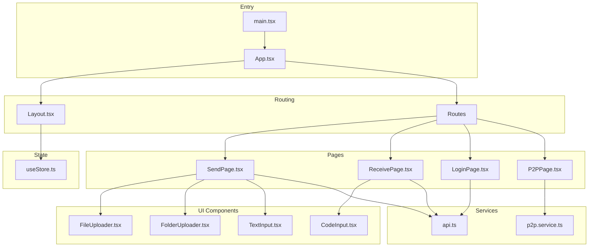

**Diagram sources**
- [main.tsx:1-11](file://packages/web/src/main.tsx#L1-L11)
- [App.tsx:1-26](file://packages/web/src/App.tsx#L1-L26)
- [Layout.tsx:1-62](file://packages/web/src/components/Layout.tsx#L1-L62)
- [SendPage.tsx:1-193](file://packages/web/src/pages/SendPage.tsx#L1-L193)
- [ReceivePage.tsx:1-78](file://packages/web/src/pages/ReceivePage.tsx#L1-L78)
- [LoginPage.tsx:1-105](file://packages/web/src/pages/LoginPage.tsx#L1-L105)
- [P2PPage.tsx:1-155](file://packages/web/src/pages/P2PPage.tsx#L1-L155)
- [FileUploader.tsx:1-86](file://packages/web/src/components/FileUploader.tsx#L1-L86)
- [FolderUploader.tsx:1-161](file://packages/web/src/components/FolderUploader.tsx#L1-L161)
- [TextInput.tsx:1-43](file://packages/web/src/components/TextInput.tsx#L1-L43)
- [CodeInput.tsx:1-74](file://packages/web/src/components/CodeInput.tsx#L1-L74)
- [api.ts:1-133](file://packages/web/src/services/api.ts#L1-L133)
- [p2p.service.ts:1-580](file://packages/web/src/services/p2p.service.ts#L1-L580)
- [useStore.ts:1-35](file://packages/web/src/stores/useStore.ts#L1-L35)

**Section sources**
- [main.tsx:1-11](file://packages/web/src/main.tsx#L1-L11)
- [App.tsx:1-26](file://packages/web/src/App.tsx#L1-L26)

## Core Components
- Routing and Layout: App.tsx configures BrowserRouter and Routes; Layout.tsx renders header, navigation, and footer, and exposes logout and user info via Zustand.
- State Management: useStore.ts defines a persisted Zustand store for user, token, and config, with logout clearing token and user.
- UI Components:
  - FileUploader: drag-and-drop file selection with size validation and loading overlay.
  - FolderUploader: reads directory entries, validates counts/sizes, zips to Blob, reports progress.
  - TextInput: textarea with character count and submit button.
  - CodeInput: 6-character input grid with auto-focus, paste handling, and auto-submit.
- Page Components:
  - SendPage: orchestrates file/text/folder uploads, expiration/downloads settings, owner-only toggle, and displays pickup code.
  - ReceivePage: prompts for 6-character code, fetches content, handles text copy or file download.
  - LoginPage: toggles login/register, validates inputs, integrates with auth API, persists tokens/users.
  - P2PPage: discovers peers, manages transfers, shows progress, and handles requests.

**Section sources**
- [Layout.tsx:1-62](file://packages/web/src/components/Layout.tsx#L1-L62)
- [useStore.ts:1-35](file://packages/web/src/stores/useStore.ts#L1-L35)
- [FileUploader.tsx:1-86](file://packages/web/src/components/FileUploader.tsx#L1-L86)
- [FolderUploader.tsx:1-161](file://packages/web/src/components/FolderUploader.tsx#L1-L161)
- [TextInput.tsx:1-43](file://packages/web/src/components/TextInput.tsx#L1-L43)
- [CodeInput.tsx:1-74](file://packages/web/src/components/CodeInput.tsx#L1-L74)
- [SendPage.tsx:1-193](file://packages/web/src/pages/SendPage.tsx#L1-L193)
- [ReceivePage.tsx:1-78](file://packages/web/src/pages/ReceivePage.tsx#L1-L78)
- [LoginPage.tsx:1-105](file://packages/web/src/pages/LoginPage.tsx#L1-L105)
- [P2PPage.tsx:1-155](file://packages/web/src/pages/P2PPage.tsx#L1-L155)

## Architecture Overview
The system follows a layered architecture:
- Presentation Layer: React components and pages
- Service Layer: Axios-based API client and P2P service
- State Layer: Zustand store with persistence
- Routing Layer: React Router with a shared Layout wrapper

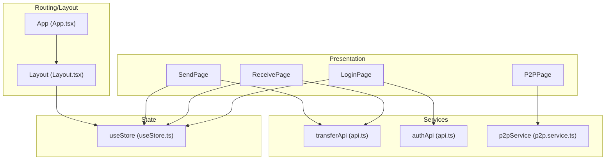

**Diagram sources**
- [App.tsx:1-26](file://packages/web/src/App.tsx#L1-L26)
- [Layout.tsx:1-62](file://packages/web/src/components/Layout.tsx#L1-L62)
- [useStore.ts:1-35](file://packages/web/src/stores/useStore.ts#L1-L35)
- [api.ts:1-133](file://packages/web/src/services/api.ts#L1-L133)
- [p2p.service.ts:1-580](file://packages/web/src/services/p2p.service.ts#L1-L580)
- [SendPage.tsx:1-193](file://packages/web/src/pages/SendPage.tsx#L1-L193)
- [ReceivePage.tsx:1-78](file://packages/web/src/pages/ReceivePage.tsx#L1-L78)
- [LoginPage.tsx:1-105](file://packages/web/src/pages/LoginPage.tsx#L1-L105)
- [P2PPage.tsx:1-155](file://packages/web/src/pages/P2PPage.tsx#L1-L155)

## Detailed Component Analysis

### Routing and Navigation
- BrowserRouter wraps the app; Layout provides header/footer and user-aware navigation.
- Routes define paths for home, send, receive, P2P, and login.
- Logout clears persisted token/user and navigates to home.

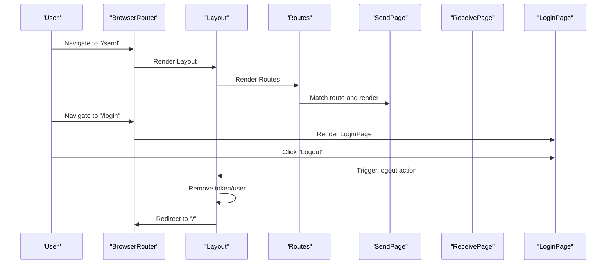

**Diagram sources**
- [App.tsx:1-26](file://packages/web/src/App.tsx#L1-L26)
- [Layout.tsx:1-62](file://packages/web/src/components/Layout.tsx#L1-L62)
- [SendPage.tsx:1-193](file://packages/web/src/pages/SendPage.tsx#L1-L193)
- [ReceivePage.tsx:1-78](file://packages/web/src/pages/ReceivePage.tsx#L1-L78)
- [LoginPage.tsx:1-105](file://packages/web/src/pages/LoginPage.tsx#L1-L105)

**Section sources**
- [App.tsx:1-26](file://packages/web/src/App.tsx#L1-L26)
- [Layout.tsx:1-62](file://packages/web/src/components/Layout.tsx#L1-L62)

### State Management with Zustand
- Store includes user, token, config, setters, and logout.
- Persist middleware synchronizes user/token to localStorage.
- Layout and pages consume store for user presence and logout.

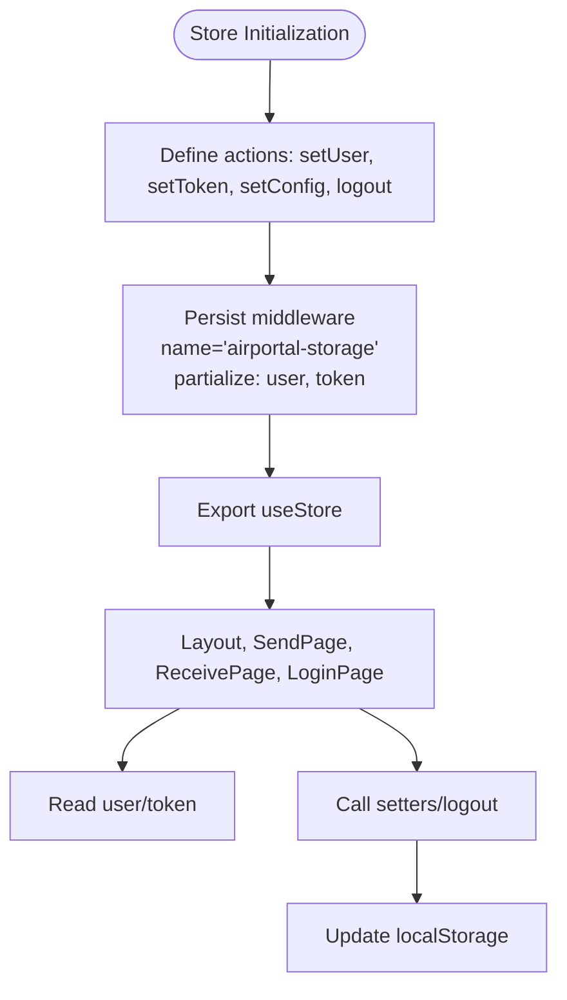

**Diagram sources**
- [useStore.ts:1-35](file://packages/web/src/stores/useStore.ts#L1-L35)
- [Layout.tsx:1-62](file://packages/web/src/components/Layout.tsx#L1-L62)

**Section sources**
- [useStore.ts:1-35](file://packages/web/src/stores/useStore.ts#L1-L35)

### UI Component Architecture

#### FileUploader
- Accepts a single file via drag/drop or input.
- Validates size against maxSize and shows error if exceeded.
- Provides loading overlay during upload.

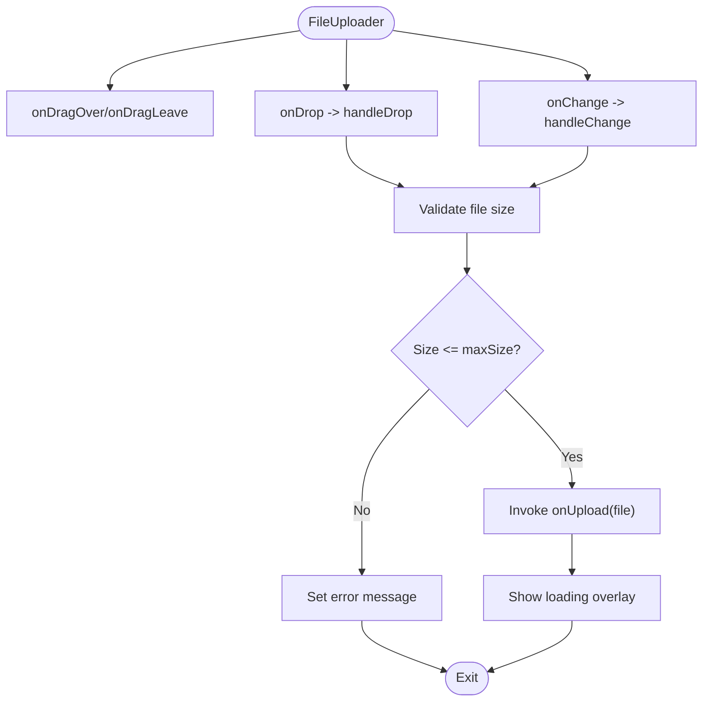

**Diagram sources**
- [FileUploader.tsx:1-86](file://packages/web/src/components/FileUploader.tsx#L1-L86)

**Section sources**
- [FileUploader.tsx:1-86](file://packages/web/src/components/FileUploader.tsx#L1-L86)

#### FolderUploader
- Reads directory entries via WebKit API, validates file count and total size.
- Zips entries to a Blob with progress reporting.
- Emits zipBlob, folderName, and fileCount to parent.

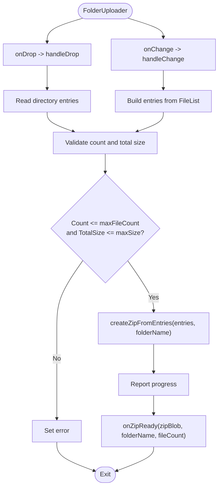

**Diagram sources**
- [FolderUploader.tsx:1-161](file://packages/web/src/components/FolderUploader.tsx#L1-L161)

**Section sources**
- [FolderUploader.tsx:1-161](file://packages/web/src/components/FolderUploader.tsx#L1-L161)

#### TextInput
- Textarea with character counter and submit button.
- Trims input and disables submit when empty or loading.

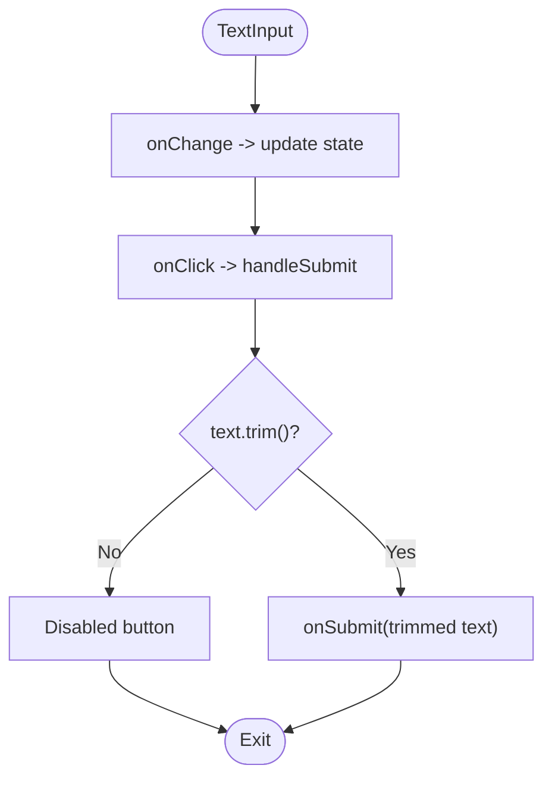

**Diagram sources**
- [TextInput.tsx:1-43](file://packages/web/src/components/TextInput.tsx#L1-L43)

**Section sources**
- [TextInput.tsx:1-43](file://packages/web/src/components/TextInput.tsx#L1-L43)

#### CodeInput
- 6-digit grid input with auto-focus, paste handling, and auto-submit.
- Normalizes input to uppercase and excludes invalid characters.

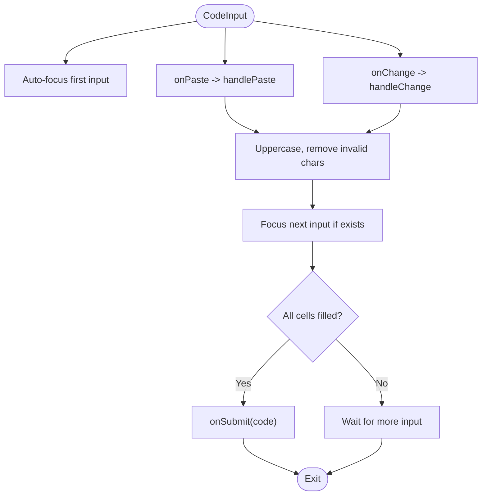

**Diagram sources**
- [CodeInput.tsx:1-74](file://packages/web/src/components/CodeInput.tsx#L1-L74)

**Section sources**
- [CodeInput.tsx:1-74](file://packages/web/src/components/CodeInput.tsx#L1-L74)

### Page Components Implementation

#### SendPage
- Manages transfer type (file/text/folder), expiration, downloads, owner-only flag.
- Fetches server config to adapt UI (e.g., enable folder upload).
- Delegates upload to transferApi and shows pickup code display upon success.

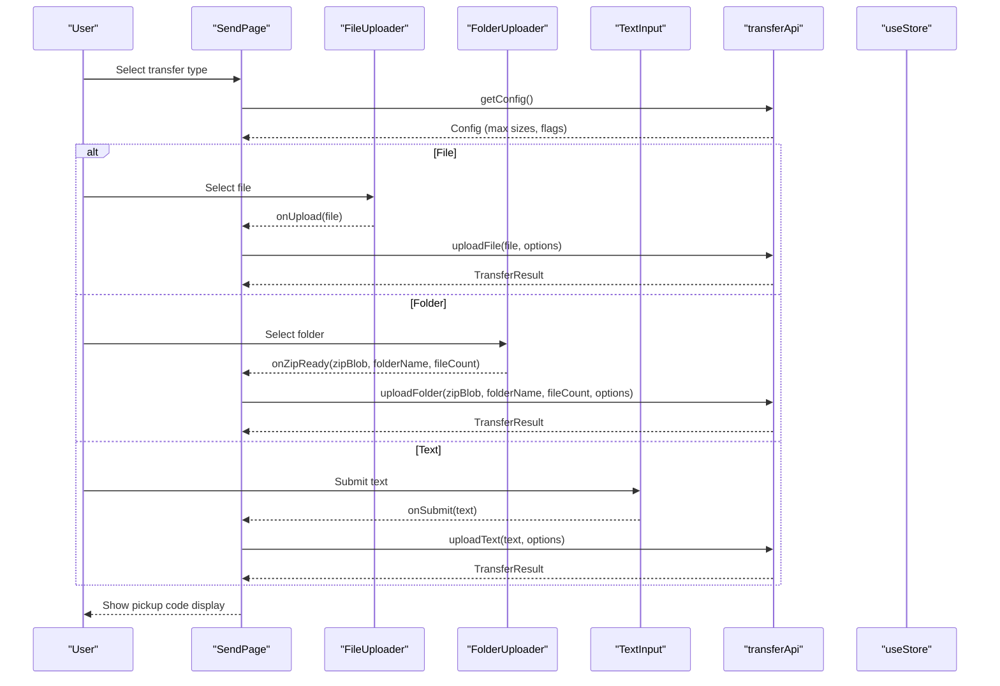

**Diagram sources**
- [SendPage.tsx:1-193](file://packages/web/src/pages/SendPage.tsx#L1-L193)
- [FileUploader.tsx:1-86](file://packages/web/src/components/FileUploader.tsx#L1-L86)
- [FolderUploader.tsx:1-161](file://packages/web/src/components/FolderUploader.tsx#L1-L161)
- [TextInput.tsx:1-43](file://packages/web/src/components/TextInput.tsx#L1-L43)
- [api.ts:56-129](file://packages/web/src/services/api.ts#L56-L129)
- [useStore.ts:1-35](file://packages/web/src/stores/useStore.ts#L1-L35)

**Section sources**
- [SendPage.tsx:1-193](file://packages/web/src/pages/SendPage.tsx#L1-L193)

#### ReceivePage
- Accepts 6-character code, fetches content via transferApi.
- For text: copies to clipboard and alerts success.
- For files/blobs: creates object URL and triggers download.

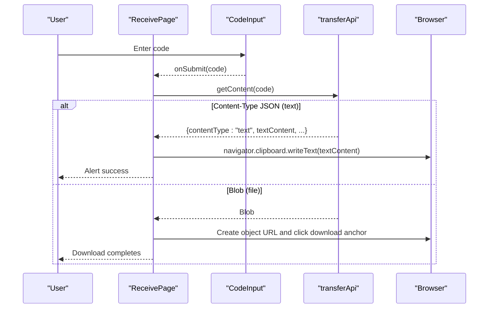

**Diagram sources**
- [ReceivePage.tsx:1-78](file://packages/web/src/pages/ReceivePage.tsx#L1-L78)
- [CodeInput.tsx:1-74](file://packages/web/src/components/CodeInput.tsx#L1-L74)
- [api.ts:121-130](file://packages/web/src/services/api.ts#L121-L130)

**Section sources**
- [ReceivePage.tsx:1-78](file://packages/web/src/pages/ReceivePage.tsx#L1-L78)

#### LoginPage
- Toggle between login and register modes.
- Validates min/max lengths for username/password.
- Calls authApi, persists token/user, navigates to home.

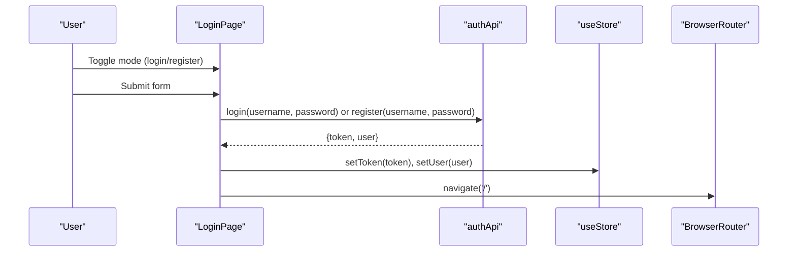

**Diagram sources**
- [LoginPage.tsx:1-105](file://packages/web/src/pages/LoginPage.tsx#L1-L105)
- [api.ts:33-54](file://packages/web/src/services/api.ts#L33-L54)
- [useStore.ts:1-35](file://packages/web/src/stores/useStore.ts#L1-L35)

**Section sources**
- [LoginPage.tsx:1-105](file://packages/web/src/pages/LoginPage.tsx#L1-L105)

#### P2PPage
- Integrates with useP2P hook to manage peers, transfers, and pending requests.
- Supports sending files to selected peers, accepting/rejecting transfers, and rendering progress cards.

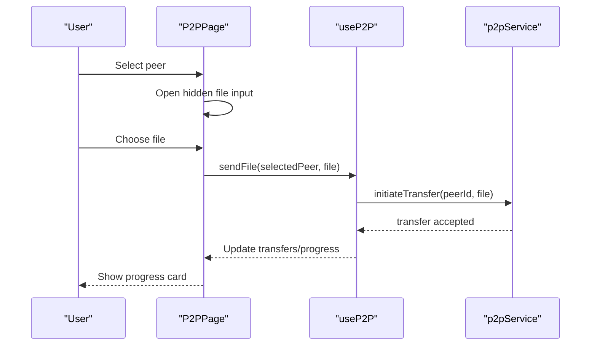

**Diagram sources**
- [P2PPage.tsx:1-155](file://packages/web/src/pages/P2PPage.tsx#L1-L155)
- [p2p.service.ts:362-398](file://packages/web/src/services/p2p.service.ts#L362-L398)
- [p2p.service.ts:403-446](file://packages/web/src/services/p2p.service.ts#L403-L446)

**Section sources**
- [P2PPage.tsx:1-155](file://packages/web/src/pages/P2PPage.tsx#L1-L155)

### API Integration Patterns and Service Layer
- Axios client configured with base URL and interceptors:
  - Request interceptor adds Authorization header if token exists.
  - Response interceptor handles 401 by clearing auth and redirecting.
- Authentication API:
  - register, login, getMe returning typed results.
- Transfer API:
  - getConfig, uploadFile (multipart/form-data), uploadFolder (multipart/form-data), uploadText (JSON), getContent (returns Blob or parsed JSON).
- P2P Service:
  - WebSocket signaling, WebRTC peer connections, data channels.
  - Message handling for offers/answers/candidates, file metadata, chunk streaming, progress callbacks.

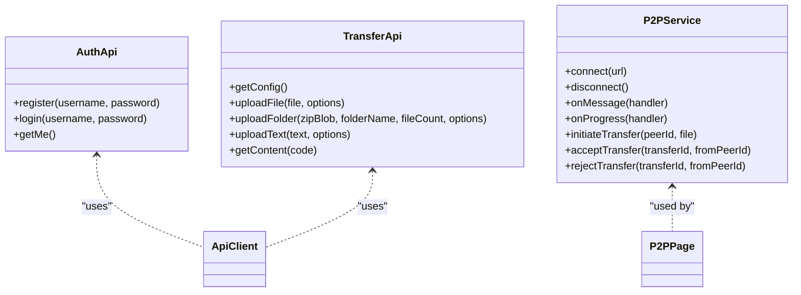

**Diagram sources**
- [api.ts:33-130](file://packages/web/src/services/api.ts#L33-L130)
- [p2p.service.ts:14-576](file://packages/web/src/services/p2p.service.ts#L14-L576)

**Section sources**
- [api.ts:1-133](file://packages/web/src/services/api.ts#L1-L133)
- [p2p.service.ts:1-580](file://packages/web/src/services/p2p.service.ts#L1-L580)

### File Upload Handling Mechanisms
- Single file upload:
  - FormData append file, optional query params for TTL, downloads, owner-only.
  - Returns TransferResult with pickup code.
- Folder upload:
  - FolderUploader zips entries to Blob; uploadFolder appends zip with metadata and options.
- Text upload:
  - Sends text content with options; ReceivePage detects JSON response and copies text.

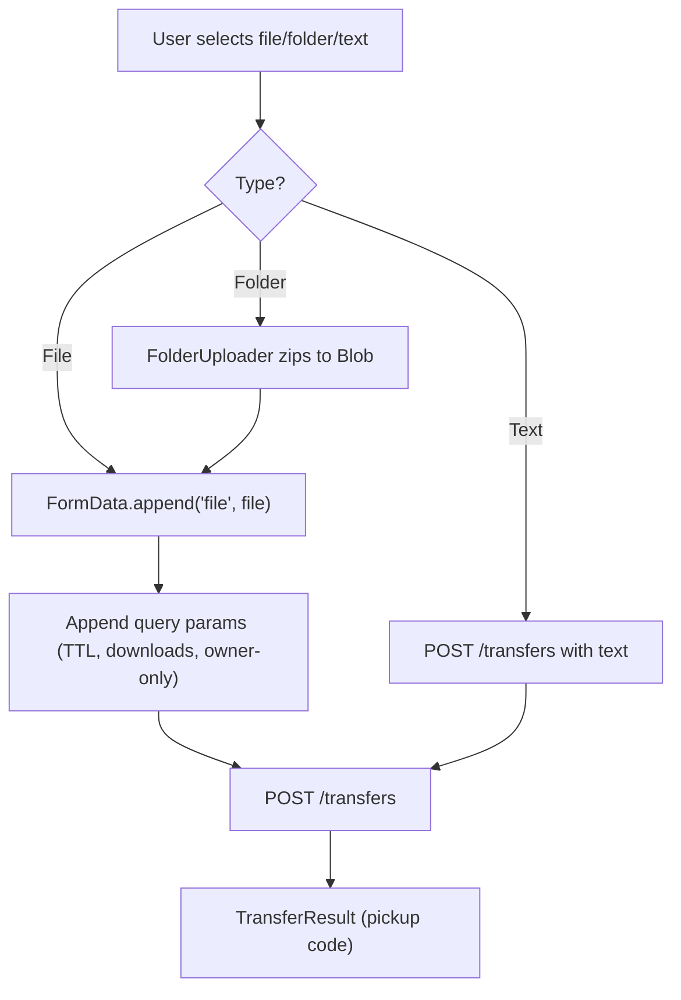

**Diagram sources**
- [SendPage.tsx:26-63](file://packages/web/src/pages/SendPage.tsx#L26-L63)
- [FolderUploader.tsx:38-46](file://packages/web/src/components/FolderUploader.tsx#L38-L46)
- [api.ts:62-119](file://packages/web/src/services/api.ts#L62-L119)

**Section sources**
- [SendPage.tsx:26-63](file://packages/web/src/pages/SendPage.tsx#L26-L63)
- [FolderUploader.tsx:38-46](file://packages/web/src/components/FolderUploader.tsx#L38-L46)
- [api.ts:62-119](file://packages/web/src/services/api.ts#L62-L119)

### Layout System and Responsive Design
- Layout.tsx provides:
  - Header with logo and navigation; conditional login/out based on user presence.
  - Main content area with max-width container and padding.
  - Footer with brand message.
- Responsive patterns:
  - Flexbox and grid layouts (e.g., P2PPage grid of peers).
  - Tailwind utilities for spacing, shadows, and color scales.
  - Centered modals/cards with rounded corners and shadows.

**Section sources**
- [Layout.tsx:1-62](file://packages/web/src/components/Layout.tsx#L1-L62)
- [P2PPage.tsx:119-129](file://packages/web/src/pages/P2PPage.tsx#L119-L129)

### Form Handling and Validation Strategies
- LoginPage:
  - Enforces min/max lengths for username/password.
  - Toggle between login/register modes.
- SendPage:
  - Uses select dropdowns for TTL and downloads; owner-only toggle for logged-in users.
  - UI adapts based on server config (e.g., enabling folder upload).
- TextInput:
  - Character counter and trim-on-submit behavior.
- CodeInput:
  - Auto-focus, paste normalization, strict character set, auto-submit on completion.

**Section sources**
- [LoginPage.tsx:42-79](file://packages/web/src/pages/LoginPage.tsx#L42-L79)
- [SendPage.tsx:138-188](file://packages/web/src/pages/SendPage.tsx#L138-L188)
- [TextInput.tsx:18-41](file://packages/web/src/components/TextInput.tsx#L18-L41)
- [CodeInput.tsx:54-72](file://packages/web/src/components/CodeInput.tsx#L54-L72)

### User Experience Optimizations
- Loading states:
  - FileUploader, FolderUploader, SendPage, ReceivePage show spinners during async operations.
- Immediate feedback:
  - Error messages for size limits, owner-only restrictions, and generic failures.
  - Clipboard copy for received text; automatic download for blobs.
- Accessibility:
  - Disabled states during loading, clear labels, and keyboard-friendly inputs.

**Section sources**
- [FileUploader.tsx:77-83](file://packages/web/src/components/FileUploader.tsx#L77-L83)
- [FolderUploader.tsx:139-158](file://packages/web/src/components/FolderUploader.tsx#L139-L158)
- [SendPage.tsx:134-137](file://packages/web/src/pages/SendPage.tsx#L134-L137)
- [ReceivePage.tsx:37-54](file://packages/web/src/pages/ReceivePage.tsx#L37-L54)

## Dependency Analysis
- App.tsx depends on Layout and page components.
- Pages depend on UI components and services.
- UI components depend on services for upload and on Zustand for user/config.
- Services depend on browser APIs (Axios, WebRTC, Blob, FileReader).

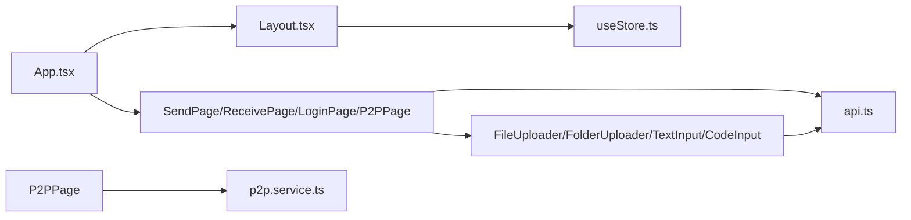

**Diagram sources**
- [App.tsx:1-26](file://packages/web/src/App.tsx#L1-L26)
- [Layout.tsx:1-62](file://packages/web/src/components/Layout.tsx#L1-L62)
- [useStore.ts:1-35](file://packages/web/src/stores/useStore.ts#L1-L35)
- [SendPage.tsx:1-193](file://packages/web/src/pages/SendPage.tsx#L1-L193)
- [ReceivePage.tsx:1-78](file://packages/web/src/pages/ReceivePage.tsx#L1-L78)
- [LoginPage.tsx:1-105](file://packages/web/src/pages/LoginPage.tsx#L1-L105)
- [P2PPage.tsx:1-155](file://packages/web/src/pages/P2PPage.tsx#L1-L155)
- [FileUploader.tsx:1-86](file://packages/web/src/components/FileUploader.tsx#L1-L86)
- [FolderUploader.tsx:1-161](file://packages/web/src/components/FolderUploader.tsx#L1-L161)
- [TextInput.tsx:1-43](file://packages/web/src/components/TextInput.tsx#L1-L43)
- [CodeInput.tsx:1-74](file://packages/web/src/components/CodeInput.tsx#L1-L74)
- [api.ts:1-133](file://packages/web/src/services/api.ts#L1-L133)
- [p2p.service.ts:1-580](file://packages/web/src/services/p2p.service.ts#L1-L580)

**Section sources**
- [App.tsx:1-26](file://packages/web/src/App.tsx#L1-L26)

## Performance Considerations
- FolderUploader compresses files client-side; consider worker threads for very large folders to avoid blocking the UI.
- FileUploader and FolderUploader show loading overlays; ensure they are dismissed on all error paths.
- P2PService uses chunked transfer with backpressure control; monitor bufferedAmount to prevent memory spikes.
- Axios interceptors add Authorization header on every request; cache token retrieval if needed.

## Troubleshooting Guide
- Authentication errors:
  - 401 responses trigger token removal and redirect; verify token storage and interceptor logic.
- Upload failures:
  - Check maxSize and maxFileCount constraints; inspect error messages returned by API.
- P2P connectivity:
  - Verify WebSocket URL scheme (ws/wss) matches environment; ensure no STUN/TURN servers are required for LAN-only operation.
- Clipboard and downloads:
  - Text copy requires secure context; downloads rely on object URLs; ensure cleanup after download.

**Section sources**
- [api.ts:20-31](file://packages/web/src/services/api.ts#L20-L31)
- [FolderUploader.tsx:23-32](file://packages/web/src/components/FolderUploader.tsx#L23-L32)
- [ReceivePage.tsx:37-54](file://packages/web/src/pages/ReceivePage.tsx#L37-L54)
- [p2p.service.ts:108-111](file://packages/web/src/services/p2p.service.ts#L108-L111)

## Conclusion
The Airportal frontend is a modular React application with clear separation of concerns:
- Routing and layout provide a consistent shell.
- Zustand manages authentication and configuration state with persistence.
- UI components encapsulate reusable behaviors for uploads and inputs.
- Pages orchestrate business logic and integrate with Axios-based services and a WebRTC-based P2P service.
- The system emphasizes user experience with loading states, immediate feedback, and responsive design.