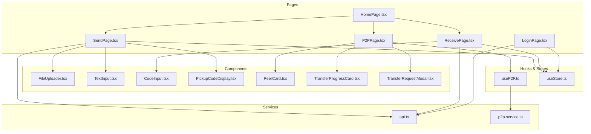
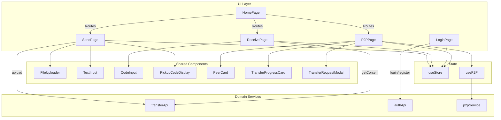
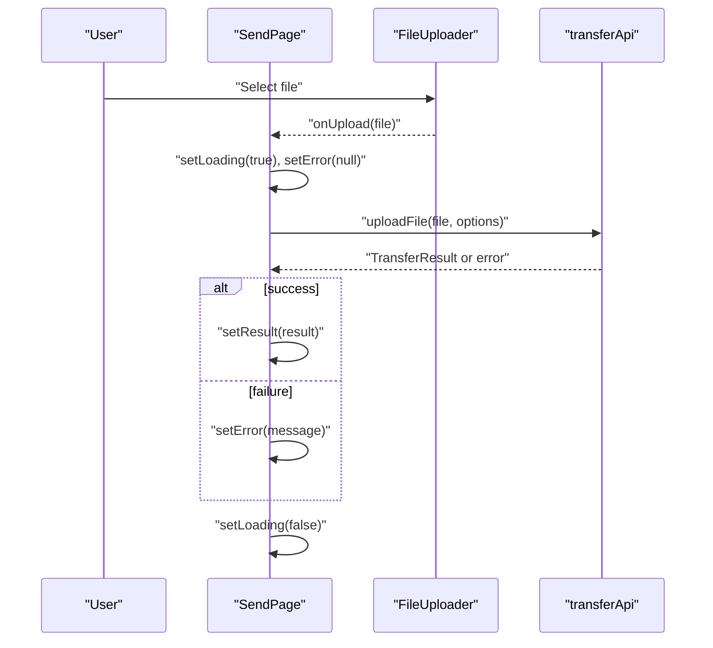
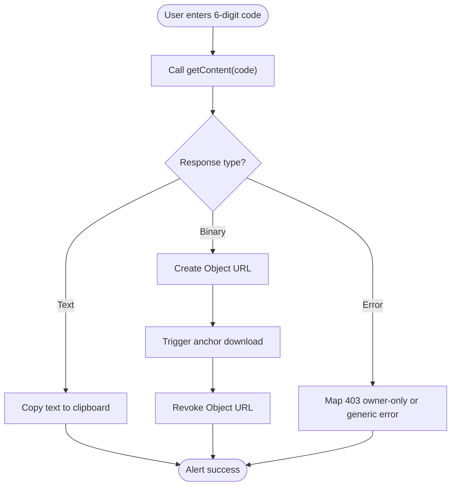
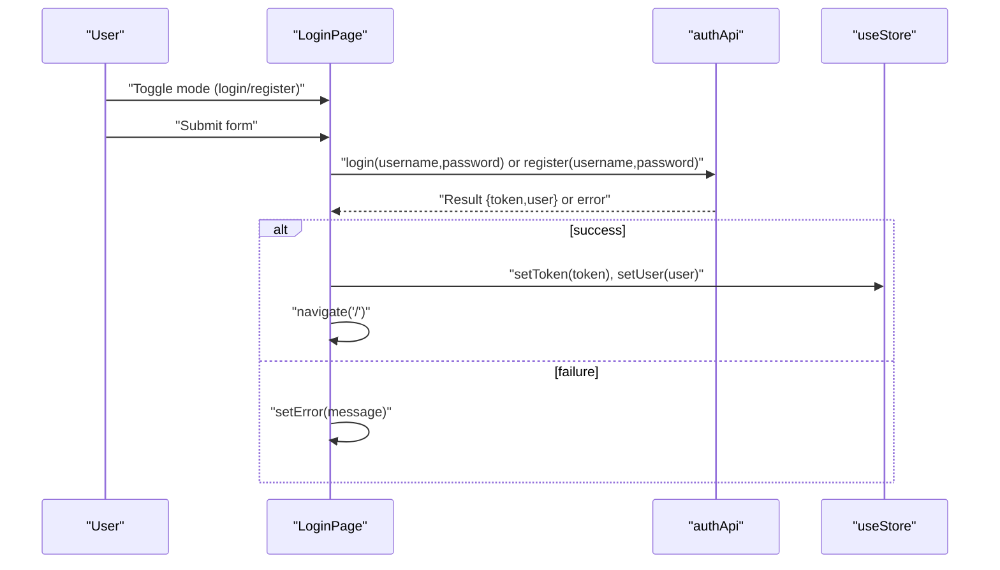
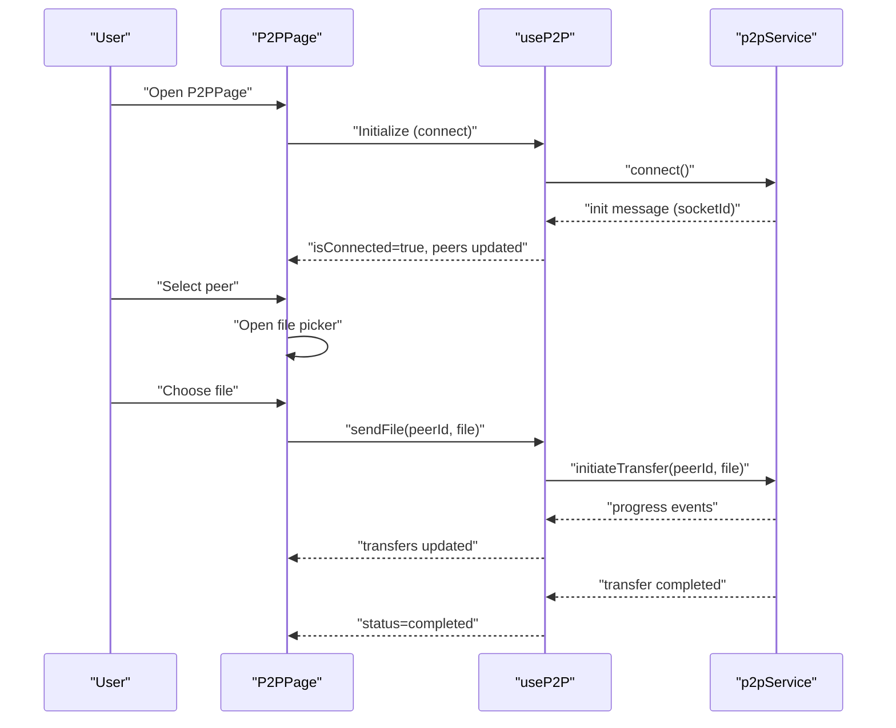
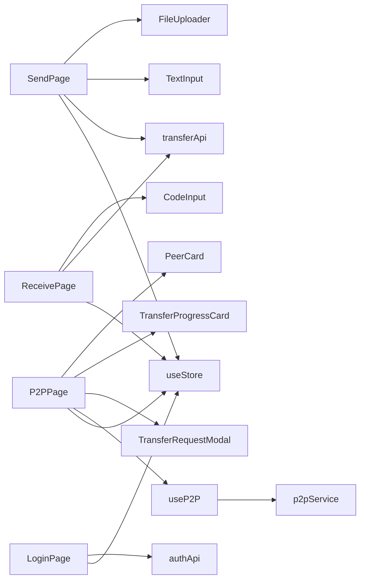

# Page Components

<cite>
**Referenced Files in This Document**
- [HomePage.tsx](file://packages/web/src/pages/HomePage.tsx)
- [SendPage.tsx](file://packages/web/src/pages/SendPage.tsx)
- [ReceivePage.tsx](file://packages/web/src/pages/ReceivePage.tsx)
- [LoginPage.tsx](file://packages/web/src/pages/LoginPage.tsx)
- [P2PPage.tsx](file://packages/web/src/pages/P2PPage.tsx)
- [FileUploader.tsx](file://packages/web/src/components/FileUploader.tsx)
- [FolderUploader.tsx](file://packages/web/src/components/FolderUploader.tsx)
- [TextInput.tsx](file://packages/web/src/components/TextInput.tsx)
- [PickupCodeDisplay.tsx](file://packages/web/src/components/PickupCodeDisplay.tsx)
- [CodeInput.tsx](file://packages/web/src/components/CodeInput.tsx)
- [PeerCard.tsx](file://packages/web/src/components/PeerCard.tsx)
- [TransferProgressCard.tsx](file://packages/web/src/components/TransferProgressCard.tsx)
- [TransferRequestModal.tsx](file://packages/web/src/components/TransferRequestModal.tsx)
- [useP2P.ts](file://packages/web/src/hooks/useP2P.ts)
- [p2p.service.ts](file://packages/web/src/services/p2p.service.ts)
- [api.ts](file://packages/web/src/services/api.ts)
- [useStore.ts](file://packages/web/src/stores/useStore.ts)
- [App.tsx](file://packages/web/src/App.tsx)
- [main.tsx](file://packages/web/src/main.tsx)
</cite>

## Table of Contents
1. [Introduction](#introduction)
2. [Project Structure](#project-structure)
3. [Core Components](#core-components)
4. [Architecture Overview](#architecture-overview)
5. [Detailed Component Analysis](#detailed-component-analysis)
6. [Dependency Analysis](#dependency-analysis)
7. [Performance Considerations](#performance-considerations)
8. [Troubleshooting Guide](#troubleshooting-guide)
9. [Conclusion](#conclusion)

## Introduction
This document provides comprehensive documentation for Airportal's page-level components. It covers the main landing page, file/text upload workflows, download initiation and retrieval, authentication flow, and peer-to-peer transfer interface. The goal is to explain routing patterns, page transitions, error handling, and user experience optimizations for each page component.

## Project Structure
Airportal is a Vite + React + TypeScript single-page application organized into pages, components, services, hooks, stores, and shared types. Pages are routeable components that orchestrate user interactions and delegate to reusable components and services.

**Diagram sources**
- [HomePage.tsx](file://packages/web/src/pages/HomePage.tsx)
- [SendPage.tsx](file://packages/web/src/pages/SendPage.tsx)
- [ReceivePage.tsx](file://packages/web/src/pages/ReceivePage.tsx)
- [LoginPage.tsx](file://packages/web/src/pages/LoginPage.tsx)
- [P2PPage.tsx](file://packages/web/src/pages/P2PPage.tsx)
- [FileUploader.tsx](file://packages/web/src/components/FileUploader.tsx)
- [TextInput.tsx](file://packages/web/src/components/TextInput.tsx)
- [CodeInput.tsx](file://packages/web/src/components/CodeInput.tsx)
- [PickupCodeDisplay.tsx](file://packages/web/src/components/PickupCodeDisplay.tsx)
- [PeerCard.tsx](file://packages/web/src/components/PeerCard.tsx)
- [TransferProgressCard.tsx](file://packages/web/src/components/TransferProgressCard.tsx)
- [TransferRequestModal.tsx](file://packages/web/src/components/TransferRequestModal.tsx)
- [useP2P.ts](file://packages/web/src/hooks/useP2P.ts)
- [p2p.service.ts](file://packages/web/src/services/p2p.service.ts)
- [api.ts](file://packages/web/src/services/api.ts)
- [useStore.ts](file://packages/web/src/stores/useStore.ts)

**Section sources**
- [App.tsx](file://packages/web/src/App.tsx)
- [main.tsx](file://packages/web/src/main.tsx)

## Core Components
- HomePage: Main landing page with navigation to Send, Receive, and P2P flows. It reads user state from the global store to conditionally show history-related messaging.
- SendPage: Centralized file/text/folder upload workflow with configuration controls (expiry, max downloads, owner-only), validation feedback, and a post-upload pickup code display.
- ReceivePage: Download initiation via 6-character pickup code input, with distinct handling for text vs. file content and owner-only restrictions.
- LoginPage: Authentication toggle between login and register, form submission, token/user persistence, and navigation back to home.
- P2PPage: Local network device discovery, peer selection, real-time transfer coordination, and request handling without server intermediation.

**Section sources**
- [HomePage.tsx](file://packages/web/src/pages/HomePage.tsx)
- [SendPage.tsx](file://packages/web/src/pages/SendPage.tsx)
- [ReceivePage.tsx](file://packages/web/src/pages/ReceivePage.tsx)
- [LoginPage.tsx](file://packages/web/src/pages/LoginPage.tsx)
- [P2PPage.tsx](file://packages/web/src/pages/P2PPage.tsx)

## Architecture Overview
The pages coordinate with:
- Services for API calls and P2P signaling/transfer.
- Reusable components for input, display, and progress.
- A global store for user/session state and app configuration.
- Hooks encapsulating P2P lifecycle and state updates.

**Diagram sources**
- [HomePage.tsx](file://packages/web/src/pages/HomePage.tsx)
- [SendPage.tsx](file://packages/web/src/pages/SendPage.tsx)
- [ReceivePage.tsx](file://packages/web/src/pages/ReceivePage.tsx)
- [LoginPage.tsx](file://packages/web/src/pages/LoginPage.tsx)
- [P2PPage.tsx](file://packages/web/src/pages/P2PPage.tsx)
- [FileUploader.tsx](file://packages/web/src/components/FileUploader.tsx)
- [TextInput.tsx](file://packages/web/src/components/TextInput.tsx)
- [CodeInput.tsx](file://packages/web/src/components/CodeInput.tsx)
- [PickupCodeDisplay.tsx](file://packages/web/src/components/PickupCodeDisplay.tsx)
- [PeerCard.tsx](file://packages/web/src/components/PeerCard.tsx)
- [TransferProgressCard.tsx](file://packages/web/src/components/TransferProgressCard.tsx)
- [TransferRequestModal.tsx](file://packages/web/src/components/TransferRequestModal.tsx)
- [useP2P.ts](file://packages/web/src/hooks/useP2P.ts)
- [p2p.service.ts](file://packages/web/src/services/p2p.service.ts)
- [api.ts](file://packages/web/src/services/api.ts)
- [useStore.ts](file://packages/web/src/stores/useStore.ts)

## Detailed Component Analysis

### HomePage
- Purpose: Primary entry point offering quick actions to Send, Receive, and P2P.
- Navigation: Uses router links to navigate to respective routes.
- User state: Reads user presence from the store to tailor messaging.

Key behaviors:
- Conditional rendering of P2P entry based on configuration availability.
- Presence of user-aware hints about transfer history.

**Section sources**
- [HomePage.tsx](file://packages/web/src/pages/HomePage.tsx)
- [useStore.ts](file://packages/web/src/stores/useStore.ts)

### SendPage
- Purpose: Unified upload interface for files, folders, and text with configurable constraints.
- State management:
  - Tracks transfer type, expiry, max downloads, owner-only flag, loading/error states, and result.
  - Loads app configuration (e.g., max sizes) on mount.
- Workflows:
  - File upload: validates size, invokes upload endpoint, displays result.
  - Folder upload: zips files, uploads zip blob, displays result.
  - Text upload: trims and submits text, displays result.
- Post-upload: renders a dedicated pickup code display with countdown and copy actions.

Validation and UX:
- Size checks for files and folders.
- Owner-only toggle for logged-in users.
- Clear error messages mapped from API responses.
- Loading overlays during uploads.

**Section sources**
- [SendPage.tsx](file://packages/web/src/pages/SendPage.tsx)
- [FileUploader.tsx](file://packages/web/src/components/FileUploader.tsx)
- [FolderUploader.tsx](file://packages/web/src/components/FolderUploader.tsx)
- [TextInput.tsx](file://packages/web/src/components/TextInput.tsx)
- [PickupCodeDisplay.tsx](file://packages/web/src/components/PickupCodeDisplay.tsx)
- [api.ts](file://packages/web/src/services/api.ts)
- [useStore.ts](file://packages/web/src/stores/useStore.ts)

#### SendPage Upload Sequence

**Diagram sources**
- [SendPage.tsx](file://packages/web/src/pages/SendPage.tsx)
- [FileUploader.tsx](file://packages/web/src/components/FileUploader.tsx)
- [api.ts](file://packages/web/src/services/api.ts)

### ReceivePage
- Purpose: Initiates download by accepting a 6-character pickup code.
- Input: CodeInput component handles digit-only input, auto-focus, paste, and submission.
- Retrieval logic:
  - Calls getContent with the code.
  - For text: copies to clipboard and alerts success.
  - For binary: creates a Blob URL, triggers a hidden anchor click, revokes URL.
- Error handling:
  - Distinguishes owner-only restriction errors (403) based on login state.
  - General API error messages fallback.

**Section sources**
- [ReceivePage.tsx](file://packages/web/src/pages/ReceivePage.tsx)
- [CodeInput.tsx](file://packages/web/src/components/CodeInput.tsx)
- [api.ts](file://packages/web/src/services/api.ts)
- [useStore.ts](file://packages/web/src/stores/useStore.ts)

#### ReceivePage Retrieval Flow

**Diagram sources**
- [ReceivePage.tsx](file://packages/web/src/pages/ReceivePage.tsx)
- [CodeInput.tsx](file://packages/web/src/components/CodeInput.tsx)
- [api.ts](file://packages/web/src/services/api.ts)

### LoginPage
- Purpose: Toggle between login and register forms, persist tokens/users, and redirect to home.
- Form handling:
  - Controlled inputs for username/password with min/max constraints.
  - Prevents submission while loading.
- Authentication flow:
  - Calls authApi.login or authApi.register depending on mode.
  - On success, sets token and user in the store, navigates to home.
  - Displays API error messages on failure.

**Section sources**
- [LoginPage.tsx](file://packages/web/src/pages/LoginPage.tsx)
- [api.ts](file://packages/web/src/services/api.ts)
- [useStore.ts](file://packages/web/src/stores/useStore.ts)

#### LoginPage Authentication Sequence

**Diagram sources**
- [LoginPage.tsx](file://packages/web/src/pages/LoginPage.tsx)
- [api.ts](file://packages/web/src/services/api.ts)
- [useStore.ts](file://packages/web/src/stores/useStore.ts)

### P2PPage
- Purpose: Local network file transfer without server intermediation.
- Discovery and state:
  - useP2P hook manages connection, peer list, pending requests, and transfer progress.
  - Renders PeerCard entries for discovered peers.
- Transfers:
  - Selecting a peer opens a file picker; chosen file is sent to the peer.
  - Pending transfer requests are shown in a modal with accept/reject actions.
  - Active transfers are displayed with progress cards.
- UX:
  - Shows connection status and guidance when no peers are present.
  - Disables interactions during sending to prevent race conditions.

**Section sources**
- [P2PPage.tsx](file://packages/web/src/pages/P2PPage.tsx)
- [PeerCard.tsx](file://packages/web/src/components/PeerCard.tsx)
- [TransferProgressCard.tsx](file://packages/web/src/components/TransferProgressCard.tsx)
- [TransferRequestModal.tsx](file://packages/web/src/components/TransferRequestModal.tsx)
- [useP2P.ts](file://packages/web/src/hooks/useP2P.ts)
- [p2p.service.ts](file://packages/web/src/services/p2p.service.ts)

#### P2PPage Interaction Flow

**Diagram sources**
- [P2PPage.tsx](file://packages/web/src/pages/P2PPage.tsx)
- [useP2P.ts](file://packages/web/src/hooks/useP2P.ts)
- [p2p.service.ts](file://packages/web/src/services/p2p.service.ts)

## Dependency Analysis
- Pages depend on:
  - Components for input/display.
  - Services for API and P2P operations.
  - Store for user/session/configuration state.
- Hook useP2P encapsulates P2P service subscriptions and state updates, returning a concise API to pages.
- Components enforce validation and UX constraints close to the user input level.

**Diagram sources**
- [SendPage.tsx](file://packages/web/src/pages/SendPage.tsx)
- [ReceivePage.tsx](file://packages/web/src/pages/ReceivePage.tsx)
- [LoginPage.tsx](file://packages/web/src/pages/LoginPage.tsx)
- [P2PPage.tsx](file://packages/web/src/pages/P2PPage.tsx)
- [FileUploader.tsx](file://packages/web/src/components/FileUploader.tsx)
- [TextInput.tsx](file://packages/web/src/components/TextInput.tsx)
- [CodeInput.tsx](file://packages/web/src/components/CodeInput.tsx)
- [PeerCard.tsx](file://packages/web/src/components/PeerCard.tsx)
- [TransferProgressCard.tsx](file://packages/web/src/components/TransferProgressCard.tsx)
- [TransferRequestModal.tsx](file://packages/web/src/components/TransferRequestModal.tsx)
- [useP2P.ts](file://packages/web/src/hooks/useP2P.ts)
- [p2p.service.ts](file://packages/web/src/services/p2p.service.ts)
- [api.ts](file://packages/web/src/services/api.ts)
- [useStore.ts](file://packages/web/src/stores/useStore.ts)

**Section sources**
- [useP2P.ts](file://packages/web/src/hooks/useP2P.ts)
- [p2p.service.ts](file://packages/web/src/services/p2p.service.ts)
- [api.ts](file://packages/web/src/services/api.ts)
- [useStore.ts](file://packages/web/src/stores/useStore.ts)

## Performance Considerations
- Debounce or throttle rapid user interactions (e.g., code input) to avoid excessive re-renders.
- Lazy-load heavy components only when needed (e.g., P2PPage).
- Use virtualization for long lists of peers/transfers if scale grows.
- Minimize re-renders by passing memoized callbacks and stable references to child components.
- Avoid blocking UI during long-running operations; keep loading indicators responsive.

## Troubleshooting Guide
Common issues and resolutions:
- SendPage upload failures:
  - Verify file size constraints and network connectivity.
  - Check error messages returned by the API for specific reasons.
- ReceivePage 403 errors:
  - If not logged in, prompt login before attempting owner-only content.
  - If logged in but still blocked, inform that only the creator can claim.
- P2PPage no peers found:
  - Ensure devices are on the same local network and the page is open on peers.
  - Confirm connection to signaling server is established.
- LoginPage authentication errors:
  - Validate credentials meet minimum length requirements.
  - Confirm network availability and server reachability.

**Section sources**
- [SendPage.tsx](file://packages/web/src/pages/SendPage.tsx)
- [ReceivePage.tsx](file://packages/web/src/pages/ReceivePage.tsx)
- [P2PPage.tsx](file://packages/web/src/pages/P2PPage.tsx)
- [LoginPage.tsx](file://packages/web/src/pages/LoginPage.tsx)

## Conclusion
Airportal’s page components provide a cohesive, user-focused experience across file/text transfers, download retrieval, authentication, and local network P2P sharing. By leveraging reusable components, centralized services, and a global store, the pages maintain clean separation of concerns, robust error handling, and consistent UX patterns. The documented flows and diagrams serve as a guide for extending functionality, optimizing performance, and maintaining reliability.