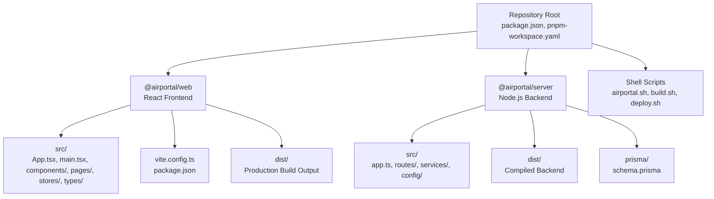
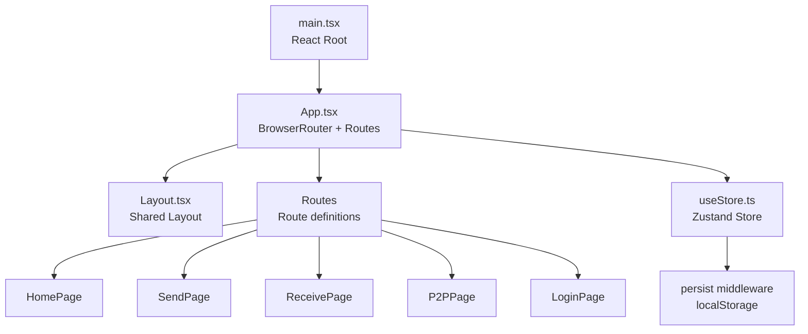
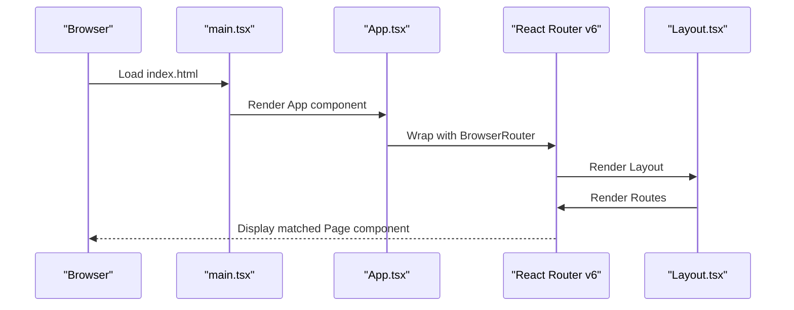
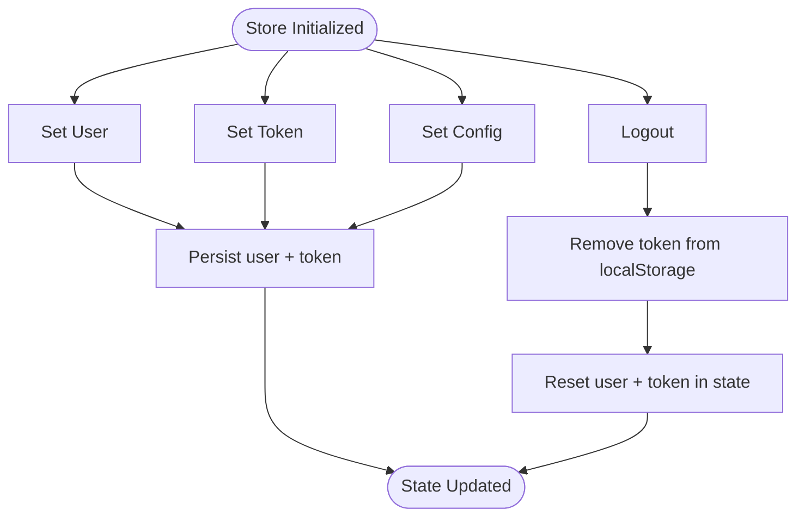
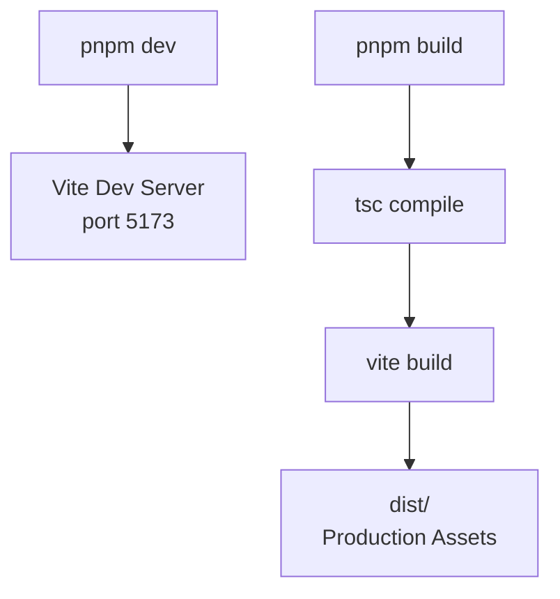
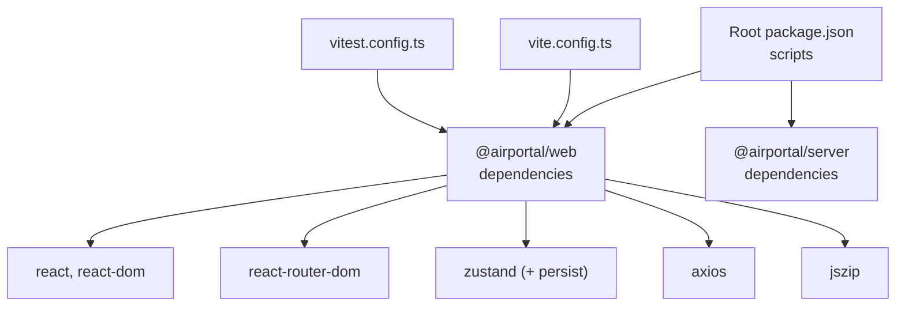

# React Application Architecture

<cite>
**Referenced Files in This Document**
- [package.json](file://package.json)
- [pnpm-workspace.yaml](file://pnpm-workspace.yaml)
- [tsconfig.base.json](file://tsconfig.base.json)
- [airportal.sh](file://airportal.sh)
- [build.sh](file://build.sh)
- [deploy.sh](file://deploy.sh)
- [packages/web/src/App.tsx](file://packages/web/src/App.tsx)
- [packages/web/src/main.tsx](file://packages/web/src/main.tsx)
- [packages/web/vite.config.ts](file://packages/web/vite.config.ts)
- [packages/web/package.json](file://packages/web/package.json)
- [packages/web/src/stores/useStore.ts](file://packages/web/src/stores/useStore.ts)
</cite>

## Table of Contents
1. [Introduction](#introduction)
2. [Project Structure](#project-structure)
3. [Core Components](#core-components)
4. [Architecture Overview](#architecture-overview)
5. [Detailed Component Analysis](#detailed-component-analysis)
6. [Dependency Analysis](#dependency-analysis)
7. [Performance Considerations](#performance-considerations)
8. [Troubleshooting Guide](#troubleshooting-guide)
9. [Conclusion](#conclusion)

## Introduction
This document describes the React application architecture for Airportal, focusing on the frontend implementation located under the web package. It covers the main App component structure, routing configuration with React Router v6, application initialization, component hierarchy, TypeScript type definitions, global application state via Zustand, Vite configuration for development and production, environment variable handling, and asset management. The document also explains how the React application integrates with the backend server and deployment scripts.

## Project Structure
The repository follows a monorepo layout managed by pnpm workspaces. The React application resides in the web package, while the server package contains the backend service. Scripts at the root orchestrate development, building, testing, and deployment across both packages.

**Diagram sources**
- [pnpm-workspace.yaml:1-3](file://pnpm-workspace.yaml#L1-L3)
- [packages/web/src/App.tsx:1-26](file://packages/web/src/App.tsx#L1-L26)
- [packages/web/src/main.tsx:1-11](file://packages/web/src/main.tsx#L1-L11)
- [packages/web/vite.config.ts:1-10](file://packages/web/vite.config.ts#L1-L10)
- [packages/web/package.json:1-39](file://packages/web/package.json#L1-L39)

**Section sources**
- [pnpm-workspace.yaml:1-3](file://pnpm-workspace.yaml#L1-L3)
- [package.json:1-21](file://package.json#L1-L21)

## Core Components
- Application entry point: Initializes the React root and renders the App component.
- Routing configuration: Uses React Router v6 with BrowserRouter and declarative Route definitions.
- Global state: Implemented with Zustand for user, token, and configuration management with persistence.
- Vite configuration: Provides development server and build pipeline for the React app.

Key implementation references:
- Entry point and rendering: [packages/web/src/main.tsx:1-11](file://packages/web/src/main.tsx#L1-L11)
- Routing and layout: [packages/web/src/App.tsx:1-26](file://packages/web/src/App.tsx#L1-L26)
- State store with persistence: [packages/web/src/stores/useStore.ts:1-35](file://packages/web/src/stores/useStore.ts#L1-L35)
- Vite configuration: [packages/web/vite.config.ts:1-10](file://packages/web/vite.config.ts#L1-L10)

**Section sources**
- [packages/web/src/main.tsx:1-11](file://packages/web/src/main.tsx#L1-L11)
- [packages/web/src/App.tsx:1-26](file://packages/web/src/App.tsx#L1-L26)
- [packages/web/src/stores/useStore.ts:1-35](file://packages/web/src/stores/useStore.ts#L1-L35)
- [packages/web/vite.config.ts:1-10](file://packages/web/vite.config.ts#L1-L10)

## Architecture Overview
The React application initializes in main.tsx, mounting the App component inside a StrictMode wrapper. App sets up React Router v6 with BrowserRouter and defines routes for Home, Send, Receive, P2P, and Login pages. The Layout component wraps the routes to provide shared UI scaffolding. Global state is managed via Zustand with a persisted slice for user and token data.

**Diagram sources**
- [packages/web/src/main.tsx:1-11](file://packages/web/src/main.tsx#L1-L11)
- [packages/web/src/App.tsx:1-26](file://packages/web/src/App.tsx#L1-L26)
- [packages/web/src/stores/useStore.ts:1-35](file://packages/web/src/stores/useStore.ts#L1-L35)

## Detailed Component Analysis

### Application Initialization and Entry Point
The entry point creates the React root and renders the App component within StrictMode. It imports global styles and ensures the DOM element with id "root" exists.

Implementation references:
- Root creation and rendering: [packages/web/src/main.tsx:6-10](file://packages/web/src/main.tsx#L6-L10)
- Global styles import: [packages/web/src/main.tsx:4](file://packages/web/src/main.tsx#L4)

**Section sources**
- [packages/web/src/main.tsx:1-11](file://packages/web/src/main.tsx#L1-L11)

### Routing Configuration with React Router v6
The App component configures BrowserRouter and defines routes for five pages. The Layout component wraps the Routes to provide a consistent shell around page views.

Implementation references:
- Router setup and route definitions: [packages/web/src/App.tsx:9-23](file://packages/web/src/App.tsx#L9-L23)

**Diagram sources**
- [packages/web/src/main.tsx:6-10](file://packages/web/src/main.tsx#L6-L10)
- [packages/web/src/App.tsx:9-23](file://packages/web/src/App.tsx#L9-L23)

**Section sources**
- [packages/web/src/App.tsx:1-26](file://packages/web/src/App.tsx#L1-L26)

### Global Application State with Zustand
The Zustand store manages user, token, and configuration state. It uses the persist middleware to synchronize selected state slices with localStorage, enabling persistence across browser sessions. The store exposes setters for user/token/config and a logout action.

Implementation references:
- Store definition and actions: [packages/web/src/stores/useStore.ts:15-34](file://packages/web/src/stores/useStore.ts#L15-L34)
- Persistence configuration: [packages/web/src/stores/useStore.ts:29-33](file://packages/web/src/stores/useStore.ts#L29-L33)

**Diagram sources**
- [packages/web/src/stores/useStore.ts:15-34](file://packages/web/src/stores/useStore.ts#L15-L34)

**Section sources**
- [packages/web/src/stores/useStore.ts:1-35](file://packages/web/src/stores/useStore.ts#L1-L35)

### Vite Configuration and Build Pipeline
The Vite configuration enables React Fast Refresh during development and sets the dev server port. The web package script orchestrates TypeScript compilation followed by Vite build for production.

Implementation references:
- Vite configuration: [packages/web/vite.config.ts:4-9](file://packages/web/vite.config.ts#L4-L9)
- Build scripts: [packages/web/package.json:6-14](file://packages/web/package.json#L6-L14)

**Diagram sources**
- [packages/web/vite.config.ts:4-9](file://packages/web/vite.config.ts#L4-L9)
- [packages/web/package.json:6-14](file://packages/web/package.json#L6-L14)

**Section sources**
- [packages/web/vite.config.ts:1-10](file://packages/web/vite.config.ts#L1-L10)
- [packages/web/package.json:1-39](file://packages/web/package.json#L1-L39)

### Environment Variable Handling and Asset Management
- Environment variables are handled via the backend server package and shell scripts. The server reads configuration from .env and config.json, and exposes runtime settings to the frontend through API responses.
- Asset management is handled by Vite for the React app, with Tailwind CSS configured via tailwind.config.js and PostCSS.

References:
- Server-side environment and configuration: [packages/server/src/config/index.ts](file://packages/server/src/config/index.ts)
- Deployment scripts manage environment provisioning and packaging: [build.sh:123-143](file://build.sh#L123-L143), [deploy.sh:149-194](file://deploy.sh#L149-L194)

**Section sources**
- [build.sh:123-143](file://build.sh#L123-L143)
- [deploy.sh:149-194](file://deploy.sh#L149-L194)

## Dependency Analysis
The React application depends on core libraries for UI, routing, HTTP, and state management. The root package orchestrates cross-package scripts, while the web package manages frontend-specific tooling.

**Diagram sources**
- [package.json:6-16](file://package.json#L6-L16)
- [packages/web/package.json:15-37](file://packages/web/package.json#L15-L37)
- [packages/web/vite.config.ts:1-10](file://packages/web/vite.config.ts#L1-L10)

**Section sources**
- [package.json:1-21](file://package.json#L1-L21)
- [packages/web/package.json:1-39](file://packages/web/package.json#L1-L39)

## Performance Considerations
- Code splitting: Consider lazy-loading route components to reduce initial bundle size.
- State granularity: Keep the Zustand store slices minimal to avoid unnecessary re-renders.
- Asset optimization: Enable Vite’s built-in minification and asset inlining for production builds.
- Strict mode: React StrictMode helps surface unsafe lifecycles but can increase development overhead; keep enabled for correctness.

## Troubleshooting Guide
- Development server port conflicts: Adjust the port in Vite configuration if port 5173 is in use.
- Build failures: Ensure TypeScript compilation succeeds before Vite build, as indicated by the web package build script order.
- State persistence issues: Verify localStorage availability and permissions; confirm the persist middleware configuration targets the intended state keys.
- Environment configuration: Confirm .env and config.json values are correctly loaded by the server and accessible to the frontend via API.

**Section sources**
- [packages/web/vite.config.ts:6-8](file://packages/web/vite.config.ts#L6-L8)
- [packages/web/package.json:8](file://packages/web/package.json#L8)
- [packages/web/src/stores/useStore.ts:29-33](file://packages/web/src/stores/useStore.ts#L29-L33)

## Conclusion
Airportal’s React application is structured as a modern Vite-powered single-page app with React Router v6 for navigation and Zustand for global state management. The monorepo layout separates concerns between frontend and backend, with shell scripts automating development, building, and deployment. The architecture emphasizes simplicity, type safety via TypeScript, and maintainable state management, providing a solid foundation for the file transfer application’s user interface.