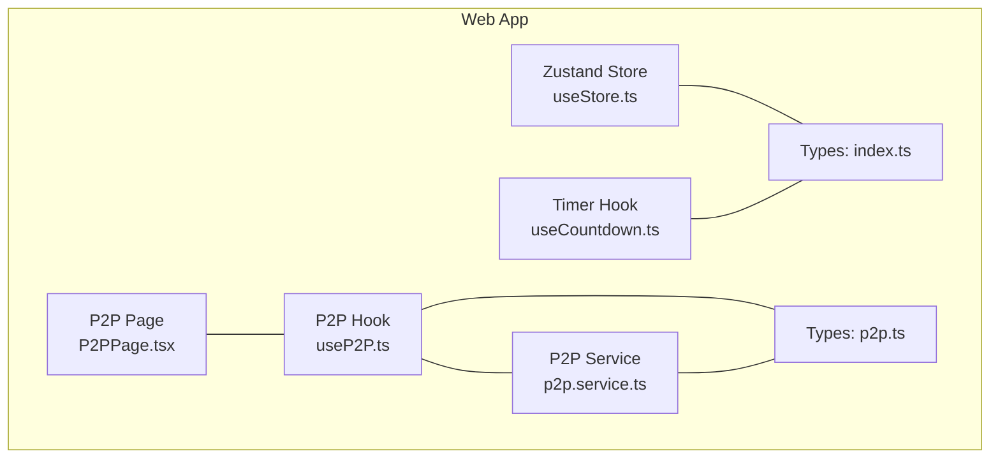
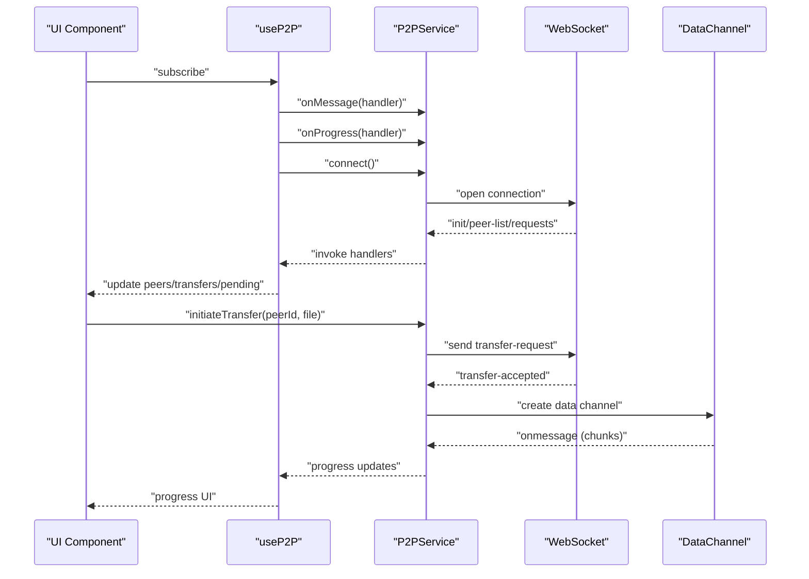
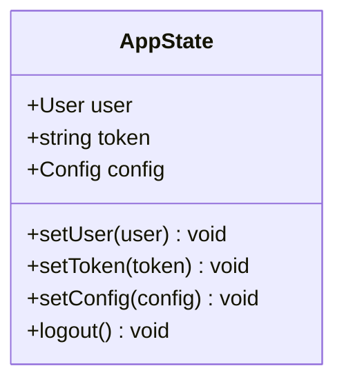
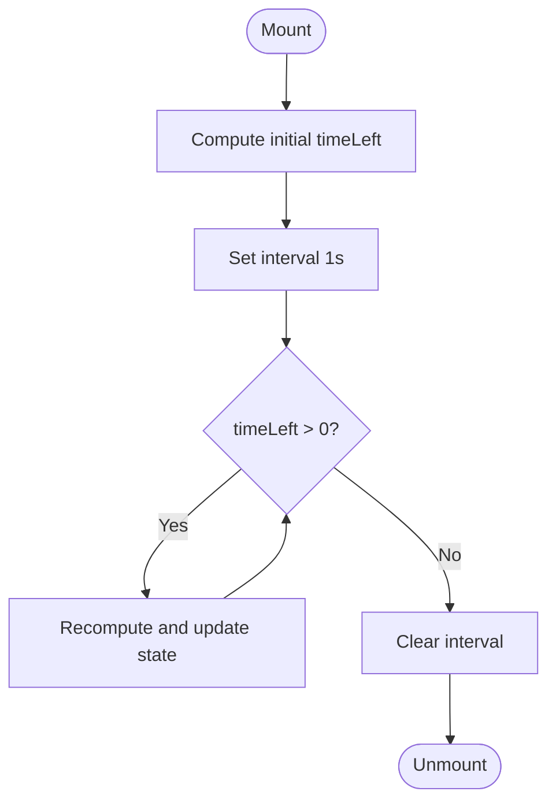
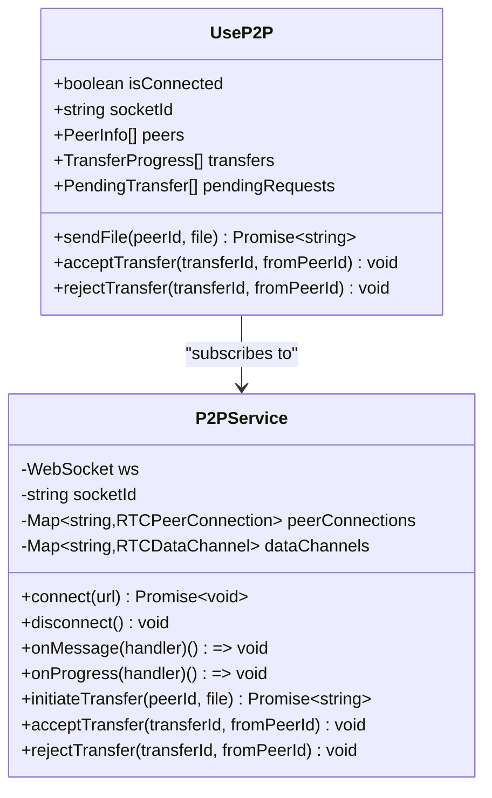
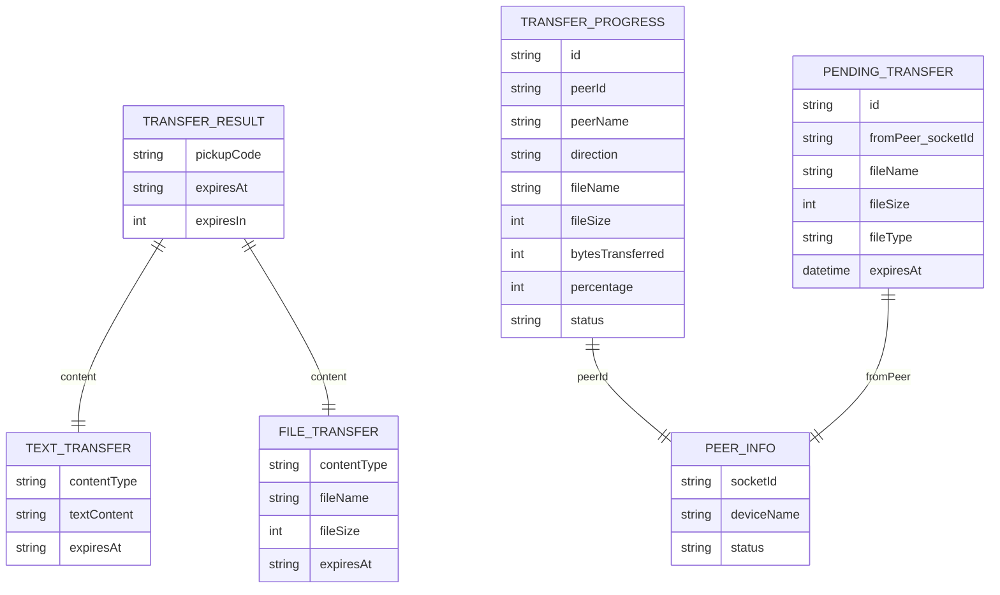
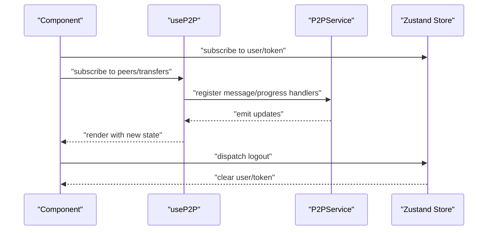
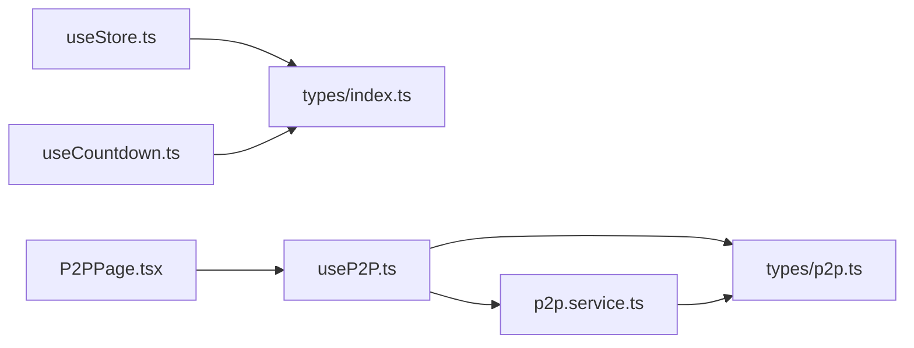

# State Management

<cite>
**Referenced Files in This Document**
- [useStore.ts](file://packages/web/src/stores/useStore.ts)
- [useCountdown.ts](file://packages/web/src/hooks/useCountdown.ts)
- [useP2P.ts](file://packages/web/src/hooks/useP2P.ts)
- [p2p.service.ts](file://packages/web/src/services/p2p.service.ts)
- [index.ts](file://packages/web/src/types/index.ts)
- [p2p.ts](file://packages/web/src/types/p2p.ts)
- [P2PPage.tsx](file://packages/web/src/pages/P2PPage.tsx)
- [package.json](file://packages/web/package.json)
- [useStore.test.ts](file://packages/web/test/stores/useStore.test.ts)
- [useCountdown.test.ts](file://packages/web/test/hooks/useCountdown.test.ts)
</cite>

## Table of Contents
1. [Introduction](#introduction)
2. [Project Structure](#project-structure)
3. [Core Components](#core-components)
4. [Architecture Overview](#architecture-overview)
5. [Detailed Component Analysis](#detailed-component-analysis)
6. [Dependency Analysis](#dependency-analysis)
7. [Performance Considerations](#performance-considerations)
8. [Troubleshooting Guide](#troubleshooting-guide)
9. [Conclusion](#conclusion)
10. [Appendices](#appendices)

## Introduction
This document describes Airportal’s state management architecture with a focus on the Zustand store, authentication and UI state, P2P connection state, and expiration timers. It explains how state is persisted, synchronized, updated, and cleaned up, and provides best practices for normalization, performance, memory management, and debugging.

## Project Structure
Airportal’s web client organizes state management around a small but effective set of modules:
- Zustand store for authentication and configuration state
- React hooks for timers and P2P orchestration
- A singleton P2P service managing WebRTC and signaling
- Strongly typed models for transfers, peers, and messages
- Tests validating store behavior and timer logic

**Diagram sources**
- [useStore.ts:1-35](file://packages/web/src/stores/useStore.ts#L1-L35)
- [useCountdown.ts:1-37](file://packages/web/src/hooks/useCountdown.ts#L1-L37)
- [useP2P.ts:1-155](file://packages/web/src/hooks/useP2P.ts#L1-L155)
- [p2p.service.ts:1-580](file://packages/web/src/services/p2p.service.ts#L1-L580)
- [index.ts:1-51](file://packages/web/src/types/index.ts#L1-L51)
- [p2p.ts:1-101](file://packages/web/src/types/p2p.ts#L1-L101)
- [P2PPage.tsx:1-155](file://packages/web/src/pages/P2PPage.tsx#L1-L155)

**Section sources**
- [package.json:1-39](file://packages/web/package.json#L1-L39)

## Core Components
- Authentication and configuration store (Zustand):
  - Holds user, token, and app config
  - Provides setters and a logout action
  - Persists selected fields to local storage
- Timer hook:
  - Computes and exposes remaining time until an expiration
  - Normalizes to minutes/seconds and formatted display
- P2P orchestration:
  - React hook that subscribes to a singleton P2P service
  - Manages peer lists, pending requests, and transfer progress
- P2P service:
  - WebSocket signaling and WebRTC data channels
  - Centralized message routing and progress reporting

**Section sources**
- [useStore.ts:5-34](file://packages/web/src/stores/useStore.ts#L5-L34)
- [useCountdown.ts:3-36](file://packages/web/src/hooks/useCountdown.ts#L3-L36)
- [useP2P.ts:23-154](file://packages/web/src/hooks/useP2P.ts#L23-L154)
- [p2p.service.ts:14-579](file://packages/web/src/services/p2p.service.ts#L14-L579)

## Architecture Overview
The state architecture separates concerns:
- UI state: managed by React hooks and Zustand store
- P2P state: derived from the P2P service and surfaced via a dedicated hook
- Expiration timers: computed locally by a timer hook
- Persistence: Zustand persist middleware writes selected fields to local storage

**Diagram sources**
- [useP2P.ts:30-92](file://packages/web/src/hooks/useP2P.ts#L30-L92)
- [p2p.service.ts:35-103](file://packages/web/src/services/p2p.service.ts#L35-L103)
- [p2p.service.ts:171-210](file://packages/web/src/services/p2p.service.ts#L171-L210)
- [p2p.service.ts:403-446](file://packages/web/src/services/p2p.service.ts#L403-L446)
- [p2p.service.ts:283-326](file://packages/web/src/services/p2p.service.ts#L283-L326)

## Detailed Component Analysis

### Zustand Store (Authentication and Config)
- State shape:
  - user: nullable user profile
  - token: nullable JWT token
  - config: app configuration
- Actions:
  - setUser, setToken, setConfig
  - logout clears user/token and removes token from local storage
- Persistence:
  - Middleware persists only user and token
  - Storage key is a fixed name
- Subscription:
  - Components consume via direct selector usage or by subscribing to store slices

**Diagram sources**
- [useStore.ts:5-13](file://packages/web/src/stores/useStore.ts#L5-L13)

**Section sources**
- [useStore.ts:15-34](file://packages/web/src/stores/useStore.ts#L15-L34)
- [useStore.test.ts:12-98](file://packages/web/test/stores/useStore.test.ts#L12-L98)

### Countdown Timer Hook
- Purpose: compute and expose time remaining until a deadline
- Inputs: expiration date/time
- Outputs: seconds, minutes, formatted MM:SS, and expiration flag
- Lifecycle:
  - Initializes immediately
  - Updates every second
  - Clears interval when expired
- Cleanup:
  - Clears interval on unmount

**Diagram sources**
- [useCountdown.ts:12-24](file://packages/web/src/hooks/useCountdown.ts#L12-L24)

**Section sources**
- [useCountdown.ts:3-36](file://packages/web/src/hooks/useCountdown.ts#L3-L36)
- [useCountdown.test.ts:5-67](file://packages/web/test/hooks/useCountdown.test.ts#L5-L67)

### P2P State Orchestration (Hook and Service)
- Hook responsibilities:
  - Subscribe to service messages and progress events
  - Maintain local UI state: peers, pending requests, transfers
  - Drive lifecycle actions: connect, send file, accept/reject
- Service responsibilities:
  - Manage WebSocket connection and message routing
  - Manage WebRTC peer connections and data channels
  - Aggregate and emit progress updates
- Data models:
  - PeerInfo, TransferProgress, PendingTransfer, FileMetadata
  - WebSocket and DataChannel message types

**Diagram sources**
- [useP2P.ts:23-154](file://packages/web/src/hooks/useP2P.ts#L23-L154)
- [p2p.service.ts:14-579](file://packages/web/src/services/p2p.service.ts#L14-L579)

**Section sources**
- [useP2P.ts:23-154](file://packages/web/src/hooks/useP2P.ts#L23-L154)
- [p2p.service.ts:14-579](file://packages/web/src/services/p2p.service.ts#L14-L579)
- [p2p.ts:3-101](file://packages/web/src/types/p2p.ts#L3-L101)

### Data Models and Normalization
- Transfer models:
  - TextTransfer and FileTransfer define content-specific fields and expiration
  - TransferResult and FolderTransferResult standardize expiration metadata
- P2P models:
  - PeerInfo, TransferProgress, PendingTransfer capture runtime state
  - WSMessage and DC* messages define transport protocols
- Normalization:
  - Keep transfer progress normalized by storing bytes transferred and percentages
  - Normalize peer identifiers using socket IDs

**Diagram sources**
- [index.ts:1-51](file://packages/web/src/types/index.ts#L1-L51)
- [p2p.ts:3-101](file://packages/web/src/types/p2p.ts#L3-L101)

**Section sources**
- [index.ts:1-51](file://packages/web/src/types/index.ts#L1-L51)
- [p2p.ts:3-101](file://packages/web/src/types/p2p.ts#L3-L101)

### State Update Patterns and Subscription Mechanisms
- Zustand store updates:
  - Action creators update immutable state slices atomically
  - Selectors enable fine-grained subscriptions in components
- Timer updates:
  - Hook updates state on interval ticks
- P2P updates:
  - Service emits progress and message events
  - Hook maps service events to normalized UI state
- Cleanup:
  - Timer hook clears intervals on unmount
  - P2P hook unsubscribes handlers on unmount

**Diagram sources**
- [useStore.ts:15-34](file://packages/web/src/stores/useStore.ts#L15-L34)
- [useP2P.ts:30-92](file://packages/web/src/hooks/useP2P.ts#L30-L92)

**Section sources**
- [useStore.ts:15-34](file://packages/web/src/stores/useStore.ts#L15-L34)
- [useP2P.ts:30-92](file://packages/web/src/hooks/useP2P.ts#L30-L92)

## Dependency Analysis
- Zustand store depends on:
  - Local storage via persist middleware
  - Type definitions for User and Config
- Timer hook depends on:
  - React state and effects
  - Date arithmetic
- P2P hook depends on:
  - Singleton P2P service
  - WebSocket and DataChannel APIs
- P2P service depends on:
  - WebSocket and WebRTC APIs
  - Typed message interfaces

**Diagram sources**
- [useStore.ts:1-3](file://packages/web/src/stores/useStore.ts#L1-L3)
- [useCountdown.ts:1](file://packages/web/src/hooks/useCountdown.ts#L1)
- [useP2P.ts:1-10](file://packages/web/src/hooks/useP2P.ts#L1-L10)
- [p2p.service.ts:1-7](file://packages/web/src/services/p2p.service.ts#L1-L7)
- [index.ts:1-51](file://packages/web/src/types/index.ts#L1-L51)
- [p2p.ts:1-101](file://packages/web/src/types/p2p.ts#L1-L101)
- [P2PPage.tsx:1-5](file://packages/web/src/pages/P2PPage.tsx#L1-L5)

**Section sources**
- [package.json:15-22](file://packages/web/package.json#L15-L22)

## Performance Considerations
- Prefer atomic updates in Zustand to minimize re-renders
- Normalize large arrays (e.g., transfers) to keep component renders efficient
- Debounce or throttle frequent updates (e.g., progress) if needed
- Avoid unnecessary deep equality checks by keeping state flat where possible
- Use selective subscriptions to avoid full-store re-renders
- Clean up intervals and subscriptions promptly to prevent leaks

## Troubleshooting Guide
- Timer not updating:
  - Verify interval is cleared on unmount
  - Confirm expiration date is in the future
- P2P not connecting:
  - Check WebSocket readiness before sending messages
  - Ensure handlers are registered before connect resolves
- State not persisting:
  - Confirm persist middleware is applied and partialize selects intended fields
  - Verify local storage availability and permissions
- Logout not clearing token:
  - Ensure logout removes token from local storage and resets state

**Section sources**
- [useCountdown.ts:23-24](file://packages/web/src/hooks/useCountdown.ts#L23-L24)
- [useStore.ts:24-27](file://packages/web/src/stores/useStore.ts#L24-L27)
- [p2p.service.ts:215-221](file://packages/web/src/services/p2p.service.ts#L215-L221)

## Conclusion
Airportal’s state management combines a lightweight Zustand store for authentication and configuration, a robust P2P orchestration layer built on a singleton service, and a simple timer hook for expiration handling. The design emphasizes clear separation of concerns, explicit persistence, and straightforward subscription patterns. Following the best practices outlined here will help maintain performance, reliability, and developer productivity.

## Appendices
- Best practices summary:
  - Keep store actions pure and atomic
  - Normalize state to reduce nesting and improve selectivity
  - Always clean up timers and subscriptions
  - Persist only essential fields to reduce storage overhead
  - Use typed models to prevent runtime errors
  - Test store updates and timer behavior with mocked environments