# UI Components

<cite>
**Referenced Files in This Document**
- [FileUploader.tsx](file://packages/web/src/components/FileUploader.tsx)
- [FolderUploader.tsx](file://packages/web/src/components/FolderUploader.tsx)
- [TextInput.tsx](file://packages/web/src/components/TextInput.tsx)
- [CodeInput.tsx](file://packages/web/src/components/CodeInput.tsx)
- [Layout.tsx](file://packages/web/src/components/Layout.tsx)
- [PeerCard.tsx](file://packages/web/src/components/PeerCard.tsx)
- [PickupCodeDisplay.tsx](file://packages/web/src/components/PickupCodeDisplay.tsx)
- [TransferProgressCard.tsx](file://packages/web/src/components/TransferProgressCard.tsx)
- [TransferRequestModal.tsx](file://packages/web/src/components/TransferRequestModal.tsx)
- [folder-zip.ts](file://packages/web/src/services/folder-zip.ts)
- [useCountdown.ts](file://packages/web/src/hooks/useCountdown.ts)
- [useP2P.ts](file://packages/web/src/hooks/useP2P.ts)
- [useStore.ts](file://packages/web/src/stores/useStore.ts)
- [index.ts](file://packages/web/src/types/index.ts)
- [p2p.ts](file://packages/web/src/types/p2p.ts)
- [tailwind.config.js](file://packages/web/tailwind.config.js)
</cite>

## Table of Contents
1. [Introduction](#introduction)
2. [Project Structure](#project-structure)
3. [Core Components](#core-components)
4. [Architecture Overview](#architecture-overview)
5. [Detailed Component Analysis](#detailed-component-analysis)
6. [Dependency Analysis](#dependency-analysis)
7. [Performance Considerations](#performance-considerations)
8. [Troubleshooting Guide](#troubleshooting-guide)
9. [Conclusion](#conclusion)
10. [Appendices](#appendices)

## Introduction
This document describes Airportal’s UI component library with a focus on user interaction patterns, props, state management, and styling. It covers:
- FileUploader for single-file selection and upload handling
- FolderUploader for directory compression and batch uploads
- TextInput for text content sharing
- CodeInput for pickup code verification
- Layout component structure, navigation patterns, and responsive design
- Specialized components: PeerCard for P2P peer management, PickupCodeDisplay for code presentation, TransferProgressCard for upload/download status, and TransferRequestModal for confirmation dialogs
- Composition patterns, Tailwind CSS styling, and accessibility considerations

## Project Structure
Components live under packages/web/src/components and integrate with hooks, services, stores, and shared types. The Tailwind configuration extends a primary color palette and scans the app’s source tree for class usage.

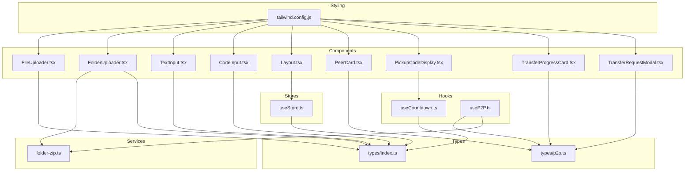

**Diagram sources**
- [FileUploader.tsx](file://packages/web/src/components/FileUploader.tsx)
- [FolderUploader.tsx](file://packages/web/src/components/FolderUploader.tsx)
- [TextInput.tsx](file://packages/web/src/components/TextInput.tsx)
- [CodeInput.tsx](file://packages/web/src/components/CodeInput.tsx)
- [Layout.tsx](file://packages/web/src/components/Layout.tsx)
- [PeerCard.tsx](file://packages/web/src/components/PeerCard.tsx)
- [PickupCodeDisplay.tsx](file://packages/web/src/components/PickupCodeDisplay.tsx)
- [TransferProgressCard.tsx](file://packages/web/src/components/TransferProgressCard.tsx)
- [TransferRequestModal.tsx](file://packages/web/src/components/TransferRequestModal.tsx)
- [folder-zip.ts](file://packages/web/src/services/folder-zip.ts)
- [useCountdown.ts](file://packages/web/src/hooks/useCountdown.ts)
- [useP2P.ts](file://packages/web/src/hooks/useP2P.ts)
- [useStore.ts](file://packages/web/src/stores/useStore.ts)
- [index.ts](file://packages/web/src/types/index.ts)
- [p2p.ts](file://packages/web/src/types/p2p.ts)
- [tailwind.config.js](file://packages/web/tailwind.config.js)

**Section sources**
- [tailwind.config.js:1-29](file://packages/web/tailwind.config.js#L1-L29)

## Core Components
This section summarizes each component’s purpose, props, state, and interaction model.

- FileUploader
  - Purpose: Accept a single file via click or drag-and-drop, enforce size limits, and signal upload intent.
  - Props:
    - onUpload: Function receiving a File when valid
    - loading: Optional boolean to disable input and show overlay spinner
    - maxSize: Optional maximum file size in bytes (default ~50MB)
  - State:
    - dragActive: Tracks drag-over state for visual feedback
    - error: Error message string or null
  - Interaction:
    - Drag-and-drop area triggers drop handler; click opens file picker; validates size before invoking onUpload
  - Accessibility:
    - Hidden input receives keyboard focus; visual feedback for drag state; disabled state prevents interaction during loading

- FolderUploader
  - Purpose: Compress a selected folder (or file list) into a ZIP and report readiness.
  - Props:
    - onZipReady: Function receiving Blob, folderName, and fileCount
    - loading: Optional boolean to disable input and show overlay spinner
    - maxSize: Optional maximum total size in bytes (default ~50MB)
    - maxFileCount: Optional maximum number of files (default 10000)
  - State:
    - dragActive: Tracks drag-over state
    - error: Error message string or null
    - zipping: Indicates compression in progress
    - progress: Percentage of compression completion
  - Interaction:
    - Accepts directory via WebKit directory API; falls back to file list; validates counts/sizes; compresses asynchronously; emits progress updates; invokes onZipReady with generated ZIP
  - Accessibility:
    - Hidden input with webkitdirectory attribute; disabled state during loading/compression

- TextInput
  - Purpose: Capture text content with character count and submit action.
  - Props:
    - onSubmit: Function receiving trimmed text when valid
    - loading: Optional boolean to disable input and button
    - maxLength: Optional maximum characters (default 10000)
  - State:
    - text: Controlled textarea value
  - Interaction:
    - Updates state on change; disables submit when empty or loading; submits trimmed text on click
  - Accessibility:
    - Proper label via placeholder; disabled states; focus ring for keyboard navigation

- CodeInput
  - Purpose: Collect a fixed-length pickup code with auto-focus, auto-navigation, paste handling, and immediate submission.
  - Props:
    - length: Optional code length (default 6)
    - onSubmit: Function receiving the concatenated code
    - loading: Optional boolean to disable input
  - State:
    - code: Array of single-character inputs initialized empty
    - inputRefs: Refs to each input element for programmatic focus
  - Interaction:
    - Uppercase filtering; backspace navigation; paste normalization; auto-submit when filled
  - Accessibility:
    - Individual inputs with maxLength=1; focused on mount; disabled during loading

- Layout
  - Purpose: Provide global header/footer, navigation, and user session controls.
  - Props:
    - children: Page content to render inside main container
  - State:
    - None; uses store for user/session state
  - Interaction:
    - Displays user greeting when logged in; navigates to home and logs out on logout click
  - Accessibility:
    - Semantic header/footer; links/buttons with visible focus states

- PeerCard
  - Purpose: Represent a P2P peer with availability and trigger send actions.
  - Props:
    - peer: PeerInfo with deviceName and status
    - onSendFile: Callback invoked when “Send file” is clicked
    - disabled: Optional boolean to disable the card
  - State:
    - None
  - Interaction:
    - Button enabled only when peer is available; clicking invokes callback
  - Accessibility:
    - Clear status indicator; enabled/disabled button states

- PickupCodeDisplay
  - Purpose: Present a newly created pickup code with expiration countdown and copy action.
  - Props:
    - result: TransferResult containing pickupCode and expiresAt
    - onReset: Callback to reset flow
  - State:
    - None; uses hook for countdown
  - Interaction:
    - Copies code to clipboard; resets flow on button click
  - Accessibility:
    - Large, readable code display; copy button with title tooltip

- TransferProgressCard
  - Purpose: Visualize a P2P transfer’s direction, status, progress, and size metrics.
  - Props:
    - transfer: TransferProgress with direction, status, sizes, and progress
  - State:
    - None
  - Interaction:
    - None; purely presentational
  - Accessibility:
    - Color-coded status; readable labels; progress bar semantics

- TransferRequestModal
  - Purpose: Confirm or reject incoming P2P transfer requests with countdown.
  - Props:
    - request: PendingTransfer with metadata and expiration
    - onAccept: Callback invoked on acceptance
    - onReject: Callback invoked on rejection
  - State:
    - timeLeft: Seconds countdown derived from expiresAt
  - Interaction:
    - Auto-rejects when countdown reaches zero; manual accept/reject buttons
  - Accessibility:
    - Modal backdrop; clear action buttons; countdown label

**Section sources**
- [FileUploader.tsx:1-86](file://packages/web/src/components/FileUploader.tsx#L1-L86)
- [FolderUploader.tsx:1-161](file://packages/web/src/components/FolderUploader.tsx#L1-L161)
- [TextInput.tsx:1-43](file://packages/web/src/components/TextInput.tsx#L1-L43)
- [CodeInput.tsx:1-74](file://packages/web/src/components/CodeInput.tsx#L1-L74)
- [Layout.tsx:1-62](file://packages/web/src/components/Layout.tsx#L1-L62)
- [PeerCard.tsx:1-64](file://packages/web/src/components/PeerCard.tsx#L1-L64)
- [PickupCodeDisplay.tsx:1-70](file://packages/web/src/components/PickupCodeDisplay.tsx#L1-L70)
- [TransferProgressCard.tsx:1-135](file://packages/web/src/components/TransferProgressCard.tsx#L1-L135)
- [TransferRequestModal.tsx:1-113](file://packages/web/src/components/TransferRequestModal.tsx#L1-L113)

## Architecture Overview
The components integrate with hooks, services, and stores to form a cohesive UI layer:
- FileUploader and FolderUploader communicate with parent containers via callbacks and optional loading flags.
- FolderUploader depends on folder-zip service for directory traversal and ZIP generation.
- PickupCodeDisplay relies on useCountdown to compute expiration visuals.
- TransferRequestModal coordinates with P2P state via useP2P and types.
- Layout composes the global shell and integrates with useStore for authentication state.
- Tailwind configuration centralizes design tokens and enables responsive utilities.

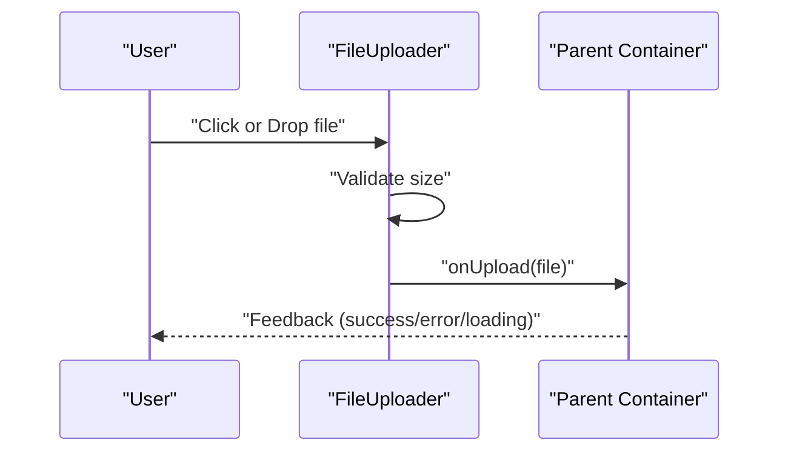

**Diagram sources**
- [FileUploader.tsx:13-41](file://packages/web/src/components/FileUploader.tsx#L13-L41)

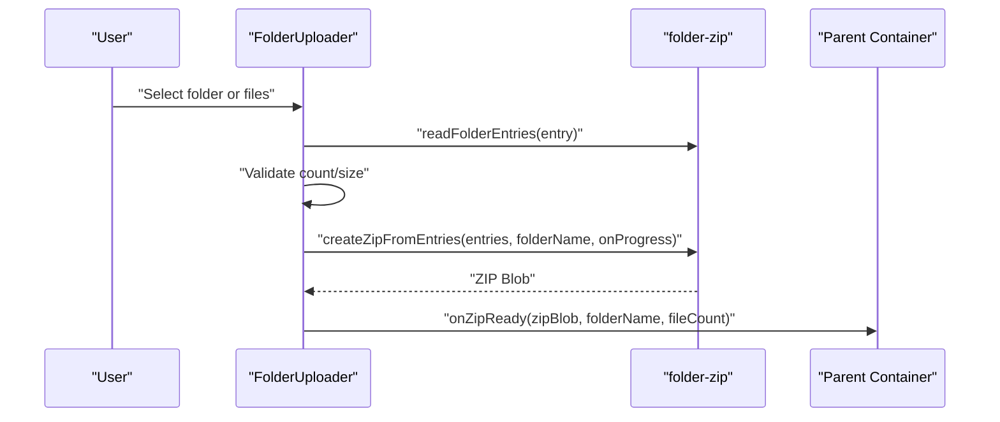

**Diagram sources**
- [FolderUploader.tsx:51-95](file://packages/web/src/components/FolderUploader.tsx#L51-L95)
- [folder-zip.ts:11-90](file://packages/web/src/services/folder-zip.ts#L11-L90)

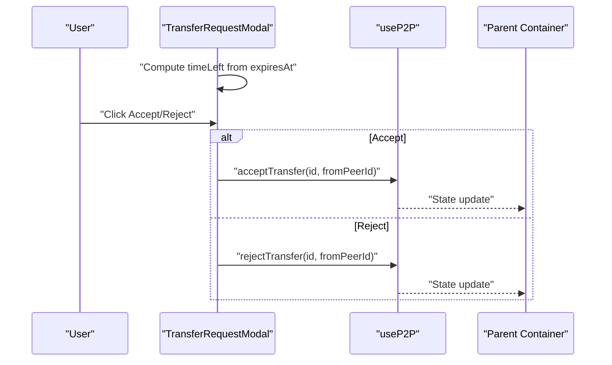

**Diagram sources**
- [TransferRequestModal.tsx:17-36](file://packages/web/src/components/TransferRequestModal.tsx#L17-L36)
- [useP2P.ts:134-142](file://packages/web/src/hooks/useP2P.ts#L134-L142)

## Detailed Component Analysis

### FileUploader
- Props and behavior:
  - onUpload(file): Invoked after size validation passes
  - loading: Disables input and overlays spinner
  - maxSize: Defaults to ~50MB; error shown if exceeded
- State and events:
  - dragActive toggles visual feedback on drag enter/leave
  - error holds validation messages
- UX:
  - Drop zone with icon and hint; click-to-select; disabled during loading

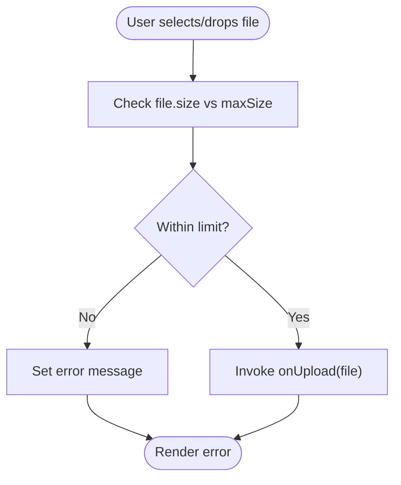

**Diagram sources**
- [FileUploader.tsx:13-23](file://packages/web/src/components/FileUploader.tsx#L13-L23)

**Section sources**
- [FileUploader.tsx:1-86](file://packages/web/src/components/FileUploader.tsx#L1-L86)

### FolderUploader
- Props and behavior:
  - onZipReady(zipBlob, folderName, fileCount): Called when compression completes
  - loading and maxSize/maxFileCount: Enforce constraints
- State and events:
  - dragActive, error, zipping, progress
  - Uses webkitdirectory input fallback to file list
- UX:
  - Directory tree traversal; progress bar; disabled states during loading/compression

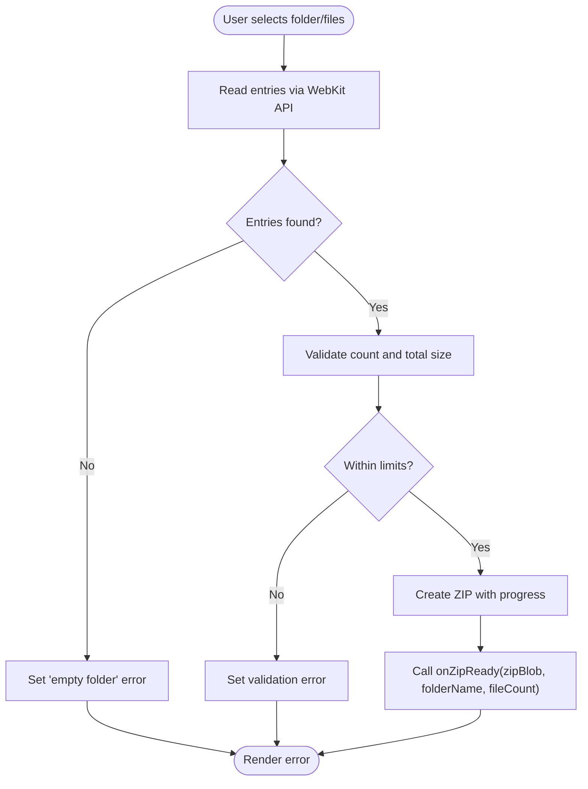

**Diagram sources**
- [FolderUploader.tsx:51-95](file://packages/web/src/components/FolderUploader.tsx#L51-L95)
- [folder-zip.ts:11-46](file://packages/web/src/services/folder-zip.ts#L11-L46)

**Section sources**
- [FolderUploader.tsx:1-161](file://packages/web/src/components/FolderUploader.tsx#L1-L161)
- [folder-zip.ts:1-91](file://packages/web/src/services/folder-zip.ts#L1-L91)

### TextInput
- Props and behavior:
  - onSubmit(text): Triggers on valid submission
  - loading: Disables input and button
  - maxLength: Enforced on textarea
- State and events:
  - Controlled text state; trim before submit; disabled submit when empty or loading

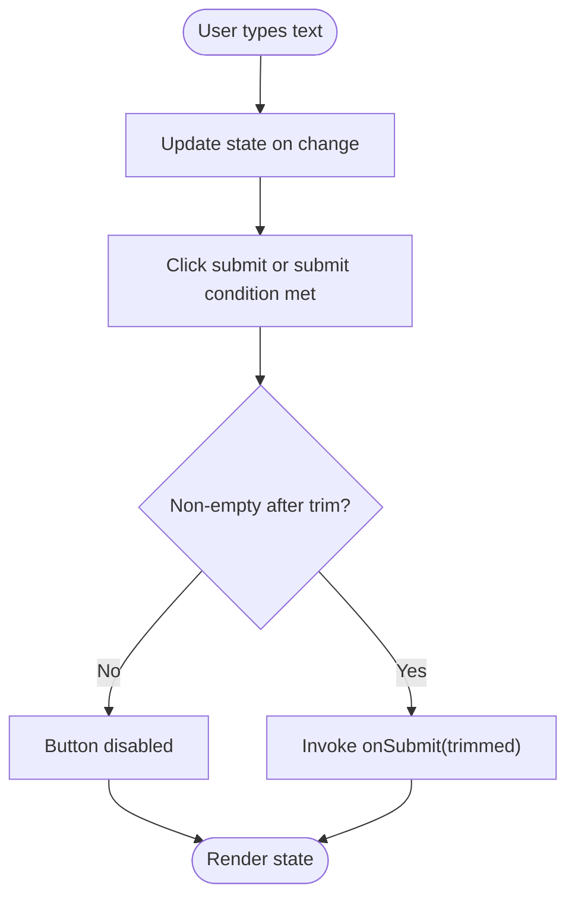

**Diagram sources**
- [TextInput.tsx:9-16](file://packages/web/src/components/TextInput.tsx#L9-L16)

**Section sources**
- [TextInput.tsx:1-43](file://packages/web/src/components/TextInput.tsx#L1-L43)

### CodeInput
- Props and behavior:
  - length: Number of code positions (default 6)
  - onSubmit(code): Invoked when code is complete
  - loading: Disables input
- State and events:
  - code array; refs for focus management; uppercase filtering; backspace navigation; paste normalization
- UX:
  - Auto-focus on mount; seamless digit entry; immediate submission when complete

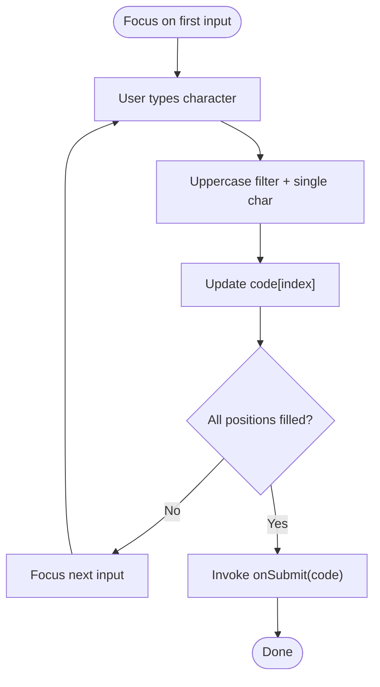

**Diagram sources**
- [CodeInput.tsx:9-51](file://packages/web/src/components/CodeInput.tsx#L9-L51)

**Section sources**
- [CodeInput.tsx:1-74](file://packages/web/src/components/CodeInput.tsx#L1-L74)

### Layout
- Props and behavior:
  - children: Rendered in main content area
- State and integration:
  - Uses useStore for user/session state; logout clears token and user
- Navigation:
  - Logo links to home; login link when not authenticated; logout button when authenticated

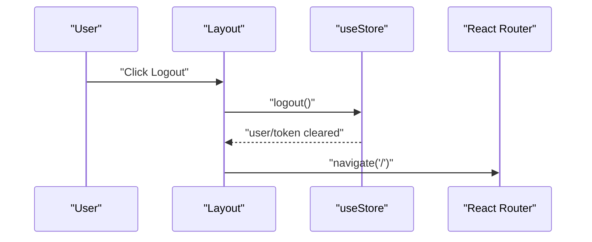

**Diagram sources**
- [Layout.tsx:9-12](file://packages/web/src/components/Layout.tsx#L9-L12)
- [useStore.ts:24-27](file://packages/web/src/stores/useStore.ts#L24-L27)

**Section sources**
- [Layout.tsx:1-62](file://packages/web/src/components/Layout.tsx#L1-L62)
- [useStore.ts:1-35](file://packages/web/src/stores/useStore.ts#L1-L35)

### PeerCard
- Props and behavior:
  - peer: Device info and availability status
  - onSendFile: Triggered when sending is enabled
  - disabled: Disables the card
- UX:
  - Visual status indicator; enabled only when peer is available

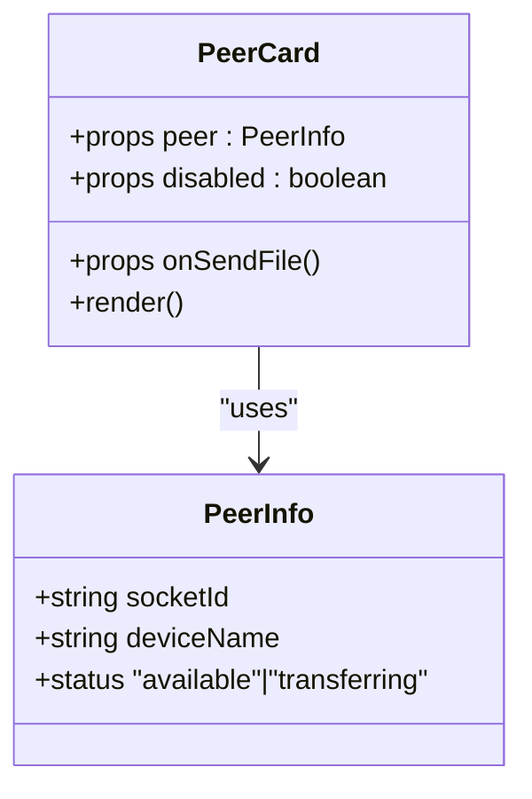

**Diagram sources**
- [PeerCard.tsx:3-7](file://packages/web/src/components/PeerCard.tsx#L3-L7)
- [p2p.ts:3-7](file://packages/web/src/types/p2p.ts#L3-L7)

**Section sources**
- [PeerCard.tsx:1-64](file://packages/web/src/components/PeerCard.tsx#L1-L64)
- [p2p.ts:1-101](file://packages/web/src/types/p2p.ts#L1-L101)

### PickupCodeDisplay
- Props and behavior:
  - result: TransferResult with pickupCode and expiresAt
  - onReset: Reset flow callback
- State and integration:
  - Uses useCountdown to compute formatted time and expiration flag
- UX:
  - Large code display; copy-to-clipboard; reset action

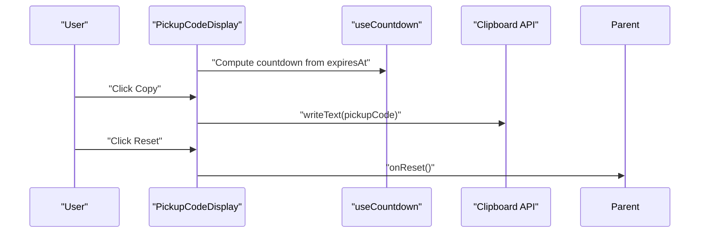

**Diagram sources**
- [PickupCodeDisplay.tsx:9-14](file://packages/web/src/components/PickupCodeDisplay.tsx#L9-L14)
- [useCountdown.ts:3-36](file://packages/web/src/hooks/useCountdown.ts#L3-L36)

**Section sources**
- [PickupCodeDisplay.tsx:1-70](file://packages/web/src/components/PickupCodeDisplay.tsx#L1-L70)
- [useCountdown.ts:1-37](file://packages/web/src/hooks/useCountdown.ts#L1-L37)

### TransferProgressCard
- Props and behavior:
  - transfer: TransferProgress with direction, status, sizes, and progress
- UX:
  - Directional icons; progress bar when transferring/connecting; status color coding; size formatting

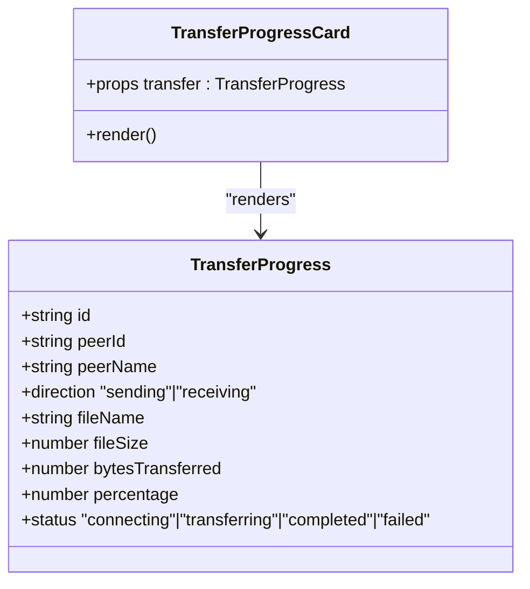

**Diagram sources**
- [TransferProgressCard.tsx:3-5](file://packages/web/src/components/TransferProgressCard.tsx#L3-L5)
- [p2p.ts:9-20](file://packages/web/src/types/p2p.ts#L9-L20)

**Section sources**
- [TransferProgressCard.tsx:1-135](file://packages/web/src/components/TransferProgressCard.tsx#L1-L135)
- [p2p.ts:1-101](file://packages/web/src/types/p2p.ts#L1-L101)

### TransferRequestModal
- Props and behavior:
  - request: PendingTransfer with metadata and expiration
  - onAccept/onReject: Action callbacks
- State and lifecycle:
  - Computes timeLeft from expiresAt; auto-rejects when countdown reaches zero
- UX:
  - Clear file metadata; countdown label; prominent accept/reject actions

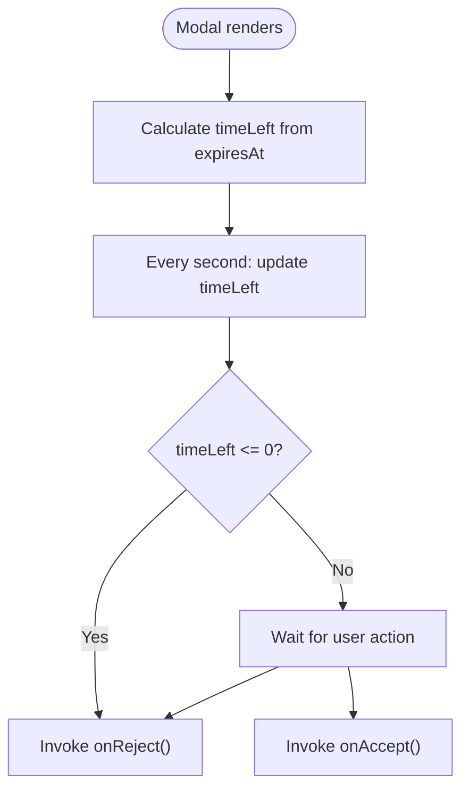

**Diagram sources**
- [TransferRequestModal.tsx:17-36](file://packages/web/src/components/TransferRequestModal.tsx#L17-L36)

**Section sources**
- [TransferRequestModal.tsx:1-113](file://packages/web/src/components/TransferRequestModal.tsx#L1-L113)
- [p2p.ts:22-29](file://packages/web/src/types/p2p.ts#L22-L29)

## Dependency Analysis
- Component-to-type relationships:
  - FileUploader/FileUploader.tsx -> types/index.ts (TransferResult, UploadOptions)
  - FolderUploader.tsx -> folder-zip.ts (FolderEntry, readFolderEntries, createZipFromEntries)
  - PeerCard.tsx, TransferProgressCard.tsx, useP2P.ts -> types/p2p.ts (PeerInfo, TransferProgress, PendingTransfer)
  - PickupCodeDisplay.tsx -> hooks/useCountdown.ts (countdown utilities)
  - Layout.tsx -> stores/useStore.ts (user/session state)
- Styling:
  - Tailwind classes across components rely on primary color palette and spacing utilities defined in tailwind.config.js

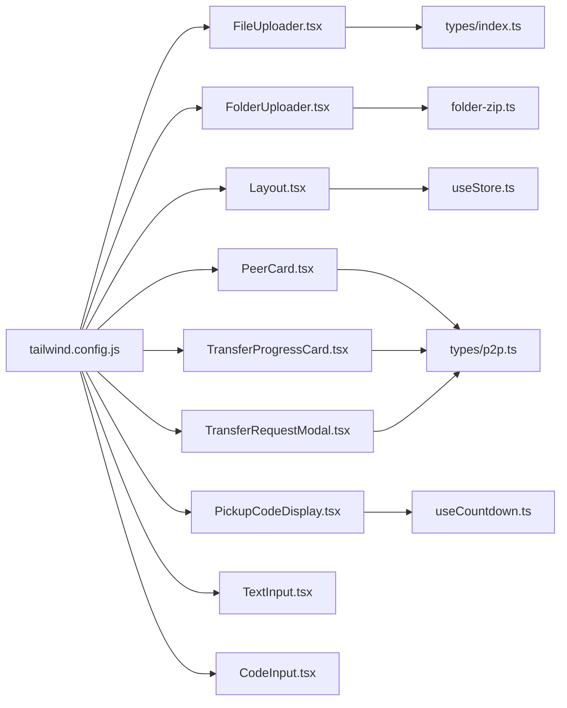

**Diagram sources**
- [FileUploader.tsx](file://packages/web/src/components/FileUploader.tsx)
- [FolderUploader.tsx](file://packages/web/src/components/FolderUploader.tsx)
- [TextInput.tsx](file://packages/web/src/components/TextInput.tsx)
- [CodeInput.tsx](file://packages/web/src/components/CodeInput.tsx)
- [Layout.tsx](file://packages/web/src/components/Layout.tsx)
- [PeerCard.tsx](file://packages/web/src/components/PeerCard.tsx)
- [PickupCodeDisplay.tsx](file://packages/web/src/components/PickupCodeDisplay.tsx)
- [TransferProgressCard.tsx](file://packages/web/src/components/TransferProgressCard.tsx)
- [TransferRequestModal.tsx](file://packages/web/src/components/TransferRequestModal.tsx)
- [folder-zip.ts](file://packages/web/src/services/folder-zip.ts)
- [useCountdown.ts](file://packages/web/src/hooks/useCountdown.ts)
- [useP2P.ts](file://packages/web/src/hooks/useP2P.ts)
- [useStore.ts](file://packages/web/src/stores/useStore.ts)
- [index.ts](file://packages/web/src/types/index.ts)
- [p2p.ts](file://packages/web/src/types/p2p.ts)
- [tailwind.config.js](file://packages/web/tailwind.config.js)

**Section sources**
- [index.ts:1-51](file://packages/web/src/types/index.ts#L1-L51)
- [p2p.ts:1-101](file://packages/web/src/types/p2p.ts#L1-L101)
- [folder-zip.ts:1-91](file://packages/web/src/services/folder-zip.ts#L1-L91)
- [useCountdown.ts:1-37](file://packages/web/src/hooks/useCountdown.ts#L1-L37)
- [useP2P.ts:1-155](file://packages/web/src/hooks/useP2P.ts#L1-L155)
- [useStore.ts:1-35](file://packages/web/src/stores/useStore.ts#L1-L35)
- [tailwind.config.js:1-29](file://packages/web/tailwind.config.js#L1-L29)

## Performance Considerations
- FileUploader
  - Validation occurs synchronously; keep maxSize reasonable to avoid blocking UI.
- FolderUploader
  - Compression runs in memory; large folders may cause high CPU usage. Consider chunking or worker threads if needed.
  - Progress reporting is handled via callbacks; ensure parents debounce UI updates.
- TransferProgressCard
  - Rendering frequency depends on progress updates; avoid unnecessary re-renders by memoizing props.
- TransferRequestModal
  - Countdown interval runs every second; cleanup in effect prevents leaks.

## Troubleshooting Guide
- FileUploader
  - Symptom: Error message appears after selecting oversized file.
  - Cause: File size exceeds maxSize.
  - Resolution: Reduce file size or adjust maxSize prop.
- FolderUploader
  - Symptom: “Cannot read folder” error.
  - Cause: Browser lacks WebKit directory API support or user denied access.
  - Resolution: Use fallback file list selection; verify browser compatibility.
  - Symptom: Empty folder error.
  - Cause: No files found in selected directory.
  - Resolution: Select a non-empty folder.
- CodeInput
  - Symptom: Characters not accepted.
  - Cause: Only allowed characters are processed; others are filtered.
  - Resolution: Ensure input matches allowed character set.
- TransferRequestModal
  - Symptom: Request auto-rejected unexpectedly.
  - Cause: Countdown reached zero.
  - Resolution: Act promptly or increase request lifetime.

**Section sources**
- [FileUploader.tsx:16-18](file://packages/web/src/components/FileUploader.tsx#L16-L18)
- [FolderUploader.tsx:20-26](file://packages/web/src/components/FolderUploader.tsx#L20-L26)
- [FolderUploader.tsx:65-67](file://packages/web/src/components/FolderUploader.tsx#L65-L67)
- [CodeInput.tsx:18](file://packages/web/src/components/CodeInput.tsx#L18)
- [TransferRequestModal.tsx:30-33](file://packages/web/src/components/TransferRequestModal.tsx#L30-L33)

## Conclusion
Airportal’s UI component library emphasizes clear user interactions, robust validation, and consistent styling through Tailwind. Components are designed to be reusable and composable, integrating with hooks and services to deliver a cohesive experience for file/text sharing, P2P transfers, and session management.

## Appendices
- Tailwind CSS
  - Primary color palette is extended and applied across components for consistent theming.
- Types
  - Shared types define transfer results, P2P progress, and pending requests to maintain type safety across components.

**Section sources**
- [tailwind.config.js:6-28](file://packages/web/tailwind.config.js#L6-L28)
- [index.ts:1-51](file://packages/web/src/types/index.ts#L1-L51)
- [p2p.ts:1-101](file://packages/web/src/types/p2p.ts#L1-L101)