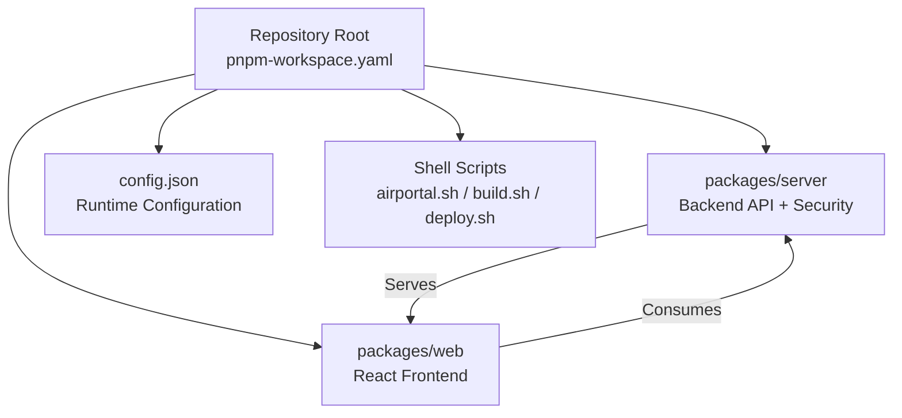
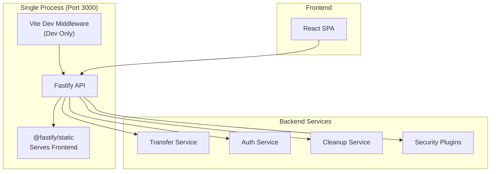

# Getting Started

<cite>
**Referenced Files in This Document**
- [package.json](file://package.json)
- [pnpm-workspace.yaml](file://pnpm-workspace.yaml)
- [tsconfig.base.json](file://tsconfig.base.json)
- [config.json](file://config.json)
- [packages/server/package.json](file://packages/server/package.json)
- [packages/web/package.json](file://packages/web/package.json)
- [airportal.sh](file://airportal.sh)
- [build.sh](file://build.sh)
- [deploy.sh](file://deploy.sh)
- [CLAUDE.md](file://CLAUDE.md)
- [packages/server/src/index.ts](file://packages/server/src/index.ts)
- [packages/web/src/main.tsx](file://packages/web/src/main.tsx)
</cite>

## Table of Contents
1. [Introduction](#introduction)
2. [Project Structure](#project-structure)
3. [Core Components](#core-components)
4. [Architecture Overview](#architecture-overview)
5. [Installation and Setup](#installation-and-setup)
6. [Development Environment](#development-environment)
7. [Running Locally](#running-locally)
8. [Quick Start Examples](#quick-start-examples)
9. [Build and Deployment](#build-and-deployment)
10. [Troubleshooting Guide](#troubleshooting-guide)
11. [Conclusion](#conclusion)

## Introduction
AirPortal is a secure file, text, and folder transfer application. It allows users to upload content and generate a pickup code that others can use to retrieve the content. The project uses a TypeScript monorepo with pnpm workspaces, featuring a single-process architecture serving both the API and the frontend on port 3000.

Key capabilities include:
- File, folder, and text uploads
- Pick-up code generation and retrieval
- Comprehensive security features (file type validation, IP blacklisting, rate limiting, audit logging, heuristic scanning, behavior tracking)
- Optional P2P LAN direct transfer
- SQLite-backed storage with Prisma ORM

## Project Structure
The repository follows a pnpm workspace layout with two primary packages:
- packages/server: Fastify-based backend with Prisma ORM and security plugins
- packages/web: React 18 + Vite frontend with TailwindCSS



**Diagram sources**
- [pnpm-workspace.yaml:1-3](file://pnpm-workspace.yaml#L1-L3)
- [packages/server/package.json:1-50](file://packages/server/package.json#L1-L50)
- [packages/web/package.json:1-39](file://packages/web/package.json#L1-L39)
- [config.json:1-102](file://config.json#L1-L102)
- [airportal.sh:1-211](file://airportal.sh#L1-L211)

**Section sources**
- [pnpm-workspace.yaml:1-3](file://pnpm-workspace.yaml#L1-L3)
- [package.json:1-21](file://package.json#L1-L21)
- [CLAUDE.md:31-74](file://CLAUDE.md#L31-L74)

## Core Components
- Backend (packages/server)
  - Fastify v5 with Prisma ORM + SQLite
  - Security plugin system (heuristic scanner, behavior tracker)
  - Authentication service (JWT)
  - Transfer service (file/text/folder handling)
  - Cleanup service (cron job for expired transfers)
  - IP blacklist service and audit logging
- Frontend (packages/web)
  - React 18 + Vite 5 + TailwindCSS
  - Zustand state management with persistence
  - Axios-based API client
  - Folder ZIP utility for compression

**Section sources**
- [CLAUDE.md:37-69](file://CLAUDE.md#L37-L69)
- [packages/server/package.json:19-48](file://packages/server/package.json#L19-L48)
- [packages/web/package.json:15-37](file://packages/web/package.json#L15-L37)

## Architecture Overview
AirPortal operates as a single-process application:
- Development: Fastify with Vite middleware (hot module replacement)
- Production: Fastify serves built frontend via @fastify/static



**Diagram sources**
- [CLAUDE.md:33-36](file://CLAUDE.md#L33-L36)
- [packages/server/src/index.ts:1-7](file://packages/server/src/index.ts#L1-L7)
- [packages/web/src/main.tsx:1-11](file://packages/web/src/main.tsx#L1-L11)

## Installation and Setup
### Prerequisites
- Node.js 18+ (required)
- pnpm package manager
- Git (recommended for updates)

### Install Dependencies
```bash
# Clone repository (if not already cloned)
git clone <repository-url>
cd airportal

# Install workspace dependencies
pnpm install --frozen-lockfile
```

### Generate Prisma Client
```bash
# Generate Prisma client for server package
pnpm --filter @airportal/server db:generate
```

**Section sources**
- [deploy.sh:58-89](file://deploy.sh#L58-L89)
- [deploy.sh:91-101](file://deploy.sh#L91-L101)
- [deploy.sh:203-206](file://deploy.sh#L203-L206)
- [package.json:6-16](file://package.json#L6-L16)

## Development Environment
### Node.js Version Requirements
- Minimum: Node.js 18.x
- Recommended: Latest LTS version
- Verify with: node -v

### Development Scripts
```bash
# Start development server (single process)
pnpm dev

# Database operations
pnpm db:generate    # Generate Prisma client
pnpm db:push       # Push schema changes to SQLite

# Testing
pnpm test          # Run all tests
pnpm test:server   # Backend tests only
pnpm test:web      # Frontend tests only
```

### Environment Configuration
Create .env file in packages/server/:
- NODE_ENV=development
- PORT=3000
- HOST=0.0.0.0
- DATABASE_URL=file:./data/airportal.db
- JWT_SECRET=<secure-random-secret>

**Section sources**
- [CLAUDE.md:11-29](file://CLAUDE.md#L11-L29)
- [deploy.sh:149-194](file://deploy.sh#L149-L194)
- [packages/server/package.json:6-18](file://packages/server/package.json#L6-L18)

## Running Locally
### Method 1: Using Service Management Script
```bash
# Start the service
./airportal.sh start

# Check status
./airportal.sh status

# View logs
./airportal.sh logs

# Stop the service
./airportal.sh stop
```

### Method 2: Direct Development
```bash
# Start backend in watch mode
pnpm --filter @airportal/server dev

# Start frontend (in another terminal)
pnpm --filter @airportal/web dev
```

### Access the Application
- Web Interface: http://localhost:3000
- API Health: http://localhost:3000/api/health
- Development HMR: Integrated with Fastify during development

**Section sources**
- [airportal.sh:64-106](file://airportal.sh#L64-L106)
- [airportal.sh:143-169](file://airportal.sh#L143-L169)
- [CLAUDE.md:13-16](file://CLAUDE.md#L13-L16)

## Quick Start Examples
### Upload Files
1. Navigate to http://localhost:3000
2. Click "Send" tab
3. Select files or paste text
4. Configure expiration (default 180 seconds)
5. Click "Generate Code"
6. Copy the generated 6-character code

### Generate Pick-up Codes
- Use the Send page to upload content
- Codes are 6 characters long (excluding 0OIl1)
- Expiration configurable in config.json (default 180s, max 3600s)

### Download Shared Content
1. Navigate to http://localhost:3000
2. Click "Receive" tab
3. Enter the pickup code
4. Download the content

### Authentication (Optional)
- Register/Login to enable protected features
- JWT tokens managed by authService

**Section sources**
- [CLAUDE.md:90-93](file://CLAUDE.md#L90-L93)
- [config.json:78-82](file://config.json#L78-L82)

## Build and Deployment
### Local Build Process
```bash
# Build both packages
pnpm build

# Or build individually
pnpm --filter @airportal/web build
pnpm --filter @airportal/server build
```

### Production Start
```bash
# Start production server (single process)
pnpm start
```

### Automated Build Script
```bash
# Run the comprehensive build script
./build.sh [version]

# Creates deployment package with:
# - Compiled frontend assets
# - Backend distribution
# - Prisma schema
# - Startup scripts
# - Configuration files
```

### One-Click Deployment
```bash
# Deploy to target system
./deploy.sh [/opt/airportal]

# Features:
# - Automatic Node.js 18+ installation
# - PM2 process management setup
# - Database initialization
# - Firewall configuration (optional)
# - Systemd service creation (optional)
```

### Deployment Package Contents
- server/: Compiled backend with Prisma schema
- web/: Built frontend static assets
- config.json: Runtime configuration
- .env.example: Environment variable template
- start.sh: Production startup script
- stop.sh: Service termination script

**Section sources**
- [build.sh:64-91](file://build.sh#L64-L91)
- [build.sh:93-152](file://build.sh#L93-L152)
- [build.sh:176-232](file://build.sh#L176-L232)
- [deploy.sh:224-232](file://deploy.sh#L224-L232)
- [deploy.sh:352-382](file://deploy.sh#L352-L382)

## Troubleshooting Guide
### Common Issues and Solutions

#### Port 3000 Already in Use
```bash
# Check what's using the port
lsof -i :3000

# Kill the process or change PORT in .env
kill -9 $(lsof -t -i :3000)
```

#### Database Initialization Errors
```bash
# Clear existing database and reinitialize
rm -f packages/server/data/airportal.db
pnpm --filter @airportal/server db:push
```

#### Prisma Client Generation Failure
```bash
# Regenerate Prisma client
pnpm --filter @airportal/server db:generate
```

#### Permission Denied Errors
```bash
# Fix directory permissions
chmod -R 755 packages/server/data/
chmod -R 755 packages/server/uploads/
```

#### Frontend Build Failures
```bash
# Clean and rebuild
pnpm --filter @airportal/web clean
pnpm --filter @airportal/web build
```

#### Service Management Issues
```bash
# Check service status
./airportal.sh status

# View detailed logs
./airportal.sh logs

# Restart service
./airportal.sh restart
```

### Environment Variables Reference
Critical environment variables (set in packages/server/.env):
- NODE_ENV: production/development
- PORT: Service port (default 3000)
- HOST: Bind address (default 0.0.0.0)
- DATABASE_URL: SQLite file path
- JWT_SECRET: Cryptographic secret

### Configuration Validation
Verify configuration with:
```bash
# Test configuration loading
pnpm --filter @airportal/server start
# Check logs for configuration errors
```

**Section sources**
- [airportal.sh:40-62](file://airportal.sh#L40-L62)
- [airportal.sh:108-134](file://airportal.sh#L108-L134)
- [deploy.sh:208-222](file://deploy.sh#L208-L222)
- [build.sh:53-62](file://build.sh#L53-L62)

## Conclusion
AirPortal provides a secure, self-contained file transfer solution with comprehensive security features and a streamlined development experience. The single-process architecture simplifies deployment while maintaining robust security through multiple layers of protection.

Key advantages:
- Zero-dependency single binary deployment
- Built-in security plugins and rate limiting
- SQLite-based persistence with Prisma ORM
- Hot module replacement in development
- Comprehensive testing suite
- Automated deployment scripts

For production deployments, use the deploy.sh script for automated setup or follow the manual build process outlined above. Monitor service health via the API endpoints and configure security settings according to your organizational requirements.