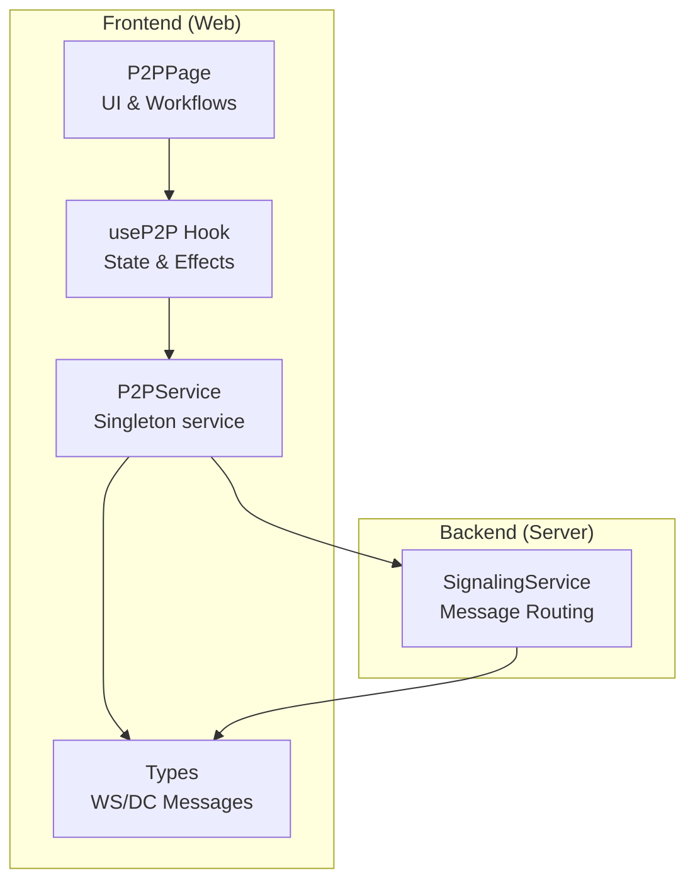
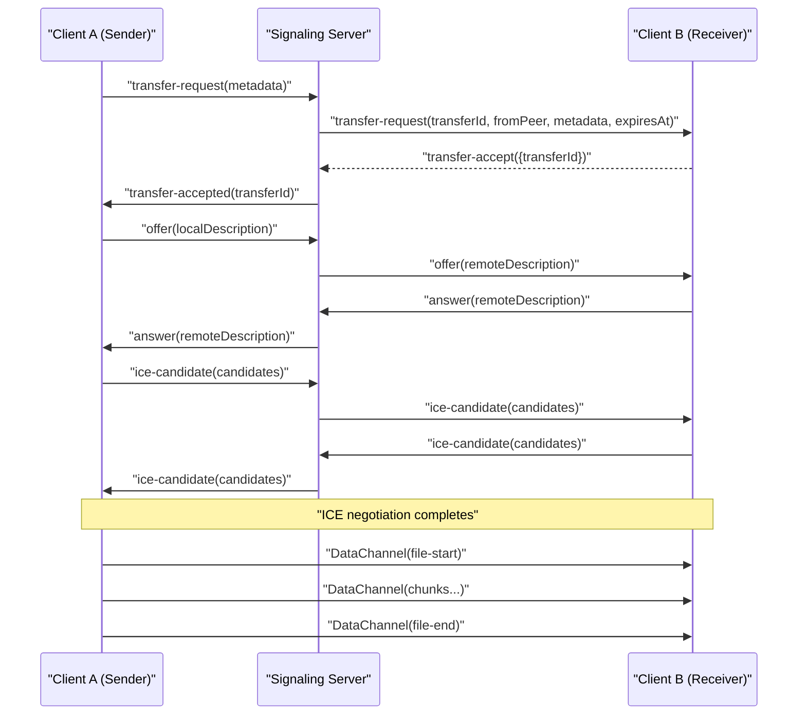
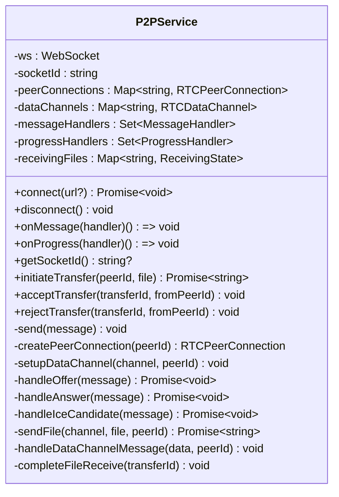
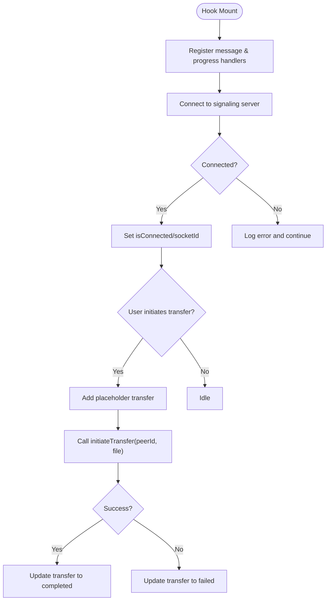
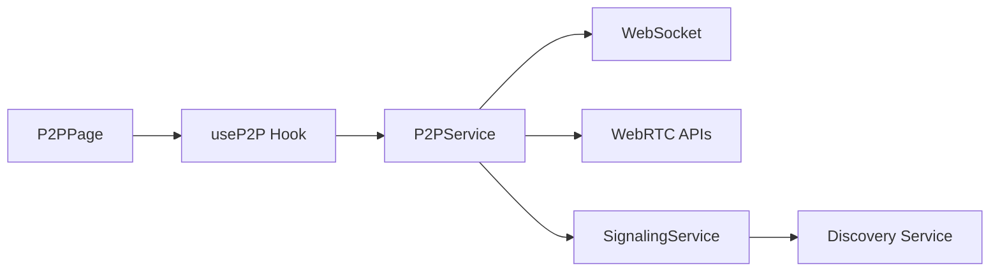

# P2P Transfer System

<cite>
**Referenced Files in This Document**
- [p2p.service.ts](file://packages/web/src/services/p2p.service.ts)
- [useP2P.ts](file://packages/web/src/hooks/useP2P.ts)
- [P2PPage.tsx](file://packages/web/src/pages/P2PPage.tsx)
- [p2p.ts](file://packages/web/src/types/p2p.ts)
- [signaling.service.ts](file://packages/server/src/services/signaling.service.ts)
</cite>

## Table of Contents
1. [Introduction](#introduction)
2. [Project Structure](#project-structure)
3. [Core Components](#core-components)
4. [Architecture Overview](#architecture-overview)
5. [Detailed Component Analysis](#detailed-component-analysis)
6. [Dependency Analysis](#dependency-analysis)
7. [Performance Considerations](#performance-considerations)
8. [Troubleshooting Guide](#troubleshooting-guide)
9. [Conclusion](#conclusion)

## Introduction
This document describes Airportal's WebRTC-based peer-to-peer (P2P) transfer system. It covers the WebRTC implementation for direct device-to-device communication, signaling server coordination, data channel management, and the React-based frontend hooks and pages that orchestrate transfers. The system is designed for local network environments and emphasizes reliable connection establishment, progress tracking, and user experience during file transfers.

## Project Structure
The P2P system spans both the frontend and backend:
- Frontend (Web): React components, custom hooks, and a singleton service managing WebRTC connections and signaling over WebSocket.
- Backend (Server): Signaling service that validates peers, forwards WebRTC signaling messages, and manages transfer requests with timeouts and state transitions.

**Diagram sources**
- [p2p.service.ts:14-580](file://packages/web/src/services/p2p.service.ts#L14-L580)
- [useP2P.ts:23-155](file://packages/web/src/hooks/useP2P.ts#L23-L155)
- [P2PPage.tsx:7-155](file://packages/web/src/pages/P2PPage.tsx#L7-L155)
- [p2p.ts:1-101](file://packages/web/src/types/p2p.ts#L1-L101)
- [signaling.service.ts:26-350](file://packages/server/src/services/signaling.service.ts#L26-L350)

**Section sources**
- [p2p.service.ts:14-580](file://packages/web/src/services/p2p.service.ts#L14-L580)
- [useP2P.ts:23-155](file://packages/web/src/hooks/useP2P.ts#L23-L155)
- [P2PPage.tsx:7-155](file://packages/web/src/pages/P2PPage.tsx#L7-L155)
- [p2p.ts:1-101](file://packages/web/src/types/p2p.ts#L1-L101)
- [signaling.service.ts:26-350](file://packages/server/src/services/signaling.service.ts#L26-L350)

## Core Components
- P2PService (frontend): Manages WebSocket signaling, WebRTC peer connections, data channels, message routing, and file transfer logic.
- useP2P hook: Provides reactive state for connectivity, peers, pending transfers, and progress updates; orchestrates transfer initiation and acceptance.
- P2PPage: Renders the P2P interface, peer discovery grid, transfer progress cards, and transfer request modal.
- Types: Defines WebSocket and DataChannel message schemas used across the system.
- SignalingService (backend): Validates peers, forwards WebRTC signaling messages, and manages transfer request lifecycle.

Key implementation patterns:
- Singleton service pattern for long-lived WebSocket and peer connections.
- Event-driven message handling with handler registration/unregistration.
- Chunked file transfer over WebRTC DataChannel with backpressure control.
- Local network focus with no STUN/TURN servers configured.

**Section sources**
- [p2p.service.ts:14-580](file://packages/web/src/services/p2p.service.ts#L14-L580)
- [useP2P.ts:23-155](file://packages/web/src/hooks/useP2P.ts#L23-L155)
- [P2PPage.tsx:7-155](file://packages/web/src/pages/P2PPage.tsx#L7-L155)
- [p2p.ts:1-101](file://packages/web/src/types/p2p.ts#L1-L101)
- [signaling.service.ts:26-350](file://packages/server/src/services/signaling.service.ts#L26-L350)

## Architecture Overview
The system operates in a local network environment:
- Clients connect to a signaling server via WebSocket to exchange signaling messages.
- Signaling messages include WebRTC offers/answers and ICE candidates.
- After successful ICE negotiation, a WebRTC data channel is established for file transfer.
- Transfer requests are coordinated by the server with timeouts and state transitions.

**Diagram sources**
- [signaling.service.ts:40-202](file://packages/server/src/services/signaling.service.ts#L40-L202)
- [p2p.service.ts:362-498](file://packages/web/src/services/p2p.service.ts#L362-L498)

## Detailed Component Analysis

### P2PService: WebRTC and Signaling Management
Responsibilities:
- WebSocket connection to signaling server with idempotent connect semantics.
- Registration and dispatch of message and progress handlers.
- Creation and management of RTCPeerConnection instances per peer.
- ICE candidate forwarding and WebRTC SDP exchange (offer/answer).
- Data channel creation, event handling, and chunked file transfer with backpressure.
- File receiving pipeline with progress reporting and completion handling.

Implementation highlights:
- WebSocket URL derivation based on current origin with automatic wss/ws selection.
- No STUN/TURN servers configured, optimized for local network operation.
- Backpressure control using bufferedAmount thresholds during file sending.
- Chunk size tuned for WebRTC DataChannel safety.

**Diagram sources**
- [p2p.service.ts:14-580](file://packages/web/src/services/p2p.service.ts#L14-L580)

**Section sources**
- [p2p.service.ts:35-143](file://packages/web/src/services/p2p.service.ts#L35-L143)
- [p2p.service.ts:226-278](file://packages/web/src/services/p2p.service.ts#L226-L278)
- [p2p.service.ts:362-498](file://packages/web/src/services/p2p.service.ts#L362-L498)
- [p2p.service.ts:503-575](file://packages/web/src/services/p2p.service.ts#L503-L575)

### useP2P Hook: State Management and Workflows
Responsibilities:
- Registers message and progress handlers upon mount and unregisters on unmount.
- Maintains state for connection status, socket ID, peers, pending transfers, and active transfers.
- Implements transfer initiation with immediate UI feedback and error handling.
- Delegates transfer acceptance/rejection to the P2PService.

Key behaviors:
- Idempotent connect() call to avoid duplicate WebSocket creation under React 18 StrictMode.
- Immediate placeholder transfer rendering to show "connecting" state while establishing WebRTC.
- Progress updates mapped to bytes transferred and percentage completion.

**Diagram sources**
- [useP2P.ts:30-92](file://packages/web/src/hooks/useP2P.ts#L30-L92)
- [useP2P.ts:94-132](file://packages/web/src/hooks/useP2P.ts#L94-L132)

**Section sources**
- [useP2P.ts:23-155](file://packages/web/src/hooks/useP2P.ts#L23-L155)

### P2PPage: UI and User Interactions
Responsibilities:
- Displays connection status and peer discovery grid.
- Provides file selection and transfer initiation flow.
- Shows active transfers and handles transfer request modal actions.
- Integrates with useP2P for state and actions.

User journey:
- Select a peer from the discovered list.
- Choose a file via hidden input click.
- Initiate transfer; observe progress cards update in real-time.
- Receive transfer requests and accept/reject them.

**Section sources**
- [P2PPage.tsx:7-155](file://packages/web/src/pages/P2PPage.tsx#L7-L155)

### SignalingService: Backend Coordination
Responsibilities:
- Validates that peers are in the same subnet before forwarding messages.
- Forwards WebRTC signaling messages (offer, answer, ice-candidate).
- Manages transfer requests with unique IDs, timeouts, and state transitions.
- Notifies both parties of acceptance, rejection, expiration, and completion.

Operational flow:
- Transfer request creation with metadata validation and timeout scheduling.
- Acceptance verification and peer status updates.
- Rejection cleanup and notifications.
- Completion cleanup and peer status reset.

**Section sources**
- [signaling.service.ts:40-350](file://packages/server/src/services/signaling.service.ts#L40-L350)

## Dependency Analysis
The frontend and backend components interact as follows:
- P2PService depends on WebSocket for signaling and WebRTC APIs for peer connections.
- useP2P depends on P2PService for all operations and state updates.
- P2PPage depends on useP2P for UI state and actions.
- SignalingService depends on discovery mechanisms to route messages and manage peer status.

**Diagram sources**
- [p2p.service.ts:14-580](file://packages/web/src/services/p2p.service.ts#L14-L580)
- [useP2P.ts:23-155](file://packages/web/src/hooks/useP2P.ts#L23-L155)
- [P2PPage.tsx:7-155](file://packages/web/src/pages/P2PPage.tsx#L7-L155)
- [signaling.service.ts:26-350](file://packages/server/src/services/signaling.service.ts#L26-L350)

**Section sources**
- [p2p.service.ts:14-580](file://packages/web/src/services/p2p.service.ts#L14-L580)
- [useP2P.ts:23-155](file://packages/web/src/hooks/useP2P.ts#L23-L155)
- [P2PPage.tsx:7-155](file://packages/web/src/pages/P2PPage.tsx#L7-L155)
- [signaling.service.ts:26-350](file://packages/server/src/services/signaling.service.ts#L26-L350)

## Performance Considerations
- DataChannel chunk sizing: 16KB chunks balance throughput and reliability for WebRTC DataChannel.
- Backpressure control: The sender monitors bufferedAmount and throttles transmission to prevent congestion.
- Local network optimization: No STUN/TURN servers reduce latency and improve reliability within LAN.
- Connection reuse: The singleton P2PService maintains persistent WebSocket and peer connections across page re-mounts.
- Progress reporting: Efficient client-side progress calculation avoids frequent DOM updates.

Recommendations:
- Monitor bufferedAmount dynamically and adjust chunk size based on observed network conditions.
- Consider compression for large text files to reduce transfer time.
- Implement retry logic for transient ICE failures if extended to heterogeneous networks.

**Section sources**
- [p2p.service.ts:12](file://packages/web/src/services/p2p.service.ts#L12)
- [p2p.service.ts:477-479](file://packages/web/src/services/p2p.service.ts#L477-L479)
- [p2p.service.ts:228](file://packages/web/src/services/p2p.service.ts#L228)

## Troubleshooting Guide
Common issues and diagnostics:
- WebSocket connection errors: Check signaling server availability and CORS/WSS configuration.
- ICE negotiation failures: Ensure both peers are on the same local network; verify firewall/NAT restrictions.
- DataChannel errors: Inspect binaryType and message parsing; confirm chunk boundaries and order.
- Transfer timeouts: Validate request timeout settings and peer responsiveness; check for expired requests.
- Progress not updating: Confirm progress handlers are registered and message handlers are firing.

Actions:
- Use browser developer tools to inspect WebSocket frames and DataChannel messages.
- Log peer connection state changes and ICE candidate exchanges.
- Verify that the signaling server enforces subnet checks and forwards messages correctly.

**Section sources**
- [p2p.service.ts:98-101](file://packages/web/src/services/p2p.service.ts#L98-L101)
- [p2p.service.ts:263-273](file://packages/web/src/services/p2p.service.ts#L263-L273)
- [signaling.service.ts:50-63](file://packages/server/src/services/signaling.service.ts#L50-L63)

## Conclusion
Airportal's P2P transfer system leverages WebRTC DataChannels for efficient, direct device-to-device file transfers within local networks. The frontend provides a robust service and hook layer for connection management, transfer orchestration, and progress tracking, while the backend coordinates signaling and enforces local-network constraints. The design balances simplicity, reliability, and user experience, with clear extension points for enhanced resilience and performance.