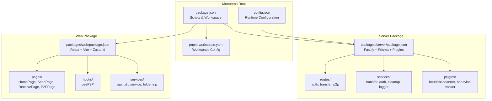
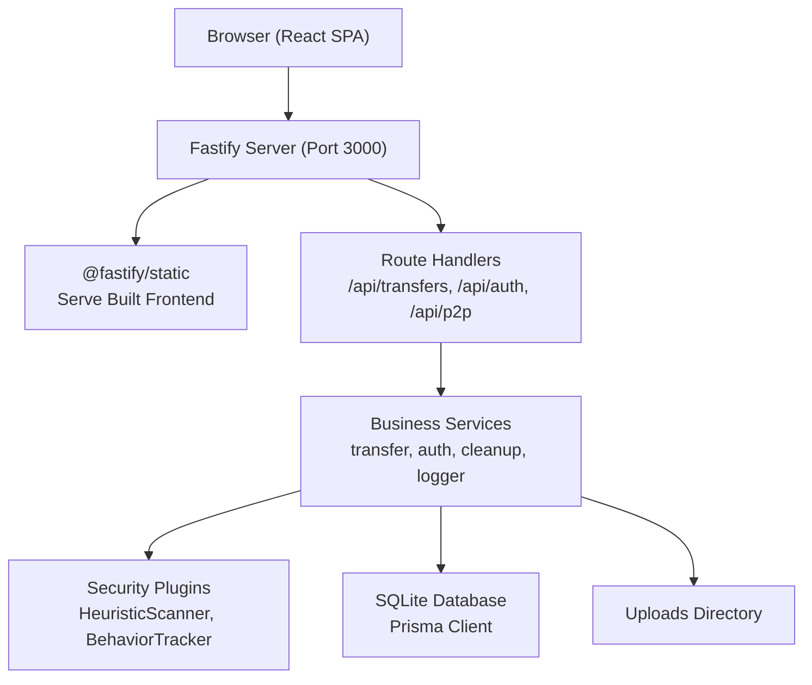
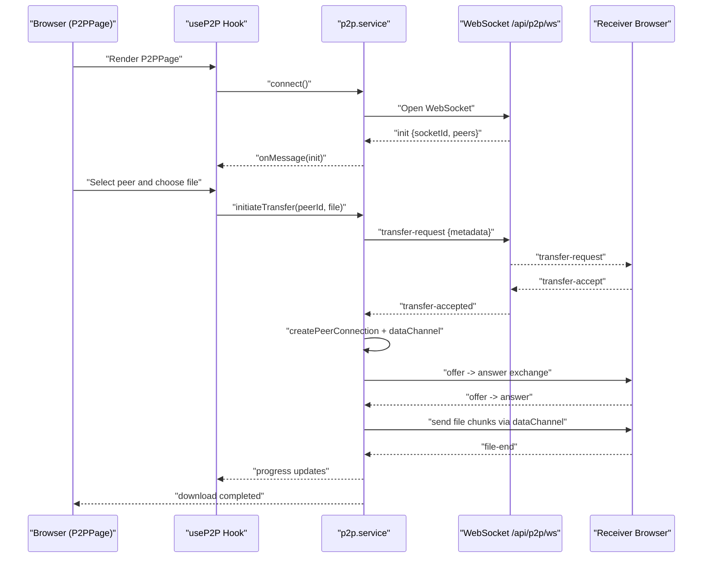
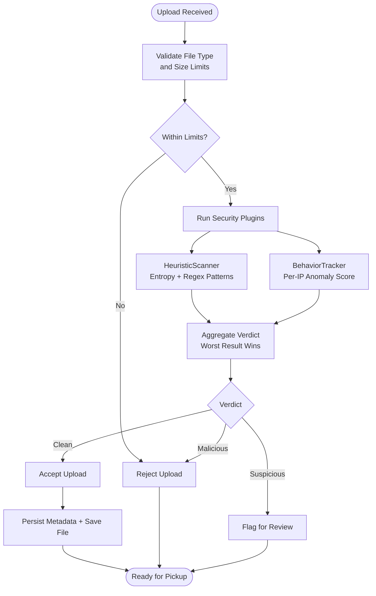
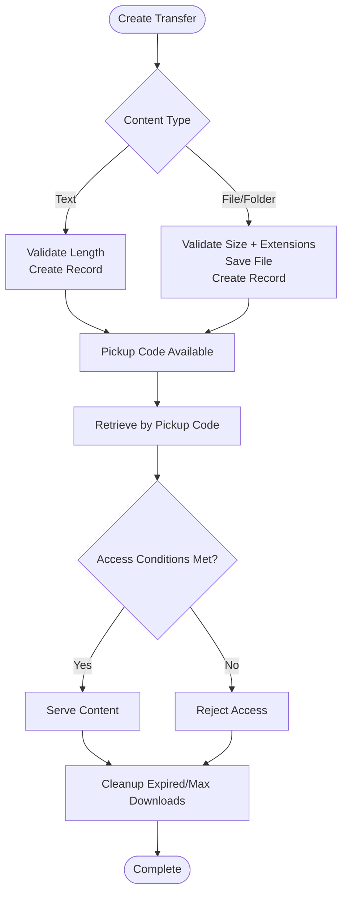
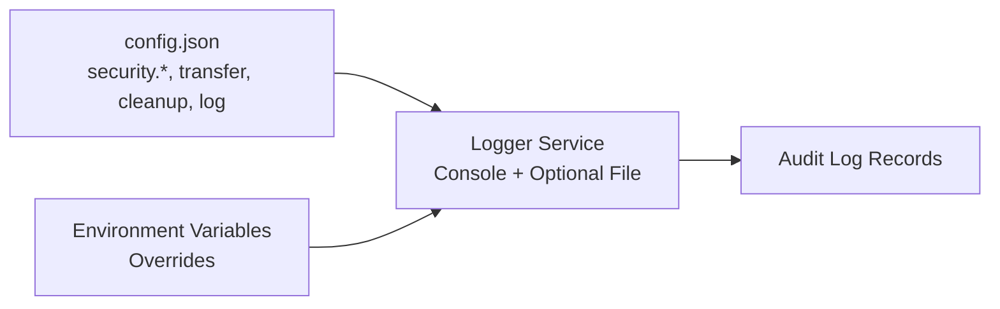
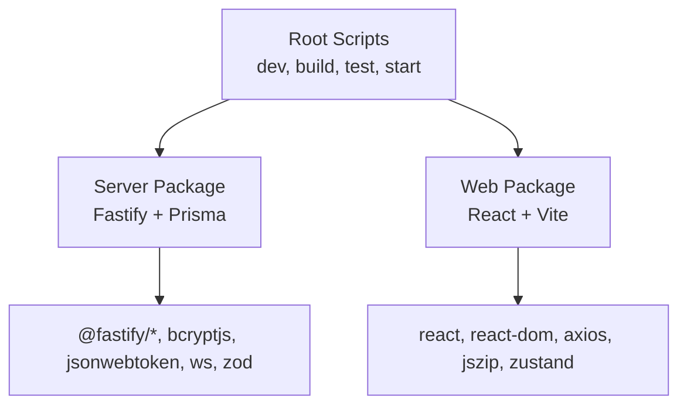

# Project Overview

<cite>
**Referenced Files in This Document**
- [package.json](file://package.json)
- [pnpm-workspace.yaml](file://pnpm-workspace.yaml)
- [CLAUDE.md](file://CLAUDE.md)
- [config.json](file://config.json)
- [packages/server/package.json](file://packages/server/package.json)
- [packages/web/package.json](file://packages/web/package.json)
- [packages/server/src/routes/p2p.routes.ts](file://packages/server/src/routes/p2p.routes.ts)
- [packages/web/src/pages/P2PPage.tsx](file://packages/web/src/pages/P2PPage.tsx)
- [packages/web/src/hooks/useP2P.ts](file://packages/web/src/hooks/useP2P.ts)
- [packages/web/src/services/p2p.service.ts](file://packages/web/src/services/p2p.service.ts)
- [packages/server/src/plugins/heuristic-scanner.ts](file://packages/server/src/plugins/heuristic-scanner.ts)
- [packages/server/src/plugins/behavior-tracker.ts](file://packages/server/src/plugins/behavior-tracker.ts)
- [packages/server/src/services/transfer.service.ts](file://packages/server/src/services/transfer.service.ts)
- [packages/server/src/services/logger.service.ts](file://packages/server/src/services/logger.service.ts)
</cite>

## Table of Contents
1. [Introduction](#introduction)
2. [Project Structure](#project-structure)
3. [Core Components](#core-components)
4. [Architecture Overview](#architecture-overview)
5. [Detailed Component Analysis](#detailed-component-analysis)
6. [Dependency Analysis](#dependency-analysis)
7. [Performance Considerations](#performance-considerations)
8. [Troubleshooting Guide](#troubleshooting-guide)
9. [Conclusion](#conclusion)

## Introduction
AirPortal is a secure file, text, and folder transfer application designed for direct device-to-device sharing using short pickup codes. It emphasizes privacy and security by enabling peer-to-peer transfers over WebRTC within local networks, while also providing traditional upload-and-retrieve flows with robust security controls. The platform differentiates itself from conventional file transfer solutions through a security-first architecture that includes pluggable heuristic scanning, behavior anomaly detection, comprehensive audit logging, IP blacklisting, and strict upload validation.

Key value propositions:
- Secure transfers with minimal trust assumptions: P2P direct device-to-device transfers reduce reliance on centralized servers for data movement.
- Code-based access: Pickup codes enable secure handoff without requiring persistent accounts.
- Comprehensive security: Pluggable security plugins, heuristic scanning, behavior tracking, and audit logging provide layered protection.
- Operational control: Configurable limits, quotas, and cleanup policies help manage resource usage and compliance.

Target audience:
- Privacy-conscious individuals and teams needing secure file/text sharing.
- Organizations seeking low-trust, local-network transfer capabilities.
- Developers and operators who require transparent, auditable systems with granular controls.

Common use cases:
- Sharing large files between devices on the same LAN without cloud intermediaries.
- Securely distributing text snippets or small documents with expiration and access controls.
- Controlled distribution of folder archives with safety checks and quotas.
- Auditing and monitoring of transfer activity for compliance scenarios.

## Project Structure
AirPortal follows a TypeScript monorepo managed by pnpm workspaces, separating concerns into distinct packages:
- packages/server: Node.js backend built with Fastify, serving both API and static frontend assets in a single-process architecture.
- packages/web: React 18 frontend with Vite and TailwindCSS, providing user-facing pages for sending, receiving, and managing transfers.

**Diagram sources**
- [package.json:1-21](file://package.json#L1-L21)
- [pnpm-workspace.yaml:1-3](file://pnpm-workspace.yaml#L1-L3)
- [config.json:1-102](file://config.json#L1-L102)
- [packages/server/package.json:1-50](file://packages/server/package.json#L1-L50)
- [packages/web/package.json:1-39](file://packages/web/package.json#L1-L39)

**Section sources**
- [package.json:1-21](file://package.json#L1-L21)
- [pnpm-workspace.yaml:1-3](file://pnpm-workspace.yaml#L1-L3)
- [CLAUDE.md:31-74](file://CLAUDE.md#L31-L74)

## Core Components
- Single-process server architecture: A unified Fastify server serves both the API and the built frontend in production, with Vite middleware during development.
- Security plugin system: Pluggable, configurable pipeline supporting heuristic scanning and behavior anomaly detection, orchestrated by a plugin manager.
- P2P transfer engine: WebRTC-based direct device-to-device transfers with signaling over WebSocket, including peer discovery and data channel file streaming.
- Transfer services: Business logic for creating, retrieving, and cleaning up transfers with validation, quotas, and access controls.
- Audit logging: Structured logging with configurable levels and optional file output for security and operational insights.

**Section sources**
- [CLAUDE.md:9-10](file://CLAUDE.md#L9-L10)
- [CLAUDE.md:46-59](file://CLAUDE.md#L46-L59)
- [CLAUDE.md:94-105](file://CLAUDE.md#L94-L105)
- [packages/server/src/services/transfer.service.ts:12-29](file://packages/server/src/services/transfer.service.ts#L12-L29)
- [packages/server/src/services/logger.service.ts:14-78](file://packages/server/src/services/logger.service.ts#L14-L78)

## Architecture Overview
AirPortal’s runtime architecture centers on a single-process Fastify server that hosts both the API and the frontend. The server exposes REST endpoints for transfers and authentication, integrates security plugins, and manages cleanup jobs. The frontend provides intuitive pages for sending, receiving, and participating in P2P transfers. Configuration is loaded from config.json with environment variable overrides.

**Diagram sources**
- [CLAUDE.md:33-44](file://CLAUDE.md#L33-L44)
- [packages/server/package.json:19-35](file://packages/server/package.json#L19-L35)
- [packages/server/src/services/transfer.service.ts:10](file://packages/server/src/services/transfer.service.ts#L10)

**Section sources**
- [CLAUDE.md:31-44](file://CLAUDE.md#L31-L44)
- [config.json:2-5](file://config.json#L2-L5)

## Detailed Component Analysis

### P2P Direct Device-to-Device Transfers
AirPortal enables secure, local-network transfers using WebRTC. The frontend establishes a WebSocket connection to a signaling endpoint, discovers peers, and negotiates WebRTC connections to stream files directly between devices. The backend coordinates peer registration and signaling messages, while the frontend manages the WebRTC data channel lifecycle and file chunking.

**Diagram sources**
- [packages/web/src/pages/P2PPage.tsx:1-155](file://packages/web/src/pages/P2PPage.tsx#L1-L155)
- [packages/web/src/hooks/useP2P.ts:1-155](file://packages/web/src/hooks/useP2P.ts#L1-L155)
- [packages/web/src/services/p2p.service.ts:1-580](file://packages/web/src/services/p2p.service.ts#L1-L580)
- [packages/server/src/routes/p2p.routes.ts:48-133](file://packages/server/src/routes/p2p.routes.ts#L48-L133)

**Section sources**
- [packages/web/src/pages/P2PPage.tsx:7-155](file://packages/web/src/pages/P2PPage.tsx#L7-L155)
- [packages/web/src/hooks/useP2P.ts:23-155](file://packages/web/src/hooks/useP2P.ts#L23-L155)
- [packages/web/src/services/p2p.service.ts:14-580](file://packages/web/src/services/p2p.service.ts#L14-L580)
- [packages/server/src/routes/p2p.routes.ts:48-133](file://packages/server/src/routes/p2p.routes.ts#L48-L133)

### Security Plugin System: Heuristic Scanning and Behavior Tracking
AirPortal implements a pluggable security pipeline that evaluates uploaded content and user behavior to detect potential threats. Heuristic scanning performs entropy analysis and regex-based pattern matching against suspicious constructs, while behavior tracking monitors per-IP upload patterns to flag anomalies. Results are aggregated and can influence automatic IP blocking.

**Diagram sources**
- [packages/server/src/plugins/heuristic-scanner.ts:25-173](file://packages/server/src/plugins/heuristic-scanner.ts#L25-L173)
- [packages/server/src/plugins/behavior-tracker.ts:12-136](file://packages/server/src/plugins/behavior-tracker.ts#L12-L136)
- [packages/server/src/services/transfer.service.ts:78-166](file://packages/server/src/services/transfer.service.ts#L78-L166)

**Section sources**
- [packages/server/src/plugins/heuristic-scanner.ts:25-173](file://packages/server/src/plugins/heuristic-scanner.ts#L25-L173)
- [packages/server/src/plugins/behavior-tracker.ts:12-136](file://packages/server/src/plugins/behavior-tracker.ts#L12-L136)
- [packages/server/src/services/transfer.service.ts:78-166](file://packages/server/src/services/transfer.service.ts#L78-L166)

### Transfer Lifecycle and Access Controls
The transfer service manages creation, retrieval, and cleanup of file, folder, and text content. It enforces size limits, disk quotas, expiration windows, and optional owner-only access. Retrieval validates access conditions and increments download counts.

**Diagram sources**
- [packages/server/src/services/transfer.service.ts:31-276](file://packages/server/src/services/transfer.service.ts#L31-L276)

**Section sources**
- [packages/server/src/services/transfer.service.ts:31-276](file://packages/server/src/services/transfer.service.ts#L31-L276)

### Audit Logging and Configuration
AirPortal maintains structured logs with configurable levels and optional file output. Configuration is loaded from config.json with environment variable overrides, allowing operators to tune security, rate limits, and operational behavior.

**Diagram sources**
- [config.json:6-93](file://config.json#L6-L93)
- [packages/server/src/services/logger.service.ts:14-78](file://packages/server/src/services/logger.service.ts#L14-L78)

**Section sources**
- [config.json:6-93](file://config.json#L6-L93)
- [packages/server/src/services/logger.service.ts:14-78](file://packages/server/src/services/logger.service.ts#L14-L78)

## Dependency Analysis
The monorepo uses pnpm workspaces to manage two packages with shared configuration and scripts. The server package depends on Fastify, Prisma, and security-related libraries, while the web package depends on React, Vite, and UI libraries. Scripts at the root coordinate building, testing, and starting both packages.

**Diagram sources**
- [package.json:6-16](file://package.json#L6-L16)
- [packages/server/package.json:19-35](file://packages/server/package.json#L19-L35)
- [packages/web/package.json:15-22](file://packages/web/package.json#L15-L22)

**Section sources**
- [package.json:6-16](file://package.json#L6-L16)
- [packages/server/package.json:19-35](file://packages/server/package.json#L19-L35)
- [packages/web/package.json:15-22](file://packages/web/package.json#L15-L22)

## Performance Considerations
- P2P transfers minimize server bandwidth by streaming directly between devices, reducing latency and cost.
- Chunked file transmission with backpressure control ensures smooth transfers and prevents memory spikes.
- Security scanning is bounded by configurable thresholds to balance safety and throughput.
- Cleanup jobs and quotas prevent storage exhaustion and maintain system responsiveness.

## Troubleshooting Guide
- P2P connectivity issues: Verify WebSocket signaling endpoint availability and local network reachability. Check browser console for connection errors and ensure the signaling route is reachable.
- Transfer timeouts: Confirm that peers are online and responsive; review transfer request acceptance and WebRTC negotiation steps.
- Upload rejections: Validate file size limits, blocked extensions, and disk quota constraints. Review security plugin results for suspicious content.
- Audit logging: Enable higher log levels or configure file output to capture detailed events for debugging.

**Section sources**
- [packages/web/src/services/p2p.service.ts:35-103](file://packages/web/src/services/p2p.service.ts#L35-L103)
- [packages/web/src/hooks/useP2P.ts:94-132](file://packages/web/src/hooks/useP2P.ts#L94-L132)
- [packages/server/src/services/transfer.service.ts:92-106](file://packages/server/src/services/transfer.service.ts#L92-L106)
- [packages/server/src/services/logger.service.ts:19-78](file://packages/server/src/services/logger.service.ts#L19-L78)

## Conclusion
AirPortal delivers a privacy-focused, security-hardened file transfer solution with flexible delivery modes. Its monorepo structure, single-process server, and pluggable security system provide a cohesive foundation for secure, auditable operations. By combining P2P direct transfers with robust validation, anomaly detection, and comprehensive logging, AirPortal offers a strong alternative to traditional file transfer platforms that often prioritize convenience over security.