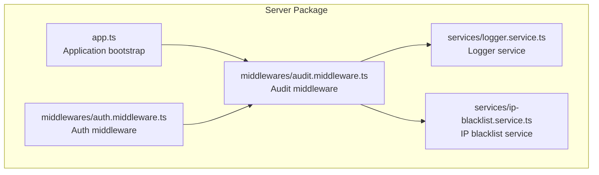
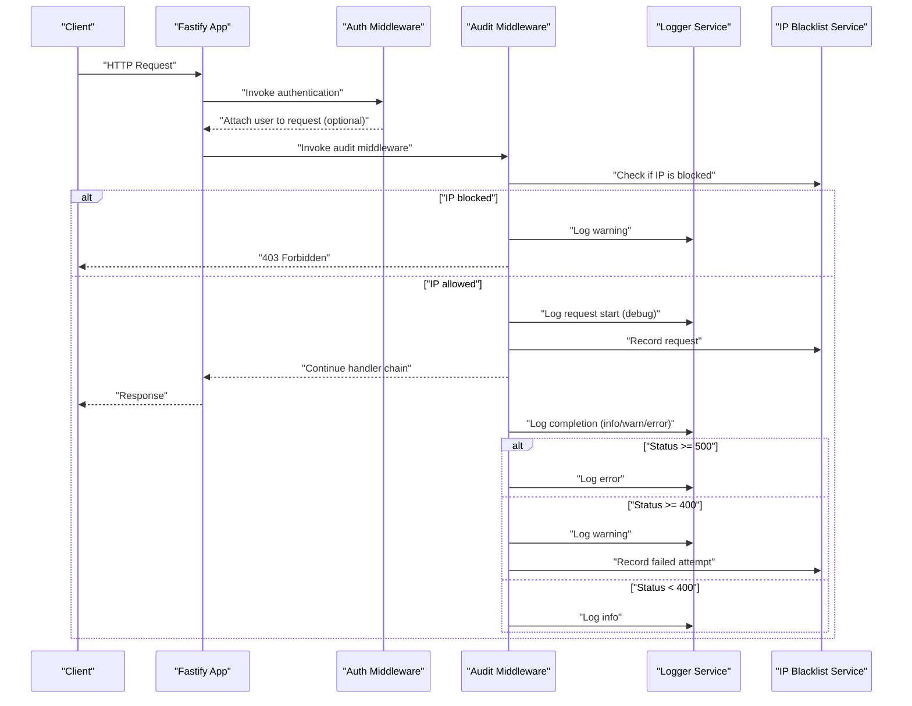
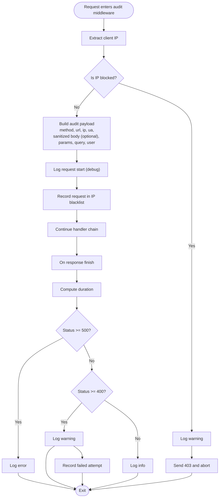
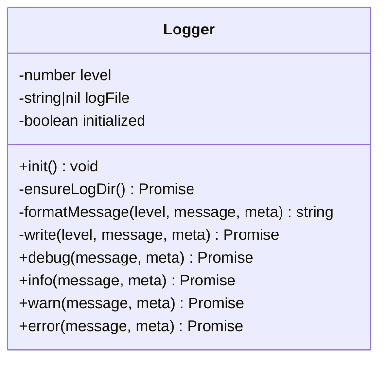
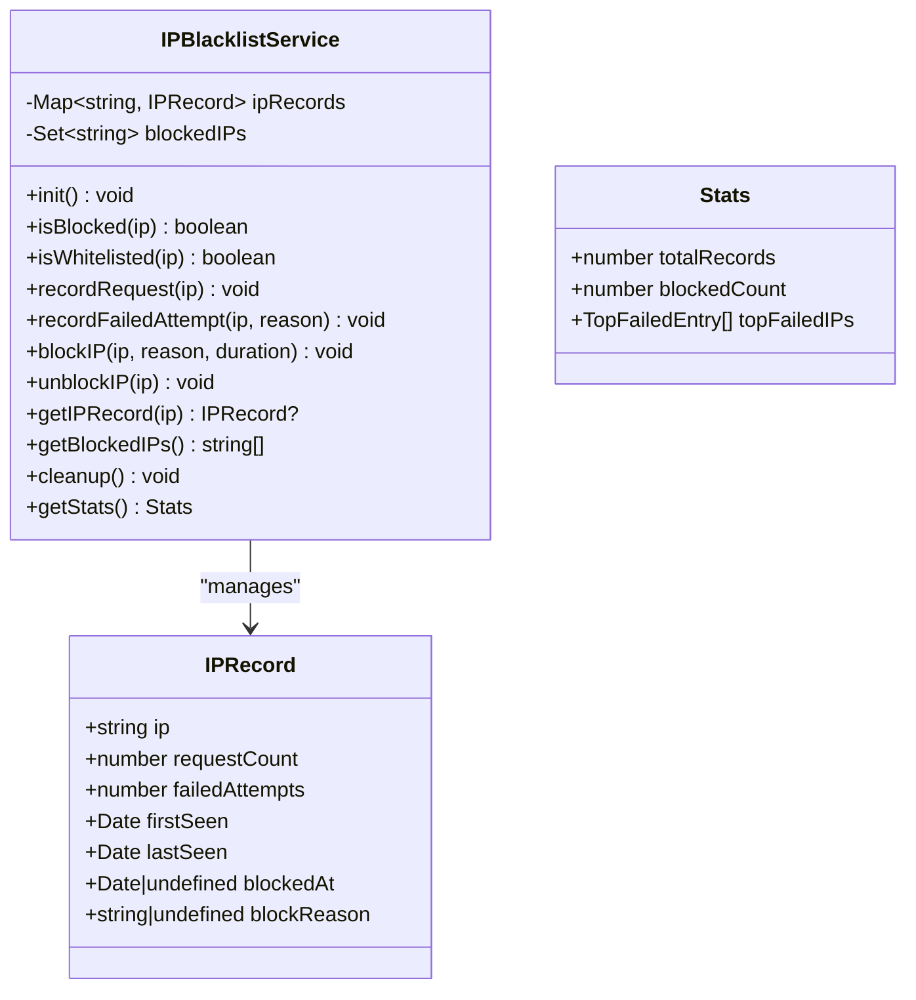
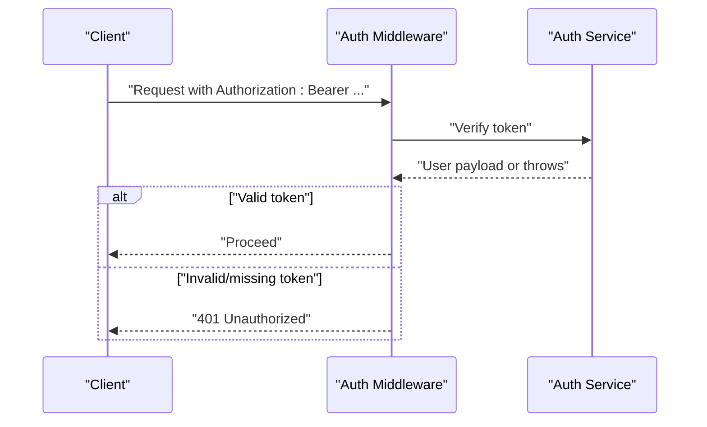
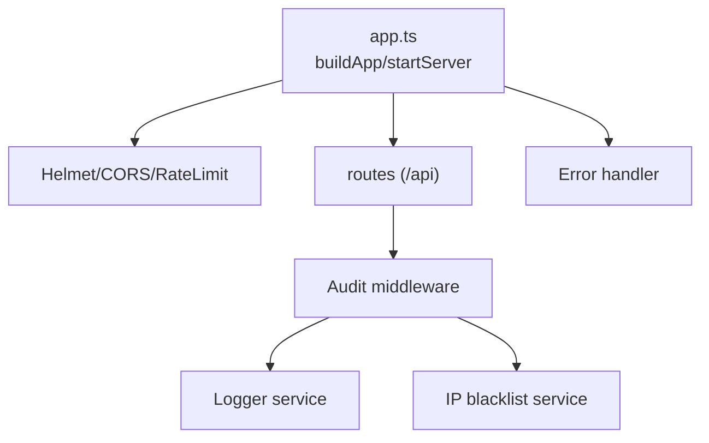
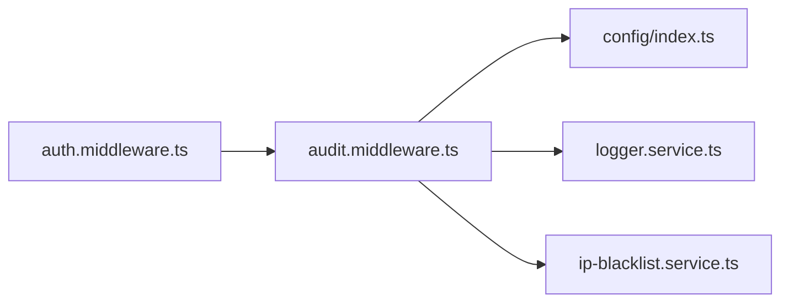

# Audit Middleware

<cite>
**Referenced Files in This Document**
- [audit.middleware.ts](file://packages/server/src/middlewares/audit.middleware.ts)
- [audit.middleware.d.ts](file://packages/server/dist/middlewares/audit.middleware.d.ts)
- [audit.middleware.js](file://packages/server/dist/middlewares/audit.middleware.js)
- [logger.service.ts](file://packages/server/src/services/logger.service.ts)
- [logger.service.js](file://packages/server/dist/services/logger.service.js)
- [ip-blacklist.service.ts](file://packages/server/src/services/ip-blacklist.service.ts)
- [ip-blacklist.service.js](file://packages/server/dist/services/ip-blacklist.service.js)
- [auth.middleware.ts](file://packages/server/src/middlewares/auth.middleware.ts)
- [auth.middleware.js](file://packages/server/dist/middlewares/auth.middleware.js)
- [app.ts](file://packages/server/src/app.ts)
- [app.js](file://packages/server/dist/app.js)
- [config/index.ts](file://packages/server/src/config/index.ts)
- [config/index.js](file://packages/server/dist/config/index.js)
</cite>

## Table of Contents
1. [Introduction](#introduction)
2. [Project Structure](#project-structure)
3. [Core Components](#core-components)
4. [Architecture Overview](#architecture-overview)
5. [Detailed Component Analysis](#detailed-component-analysis)
6. [Dependency Analysis](#dependency-analysis)
7. [Performance Considerations](#performance-considerations)
8. [Troubleshooting Guide](#troubleshooting-guide)
9. [Conclusion](#conclusion)
10. [Appendices](#appendices)

## Introduction
This document describes the audit middleware system responsible for comprehensive request logging and security event tracking. It explains how the middleware captures request metadata, redacts sensitive data, integrates with IP blacklisting for security event detection, and emits structured audit logs. It also covers configuration options, performance characteristics, and operational considerations for log storage, privacy, and integration with external logging systems and SIEM solutions.

## Project Structure
The audit middleware resides in the server package and integrates with supporting services for logging and IP blacklisting. The application bootstraps Fastify, registers security-related plugins, and wires the audit middleware into the request lifecycle.

**Diagram sources**
- [app.ts:19-148](file://packages/server/src/app.ts#L19-L148)
- [audit.middleware.ts:48-124](file://packages/server/src/middlewares/audit.middleware.ts#L48-L124)
- [auth.middleware.ts:11-32](file://packages/server/src/middlewares/auth.middleware.ts#L11-L32)
- [logger.service.ts:14-78](file://packages/server/src/services/logger.service.ts#L14-L78)
- [ip-blacklist.service.ts:14-215](file://packages/server/src/services/ip-blacklist.service.ts#L14-L215)

**Section sources**
- [app.ts:19-148](file://packages/server/src/app.ts#L19-L148)
- [audit.middleware.ts:48-124](file://packages/server/src/middlewares/audit.middleware.ts#L48-L124)
- [auth.middleware.ts:11-32](file://packages/server/src/middlewares/auth.middleware.ts#L11-L32)
- [logger.service.ts:14-78](file://packages/server/src/services/logger.service.ts#L14-L78)
- [ip-blacklist.service.ts:14-215](file://packages/server/src/services/ip-blacklist.service.ts#L14-L215)

## Core Components
- Audit middleware: Captures request metadata, redacts sensitive fields, records request lifecycle events, and integrates with IP blacklisting.
- Logger service: Provides structured logging to console and file with configurable log levels and formatting.
- IP blacklist service: Tracks IP activity, supports manual blocking/unblocking, auto-block thresholds, and statistics.
- Authentication middleware: Injects user identity into the request context for audit enrichment.
- Application bootstrap: Initializes configuration, registers security plugins, and wires middleware into the Fastify instance.

**Section sources**
- [audit.middleware.ts:48-124](file://packages/server/src/middlewares/audit.middleware.ts#L48-L124)
- [logger.service.ts:14-78](file://packages/server/src/services/logger.service.ts#L14-L78)
- [ip-blacklist.service.ts:14-215](file://packages/server/src/services/ip-blacklist.service.ts#L14-L215)
- [auth.middleware.ts:11-32](file://packages/server/src/middlewares/auth.middleware.ts#L11-L32)
- [app.ts:19-148](file://packages/server/src/app.ts#L19-L148)

## Architecture Overview
The audit middleware participates in the Fastify request lifecycle. It reads request metadata, optionally sanitizes the body, logs the start of the request, and upon completion logs the outcome with status code and duration. It also integrates with IP blacklisting to record successful and failed attempts and to trigger automatic blocking based on configured thresholds.

**Diagram sources**
- [audit.middleware.ts:48-124](file://packages/server/src/middlewares/audit.middleware.ts#L48-L124)
- [logger.service.ts:14-78](file://packages/server/src/services/logger.service.ts#L14-L78)
- [ip-blacklist.service.ts:37-120](file://packages/server/src/services/ip-blacklist.service.ts#L37-L120)
- [auth.middleware.ts:11-32](file://packages/server/src/middlewares/auth.middleware.ts#L11-L32)

## Detailed Component Analysis

### Audit Middleware
The audit middleware performs the following actions:
- Extracts client IP from forwarded headers or direct IP.
- Checks IP against the blacklist; blocks and responds with 403 if blocked.
- Builds an audit payload containing method, URL, IP, user agent, and optionally sanitized body, route params, query, and user identity.
- Emits a debug log for request start.
- Records request metrics on response finish: status code, duration.
- Logs outcomes at appropriate levels and records failed attempts for auto-blocking.

**Diagram sources**
- [audit.middleware.ts:48-124](file://packages/server/src/middlewares/audit.middleware.ts#L48-L124)
- [ip-blacklist.service.ts:55-120](file://packages/server/src/services/ip-blacklist.service.ts#L55-L120)

**Section sources**
- [audit.middleware.ts:48-124](file://packages/server/src/middlewares/audit.middleware.ts#L48-L124)
- [audit.middleware.ts:6-29](file://packages/server/src/middlewares/audit.middleware.ts#L6-L29)
- [audit.middleware.ts:34-43](file://packages/server/src/middlewares/audit.middleware.ts#L34-L43)

### Logger Service
The logger service provides:
- Configurable log level via configuration.
- Structured JSON-like messages with ISO timestamp and level.
- Console output mapped to appropriate console methods per level.
- Optional file output with directory creation and append semantics.

**Diagram sources**
- [logger.service.ts:14-78](file://packages/server/src/services/logger.service.ts#L14-L78)

**Section sources**
- [logger.service.ts:14-78](file://packages/server/src/services/logger.service.ts#L14-L78)
- [logger.service.js:10-63](file://packages/server/dist/services/logger.service.js#L10-L63)

### IP Blacklist Service
The IP blacklist service tracks:
- Per-IP request counts and last-seen timestamps.
- Failed attempts within a sliding window and thresholds for auto-blocking.
- Manual block/unblock operations with optional timed expiration.
- Statistics for monitoring and diagnostics.

**Diagram sources**
- [ip-blacklist.service.ts:14-215](file://packages/server/src/services/ip-blacklist.service.ts#L14-L215)

**Section sources**
- [ip-blacklist.service.ts:14-215](file://packages/server/src/services/ip-blacklist.service.ts#L14-L215)
- [ip-blacklist.service.js:3-177](file://packages/server/dist/services/ip-blacklist.service.js#L3-L177)

### Authentication Middleware
The authentication middleware enriches the request with user identity when a valid bearer token is present, enabling audit logs to include userId and username.

**Diagram sources**
- [auth.middleware.ts:11-32](file://packages/server/src/middlewares/auth.middleware.ts#L11-L32)

**Section sources**
- [auth.middleware.ts:11-32](file://packages/server/src/middlewares/auth.middleware.ts#L11-L32)
- [auth.middleware.js:2-21](file://packages/server/dist/middlewares/auth.middleware.js#L2-L21)

### Application Bootstrap and Security Integration
The application initializes configuration, registers security plugins (CSP, CORS, rate limiting), and sets up error handling. The audit middleware is integrated into the request pipeline during routing registration.

**Diagram sources**
- [app.ts:19-148](file://packages/server/src/app.ts#L19-L148)
- [audit.middleware.ts:48-124](file://packages/server/src/middlewares/audit.middleware.ts#L48-L124)
- [logger.service.ts:14-78](file://packages/server/src/services/logger.service.ts#L14-L78)
- [ip-blacklist.service.ts:14-215](file://packages/server/src/services/ip-blacklist.service.ts#L14-L215)

**Section sources**
- [app.ts:19-148](file://packages/server/src/app.ts#L19-L148)
- [app.js:17-128](file://packages/server/dist/app.js#L17-L128)

## Dependency Analysis
The audit middleware depends on:
- Configuration for log level and security toggles.
- Logger service for emitting structured logs.
- IP blacklist service for IP checks, request recording, and failed attempt tracking.
- Authentication middleware for user identity injection.

**Diagram sources**
- [audit.middleware.ts:1-5](file://packages/server/src/middlewares/audit.middleware.ts#L1-L5)
- [config/index.ts:1-15](file://packages/server/src/config/index.ts#L1-L15)
- [logger.service.ts:1-4](file://packages/server/src/services/logger.service.ts#L1-L4)
- [ip-blacklist.service.ts:1-2](file://packages/server/src/services/ip-blacklist.service.ts#L1-L2)
- [auth.middleware.ts:1-3](file://packages/server/src/middlewares/auth.middleware.ts#L1-L3)

**Section sources**
- [audit.middleware.ts:1-5](file://packages/server/src/middlewares/audit.middleware.ts#L1-L5)
- [config/index.ts:1-15](file://packages/server/src/config/index.ts#L1-L15)
- [logger.service.ts:1-4](file://packages/server/src/services/logger.service.ts#L1-L4)
- [ip-blacklist.service.ts:1-2](file://packages/server/src/services/ip-blacklist.service.ts#L1-L2)
- [auth.middleware.ts:1-3](file://packages/server/src/middlewares/auth.middleware.ts#L1-L3)

## Performance Considerations
- Logging overhead: Debug-level request bodies are only logged when the log level is set to debug, minimizing overhead in production.
- Sanitization cost: Recursive sanitization of request bodies is bounded by depth to prevent excessive CPU usage.
- Event-driven completion: Audit logging on response finish avoids synchronous post-processing in the request path.
- IP tracking: Request and failed attempt counters are maintained in-memory; consider persistence for long-running deployments.
- Rate limiting: Global rate limiting reduces load and mitigates abuse, indirectly reducing audit log volume spikes.

[No sources needed since this section provides general guidance]

## Troubleshooting Guide
Common issues and resolutions:
- Requests from blocked IPs receive 403 responses; check IP blacklist configuration and endpoints for stats and blocked lists.
- Missing user identity in audit logs indicates missing or invalid Authorization header; verify authentication middleware order and token validity.
- Excessive debug logs: Adjust log level to reduce verbosity.
- IP auto-block not triggering: Verify auto-block threshold, window, and that failed attempts are being recorded.

Operational endpoints for IP management:
- GET /stats: Retrieve IP statistics including counts and top failed IPs.
- GET /blocked: List currently blocked IPs.
- POST /block: Manually block an IP with reason and optional duration.
- DELETE /unblock: Remove an IP from the blacklist.

**Section sources**
- [audit.middleware.ts:129-186](file://packages/server/src/middlewares/audit.middleware.ts#L129-L186)
- [ip-blacklist.service.ts:195-211](file://packages/server/src/services/ip-blacklist.service.ts#L195-L211)
- [ip-blacklist.service.ts:125-148](file://packages/server/src/services/ip-blacklist.service.ts#L125-L148)
- [ip-blacklist.service.ts:153-162](file://packages/server/src/services/ip-blacklist.service.ts#L153-L162)

## Conclusion
The audit middleware provides comprehensive request logging with privacy-aware sanitization and integrates tightly with IP blacklisting for security event tracking. Combined with the logger service and configuration-driven controls, it offers a robust foundation for security monitoring, compliance reporting, and operational observability. For production deployments, tune log levels, consider persistent storage, and integrate with SIEM solutions for centralized analysis.

[No sources needed since this section summarizes without analyzing specific files]

## Appendices

### Audit Log Structure and Examples
- Fields captured: method, url, ip, userAgent, duration, statusCode, and optionally sanitized body, params, query, userId, username.
- Levels: debug (request start), info (success), warn (client error), error (server error).
- Example categories:
  - Successful API call: info with statusCode 2xx and duration.
  - Client error: warn with statusCode 4xx and reason recorded for auto-block.
  - Server error: error with statusCode 5xx and timing.

**Section sources**
- [audit.middleware.ts:69-120](file://packages/server/src/middlewares/audit.middleware.ts#L69-L120)
- [logger.service.ts:36-58](file://packages/server/src/services/logger.service.ts#L36-L58)

### Privacy and Data Handling
- Sensitive field detection: Keys containing password, token, secret, authorization are redacted.
- Depth-limited recursion: Prevents deep object traversal beyond a safe threshold.
- Conditional logging: Body logging is gated by debug log level.

**Section sources**
- [audit.middleware.ts:6-29](file://packages/server/src/middlewares/audit.middleware.ts#L6-L29)
- [audit.middleware.ts:72-78](file://packages/server/src/middlewares/audit.middleware.ts#L72-L78)

### Storage, Rotation, and SIEM Integration
- Local file logging: Enabled via configuration; logs are appended to a file with timestamped entries.
- Rotation strategies: Not implemented in the logger service; use external log rotation tools or forward logs to a centralized system.
- SIEM integration: Forward logs to a SIEM or log collector (e.g., syslog, filebeat, fluent-bit) for indexing and alerting.

**Section sources**
- [logger.service.ts:29-58](file://packages/server/src/services/logger.service.ts#L29-L58)

### Configuration Options
- Log level: Controls verbosity of audit logs.
- IP blacklist: Enable/disable, whitelist, blacklist, auto-block threshold, window, and duration.
- Rate limiting: Global limits applied by the framework.
- Upload limits: File size and field limits enforced by multipart plugin.

**Section sources**
- [app.ts:87-97](file://packages/server/src/app.ts#L87-L97)
- [app.ts:77-84](file://packages/server/src/app.ts#L77-L84)
- [ip-blacklist.service.ts:18-32](file://packages/server/src/services/ip-blacklist.service.ts#L18-L32)
- [config/index.ts:1-15](file://packages/server/src/config/index.ts#L1-L15)