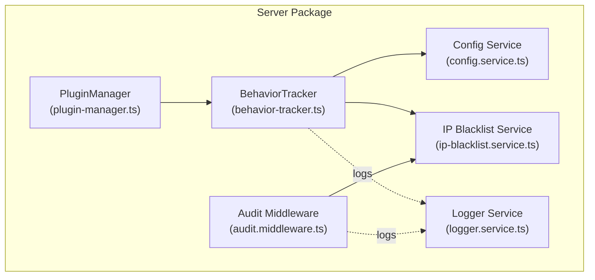
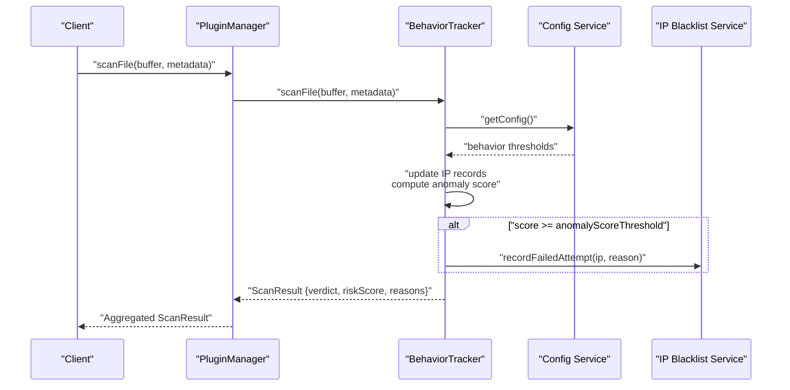
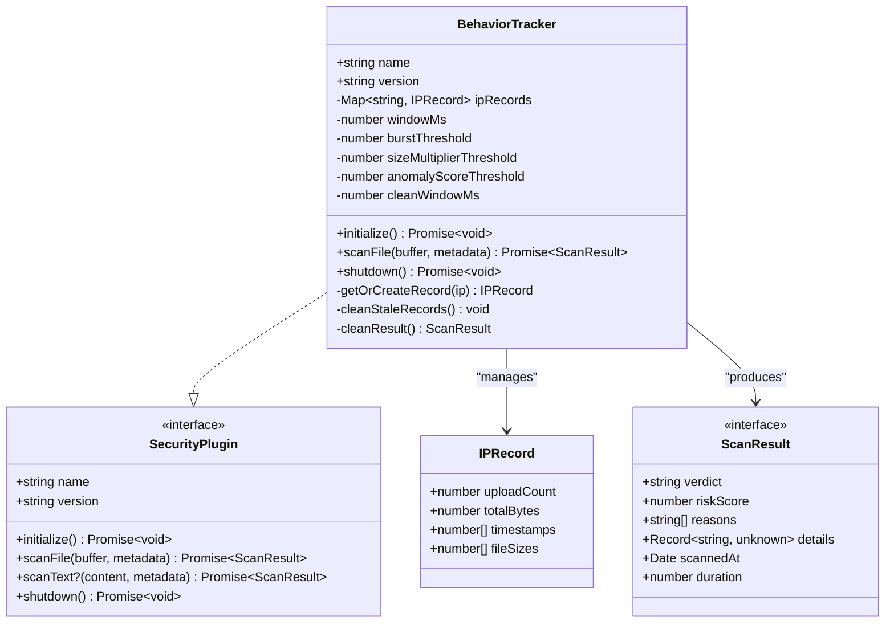
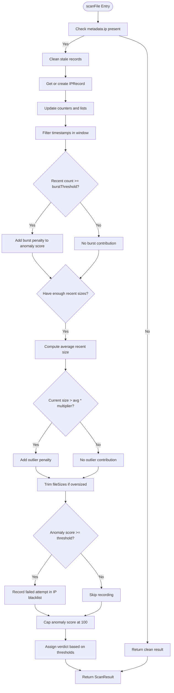
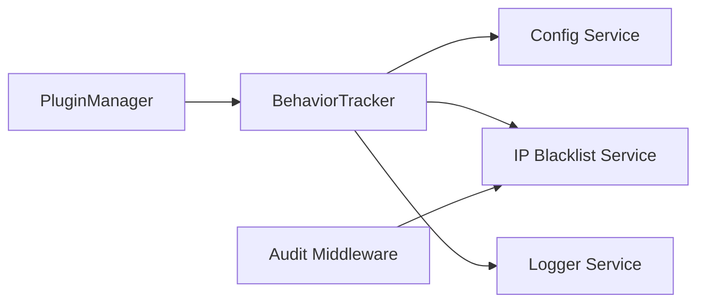

# Behavior Tracker

<cite>
**Referenced Files in This Document**
- [behavior-tracker.ts](file://packages/server/src/plugins/behavior-tracker.ts)
- [types.ts](file://packages/server/src/plugins/types.ts)
- [plugin-manager.ts](file://packages/server/src/plugins/plugin-manager.ts)
- [config.service.ts](file://packages/server/src/services/config.service.ts)
- [config.json](file://config.json)
- [ip-blacklist.service.ts](file://packages/server/src/services/ip-blacklist.service.ts)
- [audit.middleware.ts](file://packages/server/src/middlewares/audit.middleware.ts)
- [logger.service.ts](file://packages/server/src/services/logger.service.ts)
- [behavior-tracker.test.ts](file://packages/server/test/plugins/behavior-tracker.test.ts)
- [CLAUDE.md](file://CLAUDE.md)
</cite>

## Table of Contents
1. [Introduction](#introduction)
2. [Project Structure](#project-structure)
3. [Core Components](#core-components)
4. [Architecture Overview](#architecture-overview)
5. [Detailed Component Analysis](#detailed-component-analysis)
6. [Dependency Analysis](#dependency-analysis)
7. [Performance Considerations](#performance-considerations)
8. [Troubleshooting Guide](#troubleshooting-guide)
9. [Conclusion](#conclusion)
10. [Appendices](#appendices)

## Introduction
This document describes the behavior tracker system responsible for request pattern analysis and anomaly detection in the AirPortal file transfer platform. It explains how the tracker monitors user behavior, identifies suspicious activities, and maintains behavioral baselines. It also covers integration with security plugins, IP tracking systems, and rate limiting mechanisms, along with configuration options, performance characteristics, and examples of detected anomalies and automated security responses.

## Project Structure
The behavior tracker is part of the pluggable security system in the server package. It integrates with the plugin manager, configuration service, and IP blacklist service to provide runtime anomaly detection and automatic security actions.



**Diagram sources**
- [behavior-tracker.ts:12-136](file://packages/server/src/plugins/behavior-tracker.ts#L12-L136)
- [plugin-manager.ts:4-167](file://packages/server/src/plugins/plugin-manager.ts#L4-L167)
- [config.service.ts:155-259](file://packages/server/src/services/config.service.ts#L155-L259)
- [ip-blacklist.service.ts:14-215](file://packages/server/src/services/ip-blacklist.service.ts#L14-L215)
- [audit.middleware.ts:48-124](file://packages/server/src/middlewares/audit.middleware.ts#L48-L124)
- [logger.service.ts:14-78](file://packages/server/src/services/logger.service.ts#L14-L78)

**Section sources**
- [CLAUDE.md:54-61](file://CLAUDE.md#L54-L61)
- [behavior-tracker.ts:12-136](file://packages/server/src/plugins/behavior-tracker.ts#L12-L136)
- [plugin-manager.ts:4-167](file://packages/server/src/plugins/plugin-manager.ts#L4-L167)
- [config.service.ts:155-259](file://packages/server/src/services/config.service.ts#L155-L259)
- [ip-blacklist.service.ts:14-215](file://packages/server/src/services/ip-blacklist.service.ts#L14-L215)
- [audit.middleware.ts:48-124](file://packages/server/src/middlewares/audit.middleware.ts#L48-L124)
- [logger.service.ts:14-78](file://packages/server/src/services/logger.service.ts#L14-L78)

## Core Components
- BehaviorTracker: Implements the SecurityPlugin interface to analyze per-IP upload patterns, compute anomaly scores, and feed IP blacklist entries when thresholds are exceeded.
- PluginManager: Orchestrates plugin lifecycle and aggregates results from multiple security plugins.
- Config Service: Provides runtime configuration for behavior tracker thresholds and windows.
- IP Blacklist Service: Manages IP records, auto-blocking, and persistent storage of blocked IPs.
- Audit Middleware: Enforces IP blacklist checks, records requests and failures, and triggers IP blacklist updates.
- Logger Service: Centralized logging for audit events, warnings, and errors.

**Section sources**
- [behavior-tracker.ts:12-136](file://packages/server/src/plugins/behavior-tracker.ts#L12-L136)
- [types.ts:18-25](file://packages/server/src/plugins/types.ts#L18-L25)
- [plugin-manager.ts:49-153](file://packages/server/src/plugins/plugin-manager.ts#L49-L153)
- [config.service.ts:23-35](file://packages/server/src/services/config.service.ts#L23-L35)
- [ip-blacklist.service.ts:14-215](file://packages/server/src/services/ip-blacklist.service.ts#L14-L215)
- [audit.middleware.ts:48-124](file://packages/server/src/middlewares/audit.middleware.ts#L48-L124)
- [logger.service.ts:14-78](file://packages/server/src/services/logger.service.ts#L14-L78)

## Architecture Overview
The behavior tracker participates in the security plugin pipeline. On each file upload, PluginManager invokes scanFile on all registered plugins. BehaviorTracker updates per-IP statistics, computes anomaly scores based on burst frequency and file size outliers, and decides a verdict (clean/suspicious/malicious). When anomaly scores exceed configured thresholds, it records failed attempts in the IP blacklist service, which may trigger auto-block conditions.



**Diagram sources**
- [plugin-manager.ts:49-79](file://packages/server/src/plugins/plugin-manager.ts#L49-L79)
- [behavior-tracker.ts:38-108](file://packages/server/src/plugins/behavior-tracker.ts#L38-L108)
- [config.service.ts:348-353](file://packages/server/src/services/config.service.ts#L348-L353)
- [ip-blacklist.service.ts:80-120](file://packages/server/src/services/ip-blacklist.service.ts#L80-L120)

## Detailed Component Analysis

### BehaviorTracker Implementation
BehaviorTracker implements the SecurityPlugin interface and maintains per-IP records containing upload counts, total bytes, timestamps, and recent file sizes. It applies two primary anomaly detection heuristics:
- Burst detection: Counts uploads within a sliding time window and penalizes frequencies exceeding the configured threshold.
- Size outlier detection: Computes average recent file sizes and flags uploads significantly larger than the moving average.

It also periodically cleans stale records and caps anomaly scores at 100. When anomaly scores meet or exceed the configured threshold, it records failed attempts in the IP blacklist service to support auto-blocking.



**Diagram sources**
- [behavior-tracker.ts:12-136](file://packages/server/src/plugins/behavior-tracker.ts#L12-L136)
- [types.ts:1-16](file://packages/server/src/plugins/types.ts#L1-L16)

**Section sources**
- [behavior-tracker.ts:12-136](file://packages/server/src/plugins/behavior-tracker.ts#L12-L136)
- [types.ts:18-25](file://packages/server/src/plugins/types.ts#L18-L25)

### Anomaly Detection Algorithms and Pattern Recognition
- Sliding window burst detection: Maintains a list of timestamps and filters those within the configured window. Excesses over the threshold contribute to the anomaly score.
- Size outlier detection: Uses a trailing window of recent file sizes to compute an average. If the current upload size exceeds the average by the configured multiplier, it contributes a fixed score.
- Adaptive trimming: Keeps recent file sizes bounded to prevent memory growth while preserving recent trends.



**Diagram sources**
- [behavior-tracker.ts:38-108](file://packages/server/src/plugins/behavior-tracker.ts#L38-L108)

**Section sources**
- [behavior-tracker.ts:38-108](file://packages/server/src/plugins/behavior-tracker.ts#L38-L108)

### Automated Security Responses and Integration
- IP Blacklist Integration: When anomaly scores exceed the configured threshold, the behavior tracker records failed attempts, which can trigger auto-blocking based on the IP blacklist service’s thresholds and time window.
- Audit Middleware: Enforces IP blacklist checks before serving requests and records failed attempts for HTTP errors, complementing behavior tracker signals.
- Logging: Both behavior tracker and audit middleware emit structured logs for observability and incident response.

```mermaid
sequenceDiagram
participant BT as "BehaviorTracker"
participant IPB as "IP Blacklist Service"
participant AUD as "Audit Middleware"
participant LOG as "Logger Service"
BT->>IPB : "recordFailedAttempt(ip, reason)"
IPB->>IPB : "Update failedAttempts in window"
alt "failedAttempts >= autoBlockThreshold"
IPB->>IPB : "blockIP(ip, reason, duration?)"
end
AUD->>IPB : "recordFailedAttempt(ip, reason)"
BT -. logs .-> LOG
AUD -. logs .-> LOG
```

**Diagram sources**
- [behavior-tracker.ts:80-85](file://packages/server/src/plugins/behavior-tracker.ts#L80-L85)
- [ip-blacklist.service.ts:80-120](file://packages/server/src/services/ip-blacklist.service.ts#L80-L120)
- [audit.middleware.ts:115-118](file://packages/server/src/middlewares/audit.middleware.ts#L115-L118)
- [logger.service.ts:14-78](file://packages/server/src/services/logger.service.ts#L14-L78)

**Section sources**
- [behavior-tracker.ts:80-85](file://packages/server/src/plugins/behavior-tracker.ts#L80-L85)
- [ip-blacklist.service.ts:80-120](file://packages/server/src/services/ip-blacklist.service.ts#L80-L120)
- [audit.middleware.ts:115-118](file://packages/server/src/middlewares/audit.middleware.ts#L115-L118)
- [logger.service.ts:14-78](file://packages/server/src/services/logger.service.ts#L14-L78)

### Configuration Options
Behavior tracker configuration is defined under security.securityPlugin.behavior and can be overridden via environment variables. The configuration supports:
- enabled: Toggle behavior tracker globally.
- windowMs: Sliding window duration for burst detection.
- burstThreshold: Maximum uploads allowed per window before penalties apply.
- sizeMultiplierThreshold: Multiplier for outlier detection relative to recent average file size.
- anomalyScoreThreshold: Threshold for triggering IP blacklist entries and determining verdict categories.

Environment variable overrides follow the pattern SECURITY_PLUGIN_ENABLED, BEHAVIOR_*, etc., with precedence over config.json.

**Section sources**
- [config.json:55-61](file://config.json#L55-L61)
- [config.service.ts:204-210](file://packages/server/src/services/config.service.ts#L204-L210)
- [config.service.ts:348-353](file://packages/server/src/services/config.service.ts#L348-L353)

### Examples of Detected Anomalies
- Normal uploads: No anomaly score is generated when IP metadata is absent or when activity remains within expected bounds.
- Burst uploads: Repeated uploads from a single IP within the configured window exceeding the threshold produce anomaly contributions and may escalate to suspicious or malicious verdicts depending on cumulative score.
- Size outliers: Uploads significantly larger than the recent average trigger outlier penalties.
- Auto-blocking: When anomaly scores exceed thresholds, failed attempts are recorded, potentially leading to auto-blocking based on IP blacklist configuration.

**Section sources**
- [behavior-tracker.test.ts:34-130](file://packages/server/test/plugins/behavior-tracker.test.ts#L34-L130)
- [behavior-tracker.ts:80-85](file://packages/server/src/plugins/behavior-tracker.ts#L80-L85)

## Dependency Analysis
BehaviorTracker depends on:
- Config Service for runtime configuration of behavior thresholds.
- IP Blacklist Service for recording failed attempts and participating in auto-blocking.
- Logger Service for emitting audit and warning messages.
- PluginManager for orchestration within the security plugin pipeline.



**Diagram sources**
- [behavior-tracker.ts:23-36](file://packages/server/src/plugins/behavior-tracker.ts#L23-L36)
- [behavior-tracker.ts:80-85](file://packages/server/src/plugins/behavior-tracker.ts#L80-L85)
- [logger.service.ts:14-78](file://packages/server/src/services/logger.service.ts#L14-L78)
- [plugin-manager.ts:49-79](file://packages/server/src/plugins/plugin-manager.ts#L49-L79)
- [audit.middleware.ts:54-66](file://packages/server/src/middlewares/audit.middleware.ts#L54-L66)

**Section sources**
- [behavior-tracker.ts:23-36](file://packages/server/src/plugins/behavior-tracker.ts#L23-L36)
- [behavior-tracker.ts:80-85](file://packages/server/src/plugins/behavior-tracker.ts#L80-L85)
- [plugin-manager.ts:49-79](file://packages/server/src/plugins/plugin-manager.ts#L49-L79)
- [audit.middleware.ts:54-66](file://packages/server/src/middlewares/audit.middleware.ts#L54-L66)

## Performance Considerations
- Memory footprint: Per-IP records store timestamps and recent file sizes; trimming keeps recent lists bounded.
- Computational cost: Sliding window filtering and averaging are O(n) per scan, where n is recent uploads; acceptable for typical traffic volumes.
- Cleanup: Stale records are removed after a defined period to prevent indefinite growth.
- Concurrency: BehaviorTracker is single-threaded per instance; ensure adequate horizontal scaling if throughput demands increase.

[No sources needed since this section provides general guidance]

## Troubleshooting Guide
- Behavior tracker disabled: Verify security.securityPlugin.behavior.enabled and environment overrides.
- False positives: Adjust windowMs, burstThreshold, sizeMultiplierThreshold, and anomalyScoreThreshold to tune sensitivity.
- No IP metadata: BehaviorTracker returns clean results when IP is missing; ensure proxy headers are correctly forwarded.
- Auto-block not triggered: Confirm IP blacklist thresholds and time window; check audit middleware for failed attempt recording.
- Logs and diagnostics: Review logger output for warnings and errors emitted by behavior tracker and audit middleware.

**Section sources**
- [config.json:55-61](file://config.json#L55-L61)
- [config.service.ts:348-353](file://packages/server/src/services/config.service.ts#L348-L353)
- [behavior-tracker.ts:40-42](file://packages/server/src/plugins/behavior-tracker.ts#L40-L42)
- [audit.middleware.ts:115-118](file://packages/server/src/middlewares/audit.middleware.ts#L115-L118)
- [logger.service.ts:14-78](file://packages/server/src/services/logger.service.ts#L14-L78)

## Conclusion
The behavior tracker provides lightweight, statistical anomaly detection by monitoring per-IP upload patterns and file size distributions. It integrates seamlessly with the plugin system, configuration service, and IP blacklist to deliver automated security responses. Tuning its thresholds allows balancing security posture against false positives, while logging and auditing offer operational visibility.

[No sources needed since this section summarizes without analyzing specific files]

## Appendices

### Configuration Reference
- security.securityPlugin.behavior.enabled: Boolean toggle.
- security.securityPlugin.behavior.windowMs: Number (milliseconds).
- security.securityPlugin.behavior.burstThreshold: Number of uploads per window.
- security.securityPlugin.behavior.sizeMultiplierThreshold: Number multiplier for outlier detection.
- security.securityPlugin.behavior.anomalyScoreThreshold: Number threshold for anomaly scoring.

Environment variable overrides:
- SECURITY_PLUGIN_ENABLED
- BEHAVIOR_ENABLED
- BEHAVIOR_WINDOW_MS
- BEHAVIOR_BURST_THRESHOLD
- BEHAVIOR_SIZE_MULTIPLIER
- BEHAVIOR_ANOMALY_THRESHOLD

**Section sources**
- [config.json:55-61](file://config.json#L55-L61)
- [config.service.ts:204-210](file://packages/server/src/services/config.service.ts#L204-L210)
- [config.service.ts:348-353](file://packages/server/src/services/config.service.ts#L348-L353)