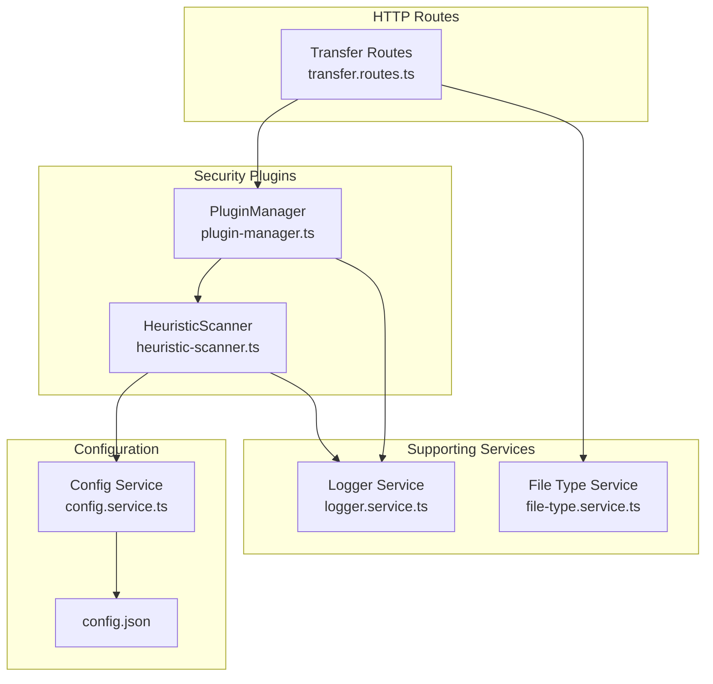
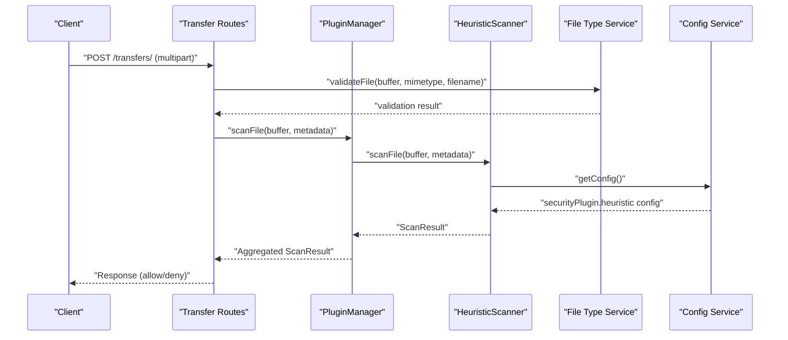
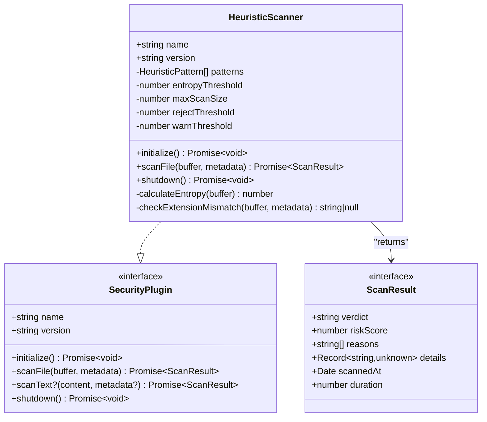
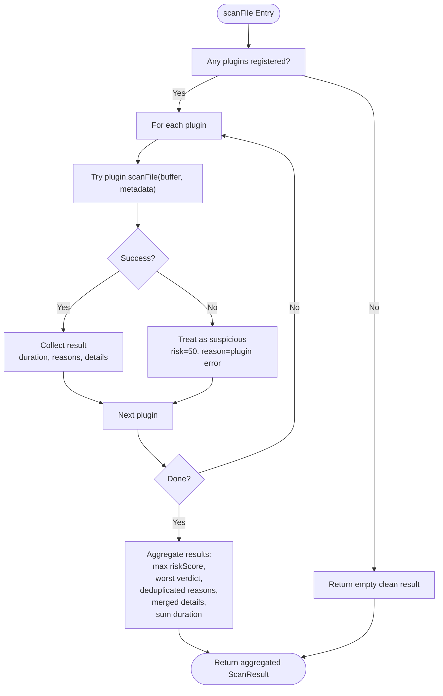
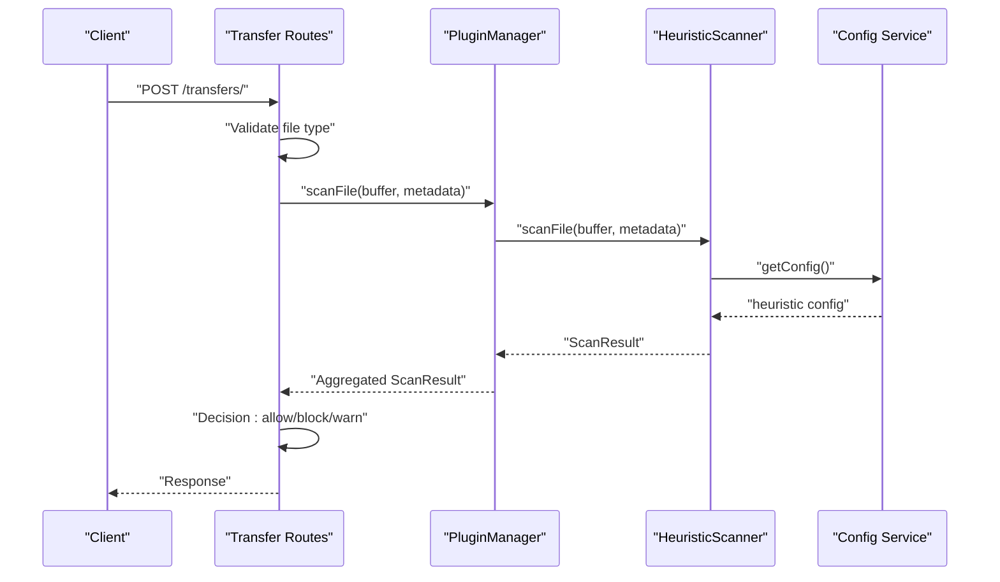
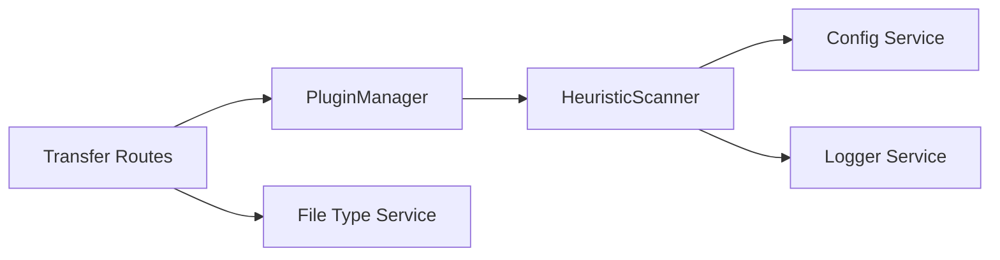

# Heuristic Scanner

<cite>
**Referenced Files in This Document**
- [heuristic-scanner.ts](file://packages/server/src/plugins/heuristic-scanner.ts)
- [types.ts](file://packages/server/src/plugins/types.ts)
- [plugin-manager.ts](file://packages/server/src/plugins/plugin-manager.ts)
- [config.service.ts](file://packages/server/src/services/config.service.ts)
- [config.json](file://config.json)
- [transfer.routes.ts](file://packages/server/src/routes/transfer.routes.ts)
- [file-type.service.ts](file://packages/server/src/services/file-type.service.ts)
- [logger.service.ts](file://packages/server/src/services/logger.service.ts)
- [heuristic-scanner.test.ts](file://packages/server/test/plugins/heuristic-scanner.test.ts)
</cite>

## Table of Contents
1. [Introduction](#introduction)
2. [Project Structure](#project-structure)
3. [Core Components](#core-components)
4. [Architecture Overview](#architecture-overview)
5. [Detailed Component Analysis](#detailed-component-analysis)
6. [Dependency Analysis](#dependency-analysis)
7. [Performance Considerations](#performance-considerations)
8. [Troubleshooting Guide](#troubleshooting-guide)
9. [Conclusion](#conclusion)

## Introduction
This document describes the heuristic scanner implementation used for file content analysis and malicious pattern detection. It explains the scanning algorithms, pattern matching techniques, and risk scoring mechanisms. It also covers file type validation, security threat identification, integration with the plugin system, scan result aggregation, and decision-making processes. Practical examples illustrate detected patterns, risk score calculations, and threshold configurations. Guidance is provided for performance optimization, memory management, false positive reduction, and extensibility for adding new detection patterns and customizing scanning rules.

## Project Structure
The heuristic scanner is implemented as a SecurityPlugin and integrated into the broader security pipeline via the PluginManager. It participates in both file and text scanning flows, with configuration managed centrally through the application configuration service and validated by the configuration validator.

**Diagram sources**
- [heuristic-scanner.ts:25-172](file://packages/server/src/plugins/heuristic-scanner.ts#L25-L172)
- [plugin-manager.ts:4-167](file://packages/server/src/plugins/plugin-manager.ts#L4-L167)
- [config.service.ts:14-364](file://packages/server/src/services/config.service.ts#L14-L364)
- [config.json:1-102](file://config.json#L1-L102)
- [transfer.routes.ts:12-348](file://packages/server/src/routes/transfer.routes.ts#L12-L348)
- [file-type.service.ts:55-224](file://packages/server/src/services/file-type.service.ts#L55-L224)
- [logger.service.ts:14-78](file://packages/server/src/services/logger.service.ts#L14-L78)

**Section sources**
- [heuristic-scanner.ts:25-172](file://packages/server/src/plugins/heuristic-scanner.ts#L25-L172)
- [plugin-manager.ts:4-167](file://packages/server/src/plugins/plugin-manager.ts#L4-L167)
- [config.service.ts:14-364](file://packages/server/src/services/config.service.ts#L14-L364)
- [config.json:1-102](file://config.json#L1-L102)
- [transfer.routes.ts:12-348](file://packages/server/src/routes/transfer.routes.ts#L12-L348)
- [file-type.service.ts:55-224](file://packages/server/src/services/file-type.service.ts#L55-L224)
- [logger.service.ts:14-78](file://packages/server/src/services/logger.service.ts#L14-L78)

## Core Components
- HeuristicScanner: Implements SecurityPlugin with pattern matching, entropy analysis, extension mismatch detection, and risk scoring.
- PluginManager: Orchestrates plugin lifecycle, executes scans, aggregates results, and handles failures.
- Config Service: Centralizes configuration loading, environment variable precedence, and validation for heuristic thresholds and patterns.
- Transfer Routes: Integrates security scanning into upload flows, invoking PluginManager and enforcing decisions.
- File Type Service: Provides file signature-based validation to complement heuristic scanning.
- Logger Service: Provides structured logging for plugin operations and security events.

**Section sources**
- [heuristic-scanner.ts:25-172](file://packages/server/src/plugins/heuristic-scanner.ts#L25-L172)
- [plugin-manager.ts:4-167](file://packages/server/src/plugins/plugin-manager.ts#L4-L167)
- [config.service.ts:14-364](file://packages/server/src/services/config.service.ts#L14-L364)
- [transfer.routes.ts:12-348](file://packages/server/src/routes/transfer.routes.ts#L12-L348)
- [file-type.service.ts:55-224](file://packages/server/src/services/file-type.service.ts#L55-L224)
- [logger.service.ts:14-78](file://packages/server/src/services/logger.service.ts#L14-L78)

## Architecture Overview
The heuristic scanner participates in a layered security architecture:
- Upload pipeline validates file type and optionally performs heuristic scanning.
- PluginManager coordinates multiple security plugins, aggregating results and determining the final verdict.
- Configuration drives thresholds and detection patterns, with environment variable overrides.
- Logging records security events and plugin outcomes.

**Diagram sources**
- [transfer.routes.ts:56-192](file://packages/server/src/routes/transfer.routes.ts#L56-L192)
- [plugin-manager.ts:49-79](file://packages/server/src/plugins/plugin-manager.ts#L49-L79)
- [heuristic-scanner.ts:56-115](file://packages/server/src/plugins/heuristic-scanner.ts#L56-L115)
- [config.service.ts:348-363](file://packages/server/src/services/config.service.ts#L348-L363)
- [file-type.service.ts:128-172](file://packages/server/src/services/file-type.service.ts#L128-L172)

## Detailed Component Analysis

### HeuristicScanner
Implements SecurityPlugin with:
- Pattern matching: Scans text content for suspicious patterns with weights.
- Entropy analysis: Detects high-entropy content indicative of encryption or packing.
- Extension mismatch detection: Flags files whose content signatures contradict declared extensions.
- Risk scoring: Accumulates weighted pattern matches and entropy contributions, capped at 100.
- Decision logic: Clean (<40), Suspicious ([40,70)), Malicious (>=70).

Key behaviors:
- Initializes thresholds and patterns from configuration or defaults.
- Limits scan size to protect performance.
- Handles binary files gracefully by falling back to a small text slice and adding a minor risk penalty.
- Aggregates reasons and includes entropy and file size in details.

**Diagram sources**
- [heuristic-scanner.ts:25-172](file://packages/server/src/plugins/heuristic-scanner.ts#L25-L172)
- [types.ts:18-25](file://packages/server/src/plugins/types.ts#L18-L25)
- [types.ts:9-16](file://packages/server/src/plugins/types.ts#L9-L16)

**Section sources**
- [heuristic-scanner.ts:25-172](file://packages/server/src/plugins/heuristic-scanner.ts#L25-L172)
- [types.ts:9-25](file://packages/server/src/plugins/types.ts#L9-L25)

### Pattern Matching and Risk Scoring
Patterns are defined as name, regex, and weight. During scan:
- A UTF-8 text slice up to 1 MiB is extracted from the first maxScanSize bytes.
- Each pattern is compiled and tested against the text slice.
- Matches contribute pattern.weight to riskScore.
- Early exit occurs when riskScore reaches 100 to bound computation.
- Entropy contributes risk proportional to deviation from entropyThreshold.
- Extension mismatch adds a fixed risk contribution.

Examples of detected patterns (by name):
- code_exec, shell_exec, system_call, powershell, cmd_exe
- sql_injection, xss_vector
- destructive_cmd, base64_decode, wget_curl_pipe, reverse_shell
- obfuscation

Risk score calculation:
- Sum of pattern weights for matched patterns.
- Additional entropy-based contribution when entropy exceeds threshold.
- Cap at 100; floor at 0.
- Verdict thresholds: <40 clean; 40–69 suspicious; >=70 malicious.

**Section sources**
- [heuristic-scanner.ts:10-23](file://packages/server/src/plugins/heuristic-scanner.ts#L10-L23)
- [heuristic-scanner.ts:56-115](file://packages/server/src/plugins/heuristic-scanner.ts#L56-L115)

### Entropy Analysis
Computes Shannon entropy over the buffer:
- Frequency counting for 256 byte values.
- Computes sum over observed frequencies: -p(x) log2 p(x).
- Used to flag potential encryption or packing.

**Section sources**
- [heuristic-scanner.ts:121-134](file://packages/server/src/plugins/heuristic-scanner.ts#L121-L134)

### Extension Mismatch Detection
Checks declared file extension against detected magic signatures:
- Declared .txt/.md/.csv/.json/.xml files with executable headers trigger a mismatch warning.
- Declared image/document formats (.png/.jpg/.jpeg/.gif/.pdf) with executable headers trigger a mismatch warning.
- Returns a descriptive reason string when mismatch is detected.

**Section sources**
- [heuristic-scanner.ts:136-153](file://packages/server/src/plugins/heuristic-scanner.ts#L136-L153)
- [heuristic-scanner.ts:156-170](file://packages/server/src/plugins/heuristic-scanner.ts#L156-L170)

### Plugin Integration and Result Aggregation
PluginManager:
- Registers SecurityPlugin instances.
- Calls initialize() on all plugins during startup.
- Executes scanFile() on each plugin and aggregates results.
- Aggregation logic:
  - Worst verdict across plugins determines final verdict.
  - Max riskScore across plugins is used.
  - Reasons are deduplicated.
  - Details are merged; pluginCount, fileSize, and fileName are included.
  - Total duration is the sum of individual durations.
- On plugin failure, treats the failure as suspicious with a moderate risk score.

**Diagram sources**
- [plugin-manager.ts:49-153](file://packages/server/src/plugins/plugin-manager.ts#L49-L153)

**Section sources**
- [plugin-manager.ts:4-167](file://packages/server/src/plugins/plugin-manager.ts#L4-L167)

### Configuration and Thresholds
Configuration is loaded from config.json with environment variable overrides and validated:
- Heuristic thresholds: entropyThreshold, maxScanSize, rejectRiskThreshold, warnRiskThreshold.
- Patterns: array of { name, regex, weight }.
- Validation ensures rejectRiskThreshold >= warnRiskThreshold and other constraints.

Environment variable keys:
- HEURISTIC_ENABLED, HEURISTIC_ENTROPY_THRESHOLD, HEURISTIC_MAX_SCAN_SIZE, HEURISTIC_REJECT_THRESHOLD, HEURISTIC_WARN_THRESHOLD, SECURITY_PLUGIN_ENABLED.

**Section sources**
- [config.service.ts:14-364](file://packages/server/src/services/config.service.ts#L14-L364)
- [config.json:34-62](file://config.json#L34-L62)

### Upload Pipeline Integration
Transfer routes integrate security scanning:
- Validates file type via FileValidationService before heuristic scanning.
- Invokes PluginManager.scanFile() with metadata including filename, mimetype, size, IP, and optional user ID.
- Enforces decisions:
  - Malicious verdict blocks upload and records a failed attempt.
  - Suspicious verdict logs warnings.
- Text uploads can be scanned via scanText() when supported by plugins.

**Diagram sources**
- [transfer.routes.ts:56-192](file://packages/server/src/routes/transfer.routes.ts#L56-L192)
- [plugin-manager.ts:49-79](file://packages/server/src/plugins/plugin-manager.ts#L49-L79)
- [heuristic-scanner.ts:56-115](file://packages/server/src/plugins/heuristic-scanner.ts#L56-L115)
- [config.service.ts:348-363](file://packages/server/src/services/config.service.ts#L348-L363)

**Section sources**
- [transfer.routes.ts:56-192](file://packages/server/src/routes/transfer.routes.ts#L56-L192)

### File Type Validation
Complements heuristic scanning by detecting real MIME type via magic signatures and checking compatibility:
- Detects images, documents, videos, audio, and executables.
- Flags dangerous MIME types immediately.
- Warns on incompatible declared vs detected types (with compatibility exceptions).
- Logs mismatches for visibility.

**Section sources**
- [file-type.service.ts:55-224](file://packages/server/src/services/file-type.service.ts#L55-L224)

### Logging and Observability
Structured logging is used across the system:
- PluginManager logs initialization, shutdown, and per-plugin scan failures.
- Transfer routes logs security scan outcomes and decisions.
- Logger supports configurable level and optional file output.

**Section sources**
- [logger.service.ts:14-78](file://packages/server/src/services/logger.service.ts#L14-L78)
- [plugin-manager.ts:17-47](file://packages/server/src/plugins/plugin-manager.ts#L17-L47)
- [transfer.routes.ts:164-191](file://packages/server/src/routes/transfer.routes.ts#L164-L191)

## Dependency Analysis
The heuristic scanner depends on:
- Config service for runtime configuration.
- Logger service for diagnostics.
- File type service for complementary validation in the upload pipeline.

**Diagram sources**
- [heuristic-scanner.ts:25-172](file://packages/server/src/plugins/heuristic-scanner.ts#L25-L172)
- [config.service.ts:348-363](file://packages/server/src/services/config.service.ts#L348-L363)
- [logger.service.ts:14-78](file://packages/server/src/services/logger.service.ts#L14-L78)
- [transfer.routes.ts:12-348](file://packages/server/src/routes/transfer.routes.ts#L12-L348)
- [plugin-manager.ts:4-167](file://packages/server/src/plugins/plugin-manager.ts#L4-L167)
- [file-type.service.ts:55-224](file://packages/server/src/services/file-type.service.ts#L55-L224)

**Section sources**
- [heuristic-scanner.ts:25-172](file://packages/server/src/plugins/heuristic-scanner.ts#L25-L172)
- [plugin-manager.ts:4-167](file://packages/server/src/plugins/plugin-manager.ts#L4-L167)
- [config.service.ts:348-363](file://packages/server/src/services/config.service.ts#L348-L363)
- [transfer.routes.ts:12-348](file://packages/server/src/routes/transfer.routes.ts#L12-L348)
- [file-type.service.ts:55-224](file://packages/server/src/services/file-type.service.ts#L55-L224)
- [logger.service.ts:14-78](file://packages/server/src/services/logger.service.ts#L14-L78)

## Performance Considerations
- Limit scan size: The scanner limits scanning to maxScanSize bytes to bound CPU and memory usage.
- Text extraction bounds: Extracts a UTF-8 slice up to 1 MiB to reduce regex overhead on large files.
- Early termination: Stops pattern matching once riskScore reaches 100 to avoid unnecessary work.
- Entropy computation: Linear-time frequency counting over 256 bins; acceptable for typical buffers.
- Regex compilation: Compiled per pattern per scan; reuse patterns judiciously.
- Memory management: Operates on slices of the original buffer; avoids copying entire files unnecessarily.
- Concurrency: PluginManager runs plugins sequentially per request; consider parallelization if adding CPU-bound plugins.

[No sources needed since this section provides general guidance]

## Troubleshooting Guide
Common issues and resolutions:
- No plugins registered: PluginManager returns a clean result; ensure heuristic scanner is registered.
- Plugin initialization failure: PluginManager logs the error and stops initialization; fix configuration or plugin code.
- Plugin scan failure: PluginManager treats the failure as suspicious; investigate plugin logs.
- High false positives: Adjust entropyThreshold, warnRiskThreshold, and rejectRiskThreshold; refine patterns.
- Large files: Verify maxScanSize is appropriate; consider increasing for thoroughness or decreasing for speed.
- Binary files: Expect a minor risk bump for non-UTF-8 decodable content; confirm intended behavior.

Evidence and examples:
- Test coverage demonstrates detection of eval, shell_exec, destructive commands, XSS vectors, high-entropy content, and extension mismatches.
- Shutdown clears patterns while keeping entropy checks functional.

**Section sources**
- [plugin-manager.ts:17-47](file://packages/server/src/plugins/plugin-manager.ts#L17-L47)
- [plugin-manager.ts:49-79](file://packages/server/src/plugins/plugin-manager.ts#L49-L79)
- [heuristic-scanner.test.ts:13-151](file://packages/server/test/plugins/heuristic-scanner.test.ts#L13-L151)

## Conclusion
The heuristic scanner provides a robust, configurable, and extensible mechanism for detecting suspicious patterns in uploaded content. Its integration with the PluginManager enables multi-layered security decisions, while configuration-driven thresholds and patterns allow tuning for various environments. Combined with file type validation and structured logging, it offers a practical balance between detection effectiveness, performance, and maintainability.