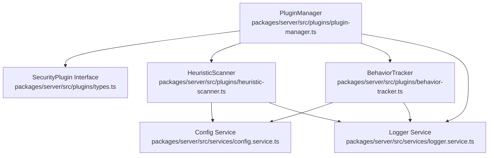
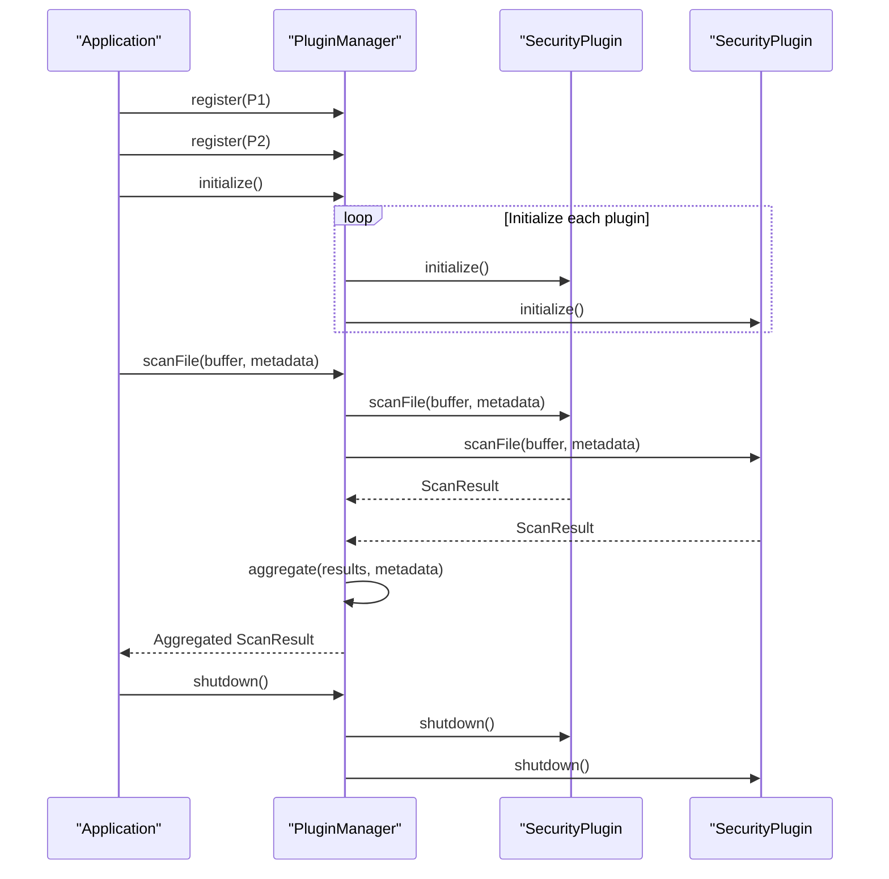
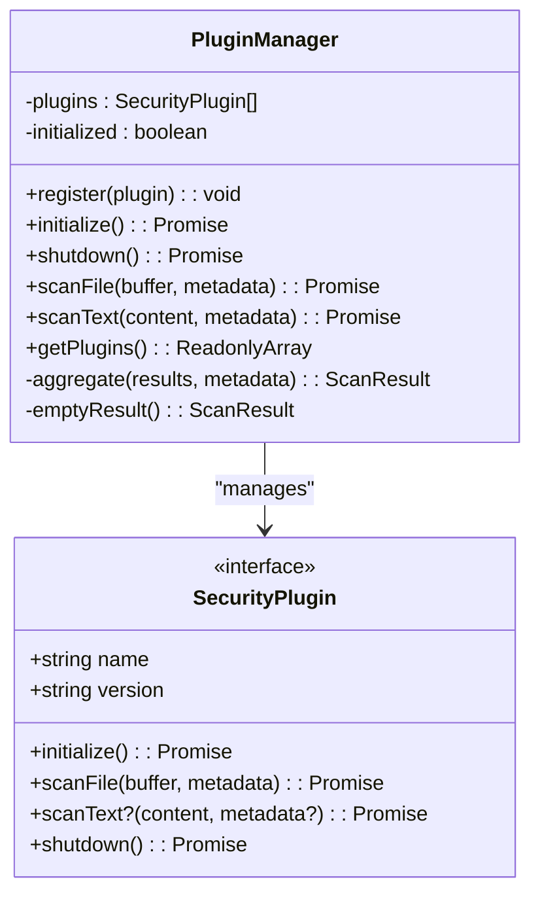
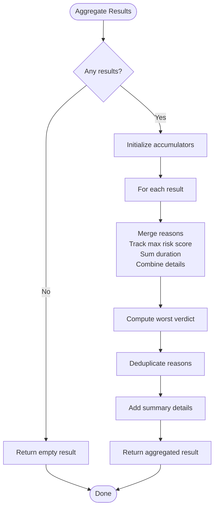
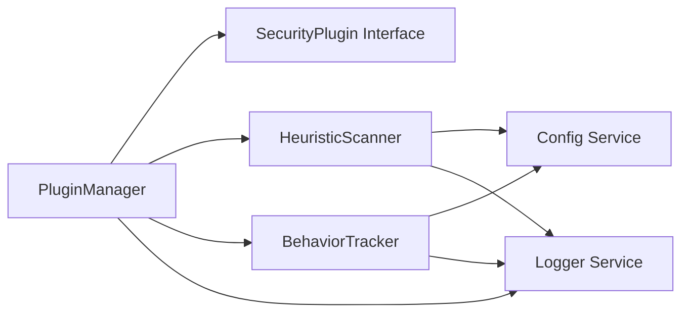

# Plugin Architecture

<cite>
**Referenced Files in This Document**
- [plugin-manager.ts](file://packages/server/src/plugins/plugin-manager.ts)
- [types.ts](file://packages/server/src/plugins/types.ts)
- [behavior-tracker.ts](file://packages/server/src/plugins/behavior-tracker.ts)
- [heuristic-scanner.ts](file://packages/server/src/plugins/heuristic-scanner.ts)
- [plugin-manager.test.ts](file://packages/server/test/plugins/plugin-manager.test.ts)
- [config.service.ts](file://packages/server/src/services/config.service.ts)
- [logger.service.ts](file://packages/server/src/services/logger.service.ts)
</cite>

## Table of Contents
1. [Introduction](#introduction)
2. [Project Structure](#project-structure)
3. [Core Components](#core-components)
4. [Architecture Overview](#architecture-overview)
5. [Detailed Component Analysis](#detailed-component-analysis)
6. [Dependency Analysis](#dependency-analysis)
7. [Performance Considerations](#performance-considerations)
8. [Troubleshooting Guide](#troubleshooting-guide)
9. [Conclusion](#conclusion)

## Introduction
This document describes Airportal's plugin architecture system with a focus on the PluginManager class, the SecurityPlugin interface contract, and the built-in security plugins. It explains plugin registration, initialization, lifecycle management, error handling, plugin discovery, and aggregation of results. It also covers plugin performance monitoring, dependency management, version compatibility, and graceful degradation when plugins fail.

## Project Structure
The plugin system resides under the server package and consists of:
- A central PluginManager orchestrating plugin lifecycle and aggregating results
- A SecurityPlugin interface defining the contract for all security plugins
- Two built-in plugins: HeuristicScanner and BehaviorTracker
- Supporting services for configuration and logging

**Diagram sources**
- [plugin-manager.ts:1-167](file://packages/server/src/plugins/plugin-manager.ts#L1-L167)
- [types.ts:1-26](file://packages/server/src/plugins/types.ts#L1-L26)
- [heuristic-scanner.ts:1-173](file://packages/server/src/plugins/heuristic-scanner.ts#L1-L173)
- [behavior-tracker.ts:1-136](file://packages/server/src/plugins/behavior-tracker.ts#L1-L136)
- [config.service.ts:1-364](file://packages/server/src/services/config.service.ts#L1-L364)
- [logger.service.ts:1-78](file://packages/server/src/services/logger.service.ts#L1-L78)

**Section sources**
- [plugin-manager.ts:1-167](file://packages/server/src/plugins/plugin-manager.ts#L1-L167)
- [types.ts:1-26](file://packages/server/src/plugins/types.ts#L1-L26)

## Core Components
- PluginManager: Central coordinator for plugin registration, initialization, scanning, and shutdown. It aggregates results from multiple plugins and ensures graceful degradation.
- SecurityPlugin interface: Defines the contract that all security plugins must implement, including name, version, initialize, scanFile, optional scanText, and shutdown.
- HeuristicScanner: A file-based scanner that performs entropy analysis, pattern matching, and extension mismatch detection.
- BehaviorTracker: An IP-based behavioral anomaly detector that tracks upload patterns and feeds blacklist entries.

**Section sources**
- [plugin-manager.ts:4-167](file://packages/server/src/plugins/plugin-manager.ts#L4-L167)
- [types.ts:18-25](file://packages/server/src/plugins/types.ts#L18-L25)
- [heuristic-scanner.ts:25-173](file://packages/server/src/plugins/heuristic-scanner.ts#L25-L173)
- [behavior-tracker.ts:12-136](file://packages/server/src/plugins/behavior-tracker.ts#L12-L136)

## Architecture Overview
The plugin architecture follows a centralized orchestration model:
- Plugins implement the SecurityPlugin interface and are registered with PluginManager.
- PluginManager initializes plugins sequentially and logs outcomes.
- During scans, PluginManager invokes each plugin and aggregates results into a unified ScanResult.
- On shutdown, PluginManager calls shutdown on each plugin and resets internal state.

**Diagram sources**
- [plugin-manager.ts:8-104](file://packages/server/src/plugins/plugin-manager.ts#L8-L104)
- [plugin-manager.ts:106-163](file://packages/server/src/plugins/plugin-manager.ts#L106-L163)

## Detailed Component Analysis

### PluginManager Implementation
Responsibilities:
- Register plugins and prevent duplicates
- Initialize plugins sequentially and propagate initialization failures
- Shutdown plugins gracefully and reset state
- Scan files and text with timing and error handling
- Aggregate results across plugins with deduplication and summary details

Key behaviors:
- Duplicate plugin detection prevents redundant registrations.
- Initialization order is strict; the first failing plugin causes initialization to abort.
- File scanning measures duration per plugin and marks failures as suspicious.
- Text scanning filters plugins that implement scanText.
- Aggregation computes worst verdict, maximum risk score, deduplicated reasons, and combined details.

**Diagram sources**
- [plugin-manager.ts:4-167](file://packages/server/src/plugins/plugin-manager.ts#L4-L167)
- [types.ts:18-25](file://packages/server/src/plugins/types.ts#L18-L25)

**Section sources**
- [plugin-manager.ts:8-163](file://packages/server/src/plugins/plugin-manager.ts#L8-L163)

### SecurityPlugin Interface Contract
The interface defines:
- name and version for identification and compatibility
- initialize for resource allocation and configuration loading
- scanFile for binary content analysis
- Optional scanText for textual content analysis
- shutdown for cleanup and resource release

Version compatibility:
- Plugins declare version via the version property.
- No automatic compatibility enforcement is present in the interface; it is recommended to manage compatibility at registration and runtime.

**Section sources**
- [types.ts:18-25](file://packages/server/src/plugins/types.ts#L18-L25)

### HeuristicScanner Plugin
Capabilities:
- Loads configuration from the configuration service for thresholds and patterns
- Performs entropy analysis on files up to a configurable maximum size
- Matches predefined or custom regex patterns against text content
- Detects file extension versus content header mismatches
- Produces risk scores and reasons, with thresholds determining verdict

Initialization and configuration:
- Reads heuristic-specific settings from configuration, falling back to defaults when not provided.
- Uses a default pattern set when none are configured.

Lifecycle:
- initialize loads configuration
- scanFile performs analysis and returns a ScanResult
- shutdown clears internal state

**Section sources**
- [heuristic-scanner.ts:25-173](file://packages/server/src/plugins/heuristic-scanner.ts#L25-L173)
- [config.service.ts:194-211](file://packages/server/src/services/config.service.ts#L194-L211)

### BehaviorTracker Plugin
Capabilities:
- Tracks per-IP upload counts, sizes, and timestamps within a sliding window
- Flags bursts and size outliers to compute an anomaly score
- Feeds IP blacklist service when anomaly exceeds thresholds
- Returns a ScanResult with behavioral details

Initialization and configuration:
- Reads behavior-specific settings from configuration, with sensible defaults.

Lifecycle:
- initialize loads configuration
- scanFile updates records and returns a ScanResult
- shutdown clears in-memory records

**Section sources**
- [behavior-tracker.ts:12-136](file://packages/server/src/plugins/behavior-tracker.ts#L12-L136)
- [config.service.ts:204-210](file://packages/server/src/services/config.service.ts#L204-L210)

### Plugin Discovery Mechanisms
- Manual registration: Plugins are explicitly registered with PluginManager.register(plugin).
- Runtime filtering: scanText only executes on plugins implementing the optional method.
- Plugin inventory: getPlugins returns name and version for all registered plugins.

**Section sources**
- [plugin-manager.ts:8-108](file://packages/server/src/plugins/plugin-manager.ts#L8-L108)

### Plugin Aggregation System
Aggregation logic:
- Worst verdict takes precedence: malicious overrides suspicious, which overrides clean
- Maximum risk score across all results
- Deduplicated reasons using a Set
- Combined details include plugin count, file size, and filename
- Total duration equals the sum of individual plugin durations

**Diagram sources**
- [plugin-manager.ts:110-153](file://packages/server/src/plugins/plugin-manager.ts#L110-L153)

**Section sources**
- [plugin-manager.ts:110-153](file://packages/server/src/plugins/plugin-manager.ts#L110-L153)

### Plugin Registration Examples
- Register a plugin: Use PluginManager.register(plugin) to add a SecurityPlugin instance.
- Prevent duplicates: The manager checks existing plugin names and skips duplicates.
- Retrieve registered plugins: Use getPlugins to obtain an array of { name, version }.

**Section sources**
- [plugin-manager.ts:8-108](file://packages/server/src/plugins/plugin-manager.ts#L8-L108)

### Plugin State Management
- Initialized flag: Ensures initialization runs only once.
- Plugin list: Maintains references to all registered plugins.
- Shutdown resets state: Clears plugin list and resets initialized flag.

**Section sources**
- [plugin-manager.ts:5-47](file://packages/server/src/plugins/plugin-manager.ts#L5-L47)

### Plugin Performance Monitoring
- Duration tracking: Each plugin's scanFile and scanText execution time is recorded.
- Aggregated duration: Total duration equals the sum of individual plugin durations.
- Timing granularity: Per-plugin timing aids performance profiling and bottleneck identification.

**Section sources**
- [plugin-manager.ts:56-96](file://packages/server/src/plugins/plugin-manager.ts#L56-L96)

### Error Handling Strategies
- Initialization failures: Any plugin initialization error causes initialization to abort and is logged.
- Scan failures: Individual plugin scan errors are caught, logged, and treated as suspicious results with a default risk score and reason.
- Graceful degradation: Even if a plugin fails, other plugins' results are still considered for aggregation.

**Section sources**
- [plugin-manager.ts:17-32](file://packages/server/src/plugins/plugin-manager.ts#L17-L32)
- [plugin-manager.ts:56-76](file://packages/server/src/plugins/plugin-manager.ts#L56-L76)
- [plugin-manager.test.ts:222-232](file://packages/server/test/plugins/plugin-manager.test.ts#L222-L232)
- [plugin-manager.test.ts:125-138](file://packages/server/test/plugins/plugin-manager.test.ts#L125-L138)

### Plugin Loading Sequence and Initialization Order
- Registration precedes initialization.
- Initialization is performed in the order plugins were registered.
- Each plugin's initialize method is awaited before proceeding to the next.

**Section sources**
- [plugin-manager.ts:17-32](file://packages/server/src/plugins/plugin-manager.ts#L17-L32)

### Graceful Degradation When Plugins Fail
- If no plugins are registered, scanFile returns a clean result.
- If a plugin throws during scanFile, the manager records an error and produces a suspicious result with a default risk score.
- scanText only executes on plugins that implement the method; missing implementations are ignored.

**Section sources**
- [plugin-manager.ts:49-104](file://packages/server/src/plugins/plugin-manager.ts#L49-L104)
- [plugin-manager.test.ts:178-205](file://packages/server/test/plugins/plugin-manager.test.ts#L178-L205)

### Plugin Dependency Management and Version Compatibility
- Dependencies:
  - HeuristicScanner depends on configuration service for thresholds and patterns.
  - BehaviorTracker depends on configuration service for behavioral thresholds and on IP blacklist service for anomaly reporting.
- Version compatibility:
  - Plugins declare version via the version property.
  - No automatic compatibility enforcement exists; manage compatibility externally at registration and runtime.

**Section sources**
- [heuristic-scanner.ts:35-54](file://packages/server/src/plugins/heuristic-scanner.ts#L35-L54)
- [behavior-tracker.ts:23-36](file://packages/server/src/plugins/behavior-tracker.ts#L23-L36)
- [types.ts:19-20](file://packages/server/src/plugins/types.ts#L19-L20)

### Plugin Shutdown Procedures
- PluginManager calls shutdown on each registered plugin.
- Errors during shutdown are logged but do not prevent the manager from clearing its internal state.
- After shutdown, the plugin list is cleared and initialized flag is reset.

**Section sources**
- [plugin-manager.ts:34-47](file://packages/server/src/plugins/plugin-manager.ts#L34-L47)

## Dependency Analysis
The PluginManager coordinates multiple components:
- SecurityPlugin interface defines the contract for all plugins.
- HeuristicScanner and BehaviorTracker implement the interface and depend on configuration and logging services.
- Logger service provides structured logging for plugin events.
- Configuration service supplies runtime settings for plugin behavior.

**Diagram sources**
- [plugin-manager.ts:1-167](file://packages/server/src/plugins/plugin-manager.ts#L1-L167)
- [types.ts:18-25](file://packages/server/src/plugins/types.ts#L18-L25)
- [heuristic-scanner.ts:1-173](file://packages/server/src/plugins/heuristic-scanner.ts#L1-L173)
- [behavior-tracker.ts:1-136](file://packages/server/src/plugins/behavior-tracker.ts#L1-L136)
- [config.service.ts:1-364](file://packages/server/src/services/config.service.ts#L1-L364)
- [logger.service.ts:1-78](file://packages/server/src/services/logger.service.ts#L1-L78)

**Section sources**
- [plugin-manager.ts:1-167](file://packages/server/src/plugins/plugin-manager.ts#L1-L167)
- [types.ts:18-25](file://packages/server/src/plugins/types.ts#L18-L25)
- [heuristic-scanner.ts:1-173](file://packages/server/src/plugins/heuristic-scanner.ts#L1-L173)
- [behavior-tracker.ts:1-136](file://packages/server/src/plugins/behavior-tracker.ts#L1-L136)
- [config.service.ts:1-364](file://packages/server/src/services/config.service.ts#L1-L364)
- [logger.service.ts:1-78](file://packages/server/src/services/logger.service.ts#L1-L78)

## Performance Considerations
- Sequential initialization: Initialization runs in registration order; consider parallelizing if plugins are independent and thread-safe.
- Per-plugin timing: Track durations to identify slow plugins and optimize accordingly.
- Aggregation cost: Aggregation iterates through all results; keep the number of plugins reasonable for latency-sensitive paths.
- Threshold tuning: Adjust heuristic and behavior thresholds to balance sensitivity and performance.

## Troubleshooting Guide
Common issues and resolutions:
- Duplicate plugin registration: The manager logs a warning and skips registration. Ensure unique plugin names.
- Initialization failure: The manager logs the error and aborts initialization. Fix plugin configuration and retry.
- Scan failure: The manager logs the error and treats the result as suspicious. Investigate plugin-specific issues.
- Missing scanText implementation: scanText ignores plugins without the method. Implement scanText if needed.
- Shutdown errors: The manager logs errors but continues to reset state. Investigate plugin shutdown logic.

**Section sources**
- [plugin-manager.ts:8-47](file://packages/server/src/plugins/plugin-manager.ts#L8-L47)
- [plugin-manager.test.ts:48-55](file://packages/server/test/plugins/plugin-manager.test.ts#L48-L55)
- [plugin-manager.test.ts:222-232](file://packages/server/test/plugins/plugin-manager.test.ts#L222-L232)
- [plugin-manager.test.ts:178-205](file://packages/server/test/plugins/plugin-manager.test.ts#L178-L205)

## Conclusion
Airportal's plugin architecture centers on a robust PluginManager that enforces a clear SecurityPlugin interface, supports multiple plugins, and aggregates results while handling failures gracefully. Built-in plugins demonstrate practical scanning capabilities, and the system integrates with configuration and logging services for flexible operation. Following the documented patterns ensures reliable plugin registration, initialization, lifecycle management, and performance monitoring.