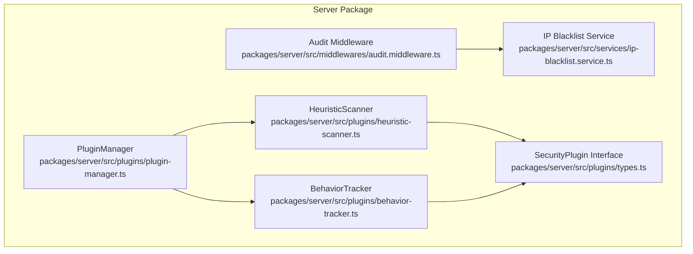
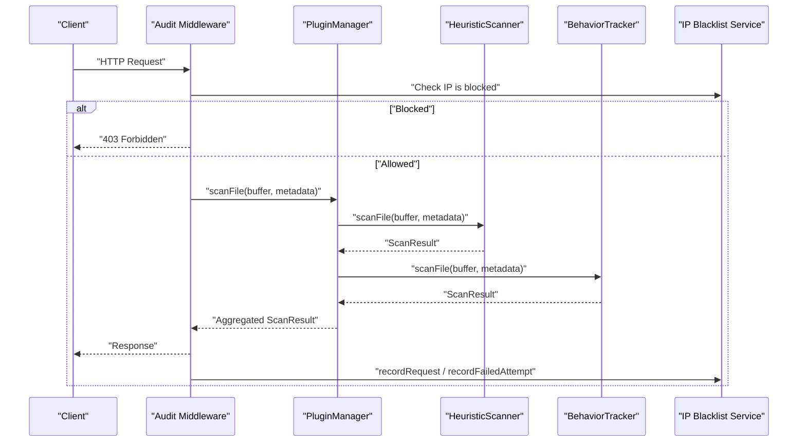
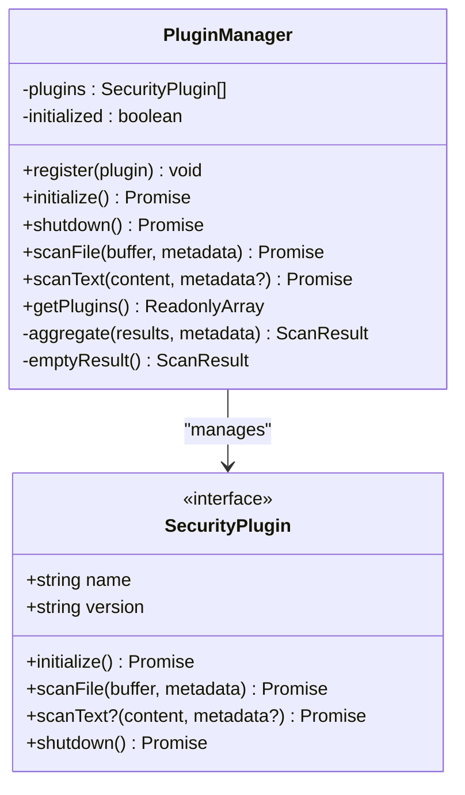
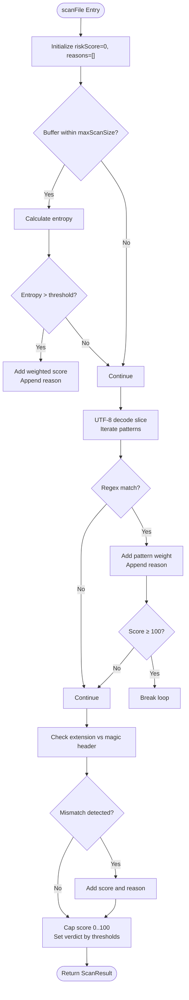
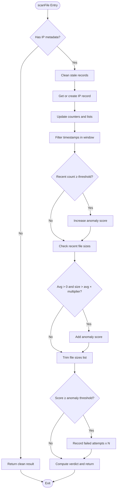
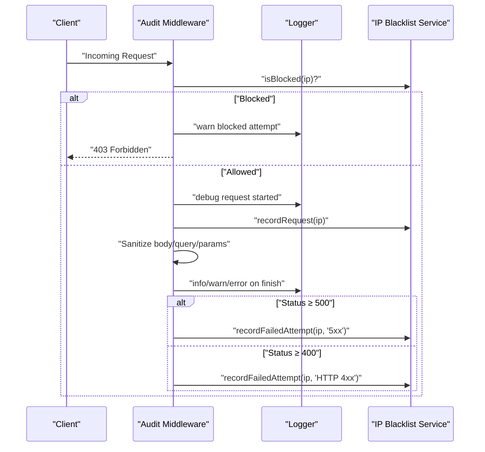
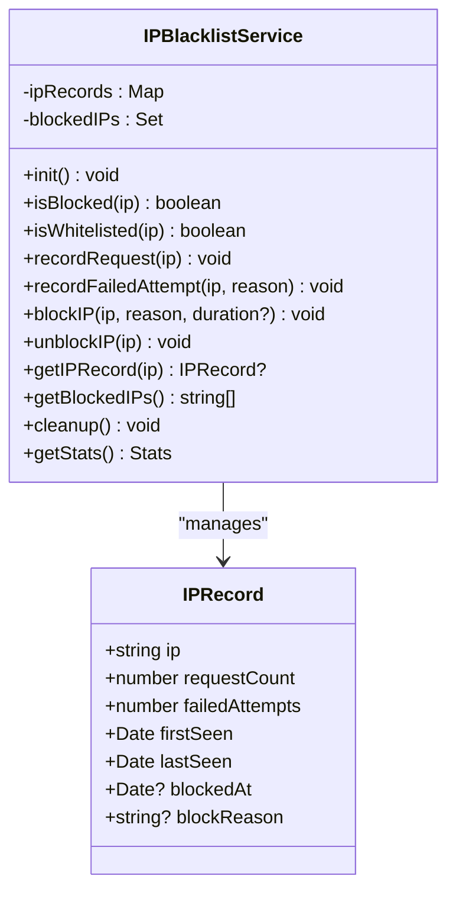
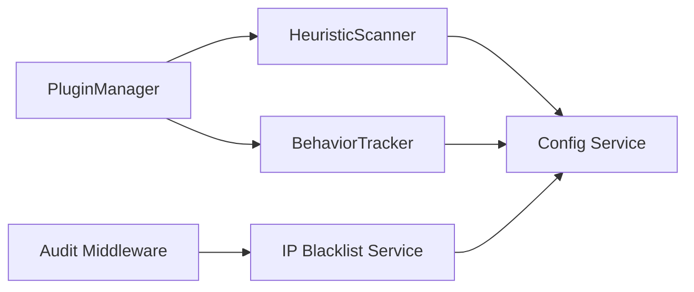

# Security System

<cite>
**Referenced Files in This Document**
- [plugin-manager.ts](file://packages/server/src/plugins/plugin-manager.ts)
- [types.ts](file://packages/server/src/plugins/types.ts)
- [heuristic-scanner.ts](file://packages/server/src/plugins/heuristic-scanner.ts)
- [behavior-tracker.ts](file://packages/server/src/plugins/behavior-tracker.ts)
- [audit.middleware.ts](file://packages/server/src/middlewares/audit.middleware.ts)
- [ip-blacklist.service.ts](file://packages/server/src/services/ip-blacklist.service.ts)
- [plugin-manager.test.ts](file://packages/server/test/plugins/plugin-manager.test.ts)
- [heuristic-scanner.test.ts](file://packages/server/test/plugins/heuristic-scanner.test.ts)
</cite>

## Table of Contents
1. [Introduction](#introduction)
2. [Project Structure](#project-structure)
3. [Core Components](#core-components)
4. [Architecture Overview](#architecture-overview)
5. [Detailed Component Analysis](#detailed-component-analysis)
6. [Dependency Analysis](#dependency-analysis)
7. [Performance Considerations](#performance-considerations)
8. [Troubleshooting Guide](#troubleshooting-guide)
9. [Conclusion](#conclusion)

## Introduction
This document describes Airportal’s multi-layered security architecture with a focus on the plugin-based security system. It covers the PluginManager orchestrator, the security plugin interface contract, extensible scanning capabilities, the heuristic scanner for file content analysis and malicious pattern detection, the behavior tracker for request pattern analysis and anomaly detection, and the audit middleware for comprehensive request logging and security event tracking. It also documents IP blacklisting, rate limiting, input validation strategies, security configuration management, threat mitigation approaches, and monitoring patterns.

## Project Structure
Airportal organizes security logic under the server package with clear separation of concerns:
- Plugins: pluggable security analyzers implementing a shared interface
- Middlewares: cross-cutting request auditing and IP blocking enforcement
- Services: runtime services such as IP blacklist management
- Tests: focused unit tests validating plugin orchestration and scanner behavior

**Diagram sources**
- [plugin-manager.ts:1-167](file://packages/server/src/plugins/plugin-manager.ts#L1-L167)
- [types.ts:1-26](file://packages/server/src/plugins/types.ts#L1-L26)
- [heuristic-scanner.ts:1-173](file://packages/server/src/plugins/heuristic-scanner.ts#L1-L173)
- [behavior-tracker.ts:1-136](file://packages/server/src/plugins/behavior-tracker.ts#L1-L136)
- [audit.middleware.ts:1-187](file://packages/server/src/middlewares/audit.middleware.ts#L1-L187)
- [ip-blacklist.service.ts:1-215](file://packages/server/src/services/ip-blacklist.service.ts#L1-L215)

**Section sources**
- [plugin-manager.ts:1-167](file://packages/server/src/plugins/plugin-manager.ts#L1-L167)
- [types.ts:1-26](file://packages/server/src/plugins/types.ts#L1-L26)
- [heuristic-scanner.ts:1-173](file://packages/server/src/plugins/heuristic-scanner.ts#L1-L173)
- [behavior-tracker.ts:1-136](file://packages/server/src/plugins/behavior-tracker.ts#L1-L136)
- [audit.middleware.ts:1-187](file://packages/server/src/middlewares/audit.middleware.ts#L1-L187)
- [ip-blacklist.service.ts:1-215](file://packages/server/src/services/ip-blacklist.service.ts#L1-L215)

## Core Components
- PluginManager: Registers, initializes, and orchestrates security plugins; aggregates scan results and enforces plugin failure handling policies.
- SecurityPlugin interface: Defines the contract for all security plugins, including optional text scanning.
- HeuristicScanner: Performs file entropy analysis, pattern matching, and file-type mismatch detection.
- BehaviorTracker: Tracks per-IP upload behavior, detects bursts and outliers, and integrates with IP blacklisting.
- Audit Middleware: Enforces IP blacklisting, sanitizes sensitive fields, logs requests, and records failures for blacklisting.
- IP Blacklist Service: Manages IP records, auto-block thresholds, whitelisting, and administrative block/unblock operations.

**Section sources**
- [plugin-manager.ts:1-167](file://packages/server/src/plugins/plugin-manager.ts#L1-L167)
- [types.ts:1-26](file://packages/server/src/plugins/types.ts#L1-L26)
- [heuristic-scanner.ts:1-173](file://packages/server/src/plugins/heuristic-scanner.ts#L1-L173)
- [behavior-tracker.ts:1-136](file://packages/server/src/plugins/behavior-tracker.ts#L1-L136)
- [audit.middleware.ts:1-187](file://packages/server/src/middlewares/audit.middleware.ts#L1-L187)
- [ip-blacklist.service.ts:1-215](file://packages/server/src/services/ip-blacklist.service.ts#L1-L215)

## Architecture Overview
The security system is built around a plugin architecture. Requests pass through the audit middleware for logging and IP checks. File uploads are scanned by registered plugins via the PluginManager, which aggregates results into a unified verdict. BehaviorTracker monitors upload patterns and can trigger blacklisting automatically.

**Diagram sources**
- [audit.middleware.ts:48-124](file://packages/server/src/middlewares/audit.middleware.ts#L48-L124)
- [plugin-manager.ts:49-79](file://packages/server/src/plugins/plugin-manager.ts#L49-L79)
- [heuristic-scanner.ts:56-115](file://packages/server/src/plugins/heuristic-scanner.ts#L56-L115)
- [behavior-tracker.ts:38-108](file://packages/server/src/plugins/behavior-tracker.ts#L38-L108)
- [ip-blacklist.service.ts:37-120](file://packages/server/src/services/ip-blacklist.service.ts#L37-L120)

## Detailed Component Analysis

### PluginManager
Responsibilities:
- Register plugins and prevent duplicates
- Initialize and shutdown plugins with robust error handling
- Orchestrate file scans across all plugins and aggregate results
- Optionally scan text content when supported by plugins
- Compute duration and maintain metadata in aggregated results

Key behaviors:
- Initialization failure aborts startup and is logged
- Shutdown invokes each plugin’s cleanup routine
- Aggregation logic:
  - Worst-case verdict: malicious > suspicious > clean
  - Risk score: maximum among plugin results
  - Reasons: deduplicated across plugins
  - Details: merged with plugin count and file metadata

**Diagram sources**
- [plugin-manager.ts:4-167](file://packages/server/src/plugins/plugin-manager.ts#L4-L167)
- [types.ts:18-25](file://packages/server/src/plugins/types.ts#L18-L25)

**Section sources**
- [plugin-manager.ts:1-167](file://packages/server/src/plugins/plugin-manager.ts#L1-L167)
- [types.ts:1-26](file://packages/server/src/plugins/types.ts#L1-L26)
- [plugin-manager.test.ts:33-248](file://packages/server/test/plugins/plugin-manager.test.ts#L33-L248)

### HeuristicScanner
Responsibilities:
- Analyze file content heuristically for suspicious patterns
- Compute entropy to detect obfuscated or encrypted content
- Detect file extension/content mismatches
- Enforce configurable thresholds for risk scoring and verdicts

Key behaviors:
- Configuration-driven pattern set and thresholds
- UTF-8 decoding with fallback for binary content
- Risk capped at 100; thresholds determine verdict categories
- Details include entropy and file size

**Diagram sources**
- [heuristic-scanner.ts:56-115](file://packages/server/src/plugins/heuristic-scanner.ts#L56-L115)

**Section sources**
- [heuristic-scanner.ts:1-173](file://packages/server/src/plugins/heuristic-scanner.ts#L1-L173)
- [heuristic-scanner.test.ts:12-152](file://packages/server/test/plugins/heuristic-scanner.test.ts#L12-L152)

### BehaviorTracker
Responsibilities:
- Track per-IP upload metrics within a sliding window
- Detect burst uploads and file-size outliers
- Integrate with IP Blacklist Service to record anomalies and potentially auto-block

Key behaviors:
- Sliding window and burst thresholding
- Size outlier detection using recent average
- Anomaly scoring with caps and thresholds
- Automatic blacklisting entries proportional to anomaly severity

**Diagram sources**
- [behavior-tracker.ts:38-108](file://packages/server/src/plugins/behavior-tracker.ts#L38-L108)

**Section sources**
- [behavior-tracker.ts:1-136](file://packages/server/src/plugins/behavior-tracker.ts#L1-L136)
- [ip-blacklist.service.ts:80-120](file://packages/server/src/services/ip-blacklist.service.ts#L80-L120)

### Audit Middleware
Responsibilities:
- Enforce IP blacklisting before processing requests
- Sanitize sensitive fields in request bodies
- Log request lifecycle events with timing and status
- Record failed attempts for blacklisting and expose admin endpoints

Key behaviors:
- IP extraction from headers or fallback to direct client IP
- Sensitive field redaction with recursive sanitization
- Conditional logging based on log level
- Automatic recording of successful and failed requests
- Admin endpoints for blacklist stats and management

**Diagram sources**
- [audit.middleware.ts:48-124](file://packages/server/src/middlewares/audit.middleware.ts#L48-L124)
- [ip-blacklist.service.ts:37-120](file://packages/server/src/services/ip-blacklist.service.ts#L37-L120)

**Section sources**
- [audit.middleware.ts:1-187](file://packages/server/src/middlewares/audit.middleware.ts#L1-L187)
- [ip-blacklist.service.ts:1-215](file://packages/server/src/services/ip-blacklist.service.ts#L1-L215)

### IP Blacklist Service
Responsibilities:
- Maintain IP records with counts, timestamps, and block state
- Support whitelisting and automatic blocking based on thresholds
- Provide administrative endpoints to manage blocks and view statistics
- Periodic cleanup of stale records

Key behaviors:
- Whitelist override for blocked checks
- Auto-block window and threshold logic
- Optional timed unblocking
- Statistics aggregation for top failed IPs

**Diagram sources**
- [ip-blacklist.service.ts:14-215](file://packages/server/src/services/ip-blacklist.service.ts#L14-L215)

**Section sources**
- [ip-blacklist.service.ts:1-215](file://packages/server/src/services/ip-blacklist.service.ts#L1-L215)

## Dependency Analysis
- PluginManager depends on the SecurityPlugin interface and orchestrates HeuristicScanner and BehaviorTracker.
- HeuristicScanner and BehaviorTracker depend on configuration service for thresholds and patterns.
- Audit Middleware depends on IP Blacklist Service for enforcement and statistics.
- IP Blacklist Service depends on configuration for thresholds and durations.

**Diagram sources**
- [plugin-manager.ts:1-167](file://packages/server/src/plugins/plugin-manager.ts#L1-L167)
- [heuristic-scanner.ts:1-54](file://packages/server/src/plugins/heuristic-scanner.ts#L1-L54)
- [behavior-tracker.ts:1-36](file://packages/server/src/plugins/behavior-tracker.ts#L1-L36)
- [audit.middleware.ts:1-10](file://packages/server/src/middlewares/audit.middleware.ts#L1-L10)
- [ip-blacklist.service.ts:1-32](file://packages/server/src/services/ip-blacklist.service.ts#L1-L32)

**Section sources**
- [plugin-manager.ts:1-167](file://packages/server/src/plugins/plugin-manager.ts#L1-L167)
- [heuristic-scanner.ts:1-54](file://packages/server/src/plugins/heuristic-scanner.ts#L1-L54)
- [behavior-tracker.ts:1-36](file://packages/server/src/plugins/behavior-tracker.ts#L1-L36)
- [audit.middleware.ts:1-10](file://packages/server/src/middlewares/audit.middleware.ts#L1-L10)
- [ip-blacklist.service.ts:1-32](file://packages/server/src/services/ip-blacklist.service.ts#L1-L32)

## Performance Considerations
- PluginManager:
  - Aggregates results sequentially; consider parallelization if plugin count grows large.
  - Duration tracking per plugin aids profiling.
- HeuristicScanner:
  - Limits scan to a configurable max size to bound CPU/memory.
  - Uses UTF-8 decoding only on a slice and falls back gracefully for binaries.
  - Entropy calculation is linear in buffer length; keep maxScanSize reasonable.
- BehaviorTracker:
  - Sliding window filtering trims timestamps; memory footprint controlled by window and history limits.
  - Anomaly scoring capped to prevent overflow.
- Audit Middleware:
  - Sanitization recurses into nested objects; depth limit prevents stack exhaustion.
  - Logging is conditional on log level to reduce overhead.

[No sources needed since this section provides general guidance]

## Troubleshooting Guide
Common issues and resolutions:
- Duplicate plugin registration:
  - Symptom: Warning logged and duplicate skipped.
  - Action: Ensure unique plugin names during registration.
- Plugin initialization failure:
  - Symptom: Startup aborts with error logged.
  - Action: Fix plugin initialization logic or remove faulty plugin.
- Plugin scan failure:
  - Symptom: Suspicious result with risk score and reasons logged.
  - Action: Inspect plugin-specific errors and adjust configuration.
- HeuristicScanner thresholds too strict:
  - Symptom: Legitimate files flagged malicious.
  - Action: Adjust entropy and risk thresholds in configuration.
- BehaviorTracker false positives:
  - Symptom: Legitimate burst uploads flagged.
  - Action: Increase burst threshold or window size.
- Audit middleware redaction:
  - Symptom: Sensitive fields not redacted.
  - Action: Verify sensitive field names and ensure debug logging is enabled to include body.
- IP blacklist not taking effect:
  - Symptom: Blocked IPs still allowed.
  - Action: Confirm blacklist enabled and IP not whitelisted; check auto-block thresholds and windows.

**Section sources**
- [plugin-manager.ts:8-31](file://packages/server/src/plugins/plugin-manager.ts#L8-L31)
- [heuristic-scanner.ts:35-54](file://packages/server/src/plugins/heuristic-scanner.ts#L35-L54)
- [behavior-tracker.ts:23-36](file://packages/server/src/plugins/behavior-tracker.ts#L23-L36)
- [audit.middleware.ts:12-29](file://packages/server/src/middlewares/audit.middleware.ts#L12-L29)
- [audit.middleware.ts:53-66](file://packages/server/src/middlewares/audit.middleware.ts#L53-L66)
- [ip-blacklist.service.ts:18-32](file://packages/server/src/services/ip-blacklist.service.ts#L18-L32)

## Conclusion
Airportal’s security system leverages a modular plugin architecture to deliver extensible scanning capabilities, robust request auditing, and intelligent anomaly detection. The HeuristicScanner and BehaviorTracker provide complementary layers of file and behavioral analysis, while the Audit Middleware and IP Blacklist Service enforce access controls and maintain comprehensive logs. Configuration-driven thresholds enable tuning for various environments, and the design supports easy addition of new security plugins.