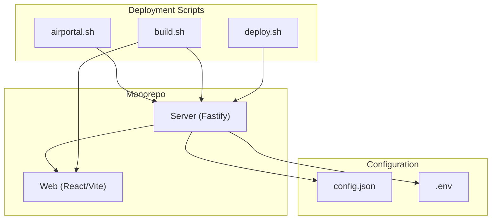
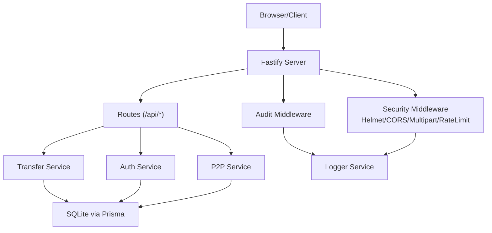
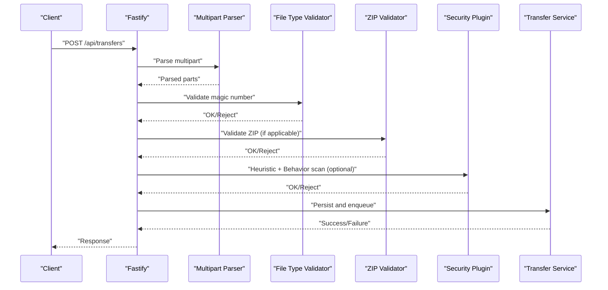
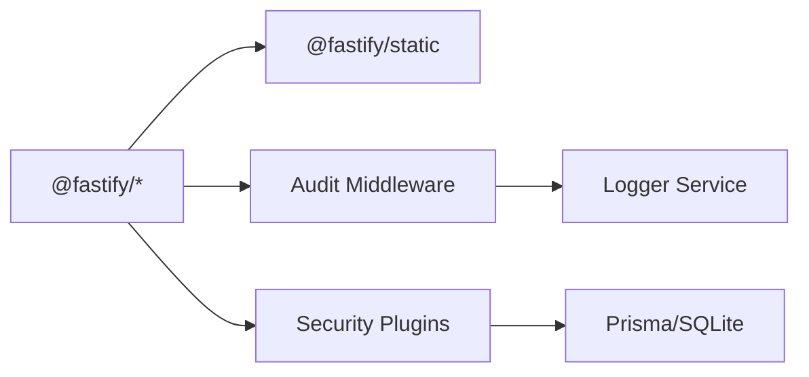

# Troubleshooting and FAQ

<cite>
**Referenced Files in This Document**
- [config.json](file://config.json)
- [CLAUDE.md](file://CLAUDE.md)
- [airportal.sh](file://airportal.sh)
- [build.sh](file://build.sh)
- [deploy.sh](file://deploy.sh)
- [package.json](file://package.json)
- [packages/server/src/app.ts](file://packages/server/src/app.ts)
- [packages/server/src/config/index.ts](file://packages/server/src/config/index.ts)
- [packages/server/src/middlewares/audit.middleware.ts](file://packages/server/src/middlewares/audit.middleware.ts)
- [packages/server/src/middlewares/auth.middleware.ts](file://packages/server/src/middlewares/auth.middleware.ts)
- [packages/server/src/services/transfer.service.ts](file://packages/server/src/services/transfer.service.ts)
- [packages/server/src/services/file-type.service.ts](file://packages/server/src/services/file-type.service.ts)
- [packages/server/src/services/zip-validation.service.ts](file://packages/server/src/services/zip-validation.service.ts)
- [packages/server/src/services/ip-blacklist.service.ts](file://packages/server/src/services/ip-blacklist.service.ts)
- [packages/server/src/services/cleanup.service.ts](file://packages/server/src/services/cleanup.service.ts)
- [packages/server/src/services/logger.service.ts](file://packages/server/src/services/logger.service.ts)
- [packages/server/src/plugins/plugin-manager.ts](file://packages/server/src/plugins/plugin-manager.ts)
- [packages/server/src/plugins/heuristic-scanner.ts](file://packages/server/src/plugins/heuristic-scanner.ts)
- [packages/server/src/plugins/behavior-tracker.ts](file://packages/server/src/plugins/behavior-tracker.ts)
- [packages/server/src/routes/transfer.routes.ts](file://packages/server/src/routes/transfer.routes.ts)
- [packages/server/src/routes/p2p.routes.ts](file://packages/server/src/routes/p2p.routes.ts)
- [packages/server/src/routes/auth.routes.ts](file://packages/server/src/routes/auth.routes.ts)
- [packages/web/src/services/api.ts](file://packages/web/src/services/api.ts)
- [packages/web/src/services/p2p.service.ts](file://packages/web/src/services/p2p.service.ts)
- [packages/web/src/hooks/useP2P.ts](file://packages/web/src/hooks/useP2P.ts)
</cite>

## Table of Contents
1. [Introduction](#introduction)
2. [Project Structure](#project-structure)
3. [Core Components](#core-components)
4. [Architecture Overview](#architecture-overview)
5. [Detailed Component Analysis](#detailed-component-analysis)
6. [Dependency Analysis](#dependency-analysis)
7. [Performance Considerations](#performance-considerations)
8. [Troubleshooting Guide](#troubleshooting-guide)
9. [FAQ](#faq)
10. [Conclusion](#conclusion)
11. [Appendices](#appendices)

## Introduction
This document provides a comprehensive troubleshooting and FAQ guide for Airportal, focusing on common operational issues such as file upload failures, P2P connection problems, authentication failures, and security plugin conflicts. It also covers systematic debugging approaches (log analysis, performance profiling, error handling patterns), network and browser compatibility considerations, and security-related concerns. Guidance is grounded in the repository’s configuration, scripts, and source code.

## Project Structure
AirPortal is a TypeScript monorepo using pnpm workspaces:
- Server package (Fastify) serving API and frontend in production, with development support via Vite HMR.
- Web package (React + Vite) providing the UI for sending, receiving, and managing transfers.
- Shared configuration via config.json and environment variables (.env).
- Deployment and lifecycle managed by shell scripts for development, building, and production deployment.

**Diagram sources**
- [CLAUDE.md:37-68](file://CLAUDE.md#L37-L68)
- [airportal.sh:1-211](file://airportal.sh#L1-L211)
- [build.sh:1-293](file://build.sh#L1-L293)
- [deploy.sh:1-386](file://deploy.sh#L1-L386)

**Section sources**
- [CLAUDE.md:31-74](file://CLAUDE.md#L31-L74)
- [package.json:6-16](file://package.json#L6-L16)

## Core Components
- Security subsystem: file type validation, ZIP archive validation, IP blacklist, audit logging, rate limiting, and the pluggable security plugin system (heuristic scanner + behavior tracker).
- Transfer subsystem: upload, retrieval, and cleanup services.
- Authentication middleware and routes.
- P2P routes and services for LAN direct transfers.
- Logging and error handling middleware.

Key configuration locations:
- Global server and security settings in config.json.
- Environment variable overrides and runtime config loading in the server.

**Section sources**
- [config.json:1-102](file://config.json#L1-L102)
- [packages/server/src/config/index.ts:1-15](file://packages/server/src/config/index.ts#L1-L15)
- [packages/server/src/app.ts:19-148](file://packages/server/src/app.ts#L19-L148)

## Architecture Overview
High-level runtime architecture:
- Single-process Fastify server serves both API and built frontend in production.
- Development mode integrates Vite for HMR.
- Security middleware applies Helmet, CORS, multipart parsing, and rate limiting.
- Audit middleware records requests and enforces IP blacklist checks.
- Routes expose transfer, authentication, and P2P endpoints.
- Security plugins scan uploads and track behavior anomalies.

**Diagram sources**
- [packages/server/src/app.ts:19-148](file://packages/server/src/app.ts#L19-L148)
- [packages/server/src/middlewares/audit.middleware.ts:48-124](file://packages/server/src/middlewares/audit.middleware.ts#L48-L124)
- [packages/server/src/routes/transfer.routes.ts](file://packages/server/src/routes/transfer.routes.ts)
- [packages/server/src/routes/auth.routes.ts](file://packages/server/src/routes/auth.routes.ts)
- [packages/server/src/routes/p2p.routes.ts](file://packages/server/src/routes/p2p.routes.ts)
- [packages/server/src/services/logger.service.ts](file://packages/server/src/services/logger.service.ts)

## Detailed Component Analysis

### Security Plugin System
The security plugin system is pluggable and configurable. It includes:
- HeuristicScanner: entropy analysis and regex-based pattern matching for risky content.
- BehaviorTracker: anomaly detection for burst uploads and size outliers.
- PluginManager: orchestrates plugin registration, execution, and aggregation.

Common symptoms of security plugin conflicts:
- Uploads rejected with risk thresholds exceeded.
- Unexpected rejections for benign content due to overly sensitive patterns.
- Performance degradation during uploads due to scanning overhead.

Operational controls:
- Enable/disable the security plugin system globally.
- Adjust heuristic thresholds and pattern weights.
- Tune behavior window and anomaly thresholds.

**Section sources**
- [config.json:31-62](file://config.json#L31-L62)
- [packages/server/src/plugins/plugin-manager.ts](file://packages/server/src/plugins/plugin-manager.ts)
- [packages/server/src/plugins/heuristic-scanner.ts](file://packages/server/src/plugins/heuristic-scanner.ts)
- [packages/server/src/plugins/behavior-tracker.ts](file://packages/server/src/plugins/behavior-tracker.ts)

### File Upload Pipeline
End-to-end upload flow:
- Multipart parsing with configured file size limits.
- File type validation (magic number detection).
- ZIP validation (path traversal, zip bomb detection, entry limits).
- Security plugin scanning (optional).
- Storage and metadata persistence.

Common failure points:
- Exceeding max file size or total storage.
- Blocked extensions or invalid magic number.
- ZIP validation failures (path traversal or compression ratio).
- Security plugin rejection.

**Diagram sources**
- [packages/server/src/app.ts:76-84](file://packages/server/src/app.ts#L76-L84)
- [packages/server/src/services/file-type.service.ts](file://packages/server/src/services/file-type.service.ts)
- [packages/server/src/services/zip-validation.service.ts](file://packages/server/src/services/zip-validation.service.ts)
- [packages/server/src/plugins/heuristic-scanner.ts](file://packages/server/src/plugins/heuristic-scanner.ts)
- [packages/server/src/services/transfer.service.ts](file://packages/server/src/services/transfer.service.ts)

**Section sources**
- [config.json:63-77](file://config.json#L63-L77)
- [packages/server/src/app.ts:76-84](file://packages/server/src/app.ts#L76-L84)

### P2P Connectivity
P2P routes and services enable LAN direct transfers:
- Device discovery and signaling.
- Direct transfer negotiation and timeouts.
- Max concurrent transfers and request timeout controls.

Common P2P issues:
- Network discovery failures (firewall/NAT).
- Request timeouts during transfer.
- Exceeded max concurrent transfers.

**Section sources**
- [config.json:94-100](file://config.json#L94-L100)
- [packages/server/src/routes/p2p.routes.ts](file://packages/server/src/routes/p2p.routes.ts)
- [packages/web/src/services/p2p.service.ts](file://packages/web/src/services/p2p.service.ts)
- [packages/web/src/hooks/useP2P.ts](file://packages/web/src/hooks/useP2P.ts)

### Authentication and Authorization
- Bearer token verification middleware.
- Optional auth middleware for endpoints allowing anonymous access.
- Auth routes for registration/login.

Common auth problems:
- Missing or malformed Authorization header.
- Invalid/expired tokens.
- Misconfigured JWT secret in .env.

**Section sources**
- [packages/server/src/middlewares/auth.middleware.ts:11-48](file://packages/server/src/middlewares/auth.middleware.ts#L11-L48)
- [packages/server/src/routes/auth.routes.ts](file://packages/server/src/routes/auth.routes.ts)
- [deploy.sh:165-194](file://deploy.sh#L165-L194)

### Audit Logging and IP Blacklist
- Audit middleware sanitizes sensitive fields and logs request/response metadata.
- IP blacklist service tracks failed attempts and supports manual block/unblock.
- IP stats endpoint exposed for diagnostics.

Common issues:
- Over-blocking due to misconfiguration.
- Missing logs due to low log level.
- Manual block/unblock via admin endpoints.

**Section sources**
- [packages/server/src/middlewares/audit.middleware.ts:48-186](file://packages/server/src/middlewares/audit.middleware.ts#L48-L186)
- [packages/server/src/services/ip-blacklist.service.ts](file://packages/server/src/services/ip-blacklist.service.ts)

## Dependency Analysis
Runtime dependencies and their roles:
- Fastify: HTTP server and routing.
- @fastify/helmet: Security headers.
- @fastify/cors: Cross-origin allowance.
- @fastify/multipart: Multipart parsing with size limits.
- @fastify/rate-limit: Global and upload-specific rate limiting.
- @fastify/static: Serving built frontend in production.
- Prisma/SQLite: Data persistence for transfers and metadata.

**Diagram sources**
- [packages/server/src/app.ts:19-148](file://packages/server/src/app.ts#L19-L148)
- [packages/server/src/services/logger.service.ts](file://packages/server/src/services/logger.service.ts)

**Section sources**
- [packages/server/src/app.ts:19-148](file://packages/server/src/app.ts#L19-L148)

## Performance Considerations
- Monitor CPU and memory usage during large uploads or ZIP decompression.
- Tune security plugin thresholds to balance safety and throughput.
- Adjust rate limit windows and max values to match expected traffic.
- Use production builds and disable debug logs for performance-sensitive environments.
- Consider offloading static assets to a CDN if scaling horizontally.

[No sources needed since this section provides general guidance]

## Troubleshooting Guide

### System Startup and Lifecycle
Symptoms:
- Port already in use.
- Service fails to start with unhandled errors.
- Logs missing or truncated.

Checklist:
- Verify port availability and PID file status.
- Inspect logs via the service management script.
- Confirm environment variables and config.json are present.
- Ensure database initialization succeeds.

**Section sources**
- [airportal.sh:30-106](file://airportal.sh#L30-L106)
- [airportal.sh:171-178](file://airportal.sh#L171-L178)
- [deploy.sh:208-222](file://deploy.sh#L208-L222)

### File Upload Failures
Symptoms:
- Uploads rejected immediately.
- Rejections after scanning completes.
- Storage quota exceeded.

Debug steps:
- Check max file size and total storage limits.
- Verify blocked extensions and magic number validation.
- Review ZIP validation settings (uncompressed size, entries, compression ratio).
- Temporarily disable security plugins to isolate scanner issues.

**Section sources**
- [config.json:63-77](file://config.json#L63-L77)
- [config.json:31-62](file://config.json#L31-L62)
- [packages/server/src/services/file-type.service.ts](file://packages/server/src/services/file-type.service.ts)
- [packages/server/src/services/zip-validation.service.ts](file://packages/server/src/services/zip-validation.service.ts)

### P2P Connection Issues
Symptoms:
- Discovery fails behind NAT/firewalls.
- Transfers time out.
- Too many concurrent transfers.

Debug steps:
- Confirm P2P enabled in config.
- Check request timeout and max concurrent transfers.
- Verify network ports open and firewall rules allow connections.
- Reduce concurrent transfers or increase timeout.

**Section sources**
- [config.json:94-100](file://config.json#L94-L100)
- [packages/server/src/routes/p2p.routes.ts](file://packages/server/src/routes/p2p.routes.ts)

### Authentication Problems
Symptoms:
- 401 Unauthorized on protected endpoints.
- Token verification errors.
- Login/register failures.

Debug steps:
- Confirm Authorization header format (Bearer token).
- Verify JWT secret in .env matches server expectations.
- Check auth routes and token expiration.

**Section sources**
- [packages/server/src/middlewares/auth.middleware.ts:11-48](file://packages/server/src/middlewares/auth.middleware.ts#L11-L48)
- [packages/server/src/routes/auth.routes.ts](file://packages/server/src/routes/auth.routes.ts)
- [deploy.sh:165-194](file://deploy.sh#L165-L194)

### Security Plugin Conflicts
Symptoms:
- Uploads rejected by heuristic scanner.
- False positives on benign content.
- Performance drops during uploads.

Debug steps:
- Disable security plugin system temporarily to confirm impact.
- Lower heuristic thresholds or adjust pattern weights.
- Review behavior tracker anomaly score thresholds.

**Section sources**
- [config.json:31-62](file://config.json#L31-L62)
- [packages/server/src/plugins/heuristic-scanner.ts](file://packages/server/src/plugins/heuristic-scanner.ts)
- [packages/server/src/plugins/behavior-tracker.ts](file://packages/server/src/plugins/behavior-tracker.ts)

### Network Connectivity and Browser Compatibility
Symptoms:
- SPA fallback 404 in production.
- Mixed content or CSP violations.
- HMR blocked in development.

Debug steps:
- Verify CSP directives and connect sources in development.
- Ensure production static file serving is enabled.
- Test with different browsers and disable ad blockers.

**Section sources**
- [packages/server/src/app.ts:38-74](file://packages/server/src/app.ts#L38-L74)
- [packages/server/src/app.ts:99-128](file://packages/server/src/app.ts#L99-L128)

### Logging and Error Handling
Symptoms:
- Missing logs or insufficient detail.
- Unhandled exceptions not surfaced clearly.

Debug steps:
- Increase log level in config.json.
- Review audit middleware logs and sanitized payloads.
- Check global error handler response format.

**Section sources**
- [config.json:90-93](file://config.json#L90-L93)
- [packages/server/src/middlewares/audit.middleware.ts:48-124](file://packages/server/src/middlewares/audit.middleware.ts#L48-L124)
- [packages/server/src/app.ts:130-145](file://packages/server/src/app.ts#L130-L145)

### Cleanup and Storage Management
Symptoms:
- Disk usage grows unexpectedly.
- Old transfers not removed.

Debug steps:
- Confirm cleanup interval and run-on-start settings.
- Verify database records and file cleanup actions.

**Section sources**
- [config.json:83-89](file://config.json#L83-L89)
- [packages/server/src/services/cleanup.service.ts](file://packages/server/src/services/cleanup.service.ts)

### Diagnostic Tools and Monitoring
- Use the service management script to check status and tail logs.
- Inspect IP blacklist stats and blocked IPs via audit endpoints.
- Monitor rate limit hits and adjust windows/max values.
- Profile upload performance and tune security plugin settings.

**Section sources**
- [airportal.sh:144-178](file://airportal.sh#L144-L178)
- [packages/server/src/middlewares/audit.middleware.ts:129-186](file://packages/server/src/middlewares/audit.middleware.ts#L129-L186)
- [packages/server/src/app.ts:86-97](file://packages/server/src/app.ts#L86-L97)

### Escalation Procedures
- Collect server logs and audit logs.
- Capture request/response payloads (with sensitive fields redacted).
- Provide configuration snapshots (config.json and .env).
- Document reproduction steps and environment details (OS, Node.js version, browser).

[No sources needed since this section provides general guidance]

## FAQ

Q1: How do I change the server port?
- Edit config.json server.port or set PORT in .env.

Q2: How do I whitelist my IP address?
- Use the IP blacklist management endpoints to add your IP to the whitelist.

Q3: Why are my uploads being rejected?
- Check file size limits, blocked extensions, magic number validation, ZIP validation, and security plugin thresholds.

Q4: How do I disable the security plugin system?
- Set security.securityPlugin.enabled to false in config.json.

Q5: How do I increase the maximum file size?
- Modify security.upload.maxFileSize in config.json.

Q6: Why does the P2P transfer fail?
- Ensure P2P is enabled, ports are open, and request timeout is sufficient.

Q7: How do I fix authentication errors?
- Verify Authorization header format and JWT secret in .env.

Q8: How do I increase rate limits?
- Adjust security.rateLimit.globalMax/globalWindowMs and upload-specific limits.

Q9: How do I enable debug logs?
- Set log.level to debug in config.json.

Q10: How do I monitor IP blacklist activity?
- Use the IP blacklist stats and blocked endpoints.

**Section sources**
- [config.json:2-5](file://config.json#L2-L5)
- [config.json:24-30](file://config.json#L24-L30)
- [config.json:90-93](file://config.json#L90-L93)
- [packages/server/src/middlewares/audit.middleware.ts:129-186](file://packages/server/src/middlewares/audit.middleware.ts#L129-L186)

## Conclusion
This guide consolidates practical troubleshooting steps and FAQs for Airportal, linking each issue to concrete configuration and code locations. By systematically validating configuration, inspecting logs, and isolating security plugin effects, most issues can be resolved quickly. For persistent problems, escalate with collected logs, configuration snapshots, and reproduction steps.

[No sources needed since this section summarizes without analyzing specific files]

## Appendices

### Appendix A: Quick Reference - Common Fixes
- Port conflicts: Change PORT or stop existing process.
- Upload failures: Lower size limits or adjust security plugin thresholds.
- P2P failures: Open ports and increase request timeout.
- Auth failures: Fix JWT secret and token format.
- Excessive blocking: Adjust IP blacklist thresholds and review stats.

**Section sources**
- [airportal.sh:40-76](file://airportal.sh#L40-L76)
- [config.json:24-30](file://config.json#L24-L30)
- [config.json:94-100](file://config.json#L94-L100)
- [deploy.sh:165-194](file://deploy.sh#L165-L194)